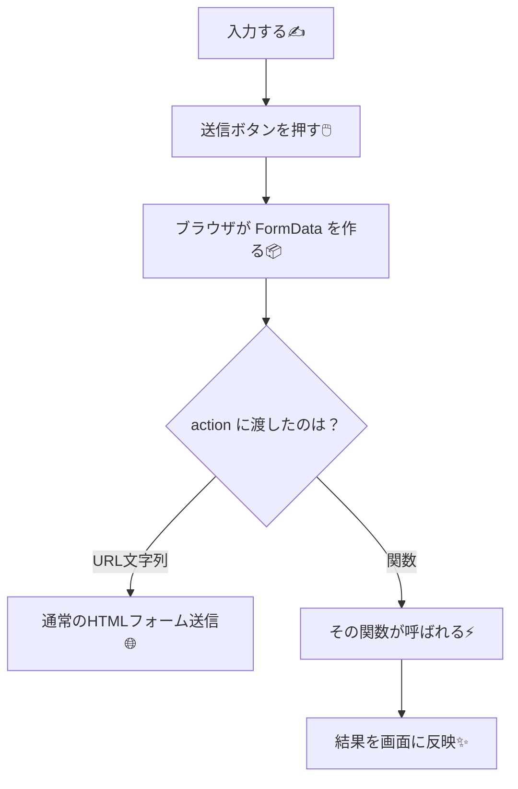
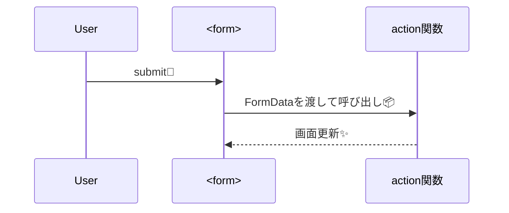

# 第134章：`<form action={...}>` の考え方🧾

この章は、「フォーム送信＝`onSubmit`で全部がんばる」から卒業して、**`action` に “関数” を渡す**発想に慣れる回だよ〜😊💕

---

## 1) まず結論：`action` は「URL」だけじゃなく「関数」も置ける🎯


React 19 では、`<form action={...}>` の `action` に **関数**を渡せるようになってるよ✨
送信すると、その関数が **`FormData` を受け取って呼び出される**感じ！📦🧡 ([React][1])

* `action="/api/xxx"` 👉 ふつうのHTMLフォーム（URLへ送信）🌐
* `action={async (formData) => {...}}` 👉 Reactが関数を呼んでくれる⚡（`FormData`つき） ([React][1])

Next.jsでもこの流れが超重要で、**Server Actionsのフォーム**はこの発想の上にできてるよ🫶 ([Next.js][2])

---

## 2) `onSubmit` と何が違うの？🤔💭


ざっくり言うと…

### ✅ `onSubmit`（昔ながら）

* `event.preventDefault()` して…
* inputの値を集めて…
* `fetch()` して…
* ローディング/エラーも自前で…

やること多め😂🧠

### ✅ `action={関数}`（新しい）

* 送信したら **Reactが `FormData` を作って関数に渡してくれる**📦
* 関数は `async` でもOK✨
* 送信処理が “Actionパターン” として扱われる（体験が整えやすい） ([React][1])

---

## 3) 図でイメージつかもう🧠✨（Mermaid）



```mermaid
flowchart TD
  A["入力する✍️"] --> B["送信ボタンを押す🖱️"]
  B --> C["ブラウザが FormData を作る📦"]
  C --> D{"action に渡したのは？"}
  D -->|"URL文字列"| E["通常のHTMLフォーム送信🌐"]
  D -->|"関数"| F["その関数が呼ばれる⚡"]
  F --> G["結果を画面に反映✨"]
```


```mermaid
sequenceDiagram
  participant U as User
  participant F as <form>
  participant A as action関数
  U->>F: submit🧾
  F->>A: FormDataを渡して呼び出し📦
  A-->>F: 画面更新✨
```

---

## 4) ミニ実験：`action` に関数を渡してみよう🧪💗（クライアント側で体験）


> ここでは「考え方」を体験したいので、まずは **Client Component** で動かすよ😊
> （次の章で “サーバーで動く版” に進むイメージ✨）

### 手順👣

1. `app/ch134/page.tsx` を作る📁
2. 下のコードを貼る🧷
3. `npm run dev` で起動して、`http://localhost:3000/ch134` を開く🌈

```tsx
'use client';

import { useState } from 'react';

export default function Page() {
  const [result, setResult] = useState<string>('');

  // ✅ action に渡す関数：引数は FormData ひとつだけ📦
  async function submit(formData: FormData) {
    const name = String(formData.get('name') ?? '');
    const menu = String(formData.get('menu') ?? '');

    setResult(`${name}さんの推しランチは「${menu}」だね〜！🍽️✨`);
  }

  return (
    <main style={{ padding: 24 }}>
      <h1>第134章デモ：form action 🧾✨</h1>

      <form action={submit} style={{ display: 'grid', gap: 12, maxWidth: 420 }}>
        <label style={{ display: 'grid', gap: 6 }}>
          ニックネーム✍️
          <input name="name" required placeholder="例：さくら" />
        </label>

        <label style={{ display: 'grid', gap: 6 }}>
          今日のランチは？🍝
          <select name="menu" defaultValue="パスタ">
            <option value="パスタ">パスタ</option>
            <option value="カレー">カレー</option>
            <option value="ラーメン">ラーメン</option>
          </select>
        </label>

        <button type="submit">送信する🚀</button>
      </form>

      {result && (
        <p style={{ marginTop: 16, padding: 12, border: '1px solid #ddd', borderRadius: 8 }}>
          {result}
        </p>
      )}
    </main>
  );
}
```

---

## 5) ここが超大事ポイント🧷✨


### ✅ `name="..."` がないと、`FormData` に入らないよ！😵

* `formData.get('name')` は、フォーム内の `name="name"` を探して取ってくる感じ🧠
* だから **`name` は必須級**💥

### ✅ “入力値を全部useStateで持つ” 必要は薄くなる🌿

* フォーム送信の瞬間に `FormData` から取れる📦
* 状態が必要なのは「送信結果を表示したい」みたいな時だけでOK🙆‍♀️✨

---

## 6) よくあるつまずき集🪤💦


* **`button` の `type` を書き忘れる**
  フォームの中の `button` は、デフォルトで `submit` になりがち😇
  👉 送信用は `type="submit"`、それ以外は `type="button"` が安心💗

* **`FormData.get()` の結果が null になる**
  だいたい原因は `name` が違う/付いてない🙃

* **「これ、サーバーで動いてる？」問題**
  今回は `use client` なので **ブラウザで動いてる版**だよ🌐
  Next.jsでは “サーバーで処理する版” も作れて、それが次の流れにつながるよ🧑‍🍳✨ ([Next.js][2])

---

## 7) ちょい練習💪🌸（3分）

1. `textarea` を足して `name="message"` を付ける📝
2. `formData.get('message')` を読んで、結果メッセージに混ぜる🎀

できたら、「フォームの値は FormData で取れる」感覚はもうOKだよ〜！🎉🥳

---

この章はここまで！🧾✨
次の章で「この `action` をサーバーで動かす（＝Server Action）」につなげていくと、**API作ってfetchして…**が一気に減って気持ちよくなるよ😆🫶

[1]: https://react.dev/reference/react-dom/components/form?utm_source=chatgpt.com "form"
[2]: https://nextjs.org/docs/app/guides/forms?utm_source=chatgpt.com "How to create forms with Server Actions"
