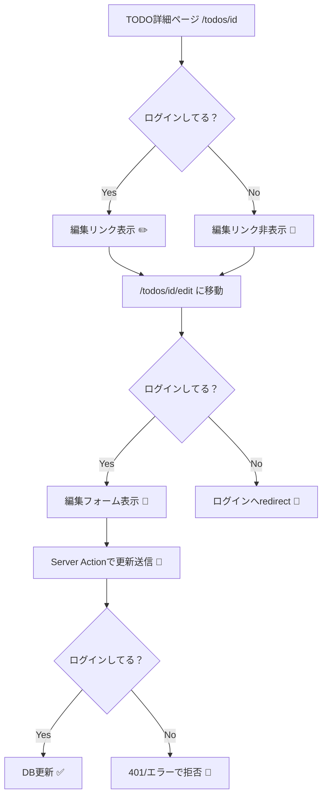

# 第185章：練習：ログイン中だけTODO編集できるようにする✏️


やることはシンプルだよ〜！😊
**「編集ボタンをログイン中だけ見せる」＋「URL直打ちでも編集ページに入れない」＋「サーバー側でも編集を拒否する」** の3点セットで完成🎉

---

## ゴール🎯

* ✅ ログインしてる人だけ「編集」リンクが表示される
* ✅ ログアウト中に `/todos/123/edit` を直打ちしても **ログインページへ飛ばされる**
* ✅ もし裏から更新リクエストされても **Server Actionが拒否する**（二重ロック🔐）

---

## ざっくり構造（今日の作戦）🗺️✨



```mermaid
flowchart TD
  A["TODO詳細ページ /todos/id"] --> B{"ログインしてる？"}
  B -->|"Yes"| C["編集リンク表示 ✏️"]
  B -->|"No"| D["編集リンク非表示 🙈"]

  C --> E["/todos/id/edit に移動"]
  D --> E

  E --> F{"ログインしてる？"}
  F -->|"Yes"| G["編集フォーム表示 📝"]
  F -->|"No"| H["ログインへredirect 🔑"]

  G --> I["Server Actionで更新送信 📮"]
  I --> J{"ログインしてる？"}
  J -->|"Yes"| K["DB更新 ✅"]
  J -->|"No"| L["401/エラーで拒否 🧯"]
```

---

## 前提（もうあるもの）🧩

この章では、すでに以下がある前提で進めるね😊

* TODOがDBに入ってて、詳細ページ `/todos/[id]` がある
* 認証が入ってて、サーバーで `auth()` を呼ぶとセッションが取れる

  * 例：`auth.ts` に `export const { auth } = NextAuth(...)` みたいにあるやつ✨

---

## Step1：TODO詳細ページで「編集リンク」をログイン中だけ出す🔗✏️

例：`app/todos/[id]/page.tsx`

```tsx
import Link from "next/link";
import { auth } from "@/auth"; // あなたのプロジェクトの置き場所に合わせてね
import { prisma } from "@/lib/prisma";

export default async function TodoDetailPage({
  params,
}: {
  params: Promise<{ id: string }>;
}) {
  const { id } = await params;
  const session = await auth(); // ✅ ログイン状態チェック
  const todo = await prisma.todo.findUnique({
    where: { id },
  });

  if (!todo) {
    return <div>見つからないよ〜🥺</div>;
  }

  return (
    <div style={{ padding: 16 }}>
      <h1>TODO詳細 📝</h1>
      <p>タイトル：{todo.title}</p>
      <p>内容：{todo.content}</p>

      <div style={{ marginTop: 16 }}>
        {session ? (
          <Link href={`/todos/${todo.id}/edit`}>編集する✏️</Link>
        ) : (
          <p style={{ opacity: 0.7 }}>
            編集はログイン中だけできるよ🔒（ログインしてね😊）
          </p>
        )}
      </div>
    </div>
  );
}
```

ポイント✨

* **UIで隠す**のは「親切」だけど、**安全の本体ではない**よ⚠️
* 次で「URL直打ち対策」やるよ〜！🚪

---

## Step2：編集ページを作って「ログインしてなければredirect」する🚦🔑


`app/todos/[id]/edit/page.tsx`

```tsx
import { redirect } from "next/navigation";
import { auth } from "@/auth";
import { prisma } from "@/lib/prisma";
import { updateTodoAction } from "./actions";

export default async function TodoEditPage({
  params,
}: {
  params: Promise<{ id: string }>;
}) {
  const { id } = await params;
  const session = await auth();

  // ✅ URL直打ち対策：ログインしてなければ追い返す！
  if (!session) {
    redirect(`/login?next=/todos/${id}/edit`);
  }

  const todo = await prisma.todo.findUnique({
    where: { id },
  });

  if (!todo) {
    return <div>TODOが見つからないよ〜🥺</div>;
  }

  return (
    <div style={{ padding: 16 }}>
      <h1>TODO編集 ✏️</h1>

      <form action={updateTodoAction}>
        <input type="hidden" name="id" value={todo.id} />

        <div style={{ marginBottom: 12 }}>
          <label>
            タイトル：
            <input
              name="title"
              defaultValue={todo.title}
              style={{ display: "block", width: 320 }}
            />
          </label>
        </div>

        <div style={{ marginBottom: 12 }}>
          <label>
            内容：
            <textarea
              name="content"
              defaultValue={todo.content ?? ""}
              style={{ display: "block", width: 320, height: 120 }}
            />
          </label>
        </div>

        <button type="submit">更新する✅</button>
      </form>
    </div>
  );
}
```

ここまでで、ログアウト中は編集ページに入れない✅
でもまだ「裏から更新」される可能性があるよね？😈
なので次で **Server Action側もロック**するよ🔐

---

## Step3：Server Actionで「ログインしてなければ更新拒否」する🧯🔒


`app/todos/[id]/edit/actions.ts`

```ts
"use server";

import { auth } from "@/auth";
import { prisma } from "@/lib/prisma";
import { redirect } from "next/navigation";

export async function updateTodoAction(formData: FormData) {
  const session = await auth();

  // ✅ サーバー側の本丸ガード（ここ超大事！）
  if (!session) {
    // ここは好みでOK：loginへ飛ばす or エラーを返す
    redirect("/login");
  }

  const id = String(formData.get("id") ?? "");
  const title = String(formData.get("title") ?? "").trim();
  const content = String(formData.get("content") ?? "").trim();

  if (!id || !title) {
    // ざっくりバリデーション（丁寧版は別章でもっとやる感じ✨）
    throw new Error("IDかタイトルが空だよ🥺");
  }

  await prisma.todo.update({
    where: { id },
    data: { title, content },
  });

  // 更新後は詳細へ戻すと気持ちいい😊
  redirect(`/todos/${id}`);
}
```

---

## Step4：動作チェック✅🧪（ここ楽しいやつ！）


1. 開発サーバー起動💻✨

```bash
npm run dev
```

2. **ログアウト状態**で確認🙈

* `/todos/1`：編集リンクが出ない✅
* `/todos/1/edit`：ログインへ飛ばされる✅

3. **ログイン状態**で確認😊

* `/todos/1`：編集リンクが出る✅
* `/todos/1/edit`：編集フォームが見える✅
* 更新したら詳細に戻る✅

---

## よくあるつまづき🍵

* **「編集リンク隠したのに、直打ちで入れちゃう！」**
  → `redirect()` が入ってるか確認してね🔍（Step2）
* **「ページは守れたけど、更新が通っちゃう…」**
  → Server Actionに `auth()` ガード入れよう🔒（Step3）
* **「auth の import パスが違う！」**
  → あなたのプロジェクトの `auth.ts` の位置に合わせてOKだよ😊✨

---

## ミニ課題（できたら強い💪✨）🎮

* 🌟 編集ページで「ログインしてない人」には
  `redirect` じゃなくて「案内ページ」を出す版も作ってみてね
  （例：ログインボタンだけ置く、みたいな🥰）

---

ここまでできたら、**「ログインしてる時だけ編集できる」**は完成〜！🎉🔒✏️
