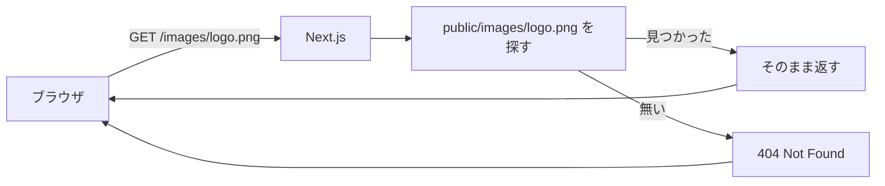

# 第191章：`public/` の使い方（静的ファイル）🗂️

この章では「画像・PDF・音声」みたいな**“そのまま配信したいファイル”**を、Next.jsでどう置いてどう呼ぶかをマスターするよ〜！😊📦
（App Router前提だよ！）

---

## 1) `public/` ってなに？🌱


`public/` は、Next.jsが**静的ファイル置き場**として見てくれる特別フォルダだよ🧺✨
ここに入れたファイルは、**URLの`/`（ルート）から**そのまま見れるようになるのがポイント！

例：
`public/avatars/me.png` に置いたら → ブラウザで **`/avatars/me.png`** で見れるよ🖼️
（`public` って文字はURLに出てこない！） ([Next.js][1])

---

## 2) イメージ図で理解しよ〜🧠➡️🌐


```mermaid
flowchart LR
  B["ブラウザ"] -->|"GET /images/logo.png"| N["Next.js"]
  N --> P["public/images/logo.png を探す"]
  P -->|"見つかった"| R["そのまま返す"]
  P -->|"無い"| E["404 Not Found"]
  R --> B
  E --> B
```

---

## 3) 置き方のおすすめ構成📁✨（迷子防止）


```text
my-next-app/
  app/
  public/
    images/
      logo.png
      hero.jpg
    pdf/
      guide.pdf
    audio/
      chime.mp3
```

* “種類フォルダ”で分けると超ラク🎀
* ファイル名は英数字＋ハイフンが無難だよ（例：`hero-2025.jpg`）😊

---

## 4) 呼び出し方（超重要）🔗✨

### ✅ ルール：`public/` の中は「URLで呼ぶ」🌐

つまり **`/` から始める**！

* `public/images/logo.png` → `src="/images/logo.png"`
* `public/pdf/guide.pdf` → `href="/pdf/guide.pdf"`

---

## 5) 画像の表示：まずは最短で成功しよ🖼️🎉

### A. いちばん簡単：`` で表示（素のHTML）🙂

```tsx
// app/page.tsx
export default function Page() {
  return (
    <main>
      <h1>publicの画像テスト🧪✨</h1>
      
    </main>
  );
}
```

これで表示できたら勝ち！🏆😆

---

### B. 次は本命：`next/image`（速くてキレイ）📸✨


ローカル画像は `public/` に置くのが定番だよ〜！ ([Next.js][2])

```tsx
// app/page.tsx
import Image from "next/image";

export default function Page() {
  return (
    <main>
      <h1>next/imageで表示📸✨</h1>
      <Image
        src="/images/logo.png"
        alt="ロゴ"
        width={240}
        height={240}
        priority
      />
    </main>
  );
}
```

* `width`/`height` は基本つける（レイアウト崩れ防止🧱）
* 最初に見せたい画像は `priority` もアリ✨

---

## 6) PDFやファイルのリンク📎✨

例：`public/pdf/guide.pdf` をリンクで開く

```tsx
export default function Page() {
  return (
    <main>
      <a href="/pdf/guide.pdf" target="_blank" rel="noreferrer">
        ガイドPDFを開く📘✨
      </a>
    </main>
  );
}
```

「資料を配布するページ」みたいな時に便利だよ〜😊📚

---

## 7) 注意：`public/` に置いたものは “全部公開” だよ🔓😳


`public/` は **誰でもURL直打ちで見れる**場所！
だから…

* ✅ 画像、PDF、音声、OGP用画像…はOK🙆‍♀️
* ❌ APIキー、ユーザー情報、社内資料…は絶対NG🙅‍♀️💥

「秘密のものは `public/` に置かない」これだけ覚えよう🧠🔒

---

## 8) キャッシュの雰囲気（ここ大事）🧊🌀

`public/` のファイルは「変わるかもしれない」扱いなので、Next.jsは**強いキャッシュをしにくい**前提があるよ〜！
デフォルトのヘッダーは `Cache-Control: public, max-age=0` になりやすい、って公式にも書かれてるよ📌 ([Next.js][3])

ざっくり言うと：

* 開発中は「更新したらすぐ反映」しやすい😊
* 本番で重い画像をたくさん置くときは、`next/image` の利用や配信設計も意識すると安心✨（この教材だと周辺章で触れるやつ！）

---

## 9) ちょい混乱ポイント：favicon や robots はどこ？🤖🍎


App Routerだと、`robots.txt` や `favicon` などは **`app/` の“メタデータ用ファイル規約”を使うのが推奨**だよ〜！ ([Next.js][3])
（もちろん “静的ファイルは `public/`” って覚え方は合ってるんだけど、Next.js的には専用ルールがある感じ！）

---

## 10) ミニ練習（5分）⏱️🌸

### 練習①：画像を1枚出す🖼️

1. `public/images/` を作る
2. `logo.png` を入れる
3. `app/page.tsx` に `next/image` で表示

### 練習②：PDFを置いてリンクする📎

1. `public/pdf/` を作る
2. `guide.pdf` を入れる
3. `<a href="/pdf/guide.pdf">` を置く

できたら「`public/` はURLの `/` から始まる！」が体に入るよ😊✨

---

## まとめ🎀✨

* `public/` は **静的ファイル置き場**🗂️
* URLは **`/` から始めて参照**（`public` は書かない）🔗
* `public/` は **全部公開**なので秘密は置かない🔒
* 画像は `next/image` と相性よし📸✨
* robots/favicon系は App Routerの**専用ファイル規約**が推奨🤖🍎 ([Next.js][3])

次、実際にあなたのプロジェクトで「このファイル構成だとパス合ってる？」みたいなチェックも一緒にできるよ〜😊🧡

[1]: https://nextjs.org/docs/pages/api-reference/file-conventions/public-folder?utm_source=chatgpt.com "File-system conventions: public"
[2]: https://nextjs.org/docs/app/getting-started/images?utm_source=chatgpt.com "Getting Started: Image Optimization"
[3]: https://nextjs.org/docs/app/api-reference/file-conventions/public-folder?utm_source=chatgpt.com "File-system conventions: public"
