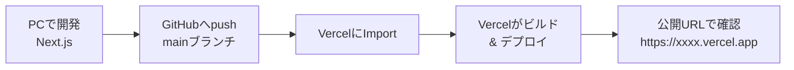

# 第221章：Vercelデプロイの流れ（最短）🚀

この章のゴールはこれだけ！👇
**Next.jsアプリを、Vercelに置いてURLで見れる状態にする**ことだよ〜😊🌈

---

## まずは全体の流れを1枚で把握しよ〜🗺️✨



```mermaid
flowchart LR
  A["PCで開発<br>Next.js"] --> B["GitHubへpush<br>mainブランチ"]
  B --> C["VercelにImport"]
  C --> D["Vercelがビルド<br>& デプロイ"]
  D --> E["公開URLで確認<br>https://xxxx.vercel.app"]
```

GitHubとVercelをつなげると、**pushしたら勝手にデプロイ**が基本になるよ〜🤝✨ ([Vercel][1])

---

## 手順1：ローカルで「ビルドできる」ことを確認する✅🧪

デプロイ前に、ここでコケると本番もコケるので先に確認しよっ😆

```bash
npm run build
npm run start
```

`npm run build` と `npm run start` は、Next.jsの基本の本番起動チェックだよ〜📦✨ ([Next.js][2])

---

## 手順2：GitHubにアップしておく（Vercelの最短ルート）🐙⬆️


もうGitHubに置けてるならここは飛ばしてOKだよ🙆‍♀️✨
まだなら、ざっくり最短はこんな感じ👇

```bash
git init
git add .
git commit -m "first deploy"
git branch -M main
git remote add origin https://github.com/<USER>/<REPO>.git
git push -u origin main
```

---

## 手順3：Vercelで「Import」してデプロイする🚀🌍


1. Vercelにログイン（GitHub連携がラクだよ〜🔗）
2. **Add New → Project**
3. GitHubのリポジトリを選んで **Import**
4. だいたい **Framework Preset: Next.js** が自動で選ばれるよ🤖✨（基本そのままでOK）

Vercelは有名フレームワークはビルド設定を自動でいい感じにしてくれることが多いよ〜🛠️✨ ([Vercel][3])

---

## 手順4：環境変数があるならVercel側に入れる🔐🍪


ここ、初心者さんが一番ハマりがちポイント〜！⚠️💦

* ローカルの `.env.local` は **Vercelには自動で行かない**（基本そういうもの！）
* Vercelの **Project → Settings → Environment Variables** で追加するよ✍️✨
* さらに、**Preview / Production** どっちに効かせるかも選べるよ〜🌱🌟 ([Vercel][4])

あと大事！
ブラウザ側（画面側）でも使いたい変数は `NEXT_PUBLIC_` を付ける…みたいなNext.jsのルールもあるよ🧠✨（ローカルの `.env*` での読み込みも含めて） ([Next.js][5])

---

## 手順5：Deployボタン！→ URLで確認🎉🔍


Import時にそのまま **Deploy** すると、

* ビルドが走る🏗️
* 成功したらURLが出る🔗✨
* 開いて動作チェック👀💕

「mainにpush → 自動でデプロイ」みたいな流れができてくるよ〜🚀 ([Vercel][1])

---

## うまくいかない時の“最短チェック”🧯😵‍💫


* ✅ **ローカルで `npm run build` が通る？**（まずここ！）
* ✅ Vercelの **Deployments** のログにエラー出てない？（赤い行がヒント👀）
* ✅ **環境変数の入れ忘れ**ない？（Preview/Productionの付け先も！） ([Vercel][4])
* ✅ リポジトリの **ルート**合ってる？（モノレポだとRoot Directory設定が必要なことある🗂️） ([Vercel][3])

---

## おまけ：GitHubなしで最短に行くなら（CLI）🧙‍♀️💻

「とにかく今すぐ上げたい！」ならVercel CLIでもできるよ〜（ただ、運用はGit連携が王道💡）
`vercel` コマンドでデプロイできる案内もあるよ📌 ([Vercel][6])

---

## まとめ：第221章の“最短ルート”🎯✨

* 🧪 `npm run build` でローカル確認
* 🐙 GitHubにpush
* 🚀 VercelでImport → Deploy
* 🔐 `.env.local` はVercelに手動登録（必要なら）
* 🔗 出たURLで動作チェック

これで「公開できた！」まで行けるよ〜🎉🌈

[1]: https://vercel.com/docs/git/vercel-for-github?utm_source=chatgpt.com "Deploying GitHub Projects with Vercel"
[2]: https://nextjs.org/docs/pages/getting-started/deploying?utm_source=chatgpt.com "Getting Started: Deploying"
[3]: https://vercel.com/docs/builds/configure-a-build?utm_source=chatgpt.com "Configuring a Build"
[4]: https://vercel.com/docs/environment-variables/managing-environment-variables?utm_source=chatgpt.com "Managing environment variables"
[5]: https://nextjs.org/docs/pages/guides/environment-variables?utm_source=chatgpt.com "Guides: Environment Variables"
[6]: https://vercel.com/docs/frameworks/full-stack/nextjs?utm_source=chatgpt.com "Next.js on Vercel"
