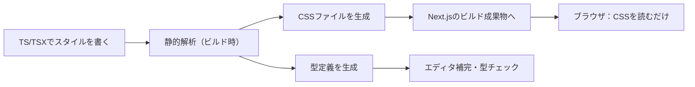

# 第265章：なぜPanda CSSか？（Zero-Runtime & Type-Safe）🐼

この章では「なんで今、Panda CSSを選ぶの？」を“ふわっと納得できる感じ”でつかみます💡
（インストール手順は次の章でやるよ〜！😊）

---

## 1) Panda CSSってなに？🐼🎨

Panda CSSは、**TypeScriptでスタイルを書けて**、しかも**ビルド時にCSSファイルを生成してくれる**“ゼロランタイムCSS-in-JS”です✨
Next.jsみたいな「サーバー中心（App Router / RSC）」な世界で困りがちなCSS-in-JSの悩みを減らすために作られています🧊🌊 ([panda-css.com][1])

---

## 2) 「ゼロランタイム」って何がうれしいの？🏃‍♀️💨（超ざっくり）


ふつうのCSS-in-JS（ランタイム型）は、**ブラウザでJavaScriptが動いてから**スタイルが作られたり挿入されたりすることがあります。
でもPandaは、**ビルド時に静的解析してCSSを作る**ので、実行時の負担が少なくなりやすいです🧁✨ ([panda-css.com][1])

### ありがちに嬉しいポイント🌟

* **実行時コストが減りやすい**（ランタイムが薄い）⚡
* **RSC（Server Components）時代と相性がいい方向**に寄せやすい🧊
* **スタイルが“ファイルとして”出る**ので、見通しがよくなりがち📄✨ ([panda-css.com][1])

---

## 3) 「Type-Safe」って何がうれしいの？🧷💖


PandaはTypeScriptベースで、**スタイルのプロパティやショートハンドが型で守られやすい**です。
さらに、テーマ（tokens）に定義した値と結びつけられるので、**「存在しない値」をうっかり書きにくい**方向にできます✅ ([panda-css.com][2])

### 女子大生あるある（？）で言うと…🤣

「色コードを適当にコピペして、後で統一できなくて泣く😭」
→ tokensで寄せれば、**“色のルール”を作りやすい**🎨✨

---

## 4) Panda CSSの仕組み（イメージ）🧠🔍

「書くのはTS、出力はCSS」って覚えるとラクです😊


```mermaid
flowchart LR
  A["TS/TSXでスタイルを書く"] --> B["静的解析（ビルド時）"]
  B --> C["CSSファイルを生成"]
  B --> D["型定義を生成"]
  C --> E["Next.jsのビルド成果物へ"]
  D --> F["エディタ補完・型チェック"]
  E --> G["ブラウザ：CSSを読むだけ"]
```

「ブラウザで“スタイル生成JS”をがんばらせない」方向性がポイントです🐼✨ ([panda-css.com][1])


---

## 5) Panda CSSが得意なこと（この先でやる内容の予告）🎁


Pandaには「よく使う設計パーツ」が用意されています💡

* **Recipes**：ボタンとかの“バリエーション付き”スタイルを作る（型安全なAPI）🧂 ([panda-css.com][3])
* **Tokens**：色・余白・フォントサイズなどをルール化🎨
* **Patterns**：Stack/Gridみたいなレイアウトの型（次の章以降で！）📐

---

## 6) ざっくり比較（迷った時の気分）🤔🧭


* **CSS Modules**：素直で安心。でも“デザイントークン運用”や“バリアント設計”は自分で頑張ること多め🧵
* **Tailwind**：速い・強い。でもクラスが長くなりがちで、設計の好みが分かれる⚡
* **Panda CSS**：TSで書けて、ビルドでCSS吐けて、設計（tokens/recipes）に寄せやすい🐼✨ ([panda-css.com][4])

---

## 7) ちょい見せ：どんな書き味？👀✨（※次章のセットアップ後に動くよ）


「こんな感じでTSの中に書くよ〜」っていう雰囲気だけ🌸

```tsx
import { css } from "../styled-system/css"

export function MiniCard() {
  return (
    <div
      className={css({
        p: "4",
        borderRadius: "lg",
        boxShadow: "sm",
      })}
    >
      <h2 className={css({ fontSize: "lg", fontWeight: "bold" })}>
        Panda CSS 🐼
      </h2>
      <p className={css({ mt: "2", color: "fg.muted" })}>
        TSで書いて、ビルド時にCSSが出るよ✨
      </p>
    </div>
  )
}
```

ポイントは「css(…)を書いたら、最終的にはCSSが生成される」方向ってことです🧊✨ ([GitHub][5])

---

## 8) ミニ理解チェック（3問）📝💗


1. Panda CSSは **いつ** CSSを作る？（実行時？ビルド時？）🤔
2. ゼロランタイムだと、ブラウザ側の負担はどうなりやすい？⚡
3. Type-Safeだと、何が嬉しい？（補完？ミス防止？）🧷

---

## 9) 次の章につながるゴール🎯✨

次の第266章では、Next.js（App Router）でPanda CSSを入れて、
「styled-systemができた！使える！」まで行きます🐼🧱 ([panda-css.com][6])

---

必要なら、この章の内容を「学習メモ用に1ページに圧縮したまとめ」も作るよ〜📄✨

[1]: https://panda-css.com/docs/overview/why-panda?utm_source=chatgpt.com "Why Panda"
[2]: https://panda-css.com/docs/concepts/writing-styles?utm_source=chatgpt.com "Writing Styles"
[3]: https://panda-css.com/docs/concepts/recipes?utm_source=chatgpt.com "Recipes"
[4]: https://panda-css.com/?utm_source=chatgpt.com "Panda CSS - Build modern websites using build time and type ..."
[5]: https://github.com/chakra-ui/panda/blob/main/SYSTEM_ARCHITECTURE.md?utm_source=chatgpt.com "SYSTEM_ARCHITECTURE.md - chakra-ui/panda"
[6]: https://panda-css.com/docs/installation/nextjs?utm_source=chatgpt.com "Using Next.js"
