# 第19章：最初の「型定義」！

> これから作るReactコンポーネントに「どんなデータが来るのか？」を、TypeScriptで先に宣言しておく回だよ。
> **型＝設計図**。設計図があると、VS Codeがずっと味方してくれる😊🛡️

---

## ゴール 🎯

* Propsの型を`type`でサクッと宣言できる
* 必須/任意（オプショナル）の書き分けができる
* 関数や`children`を含むPropsも怖くない

---

## まずは全体像 🗺️

```mermaid
flowchart TD
  A[表示したいUIを考える] --> B[必要なデータを洗い出す]
  B --> C[Propsの型を宣言する]
  C --> D[関数コンポーネントに型を当てる]
  D --> E[Appから実データを渡す]
  E --> F[VS Codeが型チェックで守ってくれる]
```



---

## ハンズオン①：自己紹介カードのProps型を作る 💳


### 1) ファイル作成

`src/components/ProfileCard.tsx` を新規作成。

### 2) Propsの型を宣言（まずは `type` でOK！）

```tsx
// src/components/ProfileCard.tsx
export type ProfileCardProps = {
  name: string;               // 必須
  age?: number;               // 任意（？が付くと無くてもOK）
  university: string;
  avatarUrl?: string;
  onFollow?: (userName: string) => void; // 関数を渡す場合
  children?: React.ReactNode; // 中身を差し込めるように
};
```

### 3) コンポーネントに型を当てる

```tsx
export default function ProfileCard({
  name,
  age,
  university,
  avatarUrl = "https://placehold.co/80x80", // デフォルト値もOK
  onFollow,
  children,
}: ProfileCardProps) {
  return (
    <article
      style={{
        display: "grid",
        gridTemplateColumns: "80px 1fr",
        gap: 12,
        padding: 16,
        border: "1px solid #ddd",
        borderRadius: 12,
      }}
    >
      
      <div>
        <h3 style={{ margin: "4px 0" }}>{name} 🎀</h3>
        <p style={{ margin: 0 }}>
          {university} {age != null ? `/ ${age}歳` : ""}
        </p>

        {/* 子要素を差し込める */}
        <div style={{ marginTop: 8 }}>{children}</div>

        {/* 関数Propsがある時だけボタンを表示 */}
        {onFollow && (
          <button
            style={{ marginTop: 8, padding: "6px 10px", borderRadius: 8 }}
            onClick={() => onFollow(name)}
          >
            フォローする✨
          </button>
        )}
      </div>
    </article>
  );
}
```

### 4) 使ってみる（App.tsx）

```tsx
// src/App.tsx
import ProfileCard from "./components/ProfileCard";

export default function App() {
  return (
    <main style={{ padding: 20, display: "grid", gap: 16 }}>
      <ProfileCard
        name="Rin"
        university="Sakura Univ."
        onFollow={(user) => alert(`${user} をフォローしたよ💘`)}
      >
        <span>好き：ラテ・猫・React 🐱☕</span>
      </ProfileCard>

      <ProfileCard
        name="Mina"
        university="Maple Univ."
        age={21}
        avatarUrl="https://placehold.co/80x80?text=M"
      >
        <em>ポートフォリオ準備中…🔥</em>
      </ProfileCard>
    </main>
  );
}
```

---

## Props型づくりのコツ 🌟

### 1) 必須と任意の見極め


* **必須**：無いとUIが成立しない → そのまま
* **任意**：無くても成立 → `?` を付ける + できれば**デフォルト値**を用意

```tsx
type ButtonProps = {
  label: string;           // 必須
  variant?: "primary"|"ghost"; // 任意（ユニオン型で選択肢を制限）
};
```

### 2) 関数Propsは「何を受け取り、何を返すか」を明確に

```tsx
type OnSelect = (id: string) => void;
type ItemProps = { onSelect?: OnSelect; };
```

### 3) `children` は `React.ReactNode`


```tsx
type CardProps = { children?: React.ReactNode };
```

### 4) ユニオン型で安全・快適 🎛️

```tsx
type Tone = "info" | "success" | "warn" | "error";
type BadgeProps = { tone?: Tone };
```

---

## “型が守ってくれた！”を体験してみよう 🛡️


### NG例：渡す値がユニオンに無い

```tsx
// ❌ 型エラー: "danger" は Tone に含まれない
// <Badge tone="danger" />
```

### NG例：必須を渡し忘れ

```tsx
// ❌ 型エラー: label は必須
// <Button />
```

VS Codeが赤線で**即気づける**。直すのも一瞬！⏱️✨

---

## ハンズオン②：既存データからProps型を“流用”する（応用ミニ）🧠


アプリには「データ型」と「表示用のProps型」が出てくることが多いよ。
**全部そのまま渡す必要はなくて、表示に必要な一部だけ型で抜き出す**のがコツ！

```tsx
// 例：APIから来るユーザーデータ
type User = {
  id: string;
  name: string;
  email: string;
  avatarUrl?: string;
  university?: string;
  createdAt: string;
};

// 表示に必要なぶんだけ Pick で抽出
type UserChipProps = Pick<User, "name" | "avatarUrl"> & {
  onClick?: () => void;
};

export function UserChip({ name, avatarUrl, onClick }: UserChipProps) {
  return (
    <button onClick={onClick} style={{ display: "flex", gap: 8, alignItems: "center" }}>
      
      <span>{name}</span>
    </button>
  );
}
```

> `Pick` / `Omit` は**実務で超つよい**。必要なカラムだけPropsにできて、型の重複も減るよ💡

---

## よくあるつまずき 🆘

```mermaid
flowchart TD
  A[必須渡し忘れ] --> A1[? を付ける or 値を渡す]
  B[関数の引数型が違う] --> B1[引数と戻り値の型を明確に]
  C[childrenの型が曖昧] --> C1[React.ReactNode を使う]
  D[ユニオンにない文字列] --> D1[ユニオン型へ値を追加 or 値を修正]
```



---

## チャレンジ課題 💪🎮

1. `ProductCard` を作ってみよう

   * 必須: `title: string`, `price: number`
   * 任意: `thumbnailUrl?: string`, `onAddToCart?: (title: string) => void`
   * `children` にバッジ類を差し込めるように
2. `price` を小数点1ケタで表示してみる（例: `1290 → ¥1,290.0`）
3. `variant` を `"solid" | "outline"` のユニオン型で追加して、見た目を少し変えてみる

---

## まとめ 🌸

* Propsの型＝**設計図**。**まずは `type` で宣言**していけばOK！
* **必須/任意/関数/children**を押さえれば、ほぼ全部いける✨
* `Pick` / `Omit` などで**データ型→表示用に最小化**するのがプロっぽい🌟

次回は **第20章**！実際に「自己紹介カード部品」を**型付きで**作り切って、型のありがたみを全身で感じよ〜〜！🙌💙
