# 第20章：練習：自己紹介カード部品。まずは`Props`の型を`type`で定義してみる。

> 今日は実践回！「自己紹介カード」コンポーネントを**型つき**で作って、App からデータを渡して表示するところまでやるよ〜✨

---

## 完成イメージと流れ 🛤️

```mermaid
flowchart TD
  A[要件を決める] --> B[Props型を設計 typeで宣言]
  B --> C[コンポーネント実装]
  C --> D[Appから実データを渡す]
  D --> E[型エラーがあれば直す]
  E --> F[完成 & ちょい改造💪]
```



---

## ステップ1：要件をサクッと決める 📝💡


自己紹介カードに入れたい情報：

* 名前（必須）
* 学年（必須：数字）
* 専攻（任意）
* 趣味（任意：配列）
* アイコン画像URL（任意：なければダミー表示）
* あいさつボタン（任意：押したら名前でアラート）
* `children`（任意：好きな要素を差し込める）

---

## ステップ2：Props の型を `type` で宣言 ✍️

**ファイル**：`src/components/IntroCard.tsx`

```tsx
export type IntroCardProps = {
  name: string;                      // 必須
  grade: number;                     // 必須（例: 1, 2, 3, 4）
  major?: string;                    // 任意
  hobbies?: string[];                // 任意
  iconUrl?: string;                  // 任意（デフォルト画像にフォールバック）
  onSayHi?: (name: string) => void;  // 任意（クリック時のコールバック）
  children?: React.ReactNode;        // 任意（差し込み用）
};
```

> ポイント：**「無くても成立」なものは `?` をつける**。イベント関数は**引数と戻り値**をしっかり型にしよう🧠

---

## ステップ3：コンポーネントを実装 🎨⚙️


```tsx
// src/components/IntroCard.tsx
export type IntroCardProps = {
  name: string;
  grade: number;
  major?: string;
  hobbies?: string[];
  iconUrl?: string;
  onSayHi?: (name: string) => void;
  children?: React.ReactNode;
};

export default function IntroCard({
  name,
  grade,
  major,
  hobbies = [],
  iconUrl = "https://placehold.co/80x80?text=👋",
  onSayHi,
  children,
}: IntroCardProps) {
  return (
    <article
      style={{
        display: "grid",
        gridTemplateColumns: "80px 1fr",
        gap: 12,
        padding: 16,
        border: "1px solid #e5e7eb",
        borderRadius: 12,
        background: "#fff",
        boxShadow: "0 1px 2px rgba(0,0,0,0.06)",
      }}
    >
      

      <div>
        <h3 style={{ margin: "4px 0 2px", fontSize: 18 }}>
          {name} <span style={{ fontSize: 14 }}>（{grade}年生）</span> ✨
        </h3>
        {major && (
          <p style={{ margin: 0, color: "#6b7280" }}>専攻：{major}</p>
        )}

        {hobbies.length > 0 && (
          <p style={{ margin: "8px 0 0" }}>
            趣味：{hobbies.join(" / ")} 🎧📚🏃‍♀️
          </p>
        )}

        {/* 差し込み自由ゾーン */}
        {children && <div style={{ marginTop: 8 }}>{children}</div>}

        {/* 挨拶ボタン（onSayHi がある時だけ） */}
        {onSayHi && (
          <button
            onClick={() => onSayHi(name)}
            style={{
              marginTop: 10,
              padding: "6px 12px",
              borderRadius: 8,
              border: "1px solid #d1d5db",
              background: "#f9fafb",
              cursor: "pointer",
            }}
          >
            あいさつする 💬
          </button>
        )}
      </div>
    </article>
  );
}
```

> ちょいテク：`hobbies = []` や `iconUrl = ...` の**デフォルト値**で「任意でも快適」な体験に🌈


---

## ステップ4：App から実データを渡す 🚚💨

**ファイル**：`src/App.tsx`

```tsx
import IntroCard from "./components/IntroCard";

export default function App() {
  return (
    <main style={{ padding: 20, display: "grid", gap: 16, maxWidth: 640 }}>
      <IntroCard
        name="Rin"
        grade={3}
        major="情報デザイン"
        hobbies={["カフェ巡り", "写真", "React"]}
        onSayHi={(n) => alert(`${n} にこんにちは〜〜！🥰`)}
      >
        <span>いまはUI/UXの研究中。ポートフォリオ準備してます🔥</span>
      </IntroCard>

      <IntroCard
        name="Mina"
        grade={2}
        hobbies={["ランニング"]}
        iconUrl="https://placehold.co/80x80?text=M"
      >
        <em>英語学習アプリ作ってみたい📱</em>
      </IntroCard>
    </main>
  );
}
```

> ここまで来たら `npm run dev` で画面チェック！かわいく表示されてたら成功〜〜💖

---

## 型チェックで「守られてる感」を味わう🛡️✨

**試しに壊してみよう（VS Code が即ツッコむはず！）**

1. `grade="3"` と**文字列**で渡す → ❌ **number** が必要
2. `hobbies="読書"` と**文字列**で渡す → ❌ **string[]** が必要
3. `onSayHi={(n) => n.toFixed(2)}` → ❌ `n` は **string** なので `toFixed` なし

**直し方ヒント**

* `grade={3}` のように **波かっこ＋数値**で
* 配列は `["読書"]` みたいに角かっこで
* `onSayHi` の引数 `n` は文字列！`alert(n)` とかにしよう

---

## さらに一歩：ユニオン型で見た目バリエを追加🎛️


「カードの雰囲気」を選べるようにしてみる（型の威力を体験！）

```tsx
// IntroCard.tsx の型に追加
export type IntroCardProps = {
  // ...（省略）
  variant?: "solid" | "outline"; // 任意
};

// 受け取り＆適用
export default function IntroCard({
  // ...（省略）
  variant = "solid",
  // ...
}: IntroCardProps) {
  const cardStyle =
    variant === "solid"
      ? { background: "#fff", border: "1px solid #e5e7eb" }
      : { background: "#fafafa", border: "1px dashed #d1d5db" };

  return (
    <article style={{
      display: "grid",
      gridTemplateColumns: "80px 1fr",
      gap: 12,
      padding: 16,
      borderRadius: 12,
      boxShadow: "0 1px 2px rgba(0,0,0,0.06)",
      ...cardStyle,
    }}>
      {/* 中略 */}
    </article>
  );
}
```

**使い方（App.tsx）**

```tsx
<IntroCard name="Aya" grade={1} variant="outline">
  <span>春からReact始めました🌸</span>
</IntroCard>
```

> `"solid" | "outline"` 以外はコンパイル時点で弾かれる！**安心かわいい**開発体験😍

---

## よくあるつまずき＆対策 🆘

```mermaid
flowchart TD
  A[必須Propsを渡し忘れ] --> A1[エディタのエラーを見て追加]
  B[型が合わない値を渡す] --> B1[型注釈やユニオン型を見直す]
  C[childrenの型が不安] --> C1[React.ReactNodeでOK]
  D[イベント引数の型迷子] --> D1[関数シグネチャを明記]
```



---

## チャレンジ課題（任意）🎮🔥

1. `hobbies` を**カンマ区切りの文字列**でも受け取れるようにし、内部で `string[]` に変換して表示してみる

   * 型：`hobbies?: string | string[]`（**ユニオン型**）
   * 実装：`Array.isArray(hobbies) ? hobbies : (hobbies ?? "").split(",")`
2. `grade` を `1 | 2 | 3 | 4` の**ユニオン数値**にしてみる（存在しない学年を型で防ぐ！）
3. `onSayHi` を非同期にして、`await new Promise(r => setTimeout(r, 500))` で0.5秒後にアラート（将来のAPI連携の練習✨）

---

## まとめ 🌸

* Propsは**まず `type` で宣言**して「必須/任意/関数/children」をきちんと表現しよう
* 迷ったら**デフォルト値**で使いやすく、**ユニオン型**で安全に
* VS Codeの赤線はツンデレな味方💘 直せばどんどん強くなるよ！

次回は **Module 3（Props編）** に入って、**親 → 子**への型付きデータ受け渡しをもっと深掘りするよ〜！🙌✨
