# 第24章：`children`の型はどう書く？

> **ゴール**：`children` を受け取るコンポーネントを、自分で型設計できるようになること。
> **キーワード**：**`React.ReactNode`**（基本形） / **`React.ReactElement`**（1つの要素） / **レンダープロップ**（子が関数）✨

---

## 🎯 `children` ってなに？


JSXでタグの**内側に書いた中身**が、コンポーネントに **`children`** という名前で渡されるよ。

```mermaid
flowchart TD
  A["親: App"] -->|&lt;Card&gt; ...ここが children...&lt;/Card&gt;| C["子: Card"]
  C -->|children を画面に差し込む| V["表示"]
  N["\`children\`は“なかみの差し込み口（スロット）”🎁"] -.-> C
```



---

## 🧩 まずは基本：`React.ReactNode` を使う

`children` の**8~9割はこれでOK**！テキスト、要素、配列、`null` など「画面に出せるもの」を**全部まとめて**表す型だよ。

```tsx
// src/components/Section.tsx
type SectionProps = {
  title: string;
  children?: React.ReactNode; // ← 基本のかたち！(オプショナル)
};

export function Section({ title, children }: SectionProps) {
  return (
    <section style={{ border: "1px solid #eee", borderRadius: 12, padding: 12 }}>
      <h2 style={{ marginTop: 0 }}>📎 {title}</h2>
      {/* ここに“差し込み” */}
      {children}
    </section>
  );
}
```

```
/* 使い方（親側） */
<Section title="今日の予定">
  <ul>
    <li>☕ カフェ勉</li>
    <li>📚 読書会</li>
  </ul>
</Section>
```

* `children?` にすると**なくてもOK**。
* 必須にしたいときは `children: React.ReactNode` にしよう👌

---

## 🧪 使い分けの実例（4パターン）

### 1) **基本**：なんでも受け入れるスロット（`React.ReactNode`）

* 「テキストでも、複数要素でも、`null` でもOK」が嬉しい💖
* 「とりあえず柔らかく受けたい」ならこれ。

```tsx
type CardProps = {
  children: React.ReactNode; // 必須にしてみたバージョン
};

export function Card({ children }: CardProps) {
  return <div style={{ padding: 12, borderRadius: 12, border: "1px solid #eee" }}>{children}</div>;
}
```

---

### 2) **1つの要素だけ**受けたい（`React.ReactElement`）

* 子の中身が**正確に“要素1つ”**だと決めたいとき。

```tsx
type OnlyOneChildProps = {
  children: React.ReactElement; // 要素1個に限定
};

export function OnlyOneChild({ children }: OnlyOneChildProps) {
  return <div aria-live="polite">{children}</div>;
}
```

> 📝 `React.ReactElement` は「**1要素**」。配列や文字列はNGになるよ（必要なら `ReactNode` に戻す）。

---

### 3) **特定のコンポーネントだけ**許可（例：`<Avatar />` 限定）

* 「このスロットには **この種類だけ** 入れてね」を型でガード🛡️

```tsx
import { Avatar } from "./Avatar";

type OnlyAvatarProps = {
  children: React.ReactElement<typeof Avatar>; // Avatar要素限定
};

export function OnlyAvatar({ children }: OnlyAvatarProps) {
  return <div style={{ display: "flex", alignItems: "center", gap: 8 }}>{children}</div>;
}
```

> 💡 `typeof Avatar` を使うと「**この部品の要素だけ**」に限定できるよ。

---

### 4) **レンダープロップ**（子が関数を受け取るパターン）


* 子を **「関数」** として受け取って、**親のデータを渡す**テク。
* 柔軟で最強💪（でも初学ではこれだけ覚えれば十分）

```tsx
type ListProps<T> = {
  items: T[];
  children: (item: T) => React.ReactNode; // ← 子が“描画関数”
};

export function List<T>({ items, children }: ListProps<T>) {
  return <ul>{items.map((it, i) => <li key={i}>{children(it)}</li>)}</ul>;
}

/* 使う側 */
type Book = { title: string; author: string };
const books: Book[] = [{ title: "React入門", author: "Hana" }];

<List items={books}>
  {(b) => <strong>📘 {b.title}</strong>}
</List>;
```

---

## 🧠 “これ何が違うの？” にサクッと答えるQ&A


* **`ReactNode` と `ReactElement` の違いは？**
  → `ReactNode` は「画面に出せるもの**全部**」（テキスト・数値・要素・配列・`null`…）。
  　　`ReactElement` は「**1つの要素だけ**」。

* **`JSX.Element` と `ReactElement` は？**
  → ほぼ似た用途だけど、React界隈では **`React.ReactElement`** を使うのが一般的🍀

* **`PropsWithChildren` を使ってもいい？**
  → 使えるけど **「必ず children を許可」**してしまうから、最近は **必要な時だけ `children` を自分で書く**のがスッキリ派🧼

---

## 💡 実用スロット設計：`header` / `footer` も `ReactNode` でOK


複数スロットにしたい時は、**名前付き `ReactNode`** が読みやすいよ。

```tsx
// src/components/Panel.tsx
type PanelProps = {
  title: string;
  header?: React.ReactNode;
  footer?: React.ReactNode;
  children?: React.ReactNode;
};

export function Panel({ title, header, footer, children }: PanelProps) {
  return (
    <section style={{ border: "1px solid #eee", borderRadius: 12, padding: 12 }}>
      <h3 style={{ marginTop: 0 }}>🧩 {title}</h3>
      {header && <div style={{ opacity: 0.8 }}>{header}</div>}
      <div style={{ margin: "8px 0" }}>{children}</div>
      {footer && <div style={{ borderTop: "1px dashed #ddd", paddingTop: 8 }}>{footer}</div>}
    </section>
  );
}
```

```
/* 使う側 */
<Panel
  title="お知らせ"
  header={<small>最終更新: 12:30</small>}
  footer={<button>閉じる</button>}
>
  <p>📣 本日16時からメンテナンスがあります</p>
</Panel>
```

---

## 🆘 よくあるエラー＆対処


* **文字列しか来ないと思って `string` にしちゃった**
  → 後から `<strong>…</strong>` を入れたくなるから、最初から **`ReactNode`** にしておくのが吉🌸

* **配列を手動で許容しようとして `ReactNode[]` にした**
  → `ReactNode` 自体が配列も含めるので **`ReactNode` だけでOK**！シンプル is ベスト。

* **要素1つだけにしたいのに `ReactNode` にした**
  → 厳密にしたければ **`ReactElement`** を使おう（設計の意思を型で表現🧱）。

---

## 🧪 まとめて動かす：`App.tsx` での実演

```tsx
// src/App.tsx
import { Section } from "./components/Section";
import { Panel } from "./components/Panel";

export default function App() {
  return (
    <main style={{ maxWidth: 560, margin: "24px auto", padding: "0 12px" }}>
      <Section title="childrenの基本">
        <p>🌈 ReactNode でなんでも受けられるよ！</p>
      </Section>

      <div style={{ height: 12 }} />

      <Panel
        title="スロット練習"
        header={<em>ヘッダー（任意）</em>}
        footer={<button>OK</button>}
      >
        <ul>
          <li>🍰 ケーキ</li>
          <li>☕ コーヒー</li>
        </ul>
      </Panel>
    </main>
  );
}
```

---

## 📝 ミニ課題（10分）🎯

1. `src/components/Badge.tsx` を作る

   * Props：`color: "pink" | "blue" | "green"; children: React.ReactNode`
   * 丸い背景で `{children}` を表示（インラインスタイルでOK）

2. `src/components/OnlyIconButton.tsx` を作る

   * Props：`label: string; children: React.ReactElement`（**アイコン1つだけ**受け取る想定）
   * `aria-label={label}` を付けて、子のアイコンだけを中に描画

3. レンダープロップ版 `Grid<T>` を作る

   * Props：`items: T[]; children: (item: T) => React.ReactNode`
   * 2列表示で並べよう（`display: "grid", gridTemplateColumns: "1fr 1fr"` など）

---

## ✅ 小テスト（○×）

1. `React.ReactNode` は文字列・要素・配列・`null` まで含む広い型である。
2. 子を**1つの要素だけ**に限定したい時は `React.ReactElement` を使う。
3. `PropsWithChildren` を使うと `children` が**必ず**必要になる。
4. レンダープロップは `children` を**関数**として受け取り、呼び出した結果を描画する。

**答え**：1○ / 2○ / 3×（許可はするが“必須”ではない）/ 4○

---

## 🎬 まとめ

* まずは **`React.ReactNode`** を覚えれば実務のほとんどは解決👌
* **厳密にしたい時**だけ `ReactElement` や **レンダープロップ**で表現力アップ💪
* 「設計の意思」を**型で伝える**と、迷いが減ってコードがキレイに✨

> 次回（第25章）は、`children` を使った**カード部品の実装練習**！デザインも少しだけ整えて、可愛いUIを一緒に作ろうね〜💖🚀
