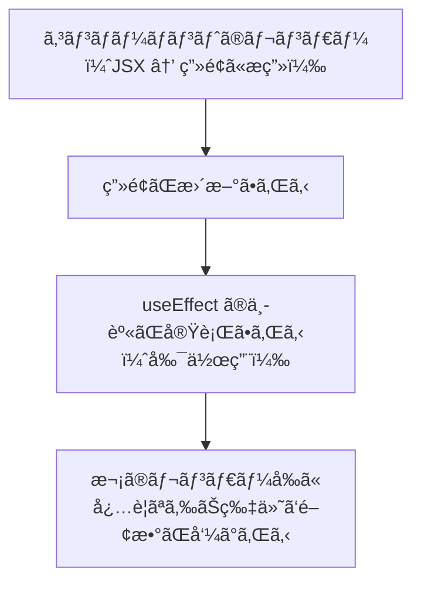

# 第57章：ã€ãƒ•ãƒƒã‚¯ã€‘`useEffect` ã®åŸºæœ¬


## 1. 今日ã“ã®ç« ã§ã§ãるよã†ã«ãªã‚ŠãŸã„ã“㨠ğŸ¯

ã“ã®ç« ã§ã¯ã€

* `useEffect` ãŒã€Œãªã«ã‚’ã™ã‚‹ãƒ•ãƒƒã‚¯ã€ãªã®ã‹ã‚¤ãƒ¡ãƒ¼ã‚¸ã§ãã‚‹
* ã„ã¡ã°ã‚“基本的ãªæ›¸ã方㧠`useEffect` を使ãˆã‚‹
* 「ã„ã¤å®Ÿè¡Œã•ã‚Œã‚‹ã®ï¼Ÿã€ã®ã‚¿ã‚¤ãƒŸãƒ³ã‚°ã‚’ã–ã£ãり説æ˜ã§ãã‚‹
* ã‹ã‚“ãŸã‚“ãªå®Ÿç”¨ä¾‹ï¼ˆãƒšãƒ¼ã‚¸ã‚¿ã‚¤ãƒˆãƒ«ã‚’変ãˆã‚‹ï¼‰ãŒæ›¸ã‘ã‚‹

ã“ã“ã¾ã§è¡Œã‘ãŸã‚‰ 💯 ã§ã™ï¼

---

## 2. `useEffect` ã¯ã€Œå¤–ã®ä¸–ç•Œã¨ä»²è‰¯ãã™ã‚‹ä¿‚ã€ğŸŒ

React ã®å…¬å¼ãƒ‰ã‚­ãƒ¥ãƒ¡ãƒ³ãƒˆã§ã¯ã€`useEffect` ã¯

> コンãƒãƒ¼ãƒãƒ³ãƒˆã‚’ãƒãƒ£ãƒƒãƒˆã‚µãƒ¼ãƒãƒ¼ã‚„タイãƒãƒ¼ãªã©ã® **外部システム** ã¨åŒæœŸã•ã›ã‚‹ãŸã‚ã®ãƒ•ãƒƒã‚¯

ã¨èª¬æ˜ã•ã‚Œã¦ã„ã¾ã™ã€‚([react.dev][1])

ãŸã¨ãˆã°ã“ã‚“ãªã¨ãã«ä½¿ã„ã¾ã™ï¼š

* `document.title` を変ãˆã‚‹ï¼ˆãƒ–ラウザã®ã‚¿ãƒ–タイトル）
* `setInterval` ã§ã‚¿ã‚¤ãƒãƒ¼ã‚’å‹•ã‹ã™
* `window.addEventListener` ã§ã‚¹ã‚¯ãƒ­ãƒ¼ãƒ«ã‚¤ãƒ™ãƒ³ãƒˆã‚’監視ã™ã‚‹
* 外部ライブラリ㮠`.start()` / `.stop()` を呼ã¶ã€€ãªã©

React ãƒãƒ¼ãƒ ã¯ã€Œå¤–部システムãŒé–¢ä¿‚ãªã„ãªã‚‰ã€ã‚€ã—ã‚ Effect ã¯ã„らãªã„ã“ã¨ãŒå¤šã„よã€ã¨ã‚‚言ã£ã¦ã„ã¾ã™ã€‚([react.dev][2])

> 👉 **ãƒã‚¤ãƒ³ãƒˆ**
> `useEffect` ã¯ã€ŒReact ã®å¤–ã®ä¸–ç•Œã€ã¨ã®çª“å£ã€‚
> ç”»é¢ã«è¡¨ç¤ºã™ã‚‹ã ã‘ãªã‚‰ã€åŸºæœ¬ã¯ `useState` ã‚„ JSX ã§è¶³ã‚Šã¾ã™ã€‚

---

## 3. `useEffect` ã®ã–ã£ãã‚Šæµã‚Œã‚’図ã§è¦‹ã‚‹ 🧠


`useEffect` ãŒå‹•ãæµã‚Œã‚’ã€ã–ã£ãã‚Š Mermaid ã§å›³ã«ã—ã¦ã¿ã¾ã™ã€‚


```mermaid
graph TD;
  A[コンãƒãƒ¼ãƒãƒ³ãƒˆã®ãƒ¬ãƒ³ãƒ€ãƒ¼<br>（JSX → ç”»é¢ã«æ画）] --> B[ç”»é¢ãŒæ›´æ–°ã•ã‚Œã‚‹];
  B --> C[useEffect ã®ä¸­èº«ãŒå®Ÿè¡Œã•ã‚Œã‚‹<br>（副作用）];
  C --> D[次ã®ãƒ¬ãƒ³ãƒ€ãƒ¼å‰ã«<br>å¿…è¦ãªã‚‰ãŠç‰‡ä»˜ã‘関数ãŒå‘¼ã°ã‚Œã‚‹];
```

イメージã¨ã—ã¦ã¯ã€

1. React ㌠JSX ã‚’ã‚‚ã¨ã«ç”»é¢ã‚’æ›´æ–°ã™ã‚‹
2. ãã®ã€Œã‚ã¨ã‹ã‚‰ã€`useEffect` ã®ä¸­ãŒèµ°ã‚‹
3. 次ã«ã‚‚ã†ä¸€åº¦åŒã˜ã‚³ãƒ³ãƒãƒ¼ãƒãƒ³ãƒˆãŒå‹•ãã¨ãã€å‰å›åˆ†ã®ã€ŒãŠç‰‡ä»˜ã‘ã€ãŒå‘¼ã°ã‚Œã‚‹ï¼ˆã‚ã‚Œã°ï¼‰

ãらã„ã§OKã§ã™ ✨

---

## 4. `useEffect` ã®ã„ã¡ã°ã‚“基本ã®å½¢ âœï¸

ã¾ãšã¯ **å‹ã¨ã‹é›£ã—ã„ã“ã¨ã¯ç½®ã„ã¨ã„ã¦**ã€å½¢ã‹ã‚‰è¦šãˆã¡ã‚ƒã„ã¾ã—ょã†ã€‚

### 基本ã®æ§‹æ–‡

```ts
import { useEffect } from "react";

useEffect(() => {
  // ã“ã“ã«ã€Œå‰¯ä½œç”¨ã€ã®å‡¦ç†ã‚’書ã
  console.log("useEffect ãŒå‹•ã„ãŸã‚ˆï¼");
});
```

* `useEffect(コールãƒãƒƒã‚¯é–¢æ•°)`
* コールãƒãƒƒã‚¯é–¢æ•°ã®ä¸­ã«ã€Œå¤–ã®ä¸–ç•Œã¨ã‚„ã‚Šã¨ã‚Šã™ã‚‹å‡¦ç†ã€ã‚’書ãã¾ã™ã€‚

> ※ 第62ç« ã§ã‚„る「ãŠç‰‡ä»˜ã‘（クリーンアップ）ã€ã‚’入れãŸã„ã¨ãã¯
> `return () => { ... }` ã‚’ã“ã®ä¸­ã‹ã‚‰è¿”ã—ã¾ã™ãŒã€ä»Šæ—¥ã¯ã¾ã å‡ºã¦ãã¾ã›ã‚“ ✋

---

## 5. ãƒãƒ³ã‚ºã‚ªãƒ³â‘ ï¼šã‚³ãƒ³ã‚½ãƒ¼ãƒ«ã«ãƒ¡ãƒƒã‚»ãƒ¼ã‚¸ã‚’出ã—ã¦ã¿ã‚‹ 🖥ï¸

ã¾ãšã¯ã€Œå‹•ã„ãŸã‹ã©ã†ã‹ã€ãŒä¸€ç›®ã§ã‚ã‹ã‚‹ãƒ­ã‚°ã‹ã‚‰å§‹ã‚ã¾ã™ã€‚

### 5-1. コンãƒãƒ¼ãƒãƒ³ãƒˆã‚’作る

`src/App.tsx` ã‚’ã€ã“ã‚“ãªæ„Ÿã˜ã«æ›¸ãã‹ãˆã¦ã¿ã¾ã—ょã†ã€‚

```tsx
import { useEffect } from "react";

export function App() {
  useEffect(() => {
    console.log("App コンãƒãƒ¼ãƒãƒ³ãƒˆã® useEffect ãŒå®Ÿè¡Œã•ã‚Œã¾ã—㟠ğŸ‰");
  });

  return (
    <div>
      <h1>useEffect ã®æœ€åˆã®ä¸€æ­© 👣</h1>
      <p>ブラウザã®é–‹ç™ºè€…ツールã®ã‚³ãƒ³ã‚½ãƒ¼ãƒ«ã‚’見ã¦ã¿ã‚ˆã†ï¼</p>
    </div>
  );
}
```

### 5-2. å‹•ã‹ã—ã¦ã¿ã‚‹

1. ターミナルã§ãƒ—ロジェクトフォルダã«ç§»å‹•

2. 開発サーãƒãƒ¼ã‚’èµ·å‹•

   ```bash
   npm run dev
   ```

3. ブラウザ㧠`http://localhost:5173`（Vite ã®ãƒ‡ãƒ•ã‚©ãƒ«ãƒˆï¼‰ã‚’é–‹ã

4. **F12キー** → 「Consoleã€ã‚¿ãƒ–ã‚’é–‹ã

ã™ã‚‹ã¨ã€ã“ã‚“ãªãƒ­ã‚°ãŒå‡ºã¦ã„ã‚‹ã¯ãšã§ã™ğŸ‘‡

```text
App コンãƒãƒ¼ãƒãƒ³ãƒˆã® useEffect ãŒå®Ÿè¡Œã•ã‚Œã¾ã—㟠ğŸ‰
```

> 💡 開発モードã§ã¯ã€`StrictMode` ã®å½±éŸ¿ã§ **最åˆã®ãƒ¬ãƒ³ãƒ€ãƒ¼ã ã‘ 2 å›å®Ÿè¡Œã•ã‚Œã‚‹** ã“ã¨ãŒã‚ã‚Šã¾ã™ã€‚
> React 18 以é™ã®é–‹ç™ºãƒ¢ãƒ¼ãƒ‰ã®ä»•æ§˜ã§ã€ã€Œãƒã‚°ãŒãªã„ã‹ãƒã‚§ãƒƒã‚¯ã™ã‚‹ãŸã‚ã€ã®å‹•ãã§ã™ã€‚([Reddit][3])
> 本番ビルドã§ã¯ 1 å›ã«ãªã‚‹ã®ã§ã€ã€Œ2å›å‡ºã‚‹ï¼ãƒã‚°ã€ã¨ã¯é™ã‚‰ãªã„よ〜ã¨ã„ã†ã“ã¨ã ã‘覚ãˆã¦ãŠã„ã¦ãã ã•ã„。

---

## 6. `useEffect` ã¯ã€Œã„ã¤ã€å‹•ãã®ï¼ŸâŒš

ã•ã£ãã®ã‚³ãƒ¼ãƒ‰ã§ã¯ã€ä¾å­˜é…列（`[]` ã®ã‚„ã¤ï¼‰ã‚’ã¤ã‘ã¦ã„ãªã„ã®ã§ã€

> コンãƒãƒ¼ãƒãƒ³ãƒˆãŒãƒ¬ãƒ³ãƒ€ãƒ¼ã•ã‚Œã‚‹ãŸã³ã« `useEffect` ãŒå‹•ã

ã¨ã„ã†æŒ™å‹•ã«ãªã‚Šã¾ã™ã€‚([react.dev][1])

ã¤ã¾ã‚Šï¼š

* `App` ãŒæœ€åˆã«è¡¨ç¤ºã•ã‚ŒãŸã¨ã ✅
* `App` ã®ä¸­ã® state ãŒå¤‰ã‚ã£ã¦ã€ã‚‚ã†ä¸€åº¦ãƒ¬ãƒ³ãƒ€ãƒ¼ã•ã‚ŒãŸã¨ã ✅
  → ãã®ãŸã³ã« `console.log` ãŒå‡ºã‚‹

> 🗠ä¾å­˜é…列ã£ã¦ãªã«ï¼Ÿ
> `useEffect(() => { ... }, [count])` ã¿ãŸã„ã«æ›¸ã **第2引数ã®é…列** ã®ã“ã¨ã‚’
> ã“ã®æ•™æã§ã¯ã€Œè¦‹å¼µã‚Šãƒªã‚¹ãƒˆã€ã¨å‘¼ã³ã¾ã™ã€‚
> **第58章〜第61ç« ** ã§ã˜ã£ãã‚Šã‚„ã‚‹ã®ã§ã€ä»Šã¯ãƒãƒ©è¦‹ã›ã ã‘ã«ã—ã¦ãŠãã¾ã™ 👀

---

## 7. ãƒãƒ³ã‚ºã‚ªãƒ³â‘¡ï¼šãƒšãƒ¼ã‚¸ã‚¿ã‚¤ãƒˆãƒ«ã‚’「カウントã€ã«åˆã‚ã›ã¦å¤‰ãˆã‚‹ 🧮✨


React 19 ã§ã¯ã€ãƒ‡ãƒ¼ã‚¿å–å¾—ãªã©ã¯æ–°ã—ã„ `use` フックや Actions ã§æ›¸ãæµã‚Œã«ãªã£ã¦ãã¦ã„ã¾ã™ãŒã€`document.title` ã®å¤‰æ›´ã‚„タイãƒãƒ¼ã®ã‚ˆã†ãªã€Œå¤–部ã¨ã®ã¡ã‚‡ã£ã¨ã—ãŸåŒæœŸã€ã¯ã€ä»Šã§ã‚‚ `useEffect` ã®è‰¯ã„出番ã§ã™ã€‚([Medium][4])

ã“ã“ã§ã¯ã€

> カウンターã®æ•°å­—ã«åˆã‚ã›ã¦ã€ãƒ–ラウザタブã®ã‚¿ã‚¤ãƒˆãƒ«ã‚’変ãˆã‚‹

ã¨ã„ã†ã€å…¸å‹çš„㪠`useEffect` ã®ä¾‹ã‚’作ã£ã¦ã¿ã¾ã—ょã†ã€‚

### 7-1. コード全体

`src/App.tsx` を次ã®ã‚ˆã†ã«ã—ã¦ã¿ã¦ãã ã•ã„。

```tsx
import { useEffect, useState } from "react";

export function App() {
  const [count, setCount] = useState(0);

  // 👉 count ãŒå¤‰ã‚ã‚‹ãŸã³ã«ã€ã‚¿ã‚¤ãƒˆãƒ«ã‚’æ›´æ–°ã™ã‚‹
  useEffect(() => {
    document.title = `カウント: ${count}`;
  }, [count]); // ↠見張りリスト（ä¾å­˜é…列）：count を見ã¦ã„ã‚‹

  function handleClick() {
    setCount(count + 1);
  }

  return (
    <div style={{ padding: "16px" }}>
      <h1>useEffect ã§ãƒšãƒ¼ã‚¸ã‚¿ã‚¤ãƒˆãƒ«ã‚’変ãˆã¦ã¿ã‚ˆã† ✨</h1>
      <p>ã„ã¾ã®ã‚«ã‚¦ãƒ³ãƒˆ: {count}</p>
      <button onClick={handleClick}>+1 ã™ã‚‹ãƒœã‚¿ãƒ³ 🧮</button>
      <p>ブラウザã®ã‚¿ãƒ–ã®ã‚¿ã‚¤ãƒˆãƒ«ã«ã‚‚注目ã—ã¦ã¿ã¦ã­ï¼</p>
    </div>
  );
}
```

### 7-2. ã“ã“ã§è¦šãˆã¦ã»ã—ã„ã“㨠💡

* `useEffect(() => { ... }, [count])`

  * `count` ãŒå¤‰ã‚ã£ãŸã¨ãã ã‘ã€ã“ã®ä¸­èº«ãŒå®Ÿè¡Œã•ã‚Œã‚‹
* 中ã§ã¯ `document.title = ...` ã¨ã€React ã®å¤–ã«ã„るブラウザ API を呼んã§ã„ã‚‹

  * ã ã‹ã‚‰ã“ãã€`useEffect` ã®å‡ºç•ªï¼

> 👀 ã„ã¾ã¯ã€Œ`[count]` ã¨æ›¸ã„ãŸã‚‰ã€count ãŒå¤‰ã‚ã£ãŸã¨ã専用㮠Effect ã«ãªã‚‹ã€ãらã„ã®ç†è§£ã§OKã§ã™ã€‚
> 第58〜60ç« ã§ã€`[]` / `[state]` / çœç•¥ ã®ãã‚Œãã‚Œã®é•ã„ã‚’ä¸å¯§ã«ã‚„ã‚Šã¾ã™ã€‚

---

## 8. `useEffect` ã®æ›¸ãæ–¹ãƒãƒ¼ãƒˆã‚·ãƒ¼ãƒˆ ğŸ“

ã“ã®ç« ã§å‡ºã¦ããŸã“ã¨ã‚’ã€ã„ã£ãŸã‚“æ•´ç†ã—ã¦ãŠãã¾ã™ã€‚

### 8-1. å½¢ã¯ãœã‚“ã¶ã§ã“ã‚“ãªæ„Ÿã˜

```
useEffect(() => {
  // 副作用
});

// （ä¾å­˜é…列ã‚り）
useEffect(() => {
  // 副作用
}, [ä¾å­˜ã™ã‚‹å€¤1, ä¾å­˜ã™ã‚‹å€¤2]);

// （ãŠç‰‡ä»˜ã‘ã‚‚ã‚ã‚‹ãƒãƒ¼ã‚¸ãƒ§ãƒ³ï¼‰
useEffect(() => {
  // 副作用ã®å‡¦ç†

  return () => {
    // ãŠç‰‡ä»˜ã‘（イベント解除・タイãƒãƒ¼è§£é™¤ãªã©ï¼‰
  };
}, [ä¾å­˜ã™ã‚‹å€¤]);
```

> 🧹 ãŠç‰‡ä»˜ã‘（クリーンアップ）版ã¯ã€ç¬¬62ç« ã§ã—ã£ã‹ã‚Šã‚„ã‚Šã¾ã™ã€‚
> 「`return () => { ... }` ã§å‰å›ã®æ®‹ã‚Šã‚’片ã¥ã‘ã‚‹ã€ã¨ã ã‘メモã—ã¦ãŠã„ã¦ãã ã•ã„。

### 8-2. 守ã£ã¦ã»ã—ã„ルール（超ã–ã£ãり）

* `useEffect` 㯠**コンãƒãƒ¼ãƒãƒ³ãƒˆã®ã€Œä¸€ç•ªå¤–å´ã€ã ã‘ã«æ›¸ã**

  * `if` ã®ä¸­ã‚„ `for` ã®ä¸­ã«æ›¸ã‹ãªã„
* React ãŒãƒ¬ãƒ³ãƒ€ãƒ¼ã™ã‚‹ãŸã³ã«ã€å¿…è¦ã«å¿œã˜ã¦å‹æ‰‹ã«å‘¼ã‚“ã§ãれる

  * 自分㧠`useEffect()` ã‚’ç›´æ¥å‘¼ã³å‡ºã—ãŸã‚Šã—ãªã„
* 「React ã®å¤–ã€ã«ã‚ã‚‹ã‚‚ã®ï¼ˆ`document`, `window`, 外部ライブラリãªã©ï¼‰ã‚’触るã¨ãã«ä½¿ã†

---

## 9. ミニ練習＆ãƒã‚§ãƒƒã‚¯ãƒ†ã‚¹ãƒˆ âœï¸âœ¨

### Q1. ã“ã‚Œã¯ä½•å›å‹•ã？🤔

次ã®ã‚³ãƒ¼ãƒ‰ã‚’見ã¦ãã ã•ã„。

```tsx
import { useEffect, useState } from "react";

export function Sample() {
  const [value, setValue] = useState(0);

  useEffect(() => {
    console.log("Effect ãŒå®Ÿè¡Œã•ã‚Œã¾ã—ãŸ");
  });

  return (
    <button onClick={() => setValue(value + 1)}>
      値を増やã™ï¼ˆã„ã¾: {value}）
    </button>
  );
}
```

> 質å•ï¼š
> （開発モード㧠StrictMode ãŒæœ‰åŠ¹ãªå‰æ）
>
> * 最åˆã«ç”»é¢ãŒè¡¨ç¤ºã•ã‚ŒãŸã¨ã
> * ボタンを 1 å›ã‚¯ãƒªãƒƒã‚¯ã—ãŸã¨ã
>   コンソールã«ã¯ä½•å›ã€ŒEffect ãŒå®Ÿè¡Œã•ã‚Œã¾ã—ãŸã€ã¨å‡ºã‚‹ã§ã—ょã†ï¼Ÿ

**ヒント**：

* ä¾å­˜é…列ãŒãªã„ï¼ãƒ¬ãƒ³ãƒ€ãƒ¼ã®ãŸã³ã«å®Ÿè¡Œ
* 開発モードã§ã¯ã€æœ€åˆã®ãƒã‚¦ãƒ³ãƒˆãŒ 2 å›ã«ãªã‚‹ã“ã¨ãŒã‚る（ãƒã‚§ãƒƒã‚¯ã®ãŸã‚）

---

### Q2. ã“ã® `useEffect` ã¯ä½•ã‚’ã—ãŸã„？🕵ï¸â€â™€ï¸

```tsx
useEffect(() => {
  document.title = `ログインユーザー: ${userName}`;
}, [userName]);
```

`userName` ãŒå¤‰ã‚ã£ãŸã¨ãã«ã€ä½•ã‚’ã—ãŸã„コードã§ã—ょã†ï¼Ÿ
自分ãªã‚Šã®æ—¥æœ¬èªã§èª¬æ˜ã—ã¦ã¿ã¦ãã ã•ã„。

（例：「〇〇ã«ãªã£ãŸã‚‰ã€ãƒ–ラウザã®ã‚¿ãƒ–ã«â–³â–³ã¨è¡¨ç¤ºã™ã‚‹ã€ã¿ãŸã„㫠☺）

---

### Q3. 実装ãŠé¡Œ ğŸ®

`useEffect` を使ã£ã¦ã€æ¬¡ã®ã©ã‚Œã‹ã‚’実装ã—ã¦ã¿ã¦ãã ã•ã„（好ããªã®ã‚’é¸ã‚“ã§OK）：

1. ページを開ã„ãŸã¨ãã ã‘一度ã ã‘ `alert("よã†ã“ãï¼")` を出ã™ã‚³ãƒ³ãƒãƒ¼ãƒãƒ³ãƒˆ
2. コンãƒãƒ¼ãƒãƒ³ãƒˆãŒãƒ¬ãƒ³ãƒ€ãƒ¼ã•ã‚Œã‚‹ãŸã³ã«ã€ç¾åœ¨æ™‚刻をコンソールã«è¡¨ç¤ºã™ã‚‹ã‚³ãƒ³ãƒãƒ¼ãƒãƒ³ãƒˆ
3. 入力欄ã«æ–‡å­—を打ã¤ãŸã³ã«ã€ãã®æ–‡å­—æ•°ã‚’ `document.title` ã«å映ã™ã‚‹ã‚³ãƒ³ãƒãƒ¼ãƒãƒ³ãƒˆ

> ✨ 次ã®ç« ã§ã€Œè¦‹å¼µã‚Šãƒªã‚¹ãƒˆï¼ˆä¾å­˜é…列）ã€ã‚’ã¡ã‚ƒã‚“ã¨ç†è§£ã™ã‚‹ã¨ã€
> 「ã„ã¤1å›ã§ã€ã„ã¤æ¯å›ãªã®ã‹ã€ã‚’自信をもã£ã¦ã‚³ãƒ³ãƒˆãƒ­ãƒ¼ãƒ«ã§ãるよã†ã«ãªã‚Šã¾ã™ 💪

---

## 10. ã¾ã¨ã‚ ğŸ€

* `useEffect` 㯠**React ã®å¤–ã®ä¸–界（ブラウザAPI・タイãƒãƒ¼ãƒ»å¤–部ライブラリãªã©ï¼‰ã¨åŒæœŸã™ã‚‹ãŸã‚ã®ãƒ•ãƒƒã‚¯**
* ç”»é¢ãŒãƒ¬ãƒ³ãƒ€ãƒ¼ã•ã‚ŒãŸã€Œã‚ã¨ã€ã§å‹•ã（タイミングã¯ãƒ¬ãƒ³ãƒ€ãƒ¼ã¨ã‚»ãƒƒãƒˆï¼‰
* 第2引数ã®é…列（見張りリスト）ã§ã€Œã„ã¤å‹•ã‹ã™ã‹ã€ã‚’コントロールã§ãã‚‹
  → ã“れ㯠58〜61ç« ã§ã˜ã£ãã‚Šï¼
* React 19 ã§ã¯ãƒ‡ãƒ¼ã‚¿å–å¾—ãªã©ã¯åˆ¥ã®ä»•çµ„ã¿ã‚‚増ãˆã¦ããŸã‘ã©ã€
  `document.title` やイベント登録ãªã©ã®ç”¨é€”ã§ã¯ã€ä»Šã§ã‚‚主役級 💫

次㮠**第58ç« ** ã§ã¯ã€ã“ã® `useEffect` ã®ã€Œè¦‹å¼µã‚Šãƒªã‚¹ãƒˆï¼ˆä¾å­˜é…列）ã€ã‚’詳ã—ã見ã¦ã„ãã¾ã™ã€‚
「ã©ã®å€¤ã‚’見張るã‹ã€ã‚’コントロールã§ãるよã†ã«ãªã‚‹ã¨ã€ä¸€æ°—ã«ãƒ—ロã£ã½ã„コードã«ãªã‚Šã¾ã™ã‚ˆã€œ ğŸ˜ğŸš€

[1]: https://react.dev/reference/react/useEffect?utm_source=chatgpt.com "useEffect"
[2]: https://react.dev/learn/you-might-not-need-an-effect?utm_source=chatgpt.com "You Might Not Need an Effect"
[3]: https://www.reddit.com/r/reactjs/comments/vddc37/what_happened_to_useeffect_hook_in_react_18/?utm_source=chatgpt.com "What happened to useEffect() hook in React 18? : r/reactjs"
[4]: https://medium.com/%40CodersWorld99/react-18-vs-react-19-a-full-breakdown-of-new-apis-the-compiler-rewrite-and-game-changing-async-cfbcf78bcdee?utm_source=chatgpt.com "React 18 vs React 19: A Full Breakdown of New APIs, the ..."
