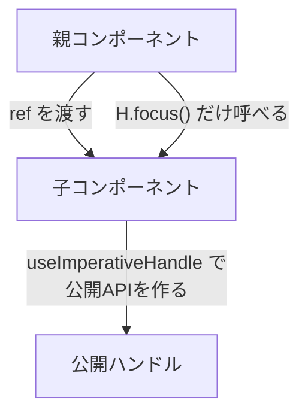
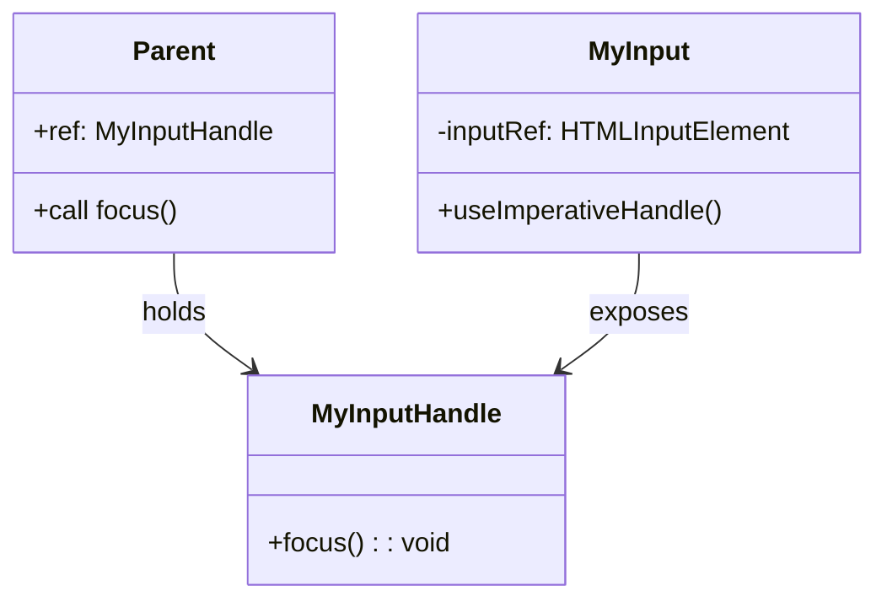

# 第108章：【フック】`useImperativeHandle`

この章は「親が子コンポーネントに対して、**必要な操作だけ**できるようにする」回だよ〜！😊
ポイントは **「refで何でも触らせない」** こと 👍✨

---

## 今日のゴール🎯

* 親 → 子に「ref」を渡す
* 子は「useImperativeHandle」で **公開していい機能だけ** を返す
* 親は「子の公開機能」だけを呼べるようになる🙌

---

## まずイメージ図🗺️（何が起きてる？）



```mermaid
flowchart TD
  P[親コンポーネント] -->|ref を渡す| C[子コンポーネント]
  C -->|useImperativeHandle で<br/>公開APIを作る| H["公開ハンドル"]
  P -->|"H.focus() だけ呼べる"| C
```

* 親は「子の中の input要素」そのものを触るんじゃなくて、
* 子が用意した「公開ボタン（API）」だけ押せる感じ！🎮✨

---

## useImperativeHandleってなに？🤔


「refを使って親から操作できるようにする」だけなら、子の中のDOM（inputとか）をそのまま渡しがち💦
でもそれだと親が **なんでもできちゃう**（＝壊しやすい）😇

そこで！

✅ 子が「使っていい操作だけ」をまとめて返すのが「useImperativeHandle」だよ✨
つまり **“公開メニューを決めるフック”** 🍽️

---

## いつ使うの？（使いどころ）🧩

よくあるのはこのへん👇

* 入力欄にフォーカスを当てたい（focus）⌨️✨
* フォームを一括クリアしたい（clear）🧹
* モーダルを開く/閉じる（open/close）🪟
* 動画を再生/停止（play/pause）🎬

逆に、普段のUI更新は **状態（useState）でやるのが基本** だよ！🧠✨
「どうしても命令っぽい操作が必要なとき」だけ使うのがコツ👍

---

## 実装してみよう！💻✨（v19スタイル：refをPropsみたいに受け取る）

今回は「MyInput」という部品を作って、親から「フォーカスだけ」できるようにするよ😊
（次の第109章にそのまま繋がる！）

---

### フォルダ構成（例）📁

```txt
src/
  components/
    MyInput.tsx
  App.tsx
```

---

## 1) 子：MyInput.tsx を作る🧸✨

* 子の中で「本物のinput」を指すために useRef を用意
* useImperativeHandle で「focus関数だけ」公開する

```tsx
// src/components/MyInput.tsx
import { useImperativeHandle, useRef } from "react";

export type MyInputHandle = {
  focus: () => void;
};

type Props = {
  label: string;
  placeholder?: string;
  // React v19: ref を Props の一部みたいに受け取れる
  ref?: React.Ref<MyInputHandle>;
};

export function MyInput(props: Props) {
  const { label, placeholder, ref } = props;

  const inputRef = useRef<HTMLInputElement>(null);

  useImperativeHandle(
    ref,
    () => {
      return {
        focus: () => {
          inputRef.current?.focus();
        },
      };
    },
    []
  );

  return (
    <div style={{ display: "grid", gap: 8 }}>
      <label style={{ fontWeight: 700 }}>{label}</label>
      <input
        ref={inputRef}
        placeholder={placeholder}
        style={{
          padding: "10px 12px",
          borderRadius: 10,
          border: "1px solid #ccc",
        }}
      />
    </div>
  );
}
```

### ここが超大事ポイント🧠✨

* 親が触れるのは「focus」だけ ✅
* inputの中身（valueとか）は、親が勝手にいじれない 🙅‍♀️
* 「公開する機能」を子がコントロールできる 💪🌸

---

## 2) 親：App.tsx から focus を呼ぶ🎛️✨

親は「MyInputHandle型のref」を作って、ボタンで「focus」を呼ぶよ！

```tsx
// src/App.tsx
import { useRef } from "react";
import { MyInput, type MyInputHandle } from "./components/MyInput";

export default function App() {
  const myInputRef = useRef<MyInputHandle>(null);

  return (
    <div style={{ padding: 24, display: "grid", gap: 16 }}>
      <h1 style={{ margin: 0 }}>useImperativeHandle 練習✨</h1>

      <MyInput
        ref={myInputRef}
        label="ユーザー名"
        placeholder="ここに入力してね😊"
      />

      <button
        onClick={() => myInputRef.current?.focus()}
        style={{
          padding: "10px 12px",
          borderRadius: 10,
          border: "none",
          cursor: "pointer",
        }}
      >
        入力欄にフォーカスする👉✨
      </button>
    </div>
  );
}
```

---

## 動作チェック✅🎉

* 画面を開く
* ボタンを押す
* 入力欄にカーソルが入ったら成功！🥳✨

---

## ありがちミス集（ハマりどころ）🕳️🧯

### 1) 押しても何も起きない😢

* 親側：refが「null」のままの可能性
  → 「myInputRef.current?.focus()」みたいに「?.」は付けてOK！

### 2) 子で inputRef.current が null 😭

* inputに「 `ref={inputRef}` 」が付いてるかチェック✅

### 3) useImperativeHandle の依存配列が気になる🤔

* 今回は「focusだけ」で中身が変わらないから「[]」でOK👍
* もし公開関数が state を使うなら、依存配列を考える必要が出てくるよ🧠✨

---

## ミニ理解図：親が呼べるのは“公開分だけ”🔐


```mermaid
classDiagram
  class Parent {
    +ref: MyInputHandle
    +call focus()
  }

  class MyInputHandle {
    +focus(): void
  }

  class MyInput {
    -inputRef: HTMLInputElement
    +useImperativeHandle()
  }

  Parent --> MyInputHandle : holds
  MyInput --> MyInputHandle : exposes
```

---

## 練習問題（やってみよ〜！）📝✨


### 練習1：clear も公開してみよう🧹

1. 「MyInputHandle」に「clear」を追加
2. useImperativeHandleで「clear」を実装（inputの中身を空にする）
3. App.tsxに「クリア」ボタンを追加

ヒント：inputRef.current があるときに value を空文字にするよ😊

---

### 練習2：公開しすぎ禁止ゲーム🚫🎮

わざと「input要素そのもの」を親に渡してみて、
「親が何でもできちゃう危険さ」を体感してみてね😇
（そのあと、ちゃんと useImperativeHandle に戻す！✨）

---

## まとめ💖

* 「useImperativeHandle」は **refで操作できる機能を“制限して公開”** するフック✨
* 親は「子の中身」を触らず、**子が許可した操作だけ**できる🔐
* 使いどころは「フォーカス」「スクロール」「再生」みたいな命令系が必要なとき👍

次の **第109章** では、今回の「focus公開」をもっときれいに練習して完成させるよ〜！🥰🎉
