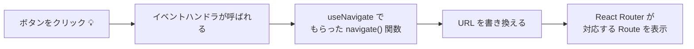

# 第147章：`useNavigate` でコードからページ移動する

この章では、**「ボタンを押したらコード側からページを変えたい！」**
というときに使うフック、**useNavigate** をマスターしていきます ✨

---

## 1️⃣ これまでとの違い：`<Link>` vs `useNavigate` 🧭

ここまでで、

* ルーティングの基本
* `<BrowserRouter>` / `<Routes>` / `<Route>`
* `<Link>` でのページ移動
* `useParams` で URL パラメータを読む

…はやりましたよね 👀

ここで新登場なのが **useNavigate** です。

* `<Link>`

  * JSX の中に書く
  * 「リンクをクリックしたら移動」みたいな *見た目にくっついた移動*
* **useNavigate**

  * フック（hook）
  * **イベントの中や処理の中から、「よし、今だ！」と思ったタイミングでページ移動できる**

たとえば：

* ログインに成功したら `/dashboard` に飛ばしたい
* フォーム送信が成功したら「完了ページ」に移動したい
* エラーが出たら `/error` ページへ飛ばしたい

こういう「条件つきのページ移動」は、useNavigate の出番です 💪
useNavigate は、React Router v6 から導入された「プログラムからのナビゲーション用フック」です。([Zenn][1])

---

## 2️⃣ useNavigate のざっくりイメージ図 🧠✨

後でコードを書きますが、まずはイメージから 👇



**ポイント：**

* useNavigate は **navigate という関数** を返してくれるフック
* その navigate を呼ぶと、**URL が変わって、表示されるページも変わる**([React Router][2])


---

## 3️⃣ useNavigate の基本の形 🧩


まずは一番シンプルな使い方から ✨

### 手順

1. `react-router-dom` から useNavigate をインポート
2. コンポーネントの中で `const navigate = useNavigate();`
3. ボタンのクリックイベントなどで `navigate("/行き先")`

### 例：ホームから「プロフィール」ページへ移動するボタン 👇

```ts
// src/pages/HomePage.tsx
import { useNavigate } from "react-router-dom";

export function HomePage() {
  // ① useNavigate で navigate 関数をもらう
  const navigate = useNavigate();

  // ② ボタンが押されたときの処理
  function handleGoProfile() {
    // ③ 行き先のパスを渡して呼び出す
    navigate("/profile");
  }

  return (
    <div>
      <h1>ホームページ 🏠</h1>
      <p>下のボタンを押すとプロフィールページへ移動します。</p>
      <button onClick={handleGoProfile}>プロフィールへ移動 👧</button>
    </div>
  );
}
```

この例では、

* ボタンがクリックされる
* `handleGoProfile` が呼ばれる
* `navigate("/profile")` が実行されて URL が `/profile` に
* ルーティング設定で `/profile` に対応するコンポーネントが表示されます 🎉([GeeksforGeeks][3])

---

## 4️⃣ navigate の 2パターン：**パス指定** と **数字指定** 🔢

公式ドキュメントによると、navigate には大きく2つの使い方があります。([React Router][2])

### ① パスを指定して移動する（よく使うやつ）

```ts
navigate("/profile");
navigate("/settings/account");
navigate(`/users/${userId}`);
```

もうこれは直感的ですね 😊
「この URL に行きたい！」というときは、ほぼこれです。

---

### ② 数字（履歴の移動）を指定する

```ts
navigate(-1); // 1つ前のページへ戻る（ブラウザの戻るボタンみたい）
navigate(1);  // 1つ先のページへ進む（進むボタンみたい）
```

* **`navigate(-1)`** は、「戻るボタン」を自作したいときによく使います。
* どのパスかわからないけど、とにかく「さっきのページに戻したい」ケースで便利です 💡

---

## 5️⃣ オプションで挙動をカスタマイズ ✨

navigate には、第2引数で **オプション** を渡せます。
代表的なのはこの2つです 👇([React Router][2])

* `replace: true`
* `state: {...}`

### 5-1. `replace: true` で「戻る」を封じる（ログイン後など）


ログイン後に `/dashboard` に飛ばしたあと、
ブラウザの戻るボタンで **ログイン画面に戻ってほしくない** ことってありますよね？

そのときは `replace: true` 😊

```ts
function LoginPage() {
  const navigate = useNavigate();

  async function handleLogin() {
    // ここでログイン処理（省略）

    // ログイン成功したらダッシュボードへ！
    navigate("/dashboard", { replace: true });
  }

  return (
    <div>
      <h1>ログイン 🔐</h1>
      <button onClick={handleLogin}>ログインする</button>
    </div>
  );
}
```

`replace: true` を付けると、
「今の履歴を上書きして移動」するイメージになります。

* `replace: true` → 戻るボタンでログイン画面に戻れない
* 付けない → 戻るボタンでログイン画面に戻れる

---

### 5-2. `state` でちょっとしたデータを一緒に渡す 📦

`state` を使うと、**URL には出さずに、次のページへデータを渡す** ことができます。([React Router][2])

#### 送る側（例：完了ページへ）

```ts
import { useNavigate } from "react-router-dom";

export function EntryForm() {
  const navigate = useNavigate();

  function handleSubmit() {
    const userName = "さくら";

    // 「完了ページ」へ、ユーザー名を state で渡す
    navigate("/complete", {
      state: { userName },
    });
  }

  return (
    <div>
      <h1>エントリーフォーム ✏️</h1>
      <button onClick={handleSubmit}>送信して完了ページへ ▶</button>
    </div>
  );
}
```

#### 受け取る側（`/complete` のページ）

本格的な型安全は次の章以降でやるとして、
ここでは **最低限の TypeScript だけ** 使った受け取り方のイメージを紹介します 👇([Zenn][4])

```ts
// src/pages/CompletePage.tsx
import { useLocation } from "react-router-dom";

type CompleteState = {
  userName: string;
};

export function CompletePage() {
  const location = useLocation();

  // location.state は unknown 扱いされるので、as で型を教えてあげる
  const state = location.state as CompleteState | null;

  return (
    <div>
      <h1>完了ページ 🎉</h1>
      <p>
        {state?.userName
          ? `${state.userName}さん、ありがとうございました！`
          : "送信ありがとうございました！"}
      </p>
    </div>
  );
}
```

**ポイント：**

* `navigate("/complete", { state: { userName } })` でデータを渡す
* 次のページで `useLocation().state` から取り出す
* TypeScript 的には `as 型` で「こういう形のデータだよ」と教えてあげる

`state` はあくまで「おまけデータ」なので、
重要な情報（トークン、機密情報など）はここには入れない方が安全です ⚠️

---

## 6️⃣ ちょっとリアルなサンプル：戻るボタン & 詳細ページへ GO 🎮

簡単なページをイメージしてみましょう 👇

* `/items` … アイテム一覧ページ
* `/items/:id` … アイテム詳細ページ

### アイテム一覧ページ（`/items`）

```ts
// src/pages/ItemListPage.tsx
import { useNavigate } from "react-router-dom";

const ITEMS = [
  { id: 1, name: "りんごジュース" },
  { id: 2, name: "オレンジジュース" },
  { id: 3, name: "ぶどうジュース" },
];

export function ItemListPage() {
  const navigate = useNavigate();

  function handleOpenDetail(id: number) {
    // `/items/1` みたいな感じで詳細ページへ
    navigate(`/items/${id}`);
  }

  function handleBack() {
    // 1つ前のページに戻る
    navigate(-1);
  }

  return (
    <div>
      <h1>ドリンク一覧 🥤</h1>

      <ul>
        {ITEMS.map((item) => (
          <li key={item.id}>
            {item.name}{" "}
            <button onClick={() => handleOpenDetail(item.id)}>
              詳細へ ▶
            </button>
          </li>
        ))}
      </ul>

      <hr />
      <button onClick={handleBack}>前のページに戻る ⬅️</button>
    </div>
  );
}
```

この例で使っているもの：

* ``navigate(`/items/\${id}`)`` … 文字列パスで移動
* `navigate(-1)` … 履歴を使った「戻る」

---

## 7️⃣ まとめ ✍️

この章で覚えておきたいポイントはこれだけ 🌟

* **useNavigate は「コードからページ移動するためのフック」**

  * `const navigate = useNavigate();`
  * `navigate("/path")` で指定したパスへ移動([React Router][2])
* **履歴を使った移動もできる**

  * `navigate(-1)` → 1つ前に戻る
  * `navigate(1)`  → 1つ先へ進む
* **オプションで挙動を変えられる**

  * `replace: true` → 戻るボタンで元のページに戻らせたくないとき
  * `state` → 次のページにちょっとしたデータを渡したいとき([React Router][2])
* 画面上にリンクを出したいときは `<Link>`
  「処理の結果に応じて移動したい！」ときは **useNavigate** が相性バツグン 💘

---

## 🎮 ミニ演習（やってみよう！）

時間があれば、次の3つを自分のプロジェクトで試してみてください ✨

1. `/login` ページで、

   * 「ログイン」ボタンを押したら `alert("ログインしました！")` を出してから
   * `navigate("/dashboard")` でダッシュボードへ移動

2. `/dashboard` ページに

   * `navigate(-1)` を使った「前のページに戻る」ボタンをつける

3. アイテム一覧から

   * ``navigate(`/items/${id}`)`` で詳細ページへ移動するボタンを作る

次の章では、フォルダの分け方や絶対パスインポートなど、
**プロジェクトの整理術** に入っていきます 🗂️✨

ゆっくりでいいので、まずは
**「Link じゃなくて useNavigate で動かす」感覚** を手に馴染ませていきましょう〜 🧡

[1]: https://zenn.dev/kkoisland/articles/918bebe350ed42?utm_source=chatgpt.com "useNavigate(): React Routerでのナビゲーションとその活用方法"
[2]: https://reactrouter.com/api/hooks/useNavigate?utm_source=chatgpt.com "useNavigate"
[3]: https://www.geeksforgeeks.org/reactjs/reactjs-usenavigate-hook/?utm_source=chatgpt.com "ReactJS useNavigate() Hook"
[4]: https://zenn.dev/lilac/articles/c40b35fe3184da?utm_source=chatgpt.com "【React Router v6】遷移先に値を渡す方法"
