# 第188章：`useFieldArray`

「電話番号が何個もある」「SNSリンクをいくつも登録したい」「メンバーを追加したい」みたいに、**入力欄が増えたり減ったりするフォーム**ってありますよね？📋
それを超気持ちよく作れるのが **React Hook Form の `useFieldArray`** です💪💖

---

## まずイメージつかも！👀✨（Mermaid図解）

```mermaid
flowchart TD
A["「＋メンバー追加」ボタン"] --> B["append() を実行"]
B --> C["fields に1件追加される"]
C --> D["画面に入力欄が増える"]
D --> E["「削除」ボタン"] --> F["remove(index) を実行"]
F --> G["fields から消える"]
D --> H["送信ボタン"] --> I["handleSubmitで配列データを受け取る"]
```




---

## 今日作るもの🎀

**「ゼミメンバー登録フォーム」**

* メンバーを「＋追加」できる➕
* いらないメンバーは「削除」できる🗑️
* 送信すると、配列で全部まとまって取れる📦✨

---

## もしまだ入ってなければインストール（念のため）💿

（前の章で入れてるならスキップでOKだよ〜🙆‍♀️）

```bash
npm i react-hook-form
```

---

## 実装：`useFieldArray` の基本セット（TS対応）🧁


### `src/FieldArrayDemo.tsx` を作る✨

```tsx
import { useFieldArray, useForm } from "react-hook-form";

type Member = {
  name: string;
  grade: number; // 学年（数字）
  note: string;
};

type FormValues = {
  members: Member[];
};

export function FieldArrayDemo() {
  const {
    register,
    control,
    handleSubmit,
    formState: { errors },
  } = useForm<FormValues>({
    defaultValues: {
      members: [{ name: "", grade: 1, note: "" }],
    },
    mode: "onBlur",
  });

  const { fields, append, remove } = useFieldArray({
    control,
    name: "members",
  });

  const onSubmit = (data: FormValues) => {
    console.log("送信データ:", data);
    alert("送信できたよ〜✨ コンソール見てね👀");
  };

  return (
    <div style={{ maxWidth: 720, margin: "40px auto", padding: 16 }}>
      <h1>ゼミメンバー登録フォーム 🌸</h1>
      <p>「＋追加」で入力欄が増えるよ〜➕✨</p>

      <form onSubmit={handleSubmit(onSubmit)}>
        <div style={{ display: "grid", gap: 12 }}>
          {fields.map((field, index) => {
            const nameError = errors.members?.[index]?.name?.message;
            const gradeError = errors.members?.[index]?.grade?.message;

            return (
              <div
                key={field.id}
                style={{
                  border: "1px solid #ddd",
                  borderRadius: 12,
                  padding: 12,
                }}
              >
                <h3 style={{ marginTop: 0 }}>メンバー {index + 1} 👤</h3>

                <div style={{ display: "grid", gap: 8 }}>
                  <label>
                    名前 ✍️
                    <input
                      style={{ display: "block", width: "100%", padding: 8 }}
                      placeholder="例）さくら"
                      {...register(`members.${index}.name`, {
                        required: "名前は必須だよ〜🥺",
                        minLength: { value: 2, message: "2文字以上にしてね😊" },
                      })}
                    />
                    {nameError && (
                      <p style={{ margin: "6px 0 0", color: "crimson" }}>
                        {nameError}
                      </p>
                    )}
                  </label>

                  <label>
                    学年 🎓
                    <input
                      style={{ display: "block", width: "100%", padding: 8 }}
                      type="number"
                      {...register(`members.${index}.grade`, {
                        valueAsNumber: true,
                        min: { value: 1, message: "1〜4の範囲にしてね🙂" },
                        max: { value: 4, message: "1〜4の範囲にしてね🙂" },
                      })}
                    />
                    {gradeError && (
                      <p style={{ margin: "6px 0 0", color: "crimson" }}>
                        {gradeError}
                      </p>
                    )}
                  </label>

                  <label>
                    ひとこと 💬（任意）
                    <input
                      style={{ display: "block", width: "100%", padding: 8 }}
                      placeholder="例）カフェ巡りが好き☕"
                      {...register(`members.${index}.note`)}
                    />
                  </label>

                  <div style={{ display: "flex", gap: 8 }}>
                    <button
                      type="button"
                      onClick={() => remove(index)}
                      disabled={fields.length === 1}
                      style={{
                        padding: "8px 12px",
                        borderRadius: 10,
                        border: "1px solid #ddd",
                        cursor: "pointer",
                      }}
                    >
                      このメンバーを削除 🗑️
                    </button>

                    {fields.length === 1 && (
                      <span style={{ alignSelf: "center", opacity: 0.7 }}>
                        ※1人は残すよ🙂
                      </span>
                    )}
                  </div>
                </div>
              </div>
            );
          })}
        </div>

        <div style={{ display: "flex", gap: 8, marginTop: 12 }}>
          <button
            type="button"
            onClick={() => append({ name: "", grade: 1, note: "" })}
            style={{
              padding: "10px 14px",
              borderRadius: 12,
              border: "1px solid #ddd",
              cursor: "pointer",
            }}
          >
            ＋ メンバー追加 ➕✨
          </button>

          <button
            type="submit"
            style={{
              padding: "10px 14px",
              borderRadius: 12,
              border: "1px solid #ddd",
              cursor: "pointer",
              fontWeight: "bold",
            }}
          >
            送信する 📩
          </button>
        </div>
      </form>

      <p style={{ marginTop: 16, opacity: 0.75 }}>
        ※送信後、ブラウザのコンソール（F12）で配列データが見えるよ👀✨
      </p>
    </div>
  );
}
```

---

### `src/App.tsx` から呼び出す🍰

```tsx
import { FieldArrayDemo } from "./FieldArrayDemo";

export default function App() {
  return <FieldArrayDemo />;
}
```

---

## 超大事ポイント3つ🔥（ここでハマりやすい！）

1. **`key` は `field.id` を使う**

 🙅‍♀️ `index` はなるべく避けてね
   → 入力中に順番がズレたりして、フォームが壊れがち😵‍💫

2. **`fields` は「表示用の設計図」**

 🧩
   `fields` 自体は入力値そのものじゃないよ！
   「今の入力値」を見たい時は `watch()` や `getValues()` を使う感じ👀✨

3. **`defaultValues` は最初に形を作る** 🧱
   配列が空だと、最初は入力欄が何も出なくて「？？？」ってなることあるよ〜🙂

---

## ちょい応用（できたら強い）💪✨


`useFieldArray` には便利ワザがいっぱい！🎮

* `prepend()`：先頭に追加🥇
* `insert(index, value)`：途中に追加📍
* `swap(a, b)` / `move(from, to)`：並び替え🔀
* `replace(newArray)`：ごっそり置き換え🧹

---

## ミニ練習🎯（5分でOK）

* 「学年」をプルダウン（`<select>`）にしてみよ🎓
* 「並び替え（上へ/下へ）」ボタンを追加して `move()` を使ってみよ🔼🔽
* `note` を `textarea` にして、長文入力にしてみよ📝✨

---

次の章（第189章）では、RHFが**なぜ入力しても無駄に再レンダリングしにくいのか**とか、**もっと軽くする考え方**をやるよ〜⚡😊
