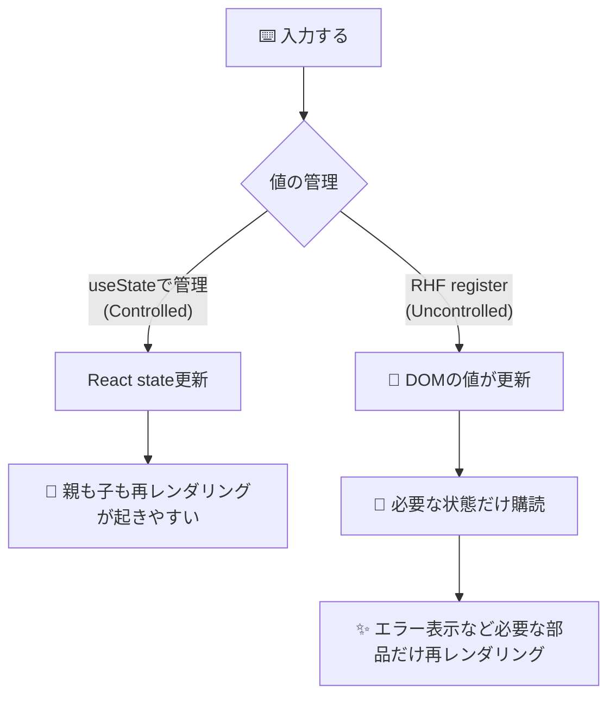

# 第189章：RHF のパフォーマンス

この章は「フォームが大きくなっても、入力がヌルヌル動く😆💨」を作る回だよ〜！🧁💕

---

## この章のゴール🎯

* 「どこが再レンダリングしてるのか」を**見える化**できる👀🔁
* RHF（React Hook Form）の**速さを壊す地雷**を踏まないようになる💣😇
* `watch` / `useWatch` / `useFormState` を使い分けられるようになる🧠✨

  * `watch` は「フォーム全体に影響しがち」なので注意だよ〜 ([React Hook Form][1])
  * `useWatch` は「使ったコンポーネントだけ」再レンダリングに寄せやすいよ〜 ([React Hook Form][2])
  * `useFormState` は「フォーム状態の購読を分離」して再レンダリングを隔離できるよ〜 ([React Hook Form][3])

---

## まずイメージ図🗺️（なぜRHFは速い？）




RHFは「基本は uncontrolled（DOMに値を持たせる）」寄りで、`register` が `ref` を掴む設計だから、入力のたびにフォーム全体がガッツリ再レンダリングしにくいんだよね😳✨ ([React Hook Form][4])

---

## 地雷その1：`watch()` をフォームの親で使う💣😵


`watch()` は便利なんだけど、使い方によっては **ルート（親）を再レンダリング**させちゃうことがあるよ〜⚠️
公式ドキュメントでも「これはルートで再レンダリングを起こすので、問題があるなら `useWatch` を検討してね」って注意があるよ ([React Hook Form][1])

---

## 地雷その2：`formState` を雑に読む💣📉


`formState` は **Proxy** で「読んだプロパティだけ購読する」仕組みになってるよ🪄
だから、**必要なものだけ**読むのがコツ！ ([React Hook Form][5])

---

## 地雷その3：`Controller` を何でもかんでも使う💣🎛️


UIライブラリ（MUI / Antdなど）みたいに controlled 前提の部品は `Controller` が便利！
でも「普通の `<input>` でいけるなら `register` が軽い」って覚えておくと勝ちやすい✌️
（RHFは controlled も最適化してるけど、設計上コストは増えやすいよ〜） ([React Hook Form][6])

---

# ハンズオン：再レンダリングを見える化しよ〜👀🔁✨

## 1) セットアップ（すでにプロジェクトあるなら不要）🧰

```bash
npm i react-hook-form
```

---

## 2) 🔁 レンダーカウンター部品を作る（超大事！）

`src/components/RenderCount.tsx`

```tsx
import { useRef } from "react";

export function RenderCount({ label }: { label: string }) {
  const count = useRef(0);
  count.current += 1;

  return (
    <span style={{ fontSize: 12, opacity: 0.8 }}>
      🔁 {label}: {count.current}
    </span>
  );
}
```

> 😺メモ：Viteの開発モード（StrictMode）だと、開発中だけ「わざと多めに呼ばれる」ことがあるよ！
> なので回数は目安でOK〜👌✨

---

## 3) 大きめフォームを作る（入力しても全体が揺れないのが理想）📝✨

`src/BigForm.tsx`

```tsx
import { memo } from "react";
import { useForm, useFormState, useWatch } from "react-hook-form";
import { RenderCount } from "./components/RenderCount";

type FormValues = {
  firstName: string;
  lastName: string;
  email: string;
  age: number;
  note: string;
};

const Field = memo(function Field(props: {
  label: string;
  name: keyof FormValues;
  type?: string;
  register: ReturnType<typeof useForm<FormValues>>["register"];
}) {
  const { label, name, type = "text", register } = props;

  return (
    <label style={{ display: "block", marginBottom: 12 }}>
      <div style={{ display: "flex", justifyContent: "space-between" }}>
        <strong>{label}</strong>
        <RenderCount label={`Field(${String(name)})`} />
      </div>

      <input
        type={type}
        {...register(name, {
          required: "必須だよ〜🥺",
          ...(name === "email"
            ? { pattern: { value: /^\S+@\S+\.\S+$/, message: "メアドの形が変かも！📮" } }
            : {}),
          ...(name === "age"
            ? { valueAsNumber: true, min: { value: 0, message: "0以上で！🧸" } }
            : {}),
        })}
        style={{
          width: "100%",
          padding: 10,
          borderRadius: 10,
          border: "1px solid #ccc",
          marginTop: 6,
        }}
      />
    </label>
  );
});

function ErrorSummary({ control }: { control: any }) {
  // ✅ useFormState：このコンポーネント内に再レンダリングを隔離しやすい :contentReference[oaicite:7]{index=7}
  const { errors, isSubmitting } = useFormState({ control });

  const messages = Object.values(errors)
    .map((e) => (e as any)?.message)
    .filter(Boolean) as string[];

  return (
    <div style={{ padding: 12, borderRadius: 12, border: "1px dashed #bbb" }}>
      <div style={{ display: "flex", justifyContent: "space-between" }}>
        <strong>⚠️ エラーまとめ</strong>
        <RenderCount label="ErrorSummary" />
      </div>

      {isSubmitting && <p>送信中...⏳</p>}

      {messages.length === 0 ? (
        <p style={{ margin: 0 }}>いまはエラーなし！えらい！🎉</p>
      ) : (
        <ul style={{ margin: "8px 0 0" }}>
          {messages.map((m, i) => (
            <li key={i}>{m}</li>
          ))}
        </ul>
      )}
    </div>
  );
}

function DebugPanel({ control }: { control: any }) {
  // ✅ useWatch：watchっぽいけど、ここに再レンダリングを寄せやすい :contentReference[oaicite:8]{index=8}
  const values = useWatch({ control });

  return (
    <div style={{ padding: 12, borderRadius: 12, border: "1px solid #ddd" }}>
      <div style={{ display: "flex", justifyContent: "space-between" }}>
        <strong>🧪 Debug（値の確認）</strong>
        <RenderCount label="DebugPanel" />
      </div>

      <pre style={{ margin: "8px 0 0", fontSize: 12, overflowX: "auto" }}>
        {JSON.stringify(values, null, 2)}
      </pre>
    </div>
  );
}

export function BigForm() {
  const { register, handleSubmit, control } = useForm<FormValues>({
    defaultValues: {
      firstName: "",
      lastName: "",
      email: "",
      age: 20,
      note: "",
    },
    mode: "onChange",
  });

  const onSubmit = (data: FormValues) => {
    alert("送信OK🎉\n" + JSON.stringify(data, null, 2));
  };

  return (
    <div style={{ maxWidth: 720, margin: "24px auto", padding: 16 }}>
      <h1 style={{ marginBottom: 6 }}>第189章：RHFパフォーマンス🚀</h1>
      <p style={{ marginTop: 0 }}>入力しても、余計なところがガタガタしないのが理想だよ〜🧁✨</p>

      <div style={{ display: "flex", justifyContent: "space-between", marginBottom: 12 }}>
        <RenderCount label="BigForm" />
        <span>（ここが増えすぎたら要注意⚠️）</span>
      </div>

      <form onSubmit={handleSubmit(onSubmit)} style={{ display: "grid", gap: 12 }}>
        <Field label="名（First）" name="firstName" register={register} />
        <Field label="姓（Last）" name="lastName" register={register} />
        <Field label="メール" name="email" register={register} />
        <Field label="年齢" name="age" type="number" register={register} />
        <Field label="ひとこと" name="note" register={register} />

        <button
          type="submit"
          style={{
            padding: 12,
            borderRadius: 12,
            border: "none",
            cursor: "pointer",
            fontWeight: 700,
          }}
        >
          送信する📨
        </button>
      </form>

      <div style={{ marginTop: 16, display: "grid", gap: 12 }}>
        <ErrorSummary control={control} />
        <DebugPanel control={control} />
      </div>
    </div>
  );
}
```

`src/App.tsx`

```tsx
import { BigForm } from "./BigForm";

export default function App() {
  return <BigForm />;
}
```

---

## 4) NG例：`watch()` を親で直に使う（わかりやすく重くなる）😵‍💫

こんな感じ👇（※この章の目的上、あえてNG）

```tsx
// ❌ BigForm の中で…
const values = watch(); // ← これで親が反応しやすい
```

`watch` は「ルートで再レンダリングを起こす」注意があるから、重いときは `useWatch` に逃がすのが基本だよ〜 ([React Hook Form][1])

---

## 5) OK例：`useWatch` を “別コンポーネント” に隔離する🧠✨


さっき作った `DebugPanel` がそれだよ〜！🥰
「値の監視で再レンダリングするなら、監視してるパネルだけでやってね」って分離できる👌 ([React Hook Form][2])

---

# 仕上げ：パフォーマンスの鉄板ルール集🧷✨

## ✅ ルール1：`watch()` は雑に使わない（隔離する）🧯

* 監視が必要なら **`useWatch` を別コンポーネントで** ([React Hook Form][2])
* どうしても `watch` を使うなら「範囲を狭く」＆「必要な場所だけ」([React Hook Form][1])

## ✅ ルール2：`formState` は「必要なものだけ読む」🪞

`formState` は Proxy で購読が賢いぶん、雑に触ると購読が増えやすいよ〜 ([React Hook Form][5])
→ なので **状態表示は `useFormState` で部品に隔離**が強い！ ([React Hook Form][3])

## ✅ ルール3：`Controller` は「必要なときだけ」🎛️

* 普通の `<input>` は `register` が軽い🌿 ([React Hook Form][4])
* UIライブラリ等で controlled 必須なら `Controller`（RHFは最適化もしてる） ([React Hook Form][6])

---

## 最後にまとめ🧁🎉

* 入力で「全部が再レンダリング」すると重くなりがち😵
* RHFは「購読」と「隔離」が超大事！🔔✨
* **監視は `useWatch`、状態表示は `useFormState` に逃がす**が勝ち筋だよ〜💯 ([React Hook Form][2])

---

次の **第190章** は、ここまでの知識を使って「プロっぽいお問い合わせフォーム」完成させるよ〜📨✨
（バリデーションもUIも気持ちよく仕上げよ🫶😊）

[1]: https://react-hook-form.com/docs/useform/watch?utm_source=chatgpt.com "watch"
[2]: https://react-hook-form.com/docs/usewatch?utm_source=chatgpt.com "useWatch"
[3]: https://react-hook-form.com/docs/useformstate?utm_source=chatgpt.com "useFormState"
[4]: https://react-hook-form.com/faqs?utm_source=chatgpt.com "FAQs"
[5]: https://react-hook-form.com/docs/useform/formstate?utm_source=chatgpt.com "formState"
[6]: https://react-hook-form.com/advanced-usage?utm_source=chatgpt.com "Advanced Usage"
