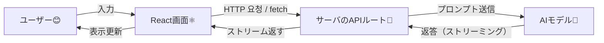

# 第221章：AI x React の現在地

この章は「いまのAI機能って、Reactアプリにどう入ってくるの？」を、全体像からスッキリ理解する回だよ〜😊🧠
次の章（セットアップ）で手を動かす前に、まずは地図を持とう！🗺️✨

---

## 1) 2025年の「AI × React」って、何ができるの？🤔💡

昔は「AI = チャット」って感じだったけど、今はざっくり **3段階** になってるよ👇

1. **チャット**（会話する）💬
2. **ストリーミング**（文字がパラパラ出てくる）🫧
3. **生成UI**（文字だけじゃなく“画面”として返す）🧩✨  ← ここが今っぽい！

---

## 2) まず全体のしくみ（超ざっくり）🌍🔌

ポイントはこれだけ👇

* **ブラウザ（React）**：見た目と操作を担当🖥️✨
* **サーバ側（APIルート）**：AIに問い合わせる担当🔐（秘密の鍵＝APIキーを守る！）
* **AIプロバイダ**：LLMが返事を作る🤖

この「React → API → AI → React」の往復が基本形だよ🙌✨

---

## 3) “ストリーミング”が超大事な理由 🫧⚡

AIの返事って長くなりがち。
**全部できてから表示**だと、ユーザーは「止まった？」って不安になっちゃう🥺💦

だから今は **「できた分から少しずつ表示」** が主流！
Vercel AI SDKの `useChat` は、まさにこの **ストリーミング表示と状態管理** をやりやすくしてくれるよ。([AI SDK][1])

---

## 4) いまどきAI機能の3パターン（具体例つき）🎯✨

### A. チャットボット型 💬🤖

* 質問→回答を会話で返す
* サポート、FAQ、相談、学習アシスタントなどに強い📚

**例**：「このエラーの原因なに？」→ 解決策を返す

---

### B. “ツール呼び出し”型 🧰⚙️

AIが勝手に想像で答えるんじゃなくて、
**必要なら関数（ツール）を呼んで、正しいデータを取ってから答える**やつ！

**例**：天気を聞かれたら `getWeather()` を呼ぶ☀️🌧️
こういう体験が「AIアプリっぽい」よね〜！😆
（Generative UIの説明でも、ツール呼び出し→結果を表示、が中心になってるよ）([AI SDK][2])

---

### C. 生成UI（Generative UI）型 🧩✨

ここが最先端！🚀
AIが返すのは「文章」だけじゃなくて、**“画面として表示できる形”**（構造化データやUI部品）になる。

たとえば👇みたいな流れ：

* ユーザー「東京の来週の予定っぽく整理して」
* AI「OK！予定カードを3つ、重要度順に並べるね」
* Reactが **カードUI** として描画🪄✨

Generative UI は「LLMがUIを“生成”する体験」を目指す考え方として整理されてるよ。([AI SDK][2])

---

## 5) React 19視点：`use` と `Suspense` が“AI体験”に効く ⚛️🪄

React 19 の `use(Promise)` は、Promiseをそのまま扱って **待ってる間は `<Suspense fallback>` を出す** って設計。([React][3])

つまり…

* 「AI待ち」＝ローディングUIをきれいに出す
* 「失敗」＝エラーバウンダリで受ける

…みたいな **“待ち時間を気持ちよくする”** 方向にReact自体が進んでるよ☺️✨

---

## 6) 絶対に押さえる注意（超重要）🔐💰⚠️

### ✅ APIキーはフロントに置かない！

React（ブラウザ）に置くと、**見ようと思えば見れる**から危険😱
だから **サーバ側のAPIルート** で呼ぶのが基本！

### ✅ コスト（トークン）意識しよ💸

* 長文プロンプト
* 会話履歴を全部送る
  これ、地味にお金が増えるやつ…！🥺
  （あとで「履歴を要約する」「必要分だけ送る」みたいな対策をやるよ✌️）

---

## 7) この章のまとめ（次章へのつながり）🔗✨

* AI × React は **チャット → ストリーミング → 生成UI** へ進化中🤖⚛️
* 基本構造は **React → APIルート → AI → React** 🌍
* 体験を良くする鍵は **ストリーミング** 🫧
* Vercel AI SDKの `useChat` は、まさにその土台を作るやつだよ([AI SDK][1])

次の第222章で、いよいよ **Vercel AI SDK のセットアップ** に入るよ〜！🧰🚀

---

## ミニチェック問題（ゆるめ）📝😆

1. AIのAPIキーをReact（ブラウザ側）に置いちゃダメなのはなぜ？🔐
2. ストリーミング表示だと、ユーザー体験が良くなる理由は？🫧
3. 「生成UI」って、チャットと何が違う？🧩

---

必要なら、この章の内容を **1枚の図（まとめマップ）** にして覚えやすくもできるよ〜🗺️✨

[1]: https://ai-sdk.dev/docs/reference/ai-sdk-ui/use-chat?utm_source=chatgpt.com "AI SDK UI: useChat"
[2]: https://ai-sdk.dev/docs/ai-sdk-ui/generative-user-interfaces?utm_source=chatgpt.com "AI SDK UI: Generative User Interfaces"
[3]: https://react.dev/reference/react/use?utm_source=chatgpt.com "use"
