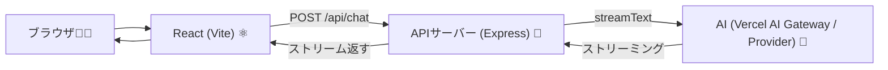

# 第222章：Vercel AI SDK のセットアップ

この章は「**AI SDKを動かすための下ごしらえ**」だよ〜！🍳
次の第223章で `useChat` をスムーズに動かすために、**フロント（React）**と**バック（API）**の両方を用意していくよ💡

---

## まず全体図をイメージしよ〜🗺️💬




AI SDKは「**AIの返事を“ちょっとずつ”流してくれる（ストリーミング）**」のが超強いの！🌊✨
（このストリーミングの型に、`useChat` がピタッと合うように作られてるよ）([AI SDK][1])

---

## 1) 必要パッケージを入れる📦✨

プロジェクトのルートで👇（Viteで作ったReactプロジェクトの場所ね！）

```bash
npm i ai @ai-sdk/react zod
npm i express
npm i -D tsx concurrently
```

* `ai`：AI SDK 本体（ストリーミングとか中核）([AI SDK][2])
* `@ai-sdk/react`：次章で使う `useChat` 側（React用）([AI SDK][2])
* `zod`：後々「入力チェック」や「ツール呼び出し」でよく使う子🧠([AI SDK][2])
* `express`：APIサーバー担当🚪
* `tsx`：TypeScriptのままサーバー起動できて楽ちん🏃‍♀️
* `concurrently`：フロントとAPIを同時起動するやつ🔁

---

## 2) APIキーを `.env.local` に入れる🔐✨（超大事！）


ルートに **`.env.local`** を作って、どっちか選んでね👇

### A. Vercel AI Gateway を使う（おすすめ・簡単）🌈

```env
AI_GATEWAY_API_KEY=xxxxxxxxx
```

AI SDKは **`AI_GATEWAY_API_KEY`** を見てGatewayを使うのが基本になってるよ🧠([AI SDK][2])

### B. OpenAIを直で使う（後で切り替えたい人向け）🔌

```env
OPENAI_API_KEY=xxxxxxxxx
```

OpenAIプロバイダはデフォで **`OPENAI_API_KEY`** を見に行くよ([AI SDK][3])

> ✅ポイント：**このキーは絶対にフロントへ出さない**（`VITE_` を付けない）🔒
> サーバー側だけで使うよ〜！

---

## 3) APIサーバーを作る（Express）🧩🚀

ルートに `server` フォルダを作って、`server/index.ts` を作成してね📁✨

```ts
// server/index.ts
import 'dotenv/config';
import express from 'express';
import { streamText, convertToModelMessages, type UIMessage } from 'ai';
// ★ OpenAI直にしたい人は、あとでここに openai を足す（下に書くよ）

const app = express();
app.use(express.json());

// ✅ 動作確認用：prompt 1発でストリームする（かんたんチェック用）
app.post('/api/hello', async (req, res) => {
  const prompt = (req.body?.prompt as string | undefined) ?? 'こんにちは！自己紹介して〜😊';

  const result = streamText({
    model: 'openai/gpt-4o', // Vercel AI Gateway を使う場合はこれでOK
    prompt,
  });

  result.pipeTextStreamToResponse(res);
});

// ✅ 次章の useChat 用：/api/chat（messages を受け取る）
app.post('/api/chat', async (req, res) => {
  const { messages } = req.body as { messages: UIMessage[] };

  const result = streamText({
    model: 'openai/gpt-4o', // Vercel AI Gateway の例
    messages: await convertToModelMessages(messages),
  });

  result.pipeUIMessageStreamToResponse(res);
});

app.listen(8080, () => {
  console.log('API server ready on http://localhost:8080 🎉');
});
```

* Expressで **ストリーミングを返す**ときは `pipeTextStreamToResponse` / `pipeUIMessageStreamToResponse` を使うのが公式例だよ([AI SDK][4])
* `useChat` はデフォで `/api/chat` を叩く設計だから、ここを作っておくと次章が爆速になるよ⚡([AI SDK][1])
* `convertToModelMessages` で UI用のmessagesを、モデル用のmessagesに変換してるよ🧼([AI SDK][2])

---

## 4) Vite からAPIへつなぐ（プロキシ）🔁🌟

`vite.config.ts` に proxy を追加して、フロントから `/api/...` がそのまま叩けるようにするよ！

```ts
// vite.config.ts
import { defineConfig } from 'vite';
import react from '@vitejs/plugin-react';

export default defineConfig({
  plugins: [react()],
  server: {
    proxy: {
      '/api': 'http://localhost:8080',
    },
  },
});
```

これでフロントは **同じオリジンっぽく** `/api/chat` を呼べるので、CORSで悩みにくいよ☺️💕

---

## 5) `package.json` で同時起動できるようにする▶️▶️

`package.json` の scripts をこんな感じにしてね👇

```json
{
  "scripts": {
    "dev:client": "vite",
    "dev:server": "tsx watch server/index.ts",
    "dev": "concurrently \"npm run dev:client\" \"npm run dev:server\"",
    "build": "vite build",
    "preview": "vite preview"
  }
}
```

そして起動！

```bash
npm run dev
```

---

## ✅ 動作チェック（まずは /api/hello でOK）🧪✨


PowerShell でもOKだよ！まずはストリームが返るかだけ確認しよ〜💕

```bash
curl -N -X POST http://localhost:8080/api/hello ^
  -H "Content-Type: application/json" ^
  -d "{\"prompt\":\"やさしく励まして〜🥹\"}"
```

文字がちょっとずつ出てきたら勝ち🎉🌊
（`-N` がストリーミング表示に大事だよ！）

---

## もし OpenAI直に切り替えたいなら（差し替え3点）🔁🔧

1. 追加インストール：

```bash
npm i @ai-sdk/openai
```

2. `.env.local` を `OPENAI_API_KEY=...` にする([AI SDK][3])

3. `server/index.ts` の `model` を変更：

```ts
import { openai } from '@ai-sdk/openai';

const result = streamText({
  model: openai('gpt-5'), // 例
  prompt,
});
```

OpenAIプロバイダは `@ai-sdk/openai` で、キーは `OPENAI_API_KEY` を使うのが基本だよ([AI SDK][3])

---

## よくある事故ポイント🚧😭（ここだけ見て！）

* `.env.local` を作ったのに効かない
  → **サーバー再起動**が必要なことが多いよ🔁
* APIキーをフロントに置いちゃう
  → **絶対NG**！サーバーだけで持とうね🔐
* `/api/chat` が 404
  → サーバーが起動してない or ルート名ミス（`/api/chat` だよ！）✨([AI SDK][1])

---

## ミニ課題🎯💖

1. `/api/hello` の prompt を変えて、口調が変わるか試す🧪
2. `model` を `'anthropic/claude-sonnet-4.5'` みたいに変えてみる（Gatewayなら文字列でOK）🎛️([AI SDK][2])
3. `server/index.ts` に `console.log('hit!')` を入れて、叩けてるのを目で確認👀✨

---

次の第223章では、いよいよ **`useChat`** で「本物のチャット画面」作るよ〜💬💖
ここまでできたら、準備は100点っ！💯🎉

[1]: https://ai-sdk.dev/docs/reference/ai-sdk-ui/use-chat "AI SDK UI: useChat"
[2]: https://ai-sdk.dev/docs/getting-started/nextjs-app-router "Getting Started: Next.js App Router"
[3]: https://ai-sdk.dev/providers/ai-sdk-providers/openai "AI SDK Providers: OpenAI"
[4]: https://ai-sdk.dev/examples/api-servers/express "API Servers: Express"
