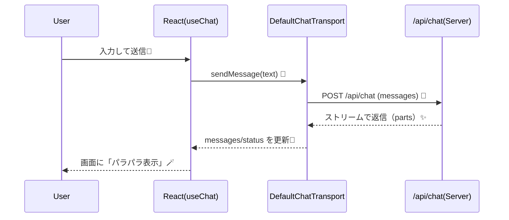

# 第223章：`useChat` フック

この章では、**Vercel AI SDK の `useChat`** を使って、React側に「チャットUI」を一気に作っちゃいます😊
`useChat` は **チャットの状態管理** と **ストリーミング表示（文字がパラパラ出るやつ）** をまとめて面倒見てくれる超便利フックです🚀 ([AI SDK][1])

---

## 1) `useChat` の全体像（何が嬉しいの？）🤝💡


`useChat` がやってくれることは、ざっくりこれ👇

* メッセージ履歴（`messages`）を持ってくれる🧠
* 送信（`sendMessage`）したら **自動でAPI呼び出し**してくれる📡
* サーバーから届く **ストリーミング** を受け取ってUIを更新してくれる✨
* 状態（`status`）やエラー（`error`）も持ってくれる🧯 ([AI SDK][1])

⚠️ポイント：**AI SDK v5以降の `useChat` は「入力欄の state」を自動で持ちません**。
なので、入力欄（`input`）は React の `useState` で自分で管理します😊 ([AI SDK][1])

---

## 2) データの流れ（図で理解）🗺️✨




`useChat` は **Transport（通信役）** を使ってAPIとやり取りします。デフォルトは `/api/chat` に向きます📮 ([AI SDK][1])

---

## 3) まずは最小のチャットUIを作る（コピペOK）✂️😊

### ✅ `src/App.tsx`（または `Chat.tsx`）に作成

```tsx
import { useChat } from "@ai-sdk/react";
import { DefaultChatTransport, type UIMessage } from "ai";
import { useMemo, useState } from "react";

function getText(message: UIMessage) {
  // UIMessage は content じゃなく parts で描画するのが基本✨
  // textパートだけ取り出してつなげます
  return message.parts
    .filter((p) => p.type === "text")
    .map((p) => p.text)
    .join("");
}

export default function App() {
  const [input, setInput] = useState("");

  const transport = useMemo(() => {
    return new DefaultChatTransport({
      api: "/api/chat", // 必要ならここを変更（例: http://localhost:3001/api/chat）
    });
  }, []);

  const {
    messages,
    status, // 'submitted' | 'streaming' | 'ready' | 'error'
    error,
    sendMessage,
    stop,
    regenerate,
    clearError,
    setMessages,
  } = useChat({ transport });

  const isBusy = status === "submitted" || status === "streaming";

  return (
    <div style={{ maxWidth: 760, margin: "24px auto", padding: 16, fontFamily: "system-ui" }}>
      <h1 style={{ marginBottom: 8 }}>AIチャット ✨</h1>

      <div
        style={{
          border: "1px solid #ddd",
          borderRadius: 12,
          padding: 12,
          minHeight: 360,
          background: "#fff",
        }}
      >
        {messages.length === 0 && (
          <p style={{ opacity: 0.7 }}>まだ会話がないよ🙂 下の入力欄から送ってね！</p>
        )}

        {messages.map((m) => {
          const text = getText(m);

          return (
            <div key={m.id} style={{ display: "flex", margin: "10px 0" }}>
              <div style={{ width: 90, fontWeight: 700 }}>
                {m.role === "user" ? "あなた🙂" : m.role === "assistant" ? "AI🤖" : "system"}
              </div>

              <div
                style={{
                  flex: 1,
                  padding: "10px 12px",
                  borderRadius: 12,
                  border: "1px solid #eee",
                  background: m.role === "user" ? "#f7fbff" : "#fafafa",
                  whiteSpace: "pre-wrap",
                }}
              >
                {text || <span style={{ opacity: 0.6 }}>（テキスト以外のパート）</span>}
              </div>
            </div>
          );
        })}

        {isBusy && <p style={{ opacity: 0.7, marginTop: 12 }}>入力受付中…じゃなくて返信生成中…！🪄</p>}
      </div>

      {error && (
        <div style={{ marginTop: 12, padding: 12, borderRadius: 12, border: "1px solid #f3b2b2" }}>
          <p style={{ margin: 0 }}>エラーだよ〜🥲：{error.message}</p>
          <button onClick={clearError} style={{ marginTop: 8 }}>
            エラー表示を消す
          </button>
        </div>
      )}

      <form
        onSubmit={(e) => {
          e.preventDefault();
          const text = input.trim();
          if (!text) return;

          sendMessage({ text }); // ここが本体🔥
          setInput("");
        }}
        style={{ display: "flex", gap: 8, marginTop: 12 }}
      >
        <input
          value={input}
          onChange={(e) => setInput(e.target.value)}
          placeholder="何でも聞いてね😊"
          style={{ flex: 1, padding: "10px 12px", borderRadius: 12, border: "1px solid #ddd" }}
          disabled={status === "error"}
        />
        <button type="submit" disabled={isBusy || !input.trim()}>
          送信📨
        </button>
        <button type="button" onClick={stop} disabled={!isBusy}>
          停止⛔
        </button>
      </form>

      <div style={{ display: "flex", gap: 8, marginTop: 10, flexWrap: "wrap" }}>
        <button type="button" onClick={() => regenerate()} disabled={isBusy || messages.length === 0}>
          もう一回つくって🔁
        </button>
        <button
          type="button"
          onClick={() => setMessages([])}
          disabled={isBusy || messages.length === 0}
        >
          会話をクリア🧹
        </button>
      </div>

      <p style={{ marginTop: 10, opacity: 0.7 }}>
        status: <b>{status}</b>
      </p>
    </div>
  );
}
```

### ここが重要ポイントだよ💡

* `useChat` は `messages` を返す（会話履歴）🗂️ ([AI SDK][1])
* 送信は `sendMessage(...)` だけでOK📨 ([AI SDK][1])
* メッセージは **`content` じゃなく `parts`** で描画するのが今の流儀✨（`type: "text"` の `text` を使う） ([AI SDK][2])

---

## 4) 「parts」ってなに？（超ざっくり）🧩


AI SDK のメッセージは、**小さなパーツ（parts）の配列**になってます。

* テキストは `type: "text"` + `text: string` 📄 ([AI SDK][2])
* 他にも reasoning（考えた過程）や tool 呼び出し等が混ざることがあります🛠️ ([AI SDK][2])

だから、**「表示したいものだけ選んで描画」**ができて強いんだよね😊

---

## 5) よくある落とし穴：`body` が更新されない問題🥲（重要）


「温度（temperature）スライダーとか、ログインユーザーIDとか」を `useChat({ body: {...} })` に入れたくなるんだけど…

✅ **hookレベルの `body` は初回レンダー時の値で固定されちゃう**ことがあります（いわゆる stale）💦 ([AI SDK][3])

### ✅ 解決策：`sendMessage` の第2引数で渡す（毎回最新）✨

```tsx
sendMessage(
  { text: input },
  {
    body: {
      temperature, // 今この瞬間の値
      userId,
    },
  }
);
```

これが公式の推奨パターンです👍 ([AI SDK][3])

---

## 6) ミニ練習（5分）🧪✨

できたら最高〜！💐

1. **Enterで送信**できることを確認（もうできてるはず！）⌨️✨
2. `status === "streaming"` のときだけ「停止⛔」ボタンが押せるのを確認
3. 「会話クリア🧹」で履歴が消えるのを確認

---

## まとめ🎉

* `useChat` は **チャット状態 + ストリーミング表示**をまとめてやってくれる便利フック💬✨ ([AI SDK][1])
* 入力欄の状態は自分で `useState` 管理するよ📝（v5+で仕様変更） ([AI SDK][1])
* 描画は **`parts` を使う**（まずは `type:"text"` の `text` だけでOK）🧩 ([AI SDK][2])
* 動的な追加情報は **`sendMessage(..., { body })`** で渡すのが安全✅ ([AI SDK][3])

次の第224章は「ストリーミング表示の仕組み」そのものを、もうちょい中身まで理解していくよ〜🪄📡

[1]: https://ai-sdk.dev/docs/reference/ai-sdk-ui/use-chat "AI SDK UI: useChat"
[2]: https://ai-sdk.dev/docs/reference/ai-sdk-core/ui-message "AI SDK Core: UIMessage"
[3]: https://ai-sdk.dev/docs/troubleshooting/use-chat-stale-body-data "Troubleshooting: Stale body values with useChat"
