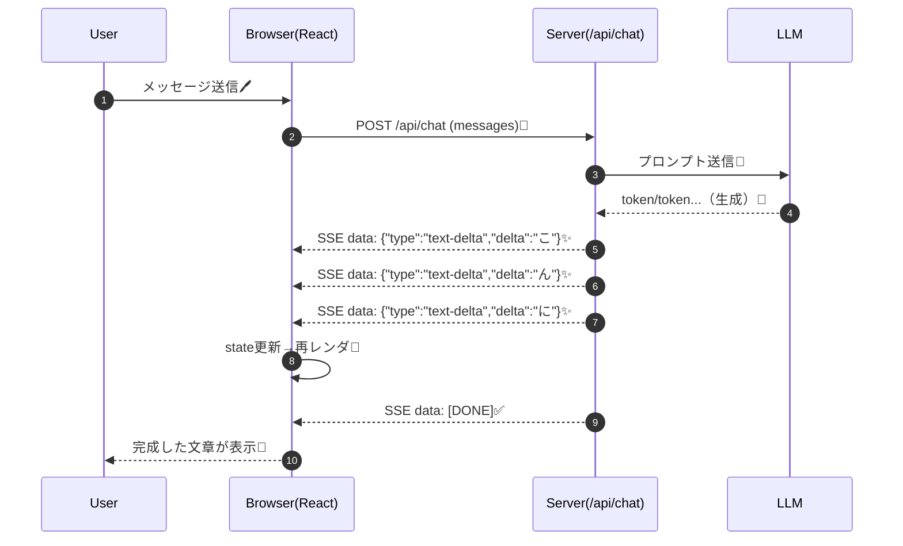

# 第224章：ストリーミング表示の仕組み

この章では、「AIの返事が1文字ずつ増えていく」仕組みを、**通信（ネットワーク）**と**Reactの画面更新**の両方から、ふんわり理解しちゃいます🧠💡
※Vercel AI SDK は **SSE（Server-Sent Events）**を標準のストリーミング方式として使います。([Vercel][1])

---

## 1) そもそもストリーミングって何？🚰


普通の通信は「全部できてからドン！」📦
ストリーミングは「できた分からちょっとずつ送る！」📮✨

つまり…

* ✅ **待ち時間が短く感じる**（体感爆速）⚡
* ✅ **“考えてる感” が出て安心**🙂
* ✅ 長文でも **途中から読める**📖

---

## 2) Vercel AI SDKのストリーミングは何でできてるの？🧩

結論：**SSE（Server-Sent Events）形式**で、サーバー → ブラウザに「イベント」を流します📡
AI SDK 5 以降、これが標準になりました。([Vercel][1])

そして AI SDK は、ただの文字列じゃなくて
「今届いたのは何のデータ？」を区別するための **Data Stream Protocol** を持ってます🧠✨([AI SDK][2])

---

## 3) 全体の流れ（図で一発）🎬




---

## 4) “パラパラ” の正体：`text-delta` が連打されてるだけ 🪄


AI SDK の Data Stream Protocol では、ストリーミング中にこんなイベントが届きます👇([AI SDK][2])

* `text-start`：文字ブロック開始（IDが付く）
* `text-delta`：追加の文字（これが “パラパラ”）
* `text-end`：文字ブロック終了
* 最後に `data: [DONE]` で終了✅

例（イメージ）：

```txt
data: {"type":"text-start","id":"msg_abc"}
data: {"type":"text-delta","id":"msg_abc","delta":"Hello"}
data: {"type":"text-delta","id":"msg_abc","delta":" world"}
data: {"type":"text-end","id":"msg_abc"}
data: [DONE]
```

---

## 5) Reactの画面が“勝手に増える”理由😳➡️🙂

ポイントはこれだけ👇

* `useChat` はサーバーからのストリーム（SSE）を受け取る
* `text-delta` が来るたびに、**messages の中身を更新**する
* React は state が変わるたびに **再レンダリング**する
* だから画面の文字が「増えて見える」✨

`useChat` は「ストリーミング受信→状態管理→UI更新」まで面倒見てくれるフックです。([AI SDK][3])
（AI SDK 5 からは “transportベース” になって、設計がけっこう今どきになってます🚌✨）([AI SDK][3])

---

## 6) 仕組みをもっと実感したい人向け：超ざっくりSSE読み取り（理解用）🧪

※これは「仕組みの理解用」の簡易版だよ！本番で雑にパースするのは危険⚠️
（AI SDKはちゃんと処理してくれるから、普段は不要だよ🙆‍♀️）

```ts
// SSEをそれっぽく読むだけの最小イメージ（理解用）
export async function readSSE(
  res: Response,
  onJson: (data: unknown) => void
) {
  const reader = res.body?.getReader();
  if (!reader) throw new Error("No response body stream");

  const decoder = new TextDecoder();
  let buffer = "";

  while (true) {
    const { value, done } = await reader.read();
    if (done) break;

    buffer += decoder.decode(value, { stream: true });

    // SSEは「空行」で1イベント区切りのことが多い
    const events = buffer.split("\n\n");
    buffer = events.pop() ?? "";

    for (const ev of events) {
      const dataLine = ev
        .split("\n")
        .find((line) => line.startsWith("data:"));
      if (!dataLine) continue;

      const payload = dataLine.slice("data:".length).trim();

      if (payload === "[DONE]") return;

      onJson(JSON.parse(payload));
    }
  }
}
```

---

## 7) DevToolsで「本当に流れてる！」を確認しよう👀🔍


1. ブラウザで開発者ツール（F12）🛠️
2. **Network** タブへ🌐
3. チャット送信して `/api/chat` のリクエストをクリック🖱️
4. **Response / Preview** を見ると、ストリームが追記されていくのが見えたりします✨
5. ヘッダーに `text/event-stream`（SSE）が付いてると「っぽい」！📌（環境により表示のされ方は差あり）

---

## 8) よくあるハマりポイント集 😭➡️😎

### ✅ ① 途中までしか表示されない / 一気に最後に出る

**原因あるある：途中の“バッファリング”**（溜めてから出すやつ）💦
SSEは「溜めずに流す」必要があるので、プロキシ・ミドルウェア・ホスティング設定で詰まることがあります🧱
AI SDK は SSE を標準にしてるので、まずは **SSE前提でデバッグ**すると早いです。([Vercel][1])

### ✅ ② 自前バックエンドで流したけど `useChat` が読めない

カスタム実装で Data Stream Protocol を流すとき、**`x-vercel-ai-ui-message-stream: v1` が必要**です。([AI SDK][2])
（これが無いと「それAI SDKの流儀じゃないかも…？」ってなる💭）

### ✅ ③ 文字以外も流れてくるの？

流れます🙆‍♀️
AI SDK は `text-*` 以外にも、任意の `data-*` みたいな「追加データ」もストリーミングできます。([AI SDK][2])
（次の章以降で“プロっぽいUI”に活きるやつ✨）

---

## 9) ミニ課題（5〜10分）📝✨

* [ ] Networkで `/api/chat` を見つける🔍
* [ ] 「一括レスポンス」じゃなくて「流れてる」感があるか観察👀
* [ ] もし可能なら、レスポンスの中に `text-delta` っぽい増え方を見つける🧩
* [ ] 終わりの合図（`[DONE]`）があるか意識してみる✅([AI SDK][2])

---

## 次（第225章）へのつながり 🚀💬

ストリーミングの仕組みがわかったら、次は **実際にAIチャットボットを完成**させます🎉
「パラパラ出るUI」をちゃんと気持ちよく作っていこうね☺️✨

[1]: https://vercel.com/blog/ai-sdk-5 "AI SDK 5 - Vercel"
[2]: https://ai-sdk.dev/docs/ai-sdk-ui/stream-protocol "AI SDK UI: Stream Protocols"
[3]: https://ai-sdk.dev/docs/reference/ai-sdk-ui/use-chat "AI SDK UI: useChat"
