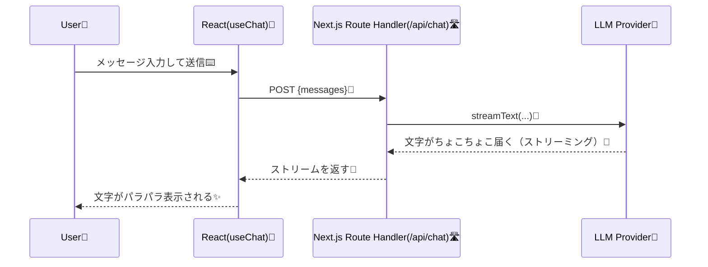

# 第225章：練習：AIチャットボットを作る

この章では **「入力 → 送信 → AIが文字をストリーミングで返す」** までを、最短ルートで作ります💨
（裏側にAPIルートを作って、秘密のキーはブラウザに出さない設計にするよ🔐）([Vercel][1])

---

### 1) まず全体像をつかもう 🗺️


「画面（フロント）」と「AIに投げる場所（サーバー）」の2つが必要です✨
※AIのキーはサーバー側だけで持つのが基本！([Vercel][1])



---

### 2) Next.jsプロジェクトを作る 🧱（React 19世代OK）

PowerShellで👇

```bash
npx create-next-app@latest my-ai-chat
cd my-ai-chat
```

作成時の質問は、だいたいこんな感じがオススメ👇

* App Router：Yes
* TypeScript：Yes
* Tailwind：Yes（見た目がラクになる😍）

---

### 3) 必要なライブラリを入れる 📦✨

AI SDK本体とReactフックを入れます（公式Quickstartでもこの構成）([ai-sdk.dev][2])

```bash
npm i ai @ai-sdk/react zod
```

---

### 4) APIキーを `.env.local` に置く 🔐

AI SDKのQuickstartでは **Vercel AI Gateway** のキー（`AI_GATEWAY_API_KEY`）を使う流れが用意されています🗝️([ai-sdk.dev][2])
（キーの用意はVercel側で発行、というイメージ！）

PowerShellでファイル作成👇

```powershell
New-Item -Force .env.local
```

`.env.local` を開いて👇

```env
AI_GATEWAY_API_KEY=xxxxxxxxxxxxxxxxxxxxxxxx
```

> ✅ `.env.local` はGitに入れないでね！🙅‍♀️（秘密の鍵！）

---

### 5) サーバー側：`/api/chat` を作る 🛣️


`app/api/chat/route.ts` を作って、これを貼ってね👇
（もし `src/` を使う設定にしてたら `src/app/api/chat/route.ts` だよ！）

```ts
import { streamText, convertToModelMessages } from "ai";

// ストリーミングの上限（例：30秒）
export const maxDuration = 30;

export async function POST(req: Request) {
  const { messages } = await req.json();

  const result = streamText({
    // Vercel AI Gateway経由のモデル指定（文字列でOK）
    model: "openai/gpt-4.1",
    messages: convertToModelMessages(messages),
  });

  // UI用のストリーム形式で返す
  return result.toUIMessageStreamResponse();
}
```

ここでやってること👇

* `streamText`：AIの返事をストリーミングで受け取る 🌊([ai-sdk.dev][3])
* `convertToModelMessages`：フロントから来たメッセージ形式を、モデル向けに変換 🧹([Vercel][1])
* `toUIMessageStreamResponse()`：フロント（useChat）が読める形式で返す 📦([Vercel][1])

---

### 6) フロント側：チャット画面を作る 💬🎀


`app/chat/page.tsx` を作って貼ってね👇

```tsx
"use client";

import { useChat } from "@ai-sdk/react";
import { useEffect, useRef, useState } from "react";

export default function ChatPage() {
  const [input, setInput] = useState("");
  const { messages, sendMessage, status, error } = useChat(); // デフォで /api/chat を見にいくよ🧠:contentReference[oaicite:7]{index=7}
  const bottomRef = useRef<HTMLDivElement | null>(null);

  // 新しいメッセージが来たら一番下にスクロール👇（気持ちいいやつ✨）
  useEffect(() => {
    bottomRef.current?.scrollIntoView({ behavior: "smooth" });
  }, [messages]);

  return (
    <div className="min-h-dvh bg-slate-50">
      <div className="mx-auto flex w-full max-w-2xl flex-col gap-4 p-4">
        <header className="rounded-xl bg-white p-4 shadow-sm">
          <h1 className="text-lg font-bold">AIチャットボット 🤖💬</h1>
          <p className="text-sm text-slate-600">
            送るとAIの返事がパラパラ出てくるよ✨
          </p>
        </header>

        <main className="flex-1 rounded-xl bg-white p-4 shadow-sm">
          <div className="flex flex-col gap-3">
            {messages.map((m) => (
              <div
                key={m.id}
                className={[
                  "max-w-[85%] whitespace-pre-wrap rounded-2xl px-4 py-3 text-sm",
                  m.role === "user"
                    ? "ml-auto bg-blue-600 text-white"
                    : "mr-auto bg-slate-100 text-slate-900",
                ].join(" ")}
              >
                {m.parts?.map((part, i) =>
                  part.type === "text" ? (
                    <span key={`${m.id}-${i}`}>{part.text}</span>
                  ) : null
                )}
              </div>
            ))}

            {status !== "ready" && (
              <div className="mr-auto rounded-2xl bg-slate-100 px-4 py-3 text-sm text-slate-700">
                いま考え中…🤔💭
              </div>
            )}

            {error && (
              <div className="rounded-xl bg-red-50 p-3 text-sm text-red-700">
                エラーだよ〜🥺：{String(error)}
              </div>
            )}

            <div ref={bottomRef} />
          </div>
        </main>

        <form
          className="flex gap-2 rounded-xl bg-white p-3 shadow-sm"
          onSubmit={(e) => {
            e.preventDefault();
            const text = input.trim();
            if (!text) return;

            // 送信！✉️（useChatの作法：sendMessage({ text })）:contentReference[oaicite:8]{index=8}
            sendMessage({ text });
            setInput("");
          }}
        >
          <input
            className="flex-1 rounded-lg border border-slate-200 px-3 py-2 text-sm outline-none focus:border-blue-400"
            value={input}
            onChange={(e) => setInput(e.target.value)}
            placeholder="例：おすすめの勉強法を3つ教えて！📚"
            disabled={status !== "ready"}
          />
          <button
            className="rounded-lg bg-blue-600 px-4 py-2 text-sm font-semibold text-white disabled:opacity-50"
            disabled={status !== "ready"}
            type="submit"
          >
            送信 🚀
          </button>
        </form>
      </div>
    </div>
  );
}
```

ポイント👇

* `useChat` が **メッセージ管理＋ストリーミング受信** を面倒見てくれるよ💖([ai-sdk.dev][4])
* 送信は `sendMessage({ text: input })` でOK✉️([ai-sdk.dev][4])

---

### 7) 起動して動かす ▶️✨

```bash
npm run dev
```

ブラウザで `/chat` を開いて、話しかけてみてね😊
返事が **じわじわ表示** されたら成功〜！🎉

---

## うまくいかない時のチェック ✅🩺

* 画面が真っ白：`app/chat/page.tsx` の先頭に `"use client";` がある？（これ超大事⚠️）
* 500エラー：`.env.local` の `AI_GATEWAY_API_KEY` が入ってる？（スペルも！）([ai-sdk.dev][2])
* 反応しない：`app/api/chat/route.ts` のパスが合ってる？（`src/` を選んだ場合は場所が変わるよ）

---

## ミニ課題（できたら強い💪✨）🎯

1. **「定型ボタン」**を作ってみよ🍪
   「自己紹介して！」「要点だけ3つで！」みたいなボタンを押したら入力欄に入るやつ✨

2. **モデルを変えてみよ🧠**
   `model: "openai/gpt-4.1"` を別のモデル文字列に変えて、速度や雰囲気の違いを比べてみよう（体感が大事！）([Vercel][1])

3. **送信中の演出**を追加🌟
   `status !== "ready"` のとき、ボタンを「送信中…」に変えるとか、ローディングを可愛くすると楽しいよ🥳

---

次の章（第226章）では、`useCompletion` で「文章生成」寄りの体験も作れるようになるよ✍️✨

[1]: https://vercel.com/academy/ai-sdk/basic-chatbot "Basic Chatbot | Vercel Academy"
[2]: https://ai-sdk.dev/docs/getting-started/nextjs-app-router "Getting Started: Next.js App Router"
[3]: https://ai-sdk.dev/docs/reference/ai-sdk-core/stream-text?utm_source=chatgpt.com "AI SDK Core: streamText"
[4]: https://ai-sdk.dev/docs/ai-sdk-ui/chatbot "AI SDK UI: Chatbot"
