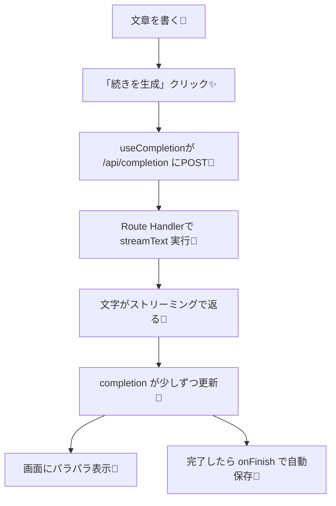

# 第226章：`useCompletion` フック

今回は **「文章の続きをAIに書いてもらう」** UIを作るよ〜🪄✨
しかも **生成結果を自動で保存（保管）** して、あとでワンクリックで戻せるようにする！🧺📌

`useCompletion` は「チャット」じゃなくて、**1つの入力から“補完テキスト”を作る**のが得意なフックだよ🧠💡（ストリーミングもOK🌊） ([AI SDK][1])

---

## 1) まず全体の流れ（図でイメージ✨）




`useCompletion` は `onFinish` などのコールバックも持てるよ（保存に超便利！） ([AI SDK][2])

---

## 2) 使うもの（今回の最小セット📦）

* クライアント（React側）

  * `@ai-sdk/react` の `useCompletion` ([AI SDK][2])
* サーバー（API側：Next.js Route Handler想定）

  * `ai` の `streamText` でストリーミング生成 ([AI SDK][1])
  * OpenAI を使うなら `@ai-sdk/openai` ([AI SDK][3])

---

## 3) インストール（まだなら🏃‍♀️💨）

プロジェクト直下で：

```bash
npm i ai @ai-sdk/react @ai-sdk/openai
```

---

## 4) 環境変数（APIキー）🔑（超だいじ！）

`.env.local` を作って：

```env
OPENAI_API_KEY=あなたのキー
```

`@ai-sdk/openai` はデフォで `OPENAI_API_KEY` を見にいくよ〜 ([AI SDK][3])

---

## 5) サーバー側：`/api/completion` を作る（ストリーミング対応🌊）


`app/api/completion/route.ts` を作成👇
（30秒までストリームOKの設定も入れてるよ） ([AI SDK][1])

```ts
import { streamText } from "ai";
import { openai } from "@ai-sdk/openai";

// ストリーミング上限（例：30秒）
export const maxDuration = 30;

type Body = {
  prompt: string;
  style?: "normal" | "cute" | "formal";
};

export async function POST(req: Request) {
  const { prompt, style = "normal" }: Body = await req.json();

  const system =
    style === "cute"
      ? "あなたは女子大生向けのやさしい文章アシスタント。絵文字を少しだけ使って、短めに。"
      : style === "formal"
      ? "あなたは丁寧な文章アシスタント。敬語で、簡潔に。"
      : "あなたは文章アシスタント。読みやすく自然に続きを書く。";

  const result = streamText({
    model: openai("gpt-4.1-mini"),
    system,
    prompt,
  });

  // UI側（useCompletion）が読める形式で返す
  return result.toUIMessageStreamResponse();
}
```

* `streamText` でストリーミング生成できる ([AI SDK][4])
* 返却は `toUIMessageStreamResponse()` の形が定番（`useCompletion` と相性◎） ([AI SDK][1])

---

## 6) クライアント側：文章補完 + 自動保管UI（メイン🎀）

例：`app/completion/page.tsx`（ページ分けすると管理ラクだよ🙆‍♀️）

ポイント：

* `complete()` で “今の文章” を投げる ✨ ([AI SDK][2])
* ストリーミング中は `isLoading` で制御🌀 ([AI SDK][2])
* 途中でやめたいときは `stop()` 🛑 ([AI SDK][1])
* 完了したら `onFinish` で履歴に自動保存💾 ([AI SDK][2])

```tsx
"use client";

import { useEffect, useMemo, useState } from "react";
import { useCompletion } from "@ai-sdk/react";

type Draft = {
  id: string;
  createdAt: number;
  prompt: string;
  completion: string;
  style: "normal" | "cute" | "formal";
};

const LS_KEY = "chapter226:drafts";
const LS_LAST = "chapter226:last";

function loadDrafts(): Draft[] {
  try {
    return JSON.parse(localStorage.getItem(LS_KEY) ?? "[]") as Draft[];
  } catch {
    return [];
  }
}
function saveDrafts(drafts: Draft[]) {
  localStorage.setItem(LS_KEY, JSON.stringify(drafts));
}

export default function CompletionPage() {
  const [style, setStyle] = useState<Draft["style"]>("cute");
  const [drafts, setDrafts] = useState<Draft[]>([]);

  const {
    input,
    setInput,
    completion,
    setCompletion,
    complete,
    isLoading,
    stop,
    error,
  } = useCompletion({
    api: "/api/completion",
    // ストリーミング中の再レンダリングを少し間引く（任意）
    experimental_throttle: 50,
    onFinish: (prompt, doneText) => {
      const item: Draft = {
        id: crypto.randomUUID(),
        createdAt: Date.now(),
        prompt,
        completion: doneText,
        style,
      };

      setDrafts((prev) => {
        const next = [item, ...prev].slice(0, 30);
        saveDrafts(next);
        localStorage.setItem(LS_LAST, JSON.stringify(item));
        return next;
      });
    },
  });

  const canMerge = useMemo(() => completion.trim().length > 0, [completion]);

  // 初回ロードで履歴＆最後の状態を復元
  useEffect(() => {
    const list = loadDrafts();
    setDrafts(list);

    const last = localStorage.getItem(LS_LAST);
    if (last) {
      try {
        const d = JSON.parse(last) as Draft;
        setInput(d.prompt ?? "");
        setCompletion(d.completion ?? "");
        setStyle(d.style ?? "cute");
      } catch {
        // ignore
      }
    }
    // eslint-disable-next-line react-hooks/exhaustive-deps
  }, []);

  const run = async () => {
    const text = input.trim();
    if (!text) return;

    // 追加の情報を body で一緒に送れる（styleとか）
    await complete(text, { body: { style } });
  };

  const merge = () => {
    if (!canMerge) return;
    setInput((prev) => (prev + (prev.endsWith("\n") ? "" : "\n") + completion).trimStart());
    setCompletion("");
  };

  const applyDraft = (d: Draft) => {
    setInput(d.prompt);
    setCompletion(d.completion);
    setStyle(d.style);
    localStorage.setItem(LS_LAST, JSON.stringify(d));
  };

  const clearAll = () => {
    setDrafts([]);
    saveDrafts([]);
    localStorage.removeItem(LS_LAST);
  };

  return (
    <div style={{ maxWidth: 900, margin: "24px auto", padding: 16 }}>
      <h1 style={{ fontSize: 28, marginBottom: 8 }}>文章つづきメーカー✍️✨</h1>
      <p style={{ marginTop: 0, opacity: 0.8 }}>
        書きかけの文章に「続きをAIが提案」してくれるよ〜🪄（終わったら自動で保存💾）
      </p>

      <div style={{ display: "flex", gap: 8, alignItems: "center", margin: "12px 0" }}>
        <span>文体：</span>
        <select value={style} onChange={(e) => setStyle(e.target.value as Draft["style"])}>
          <option value="cute">かわいめ🩷</option>
          <option value="normal">ふつう🙂</option>
          <option value="formal">ていねい🫶</option>
        </select>

        <button onClick={run} disabled={isLoading} style={{ marginLeft: 8 }}>
          続きを生成✨
        </button>

        <button onClick={stop} disabled={!isLoading}>
          Stop🛑
        </button>

        <button onClick={merge} disabled={!canMerge || isLoading}>
          本文に合体➕
        </button>

        <button onClick={clearAll} style={{ marginLeft: "auto" }}>
          履歴ぜんぶ消す🧹
        </button>
      </div>

      <div style={{ display: "grid", gridTemplateColumns: "1fr 1fr", gap: 12 }}>
        <div>
          <h2 style={{ fontSize: 18 }}>本文（入力）📝</h2>
          <textarea
            value={input}
            onChange={(e) => setInput(e.target.value)}
            placeholder="ここに文章を書いてね…（例）今日はゼミの発表があって…"
            rows={12}
            style={{ width: "100%", padding: 10 }}
          />
        </div>

        <div>
          <h2 style={{ fontSize: 18 }}>AIの続きを表示👀✨</h2>
          <div
            style={{
              width: "100%",
              minHeight: 260,
              border: "1px solid #ccc",
              padding: 10,
              whiteSpace: "pre-wrap",
              background: "#fff",
            }}
          >
            {isLoading ? "生成中…⏳（文字がパラパラ出るよ）" : null}
            {completion}
          </div>

          {error ? (
            <p style={{ color: "crimson" }}>
              エラー🥲：{error.message}
            </p>
          ) : null}
        </div>
      </div>

      <hr style={{ margin: "20px 0" }} />

      <h2 style={{ fontSize: 18 }}>自動保管の履歴💾📚</h2>
      {drafts.length === 0 ? (
        <p>まだ履歴ないよ〜🙂 まず「続きを生成✨」してみてね！</p>
      ) : (
        <ul style={{ paddingLeft: 18 }}>
          {drafts.map((d) => (
            <li key={d.id} style={{ marginBottom: 10 }}>
              <button onClick={() => applyDraft(d)}>
                戻す↩️（{new Date(d.createdAt).toLocaleString()} / {d.style}）
              </button>
              <div style={{ opacity: 0.8, marginTop: 4 }}>
                <div><b>Prompt:</b> {d.prompt.slice(0, 60)}{d.prompt.length > 60 ? "…" : ""}</div>
                <div><b>Completion:</b> {d.completion.slice(0, 60)}{d.completion.length > 60 ? "…" : ""}</div>
              </div>
            </li>
          ))}
        </ul>
      )}
    </div>
  );
}
```

### ここが「自動保管」の正体だよ💾


* `onFinish(prompt, completion)` で **生成が終わった瞬間** に履歴へ保存してるよ📌 ([AI SDK][2])
* `localStorage` に入れてるから、ページ更新しても残る🫶
* さらに `LS_LAST`（最後の1個）を復元して「前回の続き」もできる✨

---

## 7) `useCompletion` の「使える小ワザ」まとめ🎒

* **止める**：`stop()` でストリーミング中断🛑 ([AI SDK][1])
* **UI更新が重いとき**：`experimental_throttle: 50` みたいに間引ける（Reactのみ） ([AI SDK][1])
* **同じ状態を別コンポーネントでも見せたい**：`id` を同じにすると状態共有できるよ🧩 ([AI SDK][2])

---

## 8) よくあるつまずき🥺（秒で直す！）

* **(1) ずっとエラー / 401**

  * `.env.local` の `OPENAI_API_KEY` が空 or 読めてない可能性高いよ🔑 ([AI SDK][3])
* **(2) 画面が更新されない**

  * `page.tsx` の先頭に `'use client'` が必要だよ（クライアントフックだから） ([AI SDK][1])
* **(3) 生成が重く感じる**

  * `experimental_throttle` を入れてみてね🫶 ([AI SDK][1])

---

## 9) ミニ課題（やると一気に実力つく💪✨）

1. 文体セレクトに **「ギャル💖」** を追加して、systemプロンプト変えてみよ〜💅
2. 「本文に合体➕」したとき、合体した本文も **自動で保存** するようにしてみよ💾
3. 履歴の各アイテムに **削除ボタン🗑️** を付けてみよ！

---

次の章（第227章）は **Generative UI** で「文字じゃなくUIが返ってくる」世界に突入だよ🤯✨

[1]: https://ai-sdk.dev/docs/ai-sdk-ui/completion "AI SDK UI: Completion"
[2]: https://ai-sdk.dev/docs/reference/ai-sdk-ui/use-completion "AI SDK UI: useCompletion"
[3]: https://ai-sdk.dev/providers/ai-sdk-providers/openai "AI SDK Providers: OpenAI"
[4]: https://ai-sdk.dev/docs/reference/ai-sdk-core/stream-text "AI SDK Core: streamText"
