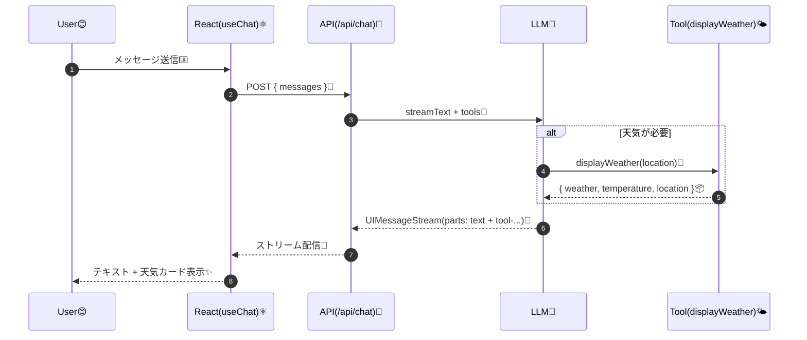
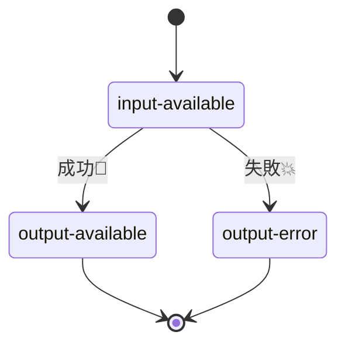

# 第227章：Generative UI

## 今日のゴール🎯

チャットの返事が **テキストだけ**じゃなくて、AIが必要に応じて **UI（カード・一覧・パネル）** を返せるようにします😍
ポイントはこれ👇

* AIが **ツール（tool）** を呼ぶ
* そのツールの結果が **message.parts** に入る
* フロント側で **partsを見て、対応するReactコンポーネントを描画**する

この「partsをUIに変換」するのが Generative UI の核心だよ💡 ([AI SDK][1])

---

## ざっくり全体の流れ（図）🗺️




---

## ハンズオン：天気カードが出るチャットを作ろう🌤️🧡

AIが「天気っぽい質問」を検知したら、`displayWeather` ツールを呼んで、結果を **カードUI** で表示します！

### 0) 追加インストール📦

（ViteのReact TSプロジェクトを想定。まだならいつものプロジェクトでOK👌）

PowerShellで👇

```bash
npm i ai @ai-sdk/react zod @ai-sdk/openai
npm i -D express cors tsx concurrently @types/express @types/cors
```

* ツール定義は `tool()` + `zod` の `inputSchema` で作れるよ✨ ([AI SDK][1])
* OpenAIプロバイダは `@ai-sdk/openai` を使うよ🤝 ([AI SDK][2])

---

## 1) サーバー側：ツール（displayWeather）を作る🔧🌤️

`server/tools.ts` を作成👇（実APIじゃなくて「擬似天気」なので気楽にOK😆）

```ts
// server/tools.ts
import { tool } from 'ai';
import { z } from 'zod';

export const tools = {
  displayWeather: tool({
    description: 'Display the weather for a location',
    inputSchema: z.object({
      location: z.string().describe('The location to get the weather for'),
    }),
    execute: async ({ location }) => {
      // ちょい待たせて「それっぽさ」を出す😴
      await new Promise((r) => setTimeout(r, 1200));

      // 擬似データ（本番はここをAPI呼び出しに差し替え✨）
      const weathers = ['Sunny', 'Cloudy', 'Rainy', 'Windy'] as const;
      const weather = weathers[Math.floor(Math.random() * weathers.length)];
      const temperature = Math.floor(10 + Math.random() * 18); // 10〜27℃くらい

      return { location, weather, temperature };
    },
  }),
} as const;
```

この形（`description / inputSchema / execute`）が「ツール」の基本形だよ🧩 ([AI SDK][1])

---

## 2) サーバー側：/api/chat を生やしてストリーミング返す📡

`server/index.ts` を作成👇
ここで `streamText()` に `tools` を渡して、**UIMessageストリーム**で返します🌊

```ts
// server/index.ts
import express, { Request, Response } from 'express';
import cors from 'cors';
import { streamText, convertToModelMessages, stepCountIs, type UIMessage } from 'ai';
import { openai } from '@ai-sdk/openai';
import { tools } from './tools';

const app = express();

app.use(cors({ origin: 'http://localhost:5173' }));
app.use(express.json());

app.post('/api/chat', async (req: Request, res: Response) => {
  const { messages } = req.body as { messages: UIMessage[] };

  const result = streamText({
    model: openai('gpt-5'),
    system:
      'You are a friendly assistant. If the user asks about weather, call displayWeather. ' +
      'After the tool result, reply with a short Japanese comment.',
    messages: await convertToModelMessages(messages),
    tools,
    stopWhen: stepCountIs(5),
  });

  // これで UIMessageStream をそのままレスポンスへ流す🌊
  result.pipeUIMessageStreamToResponse(res);
});

app.listen(8787, () => {
  console.log('✅ API server running: http://localhost:8787');
});
```

* `convertToModelMessages()` は `useChat` のUIメッセージを `streamText` で扱える形に変換してくれるよ🧠 ([AI SDK][3])
* Expressでストリームを返すなら `pipeUIMessageStreamToResponse` が定番✨ ([AI SDK][4])

### サーバー起動スクリプトも足す（package.json）📝

```json
{
  "scripts": {
    "dev": "concurrently \"npm:dev:server\" \"npm:dev:client\"",
    "dev:server": "tsx watch server/index.ts",
    "dev:client": "vite"
  }
}
```

---

## 3) フロント側：tool parts を見て「天気カード」を描画する🪄🧡

### 3-1) 天気カードコンポーネント

`src/components/WeatherCard.tsx`

```ts
// src/components/WeatherCard.tsx
type Props = {
  location: string;
  weather: string;
  temperature: number;
};

export function WeatherCard({ location, weather, temperature }: Props) {
  return (
    <div
      style={{
        border: '1px solid #ddd',
        borderRadius: 12,
        padding: 12,
        marginTop: 8,
      }}
    >
      <div style={{ fontWeight: 700 }}>🌤️ {location} のお天気</div>
      <div>天気：{weather}</div>
      <div>気温：{temperature}℃</div>
    </div>
  );
}
```

### 3-2) App.tsx：parts を分岐して描画✨

`src/App.tsx`

```tsx
// src/App.tsx
import { useState } from 'react';
import { useChat } from '@ai-sdk/react';
import { WeatherCard } from './components/WeatherCard';

export default function App() {
  const [input, setInput] = useState('');

  const { messages, sendMessage, status, error } = useChat({
    api: 'http://localhost:8787/api/chat',
  });

  const isBusy = status === 'submitted' || status === 'streaming';

  return (
    <div style={{ maxWidth: 720, margin: '20px auto', padding: 16 }}>
      <h1 style={{ marginBottom: 8 }}>Generative UI Chat 🪄💬</h1>

      <div style={{ border: '1px solid #eee', borderRadius: 12, padding: 12 }}>
        {messages.map((m) => (
          <div key={m.id} style={{ marginBottom: 12 }}>
            <div style={{ fontWeight: 700 }}>
              {m.role === 'user' ? '🙋‍♀️ You' : '🤖 AI'}
            </div>

            <div>
              {m.parts.map((part, idx) => {
                if (part.type === 'text') {
                  return <span key={idx}>{part.text}</span>;
                }

                // ✅ tool parts は "tool-<toolName>" という type 名になる（ここ大事！）
                if (part.type === 'tool-displayWeather') {
                  // tool は状態を持つよ（ローディング・成功・失敗）
                  switch (part.state) {
                    case 'input-available':
                      return (
                        <div key={idx} style={{ marginTop: 8 }}>
                          ⏳ 天気しらべてるよ〜
                        </div>
                      );

                    case 'output-available':
                      return (
                        <div key={idx}>
                          <WeatherCard {...part.output} />
                        </div>
                      );

                    case 'output-error':
                      return (
                        <div key={idx} style={{ marginTop: 8 }}>
                          💥 エラー：{part.errorText}
                        </div>
                      );

                    default:
                      return null;
                  }
                }

                return null;
              })}
            </div>
          </div>
        ))}

        {error && (
          <div style={{ marginTop: 8 }}>
            💣 通信エラー：{error.message}
          </div>
        )}
      </div>

      <form
        onSubmit={(e) => {
          e.preventDefault();
          if (!input.trim() || isBusy) return;
          sendMessage(input);
          setInput('');
        }}
        style={{ display: 'flex', gap: 8, marginTop: 12 }}
      >
        <input
          value={input}
          onChange={(e) => setInput(e.target.value)}
          placeholder="例：東京の天気は？🌸"
          style={{ flex: 1, padding: 10, borderRadius: 10, border: '1px solid #ddd' }}
        />
        <button
          type="submit"
          disabled={isBusy}
          style={{ padding: '10px 14px', borderRadius: 10 }}
        >
          送信🚀
        </button>
      </form>

      <div style={{ marginTop: 8, opacity: 0.7 }}>
        状態：{status} {isBusy ? '🌀' : '✅'}
      </div>
    </div>
  );
}
```

ここが Generative UI の超重要ポイント👇

* tool parts の `type` は `tool-${toolName}` になる ([AI SDK][1])
* さらに `state` が `input-available / output-available / output-error` のように変化するよ ([AI SDK][1])
* `useChat` はAI SDK 5以降「入力状態を持たない」ので `useState` で入力管理する感じになるよ✍️ ([AI SDK][5])

---

## 4) tool の状態ってこうなる（図）🧩



---

## 5) 起動して試す🚀

ターミナルで👇

```bash
npm run dev
```

ブラウザで `http://localhost:5173` にアクセスして、

* 「東京の天気は？🌸」
* 「大阪の気温どんな感じ？🥺」

みたいに聞くと、**天気カードUI**が出れば成功〜！🎊🎊🎊

---

## よくあるつまずき集（秒で直そう）🧯😺

### A) カードが出ず、テキストだけになる😢

* `tool` の名前と、フロントの `tool-displayWeather` が一致してる？

  * サーバー：`displayWeather`
  * フロント：`tool-displayWeather` ([AI SDK][1])

### B) ストリーミングが止まる/固まる😵‍💫

* プロキシ経由だとストリーミングが壊れるケースがあるよ（あるある）
  なのでこの章みたいに **直URL（[http://localhost:8787](http://localhost:8787)）** で叩くのがラク！
  （Expressのトラブルシュートにも「proxyでストリーミング問題」あるよ）([AI SDK][4])

### C) OPENAI_API_KEY まわりでエラー🔑

* Windowsは環境変数セットの方法がいくつかあるよ（`setx` など）([OpenAI Help Center][6])
* うっかりキーをフロントに書かないでね！🫣（必ずサーバー側で使う）

---

## ミニ課題（かわいく強くなる💪💕）

1. `displayStockPrice` ツールを追加して、株価カード📈を表示してみて（擬似データでもOK）
2. `displaySchedule` ツールを追加して、予定表っぽいUI📅を返してみて
3. 「ローディング表示」をもっとかわいくしてみて（スピナーとか✨）

---

これができると、「AIチャット」から一気に **AIアプリ**っぽくなるよ🥰🪄
次の章（AI SDK Core）に進むと、サーバー側の設計がもっと気持ちよくなるよ〜🔥

[1]: https://ai-sdk.dev/docs/ai-sdk-ui/generative-user-interfaces "AI SDK UI: Generative User Interfaces"
[2]: https://ai-sdk.dev/providers/ai-sdk-providers/openai?utm_source=chatgpt.com "OpenAI provider"
[3]: https://ai-sdk.dev/docs/reference/ai-sdk-ui/convert-to-model-messages "AI SDK UI: convertToModelMessages"
[4]: https://ai-sdk.dev/examples/api-servers/express "API Servers: Express"
[5]: https://ai-sdk.dev/docs/reference/ai-sdk-ui/use-chat "AI SDK UI: useChat"
[6]: https://help.openai.com/en/articles/5112595-best-practices-for-api-key-safety?utm_source=chatgpt.com "Best Practices for API Key Safety"
