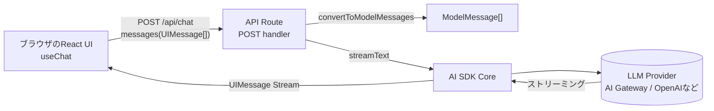

# 第228章：AI SDK Core

ここまでで「フロント側（`useChat` とか）」でチャットUIは作れたはず！😊
この章は、その裏側で動く **“サーバー側の本体”＝AI SDK Core** をちゃんと理解して、自分でカスタムできるようになる回だよ〜！🚀 ([AI SDK][1])

---

## 1) AI SDK Coreってなに？🤔💡

ざっくり言うと…

* **LLMに投げる処理（生成・ストリーミング）を統一したAPI**
* **モデル会社が違っても（OpenAI / Anthropic / Gemini…）書き方がだいたい同じ**
* **ツール呼び出し（Tool Calling）とかもサーバー側でまとめて管理できる**

代表選手はこのへん👇

* `generateText`（一気に生成）
* `streamText`（パラパラ出す＝チャット向け）
* `generateObject` / `streamObject`（Zodスキーマ通りのJSONを作らせる） ([AI SDK][1])

---

## 2) 全体の流れを図でつかもう🗺️✨（Mermaid）




「フロントはUI担当💅」
「サーバーはLLM担当🧠」
って分けると、秘密鍵（APIキー）をフロントに出さずに済むから安全だよ🔐✨

---

## 3) まずは“最小の正解”を作る ✅😊


AI SDKのドキュメントで推奨されてる基本形はこんな感じ！
ポイントは **`UIMessage[]` → `convertToModelMessages` → `streamText` → `toUIMessageStreamResponse()`** だよ🧩 ([AI SDK][2])

### 📁 `app/api/chat/route.ts`（Next.jsのRoute Handler例）

> ※この章は「バックエンド側の処理」を学ぶ回だから、まずはこの形を覚えちゃおう！✨

```ts
import { streamText, type UIMessage, convertToModelMessages } from "ai";

export async function POST(req: Request) {
  const { messages }: { messages: UIMessage[] } = await req.json();

  const result = streamText({
    // AI Gatewayを使うなら文字列モデルでもOK（グローバルプロバイダ）
    model: "anthropic/claude-sonnet-4.5",
    messages: await convertToModelMessages(messages),
  });

  return result.toUIMessageStreamResponse();
}
```

この形が動くと、フロントの `useChat()` が勝手に `/api/chat` を叩いて、文字がパラパラ出るよ〜！📨✨ ([AI SDK][2])

---

## 4) “Coreっぽさ”を出していく：サーバー側で賢くする😼🔧

ここからが第228章の本題！
**AI SDK Coreは「サーバー側でやりたいこと」を全部載せられる**んだよ✨

### 4-1) Systemメッセージで “人格” を固定する 🎀📝


```ts
const result = streamText({
  model: "anthropic/claude-sonnet-4.5",
  system: "あなたは優しくて説明が上手なアシスタントです。絵文字も使ってね。",
  messages: await convertToModelMessages(messages),
});
```

---

## 5) Tool Calling：AIに“道具”を渡す🧰✨（ここがCoreの花形！）


Tool Callingは **「AIが必要に応じて、サーバーの関数を呼べる」** 仕組みだよ😳
ツールはだいたいこの3点セット！👇

* `description`（説明）
* `inputSchema`（Zodなどのスキーマ）
* `execute`（実行する関数） ([AI SDK][3])

### 5-1) 例：日本時間の“今”を返すツール🕒🇯🇵

```ts
import { z } from "zod";
import { streamText, tool, stepCountIs, type UIMessage, convertToModelMessages } from "ai";

export async function POST(req: Request) {
  const { messages }: { messages: UIMessage[] } = await req.json();

  const result = streamText({
    model: "anthropic/claude-sonnet-4.5",
    messages: await convertToModelMessages(messages),

    tools: {
      nowJst: tool({
        description: "日本時間の現在時刻を返す",
        inputSchema: z.object({}),
        execute: async () => {
          const now = new Date();
          const tokyo = new Intl.DateTimeFormat("ja-JP", {
            timeZone: "Asia/Tokyo",
            dateStyle: "full",
            timeStyle: "medium",
          }).format(now);

          return { iso: now.toISOString(), tokyo };
        },
      }),
    },

    // ツール呼び出しで無限ループしないように上限をつけるの大事！🧯
    stopWhen: stepCountIs(3),
  });

  return result.toUIMessageStreamResponse();
}
```

### 🗣️ フロントでの使い方（ユーザーの言い方）

例えばチャットでこんな風に言うと…👇

* 「今の日本時間を教えて〜🕒」
  → AIが **`nowJst` ツールを呼ぶ** ことがあるよ✨

---

## 6) エラーが出たとき：ちゃんと“中身”を見える化する😇🔍


`useChat` で「An error occurred」だけ出るの、つらいよね😭
そんなときは `getErrorMessage` を渡してあげるのが公式のおすすめ！ ([AI SDK][4])

```ts
function errorToMessage(error: unknown) {
  if (error == null) return "unknown error";
  if (typeof error === "string") return error;
  if (error instanceof Error) return error.message;
  return JSON.stringify(error);
}

return result.toUIMessageStreamResponse({
  getErrorMessage: errorToMessage,
});
```

---

## 7) まとめ：第228章で覚えたいコト🎯💖

* AI SDK Coreは **サーバー側の“本体”**（生成・ストリーミング・ツール管理）🧠 ([AI SDK][1])
* チャットの基本形は
  **`UIMessage[] → convertToModelMessages → streamText → toUIMessageStreamResponse()`** ✅ ([AI SDK][2])
* Tool Callingで **AIに道具を渡せる**🧰（Zod + execute） ([AI SDK][3])
* エラーは `getErrorMessage` で “中身” を出してデバッグしやすくする🔍 ([AI SDK][4])

---

## 8) ミニ課題（5〜10分）🎒✨

1. `system` を変えて「ギャル口調💅」とかにしてみる😆
2. ツールを1個追加してみる（例：`rollDice` 🎲で1〜6返す）
3. `stopWhen: stepCountIs(2)` にして、無限ループしない感覚をつかむ🧯

次の章（第229章）はプロンプトの考え方をちゃんとやるから、
この章では「サーバー側に何を置けるか」を体で覚えちゃおう〜！☺️💪

[1]: https://ai-sdk.dev/docs/ai-sdk-core/overview "AI SDK Core: Overview"
[2]: https://ai-sdk.dev/docs/getting-started/nextjs-pages-router "Getting Started: Next.js Pages Router"
[3]: https://ai-sdk.dev/docs/ai-sdk-core/tools-and-tool-calling "AI SDK Core: Tool Calling"
[4]: https://ai-sdk.dev/docs/troubleshooting/use-chat-an-error-occurred "Troubleshooting: useChat \"An error occurred\""
