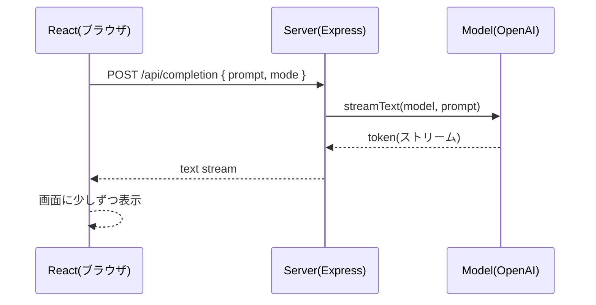

# 第230章：練習：AI搭載テキストエディタ

今日は「文章を書く→AIにお願い→結果をストリーミングで受け取って、エディタに反映」までを、**ミニ構成で一気に作る**よ〜！🎉
（AIの返事が“パラパラ…”って出てくるのが気持ちいいやつ😆）

---

## 1) 今日作るもの🎯📝

できあがりはこんな機能の“AI文章エディタ”👇

* 左：文章を書くテキストエリア✍️
* 右：AIの出力（ストリーミングで増えていく✨）
* モード切替：**言い換え / 要約 / 誤字脱字チェック / タイトル案** など🎛️
* 「適用」ボタンで、AI結果を本文に反映✅
* 「コピー」ボタンでクリップボードにコピー📋

---

## 2) 仕組み図（ストリーミングの流れ）🌊




`useCompletion` はフロント側の“受信係”、`streamText` はサーバ側の“配信係”って感じ！📦
`useCompletion` は API の既定が `/api/completion` で、`streamProtocol` は `text` / `data` を選べるよ。今回はシンプルに `text` を使うよ〜。([ai-sdk.dev][1])
サーバ側は `streamText` の結果を `pipeTextStreamToResponse` などでレスポンスに流せるよ。([ai-sdk.dev][2])

---

## 3) セットアップ（Vite + React + Express）🧰💻

### 3-1. プロジェクト作成🏗️

```bash
npm create vite@latest ai-text-editor -- --template react-ts
cd ai-text-editor
npm install
```

### 3-2. 必要ライブラリを入れる📦

フロント（React側）＋AI SDK（UI）＋サーバ（Express）＋AI SDK（Core + OpenAI）を入れるよ！

```bash
npm i ai @ai-sdk/react @ai-sdk/openai
npm i express cors dotenv
npm i -D concurrently tsx @types/express @types/cors
```

※ OpenAIプロバイダは `OPENAI_API_KEY` 環境変数がデフォルトになるよ。([ai-sdk.dev][3])

### 3-3. `.env` を作る🔐

プロジェクト直下に `.env`：

```txt
OPENAI_API_KEY=あなたのOpenAIのAPIキー
```

ついでに **コミット事故防止**（超大事😇）

```txt
# .gitignore に追加（まだ無ければ作る）
.env
```

---

## 4) サーバ（Express）を書く🛰️


### 4-1. `server/index.ts` を作成📄

プロジェクト直下に `server` フォルダを作って、その中に `index.ts` を作るよ！

```ts
// server/index.ts
import 'dotenv/config';
import express from 'express';
import cors from 'cors';
import { streamText } from 'ai';
import { openai } from '@ai-sdk/openai';

type Mode = 'rewrite' | 'summarize' | 'proofread' | 'title';

const app = express();

app.use(cors());
app.use(express.json({ limit: '1mb' }));

function buildPrompt(mode: Mode, text: string) {
  const baseRules = [
    'あなたは文章編集のプロです。',
    '日本語で出力してください。',
    '事実を捏造しないでください。',
    '入力文の意図を変えないでください。',
  ].join('\n');

  const taskByMode: Record<Mode, string> = {
    rewrite:
      '次の文章を、読みやすく自然な日本語に言い換えてください。トーンは丁寧すぎず、やわらかめで。',
    summarize:
      '次の文章を、要点がすぐ分かるように3〜5行で要約してください。必要なら箇条書きでもOK。',
    proofread:
      '次の文章の誤字脱字・不自然な表現を直し、修正後の文章だけを出してください。',
    title:
      '次の文章に合うタイトル案を5つ提案してください。短めでキャッチーに。',
  };

  return `${baseRules}\n\n【依頼】\n${taskByMode[mode]}\n\n【文章】\n${text}\n`;
}

app.post('/api/completion', async (req, res) => {
  const { prompt, mode } = req.body ?? {};

  if (typeof prompt !== 'string' || prompt.trim().length === 0) {
    res.status(400).json({ error: 'prompt is required' });
    return;
  }
  if (!['rewrite', 'summarize', 'proofread', 'title'].includes(mode)) {
    res.status(400).json({ error: 'mode is invalid' });
    return;
  }

  const result = streamText({
    model: openai('gpt-4o-mini'),
    prompt: buildPrompt(mode, prompt),
    onError: err => {
      console.error('streamText error:', err);
    },
  });

  // “テキストをストリームで返す”やつ（useCompletion 側で streamProtocol: 'text' を使う）
  res.setHeader('Content-Type', 'text/plain; charset=utf-8');
  result.pipeTextStreamToResponse(res);
});

app.listen(8787, () => {
  console.log('✅ API server running: http://localhost:8787');
});
```

ポイント💡

* `streamText` はストリーミング用で、結果オブジェクトにはレスポンスに流すヘルパーがあるよ。([ai-sdk.dev][2])
* エラーは握りつぶされやすいので、`onError` でログ出すのが安心！([ai-sdk.dev][2])

---

## 5) Vite の proxy 設定（フロント→サーバに中継）🛣️


### `vite.config.ts` を編集🧩

```ts
// vite.config.ts
import { defineConfig } from 'vite';
import react from '@vitejs/plugin-react';

export default defineConfig({
  plugins: [react()],
  server: {
    proxy: {
      '/api': 'http://localhost:8787',
    },
  },
});
```

これで React 側は `/api/completion` に投げるだけでOK✨
CORSで悩みがちポイントをショートカットできるよ〜😺

---

## 6) フロント（React）を書く🎨✨

### 6-1. `src/App.tsx` を置き換え✍️


```tsx
// src/App.tsx
import { useMemo, useRef, useState } from 'react';
import { useCompletion } from '@ai-sdk/react';
import styles from './App.module.css';

type Mode = 'rewrite' | 'summarize' | 'proofread' | 'title';

const modeLabel: Record<Mode, string> = {
  rewrite: '言い換え',
  summarize: '要約',
  proofread: '誤字脱字チェック',
  title: 'タイトル案',
};

export default function App() {
  const [text, setText] = useState(
    '今日はゼミの発表があって、めっちゃ緊張したけど、なんとか最後まで話せた。先生からは構成がいいって言われたけど、結論が弱いかもって言われた。次はそこを直したい。'
  );
  const [mode, setMode] = useState<Mode>('rewrite');

  const textareaRef = useRef<HTMLTextAreaElement | null>(null);
  const lastSelectionRef = useRef<{ start: number; end: number; usedSelection: boolean } | null>(null);

  const {
    completion,
    complete,
    isLoading,
    stop,
    error,
    setCompletion,
  } = useCompletion({
    api: '/api/completion',
    streamProtocol: 'text', // ← 今回は text stream を使うよ :contentReference[oaicite:5]{index=5}
    onFinish: (prompt, done) => {
      // ここで履歴保存などもできるよ（今回は最小構成）
      console.log('finish:', { promptLength: prompt.length, doneLength: done.length });
    },
  });

  const selectedInfo = useMemo(() => {
    const el = textareaRef.current;
    if (!el) return { selectedText: '', start: 0, end: 0, hasSelection: false };
    const start = el.selectionStart ?? 0;
    const end = el.selectionEnd ?? 0;
    const hasSelection = start !== end;
    const selectedText = hasSelection ? text.slice(start, end) : '';
    return { selectedText, start, end, hasSelection };
  }, [text]);

  async function runAi() {
    const el = textareaRef.current;
    if (!el) return;

    // “選択してたら選択部分だけ”、なければ全文
    const usedSelection = selectedInfo.hasSelection;
    const prompt = usedSelection ? selectedInfo.selectedText : text;

    lastSelectionRef.current = {
      start: selectedInfo.start,
      end: selectedInfo.end,
      usedSelection,
    };

    setCompletion('');
    await complete(prompt, { body: { mode } });
  }

  function applyToText() {
    if (!completion) return;

    const sel = lastSelectionRef.current;
    if (!sel || !sel.usedSelection) {
      setText(completion);
      return;
    }

    setText(prev => prev.slice(0, sel.start) + completion + prev.slice(sel.end));
  }

  async function copy() {
    if (!completion) return;
    await navigator.clipboard.writeText(completion);
    alert('コピーしたよ！📋✨');
  }

  return (
    <div className={styles.page}>
      <header className={styles.header}>
        <h1>AIテキストエディタ ✍️🤖✨</h1>

        <div className={styles.controls}>
          <label className={styles.label}>
            モード：
            <select value={mode} onChange={e => setMode(e.target.value as Mode)}>
              {Object.keys(modeLabel).map(k => (
                <option key={k} value={k}>
                  {modeLabel[k as Mode]}
                </option>
              ))}
            </select>
          </label>

          <button onClick={runAi} disabled={isLoading} className={styles.primary}>
            {isLoading ? '生成中…🌊' : 'AIにお願いする✨'}
          </button>

          <button onClick={stop} disabled={!isLoading}>
            停止🛑
          </button>

          <button onClick={() => setCompletion('')} disabled={isLoading || !completion}>
            出力クリア🧹
          </button>
        </div>
      </header>

      <main className={styles.main}>
        <section className={styles.panel}>
          <h2>本文✍️</h2>
          <textarea
            ref={textareaRef}
            className={styles.textarea}
            value={text}
            onChange={e => setText(e.target.value)}
            placeholder="ここに文章を書くよ〜！"
          />
          <div className={styles.meta}>
            <span>文字数：{text.length}</span>
            <span>
              選択：{selectedInfo.hasSelection ? `${selectedInfo.selectedText.length}文字` : 'なし'}
            </span>
          </div>
        </section>

        <section className={styles.panel}>
          <h2>AIの出力🤖</h2>

          {error ? <p className={styles.error}>エラー：{error.message} 😭</p> : null}

          <div className={styles.output}>
            {completion ? completion : <span className={styles.placeholder}>ここに結果が出るよ✨</span>}
          </div>

          <div className={styles.actions}>
            <button onClick={applyToText} disabled={!completion || isLoading} className={styles.primary}>
              本文に適用✅
            </button>
            <button onClick={copy} disabled={!completion || isLoading}>
              コピー📋
            </button>
          </div>

          <p className={styles.tip}>
            💡コツ：文章の一部分だけ直したいときは、本文をドラッグして選択してから「AIにお願いする✨」を押してね！
          </p>
        </section>
      </main>
    </div>
  );
}
```

### 6-2. `src/App.module.css` を作成🎀

見た目は最小でOK！でもちょっと整えるとテンション上がる😆💕

```css
/* src/App.module.css */
.page {
  padding: 16px;
  max-width: 1100px;
  margin: 0 auto;
  font-family: system-ui, -apple-system, "Segoe UI", sans-serif;
}

.header {
  display: flex;
  flex-direction: column;
  gap: 10px;
  margin-bottom: 14px;
}

.controls {
  display: flex;
  flex-wrap: wrap;
  gap: 10px;
  align-items: center;
}

.label {
  display: flex;
  gap: 8px;
  align-items: center;
}

.main {
  display: grid;
  grid-template-columns: 1fr 1fr;
  gap: 14px;
}

.panel {
  border: 1px solid #ddd;
  border-radius: 12px;
  padding: 14px;
  background: #fff;
}

.textarea {
  width: 100%;
  min-height: 260px;
  resize: vertical;
  padding: 10px;
  border-radius: 10px;
  border: 1px solid #ccc;
  line-height: 1.5;
}

.meta {
  display: flex;
  justify-content: space-between;
  margin-top: 8px;
  color: #666;
  font-size: 12px;
}

.output {
  min-height: 260px;
  border: 1px dashed #bbb;
  border-radius: 10px;
  padding: 10px;
  white-space: pre-wrap;
  line-height: 1.6;
}

.placeholder {
  color: #888;
}

.actions {
  display: flex;
  gap: 10px;
  margin-top: 10px;
}

.primary {
  border: 1px solid #222;
  background: #222;
  color: #fff;
  border-radius: 10px;
  padding: 8px 12px;
}

.error {
  color: #b00020;
}

.tip {
  margin-top: 10px;
  color: #444;
  font-size: 13px;
}
```

---

## 7) npm scripts を整える（2つ同時起動）🚀

`package.json` の `scripts` をこんな感じに👇

```json
{
  "scripts": {
    "dev": "concurrently -k \"npm:dev:client\" \"npm:dev:server\"",
    "dev:client": "vite",
    "dev:server": "tsx watch server/index.ts",
    "build": "vite build",
    "preview": "vite preview"
  }
}
```

起動はこれだけ🎉

```bash
npm run dev
```

* React: [http://localhost:5173](http://localhost:5173)
* API: [http://localhost:8787](http://localhost:8787)

---

## 8) 動作チェック✅✨

1. 左に文章を書く✍️
2. 右上でモードを選ぶ🎛️
3. 「AIにお願いする✨」
4. 右の出力が“パラパラ…”って増える🌊
5. 「本文に適用✅」で反映！

---

## 9) よくある詰まりポイント集（即解決😺🧯）

* **何も返ってこない😿**

  * `.env` の `OPENAI_API_KEY` が入ってる？（スペースとか改行とか注意！）
  * サーバ（8787）が起動してる？ターミナルに `✅ API server running` 出てる？

* **`useCompletion` が `/api/completion` を叩いてない気がする**

  * `vite.config.ts` の proxy 設定を確認！
  * `api: '/api/completion'` になってる？

* **ストリーミングにならない（まとめてドン！って来る）**

  * `streamProtocol: 'text'` にしてる？([ai-sdk.dev][1])
  * サーバ側で `pipeTextStreamToResponse` を使ってる？([ai-sdk.dev][2])

---

## 10) 発展課題（できたら超つよ💪✨）

できそうなのを1個だけでもOK！🎮

* 🧠 **履歴機能**：生成結果を5件保存して、クリックで戻せる
* 🎯 **トーン切替**：「就活っぽく」「友達っぽく」「学術っぽく」など
* ✂️ **選択範囲の置換を強化**：AI生成後も selection を保持して“その場で差し替え”
* 💾 **自動保存**：本文を `localStorage` に保存して、リロードしても復活
* 🛡️ **サーバ側バリデーション**：入力が長すぎたら弾く、など

---

必要なら、この章の完成形を「ファイル一式の形（フォルダ構成＋全コード）」でまとめて出すこともできるよ📦✨

[1]: https://ai-sdk.dev/docs/reference/ai-sdk-ui/use-completion "AI SDK UI: useCompletion"
[2]: https://ai-sdk.dev/docs/ai-sdk-core/generating-text "AI SDK Core: Generating Text"
[3]: https://ai-sdk.dev/providers/ai-sdk-providers/openai "AI SDK Providers: OpenAI"
