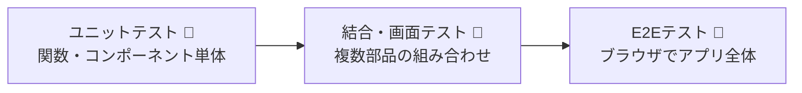
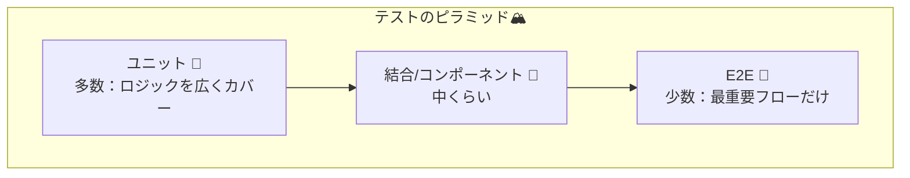

# 第231章：ユニットテストとE2Eテストの違い

テストって聞くと「なんか難しそう…🥺」ってなるけど、実は **役割が違う“種類”があるだけ**だよ〜！
この章では **ユニットテスト（Unit）** と **E2Eテスト（End-to-End）** の違いを、スッキリ整理するね🧡

---

## 1) まず結論！ざっくり何が違うの？🎯

* **ユニットテスト**：部品（関数・コンポーネントなど）を小さくチェック✅
  → 速い⚡ たくさん書ける📝 バグの場所が特定しやすい🔎

* **E2Eテスト**：アプリを本物っぽく動かして、ユーザー目線でチェック🌐
  → 遅め🐢 でも「全体がちゃんと繋がって動く」を保証しやすい💪

---

## 2) イメージ図：どこをテストしてるの？👀

ユニットは「点」✅、E2Eは「線〜面」🧭って感じ！

---

## 3) たとえ話：カフェのバイトで例えると☕🍰

* **ユニットテスト**：
  「ミルク入れても味おかしくない？」「スポンジ焼けてる？」みたいに **パーツ単位で確認**する感じ🧁✅

* **E2Eテスト**：
  「注文 → 会計 → 受け取り → 席で食べる」まで **お客さん体験を通しで確認**する感じ☕🧾🪑

---

## 4) 比較表でスッキリ！📋✨

| 観点     | ユニットテスト🧪         | E2Eテスト🧭             |
| ------ | ----------------- | -------------------- |
| 対象     | 小さい単位（関数・コンポーネント） | アプリ全体（画面遷移・API・表示まで） |
| 実行速度   | 速い⚡               | 遅め🐢（ブラウザ動かすから）      |
| バグ位置特定 | しやすい🔎            | しにくいことも😵（範囲が広い）     |
| 壊れやすさ  | 比較的安定✅            | 環境・待ち時間で不安定になりがち⚠️   |
| 書く量    | 多めに書くのが普通📚       | 少なめ（重要ルートだけ）🧭       |

---

## 5) 具体例：TODOアプリなら、何をどっちで？📝✅

### ユニットテスト向き🧪

* 入力チェック（空文字なら追加しない）🚫
* 「追加」「削除」のロジック（配列操作）🔁
* 小さめコンポーネント（ボタンが押されたら関数が呼ばれる、など）🖲️

### E2Eテスト向き🧭

* 「入力 → 追加 → 画面に表示される」まで一連の流れ🧑‍💻➡️📄➡️✅
* ページ移動（ルーティング）しても状態が期待通りか🚪➡️🚪
* 認証が絡む「ログインしてから見える」🔐👀

---

## 6) “いい感じのバランス”はこれ！テストのピラミッド🏔️🧪

基本は **下（ユニット）を厚く、上（E2E）を薄く**が王道だよ〜✨

---

## 7) ミニ確認クイズ🎀🧠

次のテスト、どっちが向いてる？（ユニット🧪 / E2E🧭）

1. 「空の入力は追加できない」
2. 「ログイン → マイページ → ログアウトできる」
3. 「`formatDate()` が正しい文字列を返す」
4. 「スマホ幅でもボタンが押せる」

**答え**👇✨
1=ユニット🧪（入力チェック）
2=E2E🧭（一連のユーザー操作）
3=ユニット🧪（関数）
4=E2E🧭（実ブラウザ＋画面サイズ）

---

## まとめ🎉

* **ユニットテスト🧪**：小さく速く、バグの場所がわかりやすい
* **E2Eテスト🧭**：ユーザー目線で、アプリ全体の安心を作る
* 基本は **ユニット多め＋E2E少なめ** が安定✨

次の章（第232章）から、いよいよ **Playwright** を触っていくよ〜🎭🧪💨
