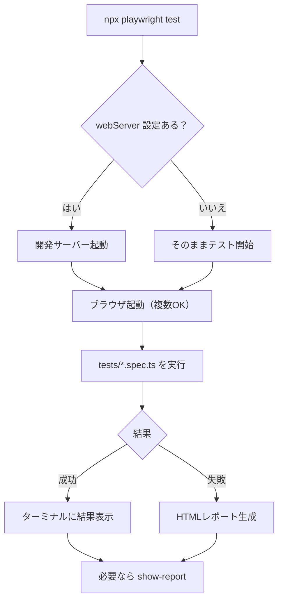
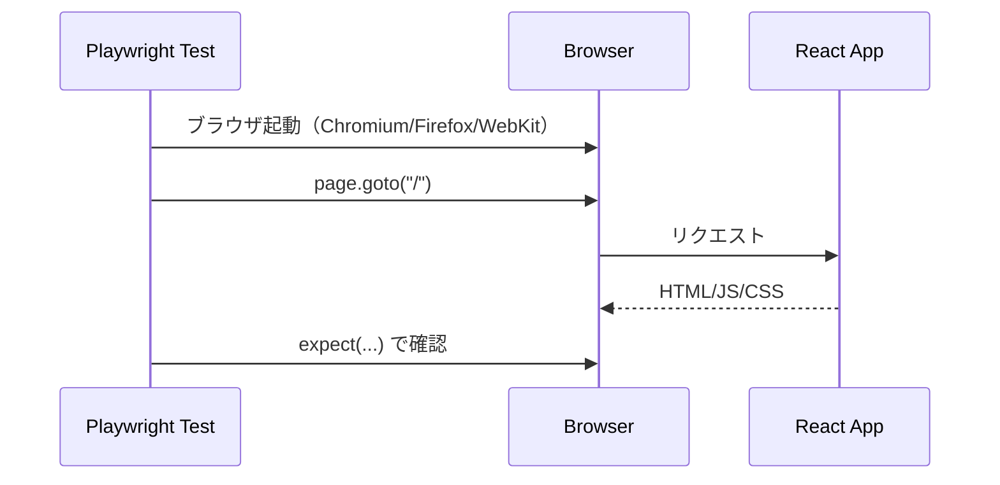

# 第232章：Playwright 入門

この章では「Reactアプリを、本物のブラウザで自動操作してチェックする」ための **Playwright** を入れて、まずは **動かすところまで**やります💪😊
（テストの書き方のコツは次の章以降でどんどん上手くなるよ〜！）

---

## 1) Playwright を入れる（いちばんカンタンな入れ方）📦💨


React（Vite）プロジェクトのフォルダで、PowerShell を開いてこれ👇

```bash
npm init playwright@latest
```

すると質問されるので、だいたいこんな感じでOKです🙆‍♀️（公式の流れです） ([Playwright][1])

* TypeScript / JavaScript → **TypeScript**（だいたいデフォルト）
* tests folder → **tests**（デフォルトでOK）
* GitHub Actions workflow → いったん **No** でもOK（後で追加できる） ([Playwright][2])
* Playwright browsers → **Yes**（ブラウザも一緒に入る）

---

## 2) 何が増えた？フォルダを見てみよ👀📁

だいたいこんな感じが増えます👇（公式） ([Playwright][1])

* `playwright.config.ts`（設定ファイル）
* `tests/example.spec.ts`（サンプルテスト）

```
your-project/
  playwright.config.ts
  tests/
    example.spec.ts
  package.json
```

---

## 3) まずはサンプルを実行してみる！▶️🧪


```bash
npx playwright test
```

デフォルトだと **ヘッドレス（画面を出さずに）**、しかも **複数ブラウザで並列実行** します🧠⚡（公式） ([Playwright][1])

### 画面を出して動きを見たいとき 👀

```bash
npx playwright test --headed
```

### UI つきでデバッグしたいとき（超おすすめ）🧰✨

```bash
npx playwright test --ui
```

（`--headed` や `--ui` は公式のTipsにもあるよ） ([Playwright][1])

---

## 4) テスト結果レポートを見る（HTML）🧾🌈


テスト後に、HTMLレポートを開けます👇（公式） ([Playwright][1])

```bash
npx playwright show-report
```

失敗したときのログやスクショ（設定次第）も見やすくて、めちゃ助かります🥹🙏

---

## 5) React（Vite）とちゃんと繋ぐ：テスト実行前に開発サーバーを自動起動する 🌐🚀


E2Eテストって「アプリが動いてるURL」に対して操作するので、
Playwright側で **サーバー起動→テスト開始** をやってくれる設定が便利です💡（公式の `webServer`） ([Playwright][3])

`playwright.config.ts` をこういうイメージにします👇
（Viteのポートは例として `5173` にしてるよ。必要なら変えてね😊）

```ts
import { defineConfig, devices } from '@playwright/test';

export default defineConfig({
  testDir: './tests',
  use: {
    baseURL: 'http://localhost:5173',
  },

  webServer: {
    command: 'npm run dev -- --port 5173',
    url: 'http://localhost:5173',
    reuseExistingServer: !process.env.CI,
  },

  projects: [
    { name: 'chromium', use: { ...devices['Desktop Chrome'] } },
    { name: 'firefox', use: { ...devices['Desktop Firefox'] } },
    { name: 'webkit', use: { ...devices['Desktop Safari'] } },
  ],
});
```

ポイントはここ👇

* `webServer`：テスト前にサーバー起動して待ってくれる ([Playwright][3])
* `use.baseURL`：`page.goto('/')` が書けるようになる（URL全部書かなくてOK） ([Playwright][3])

---

## 6) はじめての “自分のテスト” を1本作ろう 🎀✅

`tests/home.spec.ts` を作って、これを書いてみてね👇

```ts
import { test, expect } from '@playwright/test';

test('トップページが表示できる', async ({ page }) => {
  await page.goto('/');

  // タイトルでゆるく確認（Vite初期テンプレ想定）
  await expect(page).toHaveTitle(/Vite \+ React/i);
});
```

実行👇（ファイル指定もできるよ） ([Playwright][1])

```bash
npx playwright test tests/home.spec.ts
```

---

## 7) 図でわかる：Playwrightがやってる流れ 🍩📌






---

## 8) VS Code で楽したい人へ（超相性いい）💻💞


Playwrightは **公式VS Code拡張** があって、VS Codeのテスト欄から実行・デバッグ・生成までできちゃいます✨
拡張を入れて、コマンドパレットから「Install Playwright」みたいな流れでセットアップできます（公式） ([Playwright][4])

---

## 9) ミニ課題（5分）🎒🌟

1. `npx playwright test --ui` でUIモード起動 🧰 ([Playwright][1])
2. `tests/home.spec.ts` の正規表現をわざと間違えて失敗させる😈
3. `npx playwright show-report` で失敗内容を読む📖 ([Playwright][1])

「失敗の見方」に慣れると、E2Eが怖くなくなるよ〜☺️🫶

---

次の章（第233章）で、**Codegen（操作するだけでテストができる魔法）**に行くと一気に楽しくなるよ🪄✨

[1]: https://playwright.dev/docs/intro "Installation | Playwright"
[2]: https://playwright.dev/docs/ci-intro?utm_source=chatgpt.com "Setting up CI"
[3]: https://playwright.dev/docs/test-webserver "Web server | Playwright"
[4]: https://playwright.dev/docs/getting-started-vscode "Getting started - VS Code | Playwright"
