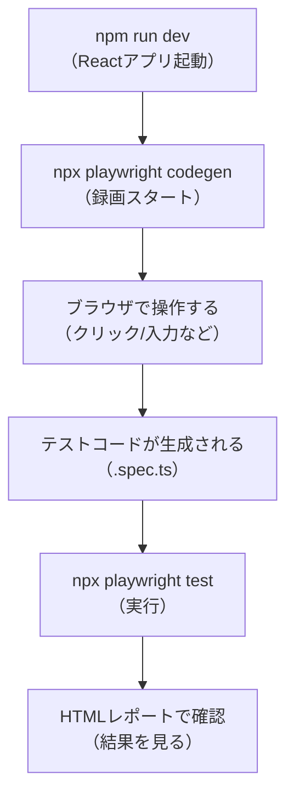

# 第233章：テストの自動生成 (Codegen)

「自分で全部書く」前に、**まず録画して土台を作る**のが最速だよ〜！😺💨
Playwrightの **Codegen** は、ブラウザを操作するだけでテストコードを自動で作ってくれる魔法🧙‍♀️✨（最初の一歩にめちゃ便利！） ([Playwright][1])

---

### まず今日のゴール🎯

* Codegenを起動できる✅
* ブラウザ操作を“録画”して✅
* `*.spec.ts`（Playwright Test）を生成して✅
* `npx playwright test` で実行できる✅

---

## 全体の流れ（図解）🗺️




---

## 1) 準備：Reactアプリを起動しよ〜🧡

PowerShell（またはVS Codeのターミナル）で👇

```bash
npm run dev
```

だいたい `http://localhost:5173` が出るはず（Viteの定番）🌱
※ポート番号は環境で変わることもあるよ！

---

## 2) Codegenを起動する🪄（これが本題！）


別ターミナルを開いて、これ👇

```bash
npx playwright codegen http://localhost:5173
```

すると…

* ブラウザ（Chromiumなど）🧭
* Playwright Inspector（コードが増えていく窓）🪟

が立ち上がるよ〜！
そして操作した内容が、右側で **勝手にテストコード化**されていく😳✨ ([Playwright][1])

---

## 3) 便利オプション：最初から“テスト用TS”でファイル出力📄✨

「コピーして貼る」でもOKだけど、**最初からファイルに出す**のがラク！😺

```bash
npx playwright codegen ^
  --target=playwright-test ^
  --output=tests/todo.spec.ts ^
  http://localhost:5173
```

* `--target=playwright-test`：Playwright Test形式で出す🧪
* `--output=...`：保存先ファイルを指定📁

（`^` はPowerShellでも使えるけど、うまくいかなければ1行でOK！）

---

## 4) 録画のコツ🎥✨（ここが成功の分かれ道）


### ✅ なるべく「ユーザーっぽい操作」をする

* ボタンはクリック🖱️
* 入力はキーボードで入力⌨️
* 変化（追加された、遷移した）まで確認👀

### ✅ Locator（要素の探し方）は賢く作られる

Codegenは、ページを見て **なるべく壊れにくい指定**を選ぼうとしてくれるよ✨
特に `getByRole` などの推奨ロケーターが優先されるのが良いポイント👍 ([Playwright][2])

---

## 5) 生成されるコードの例（こんな雰囲気）🧾

実際はアプリにより変わるけど、だいたいこういう形になるよ👇

```ts
import { test, expect } from '@playwright/test';

test('TODOを追加できる', async ({ page }) => {
  await page.goto('http://localhost:5173/');

  await page.getByRole('textbox').fill('牛乳を買う');
  await page.getByRole('button', { name: '追加' }).click();

  await expect(page.getByText('牛乳を買う')).toBeVisible();
});
```

ポイントはこれ👇

* `test(...)` がテスト1本🧪
* `page.goto(...)` でページへ🚪
* `getByRole(...)` や `getByText(...)` で要素を触る👉
  （このへんは次章のロケーターでさらに極める💪）

---

## 6) 生成したテストを実行する▶️🧪

```bash
npx playwright test
```

結果をレポートで見たいなら👇（Playwrightの定番）

```bash
npx playwright show-report
```

---

## 7) Codegenは「完成品」じゃなくて「下書き」✍️💡


Codegenは最強だけど、**そのまま出荷**はちょい危険なこともあるよ〜！😺
だから“整える”のが大事✨

### よく整えるポイント3つ🌟

1. **テスト名を分かりやすくする**
   `test('test', ...)` みたいなのは卒業🎓

2. **余計な操作・余計な待ちを消す**
   もし `waitForTimeout` が入ったら、基本は消したい（不安定になりがち）💦

3. **URLを固定しすぎない**
   後で `baseURL` を設定して `page.goto('/')` にできると気持ちいい✨
   （この辺はCI/CDにも効いてくるよ〜）

---

## 8) つまずきやすい所🧯

* **`localhost:5173` に繋がらない**
  → 先に `npm run dev` してる？ そのターミナル落ちてない？👀
* **別ポートだった**
  → 画面に出たURLをそのまま `codegen` に渡せばOK🙆‍♀️
* **ロケーターが微妙に感じる**
  → 次章（第234章）で “強い書き方” を作っていくから大丈夫😺✨ ([Playwright][2])

---

## ✅ ミニ練習（今日の宿題）📚✨

できる範囲でOKだよ〜！💗

1. Codegenで「追加」操作を録画して `tests/add.spec.ts` に保存🧪
2. もう1本、「削除」操作も録画して `tests/delete.spec.ts` に保存🗑️
3. `npx playwright test` を回して、両方グリーンにする✅✅

---

次の第234章は、**「壊れにくいロケーターの書き方」**で一気にプロっぽくなるよ〜🔥😎
この章で作った“下書き”を、ピカピカに磨いていこ〜！✨

[1]: https://playwright.dev/docs/codegen?utm_source=chatgpt.com "Test generator"
[2]: https://playwright.dev/docs/locators?utm_source=chatgpt.com "Locators"
