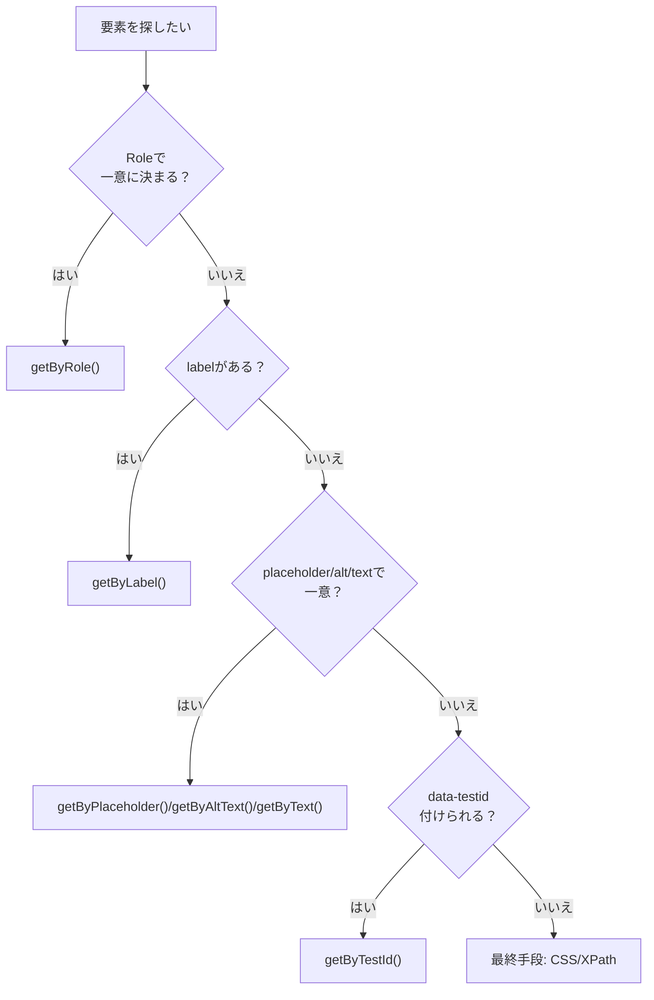

# 第234章：ロケーターの書き方

この章は **「画面のどこをどう掴むか」**＝ロケーターのセンスを身につける回だよ！💪
ロケーターが上手くなると、テストが **壊れにくく** なって、保守がめっちゃ楽になるよ〜！🎉

---

## 1) ロケーターってなに？🤔

Playwrightで

* ボタンを押す
* 入力欄に文字を入れる
* 「表示されてる？」をチェックする

…みたいな時に、**対象の要素（DOM）を見つける方法**が「ロケーター」だよ👀✨

そして結論：

✅ **基本は `getByRole` が最強**（＝人間が触るUIの取り方）
✅ 見つからない時だけ、他の方法へ降りる

---

## 2) まずは結論：`getByRole` がいちばんおすすめ🥇🎀

### なぜ強いの？💡

`getByRole` は **「アクセシビリティ的に正しい要素」**を掴むから、次のメリットがあるよ✨

* クラス名変更（デザイン変更）で壊れにくい💅
* 「そのUIの意味」に沿って取るから読みやすい📖
* UIがアクセシブルになりやすい（副作用で品質UP）🌱

---

## 3) どのロケーターを選ぶ？（判断フロー）🧭




---

## 4) `getByRole` の基本形（これ覚えたら勝ち）🏆✨

```ts
import { test, expect } from "@playwright/test";

test("ボタンを押す", async ({ page }) => {
  await page.goto("http://localhost:5173");

  await page.getByRole("button", { name: "保存" }).click();
});
```

ポイントはこれ👇

* `"button"` ← **役割（role）**
* `{ name: "保存" }` ← **画面に見えてる名前（accessible name）**

---

## 5) よく使う role たち（頻出セット）🧸📌

### ✅ ボタン

```ts
page.getByRole("button", { name: "ログイン" })
```

### ✅ テキスト入力（input / textarea）

```ts
page.getByRole("textbox", { name: "メールアドレス" })
```

### ✅ チェックボックス

```ts
page.getByRole("checkbox", { name: "利用規約に同意" })
```

### ✅ リンク

```ts
page.getByRole("link", { name: "詳細を見る" })
```

### ✅ 見出し（h1, h2…）

```ts
page.getByRole("heading", { name: "マイページ" })
```

---

## 6) “name” はどこから来るの？（超ざっくり理解）🎓✨

`name` はだいたい次のどれかから決まるよ👇

* ボタンの文字：`<button>保存</button>` → name は「保存」🟦
* ラベル：`<label>メール</label><input />` → name は「メール」🏷️
* `aria-label`：`aria-label="検索"` → name は「検索」🧠
* 画像の `alt`：`` → name は「アイコン」🖼️

つまり…
**普段のUIをちゃんと作ると、テストも綺麗に書ける**ってことだよ〜！🌸

---

## 7) 例：ログインフォームを “壊れにくく” テストしよう💌🔐

### 想定UI（React）

```tsx
export function LoginForm() {
  return (
    <form>
      <label>
        メールアドレス
        <input type="email" name="email" />
      </label>

      <label>
        パスワード
        <input type="password" name="password" />
      </label>

      <button type="submit">ログイン</button>
    </form>
  );
}
```

### Playwright テスト

```ts
import { test, expect } from "@playwright/test";

test("ログインできる（入力→送信）", async ({ page }) => {
  await page.goto("http://localhost:5173");

  await page.getByRole("textbox", { name: "メールアドレス" }).fill("test@example.com");
  await page.getByRole("textbox", { name: "パスワード" }).fill("password123");

  await page.getByRole("button", { name: "ログイン" }).click();

  // 例：ログイン後に見出しが出る想定
  await expect(page.getByRole("heading", { name: "マイページ" })).toBeVisible();
});
```

---

## 8) よくある落とし穴と解決法🧯😵‍💫

### 落とし穴A：同じ名前のボタンが2個ある😇

たとえば「保存」が2つあると、Playwrightが「どっち？」ってなるよ💦
解決の基本は **範囲を狭める**！

```ts
const dialog = page.getByRole("dialog", { name: "設定" });
await dialog.getByRole("button", { name: "保存" }).click();
```

### 落とし穴B：`getByText` だけで何でも取っちゃう😈

`getByText("保存")` は便利だけど、
同じ文字が増えると壊れやすいよ〜🥲

✅ 優先順位：
**getByRole > getByLabel > getByPlaceholder/getByAltText/getByText > getByTestId**

---

## 9) 便利ロケーターたち（困った時の逃げ道）🏃‍♀️💨

### `getByLabel`（フォーム強い！）

```ts
page.getByLabel("メールアドレス").fill("a@a.com");
```

### `getByPlaceholder`

```ts
page.getByPlaceholder("例）name@example.com").fill("test@example.com");
```

### `getByAltText`（画像）

```ts
page.getByAltText("プロフィール画像").click();
```

### `getByTestId`（最終兵器🧪）

```tsx
<button data-testid="save-button">保存</button>
```

```ts
page.getByTestId("save-button").click();
```

「デザインが変わっても絶対壊したくない」場所にだけ使うのがおすすめだよ😉✨

---

## 10) ミニ練習（Codegenの出力を“人間の言葉”に直す）🪄📎

### Codegenがこう吐いたとする（ありがち）

```ts
await page.locator("div:nth-child(2) > button").click();
```

### こう直す（理想）

```ts
await page.getByRole("button", { name: "保存" }).click();
```

### もし「保存」が2つなら？

```ts
const panel = page.getByRole("region", { name: "プロフィール" });
await panel.getByRole("button", { name: "保存" }).click();
```

---

## 11) まとめ（この章のゴール）🎯✨

* ロケーターは **壊れにくさ**が命💎
* 迷ったら **`getByRole`** を最初に考える🥇
* 同じ要素が多い時は **範囲を狭める**（dialog/region/section など）🔍

---

次の第235章は **「アサーション（検証）」** だよ！✅💕
「表示されてる？」「文字合ってる？」を気持ちよく書けるようになるから、めっちゃ楽しいよ〜！😆🎉
