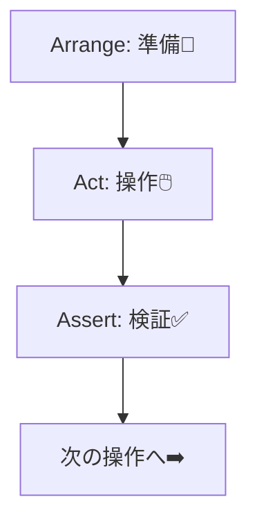
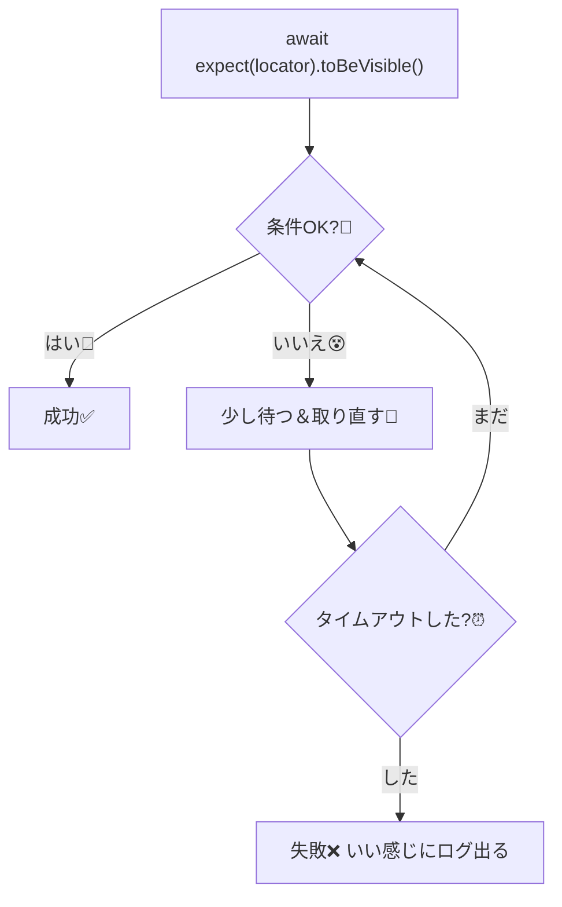

# 第235章：アサーション (検証)

この章を終えると…👇

* Playwrightの`expect`で「画面の状態チェック」が書けるようになる😊
* 不安定になりがちなテストを、**安定（フレークしにくい）**にできるようになる💪
* よく使うアサーションを一通り使えるようになる🧡

Playwrightのアサーションは、ただの「判定」じゃなくて、**条件が満たされるまで待ってくれる（リトライしてくれる）**のが超つよポイントです🔥 ([Playwright][1])

---

## 1) アサーションってなに？🧐💡

E2Eテストって基本こんな流れ👇



* **Act（操作）**：クリックする、入力する、ページ移動する、など
* **Assert（検証）**：

  * 「見出しが表示されてるはず！」
  * 「保存ボタンが無効になってるはず！」
  * 「エラーメッセージが出てないはず！」
    みたいに **期待する状態** をチェックします😊

---

## 2) Playwrightの`expect`は2種類あるよ✨（ここ超大事！）

### ✅ A. Web-first（自動リトライ）アサーション（おすすめ）🌈

たとえばこれ👇（**これが王道**）

```ts
import { test, expect } from '@playwright/test';

test('送信後にステータスが出る', async ({ page }) => {
  await page.goto('http://localhost:5173');

  await page.getByRole('button', { name: '送信' }).click();

  // ✅ 出るまで待ってくれる（最大タイムアウトまでリトライ）
  await expect(page.getByTestId('status')).toHaveText('Submitted');
});
```

これ、Playwrightが「まだ表示されてないかも」を考慮して、**取り直して何度もチェック**してくれます✨ ([Playwright][1])

---

### ⚠️ B. Non-retrying（待たない）アサーション（不安定になりがち）😵

ありがちなダメ例👇（動くけど、フレークの原因！）

```ts
// ❌ 今この瞬間だけ見て終わり（待たない）
expect(await page.getByText('welcome').isVisible()).toBe(true);
```

Playwright公式でも「こういう手動チェックは避けてね」って言ってます⚠️
代わりに👇

```ts
// ✅ Web-firstで待ってくれる
await expect(page.getByText('welcome')).toBeVisible();
```

これが安定のコツです🧡 ([Playwright][2])

---

## 3) よく使うアサーション（まずはこれだけでOK）🎒✨

### 👀 表示系

* `toBeVisible()`：見えてる？
* `toBeHidden()`：見えてない？
* `toBeInViewport()`：画面内に入ってる？

([Playwright][1])

### 📝 テキスト系

* `toHaveText('完全一致')`
* `toContainText('部分一致')`

([Playwright][1])

### 🔢 個数（リストで超使う）

* `toHaveCount(3)`

([Playwright][1])

### ⌨️ フォーム系

* `toHaveValue('入力値')`
* `toBeChecked()`（チェックボックス）
* `toBeEnabled()` / `toBeDisabled()`（ボタン有効/無効）

([Playwright][1])

### 🌍 ページ全体

* `await expect(page).toHaveURL(/\/login/)`
* `await expect(page).toHaveTitle('タイトル')`

([Playwright][1])

---

## 4) 「待ってくれる」ってどういうこと？⏳✨（イメージ）




だから、**`sleep`みたいな待ち**を自分で書かなくてよくなるんだよね😊
（待ちを手動で書くほど、テストは壊れやすくなる…！） ([Playwright][2])

---

## 5) 便利ワザ3つ✨（テストが読みやすくなる！）

### ① 失敗時のメッセージを付ける📝

レポートが読みやすくなるよ〜！

```ts
await expect(
  page.getByText('ようこそ'),
  'ログイン後は「ようこそ」が見えるはず！'
).toBeVisible();
```

公式の機能です✨ ([Playwright][1])

---

### ② `expect.soft`（まとめて失敗を見たい）🧸

「1個失敗したら即終了」だと、直す→次でまた失敗→…でつらい時あるよね🥲
そんなときはソフトアサーション！

```ts
await expect.soft(page.getByTestId('name')).toBeVisible();
await expect.soft(page.getByTestId('email')).toBeVisible();
await expect.soft(page.getByTestId('submit')).toBeDisabled();
```

最後にまとめて失敗が出ます✨ ([Playwright][1])

---

### ③ `expect.poll`（ちょい特殊な待ち）📡

「APIが200になるまで待ちたい」みたいな時に便利！

```ts
await expect.poll(async () => {
  const res = await page.request.get('https://api.example.com');
  return res.status();
}, {
  message: 'APIが最終的に200になるはず！',
  timeout: 10_000,
}).toBe(200);
```

公式の書き方だよ✨ ([Playwright][1])

---

## 6) ハンズオン🎮：TODOアプリに“最低限の検証”を入れてみよう！

例として、`tests/todo.spec.ts` にこんなのを書いてみてね😊
（URLや文言は自分のアプリに合わせてOK👌）

```ts
import { test, expect } from '@playwright/test';

test('TODOの基本動作を検証する✅', async ({ page }) => {
  await page.goto('http://localhost:5173');

  // 1) タイトルが見える
  await expect(page.getByRole('heading', { name: /todo/i })).toBeVisible();

  // 2) 入力欄が使える
  const input = page.getByRole('textbox', { name: /todo/i });
  await expect(input).toBeEditable();

  // 3) 追加ボタンがある
  const addButton = page.getByRole('button', { name: /追加/i });
  await expect(addButton).toBeEnabled();

  // 4) 入力して追加
  await input.fill('牛乳を買う🍼');
  await addButton.click();

  // 5) 追加された項目が見える（部分一致でOK）
  const item = page.getByRole('listitem').filter({ hasText: '牛乳を買う' });
  await expect(item).toBeVisible();

  // 6) リストの数が1以上（最低限の安心）
  await expect(page.getByRole('listitem')).toHaveCount(1);
});
```

ポイントは👇

* **`await expect(locator)...`を使う**（待ってくれる）
* 「ユーザーが見るもの」を検証する（DOMの細かい構造に依存しない） ([Playwright][2])

---

## 7) よくある落とし穴😇💣

### ❌ `isVisible()`でチェックしちゃう

待たないので不安定になりがち！
→ **`await expect(locator).toBeVisible()`**にしよう✨ ([Playwright][2])

### ❌ なんでも`toHaveText()`でガチガチに固定

文言が少し変わるだけで壊れる🥲
→ 「部分一致でOKなときは`toContainText()`」がやさしい💕

### ❌ やたらと`waitForTimeout(1000)`する

「たまたま動く」テストになりやすい😵
→ Web-firstアサーションで解決しがち✨ ([Playwright][1])

---

## まとめ🎉

* Playwrightは**待ってくれるアサーション（Web-first）**が強い！ ([Playwright][1])
* 基本は **`await expect(locator).toBeVisible()`** からでOK😊
* 便利ワザ：`expect.soft` / メッセージ付きexpect / `expect.poll` ✨ ([Playwright][1])

---

## 次章チラ見せ👀✨（第236章）

失敗したときに「何が起きたの？」を時空移動して見れる **Trace Viewer** に行くよ〜！🕵️‍♀️🌀

[1]: https://playwright.dev/docs/test-assertions "Assertions | Playwright"
[2]: https://playwright.dev/docs/best-practices "Best Practices | Playwright"
