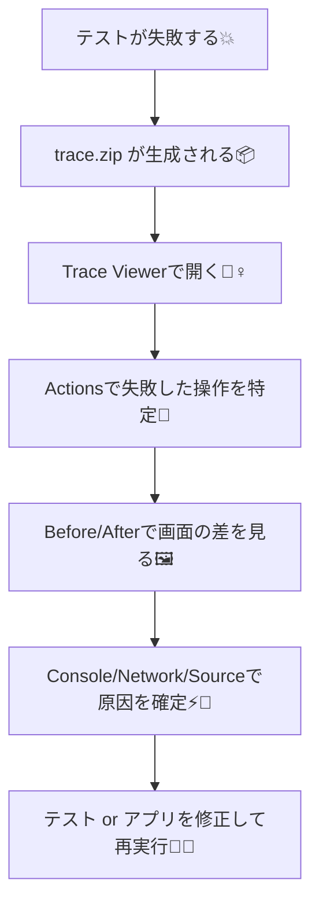

# 第236章：詳細なデバッグ (Trace Viewer)

この章は、「テストが落ちた瞬間」を**タイムトラベル**して原因を突き止める回だよ！🚀
Playwright の **Trace Viewer** を使えるようになると、デバッグ力が一気に上がる🥳

---

## 1) Trace Viewerってなに？🧳🕰️


Trace Viewerは、テスト実行中の記録（トレース）を見て、

* どの操作で失敗した？😵
* その瞬間、画面（DOM）はどうなってた？🖼️
* Console / Network はどうなってた？🌐⚡
* どの行のコードが原因？📌

…を **1ステップずつ再生**できるツールだよ！
「スクショだけじゃ分からん💦」って時の救世主✨ ([Playwright][1])

---

## 2) まずは「トレースを残す」設定をしよう📝🧪


Trace Viewerは「trace.zip」がないと見れないので、まずはトレースを出す設定をONにするよ！

### おすすめ：失敗したときだけ残す（軽い＆便利）✅

`playwright.config.ts` の `use` に `trace` を入れる：

```ts
import { defineConfig } from '@playwright/test';

export default defineConfig({
  use: {
    trace: 'retain-on-failure', // 失敗したテストだけ trace を残す✨
  },
});
```

`trace` にはいろいろモードがあるよ（代表だけ）👇 ([Playwright][1])

* `off`：取らない🙅‍♀️
* `on`：毎回取る（重い）🐘
* `on-first-retry`：**リトライ1回目だけ**取る（CI向き）🔁
* `retain-on-failure`：失敗時だけ残す（ローカル向き）💡

---

## 3) その場で1回だけ強制でトレースを出す（超便利）🎮✨

設定いじらずに、コマンドで強制できるよ！

```bash
npx playwright test --trace retain-on-failure
```

`--trace <mode>` で強制できて、`retain-on-first-failure` みたいなモードもあるよ🙆‍♀️ ([Playwright][2])

---

## 4) trace.zip の開き方（3つ）📂✨

### A. HTMLレポートから開く（いちばんラク）🧁

テスト後に：

```bash
npx playwright show-report
```

レポート上で **trace アイコン**を押すと、そのまま開けるよ！ ([Playwright][3])

---

### B. CLIで開く（王道）👑

trace.zip を直接開く：

```bash
npx playwright show-trace path\to\trace.zip
```

これで Trace Viewer が起動するよ！ ([Semaphore][4])

---

### C. VS Codeから開く（右クリック派に最高）🧡

公式拡張でPlaywrightを入れてるなら、VS Codeでテストも回せるよ（導入手順あり）([Playwright][5])
さらに trace.zip を VS Code 内で開く拡張もある！（右クリックで開ける） ([Visual Studio Marketplace][6])

---

## 5) Trace Viewerの見方（ここが大事！）🔍🧠


基本はこの流れだよ👇



### 見る場所（超ざっくり）👀

* **Actions（左）**：テストの操作が時系列で並ぶ（どこで落ちたか一発） ([Playwright][1])
* **Before / After（中央）**：その操作の前後の画面を見比べる（神）🖼️✨
* **右側のタブ**：Console / Network / Source / Errors など（その瞬間の情報）🧾⚡ ([Medium][7])

---

## 6) 失敗原因を見つける「黄金レシピ」🏆🍳


テスト落ちたら、この順で見ると早いよ💨

1. **Actionsで赤い失敗ポイント**を見る🔴
2. **そのActionをクリック**して、中央の **Before / After** を切り替え🖼️
3. 「あれ？要素なくない？」「別の画面じゃん？」を確認👀💦
4. 右側で

   * **Console**：エラー出てない？🧨
   * **Network**：API失敗してない？🚫🌐
5. **Source** で該当行にジャンプして、ロケータや待ち方を直す📌✨

---

## 7) ミニ演習：わざと失敗 → Traceでタイムトラベル🧪🕰️💥

### Step 1：失敗時だけトレースを残す（おすすめ）

```ts
// playwright.config.ts
import { defineConfig } from '@playwright/test';

export default defineConfig({
  use: { trace: 'retain-on-failure' },
});
```

### Step 2：わざと落ちるテストを書く😈

例：存在しないボタンを押しに行く（ありがち！）

```ts
import { test, expect } from '@playwright/test';

test('わざと失敗して Trace Viewer を体験する', async ({ page }) => {
  await page.goto('http://localhost:5173/');

  // 存在しないボタンをクリック（例）
  await page.getByRole('button', { name: '削除する' }).click();

  // ここには来ない想定
  await expect(page.getByText('削除しました')).toBeVisible();
});
```

### Step 3：実行して、trace を開く🎬

```bash
npx playwright test
npx playwright show-report
```

レポートで trace を開いたら…

* **どのActionでタイムアウト/失敗したか**
* **Beforeの画面に“削除する”が存在してるか**
* **そもそも別画面にいる/表示条件が違う**

…が見えるはず！👀✨

---

## 8) よくあるハマりどころ集（先に潰す）🧯😵‍💫

### 「trace が出ないんだけど！？」問題🔥

* `trace: 'on-first-retry'` なのに **retriesが0** だと、そもそもリトライが起きない → trace出ない💦
  （デフォルト設定例でも “on-first-retry + CIではretriesあり” になってる）([Playwright][3])
* `retain-on-failure` は **成功したテストのトレースは消える**（仕様）🫠 ([Playwright][1])

### 「trace.zip どこ？」問題📦

基本は `test-results` 配下にできることが多いよ（プロジェクト設定による）
迷ったら、HTMLレポートから開くのが一番早い🧁 ([Playwright][3])

---

## まとめ🎀✨

Trace Viewerは「失敗した瞬間」を丸ごと再生できる最強デバッグ道具！🕵️‍♀️💖
困ったら、

* **Actionsで失敗箇所 → Before/After → Console/Network → Source**

この順で見れば、かなりの確率で原因にたどり着けるよ！🚀

次の章（第237章）は **レスポンシブ対応のテスト📱💻**！
「スマホで崩れてない？」を自動で見張れるようになるよ〜😊✨

[1]: https://playwright.dev/docs/trace-viewer?utm_source=chatgpt.com "Trace viewer"
[2]: https://playwright.dev/docs/test-cli?utm_source=chatgpt.com "Command line"
[3]: https://playwright.dev/docs/trace-viewer-intro?utm_source=chatgpt.com "Trace viewer"
[4]: https://semaphore.io/blog/flaky-tests-playwright?utm_source=chatgpt.com "How to Avoid Flaky Tests in Playwright - Semaphore CI"
[5]: https://playwright.dev/docs/getting-started-vscode?utm_source=chatgpt.com "Getting started - VS Code"
[6]: https://marketplace.visualstudio.com/items?itemName=ryanrosello-og.playwright-vscode-trace-viewer&utm_source=chatgpt.com "Playwright Trace Viewer for VSCode"
[7]: https://medium.com/%40benadinbenny/the-complete-guide-to-debugging-in-playwright-e48f860dc1d7?utm_source=chatgpt.com "The Complete Guide to Debugging in Playwright"
