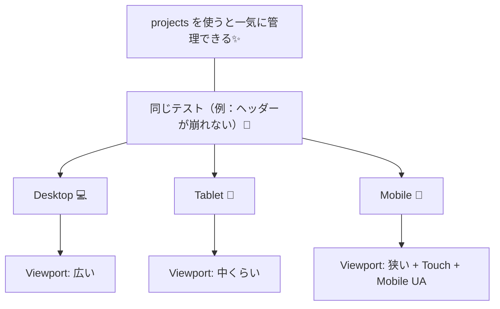

# 第237章：レスポンシブ対応のテスト

この章では、Playwright で **「画面サイズが変わってもUIが崩れないか？」** を自動テストします！
スマホ表示って、地味に事故りやすいんだよね…🥺💦（ボタン押せない、メニュー消える、文字はみ出る、など）

---

## 今日できるようになること ✅🎯

* **PC / タブレット / スマホ** の表示を自動で切り替えてテストする📐✨
* 画面幅によって **「出るはず / 消えるはず」** のUIを検証する👀✅
* 必要なら **スクショ比較（ビジュアルテスト）** で崩れを検出する🖼️🧪

---

## ざっくり全体像（同じテストを、複数画面サイズで回す）🔁📱💻




Playwright には **projects**（同じテストを違う設定で走らせる仕組み）があるので、これを使うのが王道です💡 ([Playwright][1])
さらに **devices（iPhone 13 などのデバイス設定）** も標準で用意されてます📱✨ ([Playwright][2])

---

## ステップ1：Playwright の projects で「画面サイズ別」を作る 🧩🛠️

`playwright.config.ts` に **Desktop / Tablet / Mobile** を定義します💪✨
（すでに config があるなら、`projects:` だけ足してOK！）

```ts
// playwright.config.ts
import { defineConfig, devices } from '@playwright/test';

export default defineConfig({
  testDir: './tests',
  use: {
    // あなたのVite開発サーバーに合わせてね（例）
    baseURL: 'http://localhost:5173',
    trace: 'on-first-retry',
  },

  projects: [
    {
      name: 'Desktop Chrome 💻',
      use: {
        ...devices['Desktop Chrome'],
      },
    },
    {
      name: 'Tablet 🧸 (iPad)',
      use: {
        ...devices['iPad (gen 7)'],
      },
    },
    {
      name: 'Mobile 📱 (iPhone 13)',
      use: {
        ...devices['iPhone 13'],
      },
    },
  ],
});
```

* `projects` は「同じテストを、別設定で実行」できる仕組みだよ〜！ ([Playwright][1])
* `devices['iPhone 13']` みたいにすると、**viewport / userAgent / touch などをまとめて再現**してくれます✨ ([Playwright][2])

---

## ステップ2：レスポンシブで「変わるポイント」を決める 🧠📌

レスポンシブテストは、全部を完璧にやろうとすると沼です😵‍💫💦
なのでまずは **事故りやすいところだけ** テストします👍✨


おすすめチェック項目（あるある）👇

* ヘッダーが **二段になってない？** 🧱💥
* ナビがスマホで **ハンバーガーに切り替わる？** 🍔
* ボタンが **画面外に飛んでない？** 🏃‍♀️💨
* 入力欄が **細すぎて入力できない** とかない？ ✍️😢

---

## ステップ3：実践テスト例（ハンバーガーメニュー）🍔📱✅

ここでは例として、

* Desktop：ナビ（リンク一覧）が見える、ハンバーガーは見えない
* Mobile：ハンバーガーが見える、ナビ（リンク一覧）は閉じてる
* Mobile：ハンバーガー押したらメニュー出る

みたいなテストを書きます✍️✨

> ※あなたのアプリの実装に合わせて、ロケーター（`getByRole`とか）を調整してね🙏
> 第234章の `getByRole` ベースで書くと強いよ💪

```ts
// tests/responsive.spec.ts
import { test, expect } from '@playwright/test';

test.describe('レスポンシブ：ヘッダー/ナビの崩れチェック 🍔📱', () => {
  test('Desktopではナビが見えて、ハンバーガーが隠れる 💻', async ({ page }) => {
    await page.goto('/');

    // 例：ナビゲーション領域（実装に合わせて調整してね）
    const nav = page.getByRole('navigation');
    await expect(nav).toBeVisible();

    // 例：ハンバーガーボタン（aria-label を付けるのがおすすめ！）
    const hamburger = page.getByRole('button', { name: /menu|メニュー|hamburger/i });
    await expect(hamburger).toBeHidden();
  });

  test('Mobileではハンバーガーが見えて、ナビは閉じてる 📱', async ({ page }) => {
    await page.goto('/');

    const hamburger = page.getByRole('button', { name: /menu|メニュー|hamburger/i });
    await expect(hamburger).toBeVisible();

    const nav = page.getByRole('navigation');
    // 「スマホではナビは最初隠れる」想定
    await expect(nav).toBeHidden();
  });

  test('Mobile：ハンバーガーを押すとメニューが開く 📱➡️✨', async ({ page }) => {
    await page.goto('/');

    const hamburger = page.getByRole('button', { name: /menu|メニュー|hamburger/i });
    await hamburger.click();

    const nav = page.getByRole('navigation');
    await expect(nav).toBeVisible();
  });
});
```

### コツ🎀

* 「スマホ時だけ出るUI」は **Visible/Hidden** をちゃんと検証すると強い💪✨
* `aria-label`（例：`aria-label="menu"`）を付けておくと、テストが超安定します😊

---

## ステップ4：ビジュアル（スクショ）で「崩れ」を丸ごと検出 🖼️🧪✨

「表示はあるけど、崩れてる」みたいな事故は、DOMテストだけだと見逃すことがあります😇💦
そこで **スクショ比較**（Visual Regression）を混ぜると一気に安心度UP✨


Playwright は `toHaveScreenshot()` が使えます📸
そして **アニメーションはスクショの敵**なので、無効化が大事！（`animations: "disabled"`） ([Playwright][3])

```ts
// tests/visual-responsive.spec.ts
import { test, expect } from '@playwright/test';

test('トップページ：見た目が崩れてない（スクショ）📸✨', async ({ page }) => {
  await page.goto('/');

  // fullPage で全体を撮る（必要に応じて）
  await expect(page).toHaveScreenshot('home.png', {
    fullPage: true,
    animations: 'disabled',
  });
});
```

> 初回実行時は「正解画像（スナップショット）」を作る必要があるよ📸
> 以降は差分が出たらテストが落ちて「崩れた！」って気づける感じ✨

---

## ステップ5：実行コマンド（Windows / PowerShell想定）🪟⌨️

### 全プロジェクト（Desktop/Tablet/Mobile）をまとめて実行🔁

```bash
npx playwright test
```

### Mobileだけ走らせたい📱

```bash
npx playwright test --project="Mobile 📱 (iPhone 13)"
```

### コード生成で「スマホ操作」を録画しながら作る🎥✨

```bash
npx playwright codegen --device="iPhone 13" http://localhost:5173
```

`--device` を付けると、そのデバイス設定で録画できます📱✨ ([Playwright][4])

---

## よくあるハマりどころ（先に潰す）🧯😵‍💫

### 1) 「スマホにしたのに、PCっぽい表示」🤔

* ただ viewport を狭くするだけだと、サイトによっては挙動が違うことも
* `devices['iPhone 13']` みたいな **デバイスエミュレーション**が安定です📱✨ ([Playwright][2])

### 2) スクショが不安定（毎回ちょっと違う）📸💥

* アニメーション無効化（`animations: 'disabled'`）が効く！ ([Playwright][3])
* 日付やランダム要素があるなら、そこだけ隠す（mask）や固定化が必要になりがち😇

### 3) 「要素が見えてる/見えてない」判定がブレる👀

* `getByRole` を使って、意味的に取りにいくと安定しやすい✨
* どうしてもなら `data-testid` を付けるのも全然アリ👍

---

## まとめ（この章のゴール）🎉✨

* **projects** で Desktop/Tablet/Mobile を作って、同じテストを回す🔁 ([Playwright][1])
* スマホで変わるUI（例：🍔メニュー）を **Visible/Hidden** で検証する📱✅
* 仕上げに **スクショ比較** を足すと「崩れ」を丸ごと検出できて強い🖼️🧪 ([Playwright][3])

---

次の第238章（認証が必要なページのテスト）に行く前に、もしよければ😊
あなたのアプリの「レスポンシブで変化する場所」（ヘッダー/サイドバー/カード一覧など）を1つ決めて、上の🍔テストを実データに合わせて“ピッタリ版”に整えるところまで一緒にやれるよ✨

[1]: https://playwright.dev/docs/test-projects?utm_source=chatgpt.com "Projects"
[2]: https://playwright.dev/docs/emulation?utm_source=chatgpt.com "Emulation"
[3]: https://playwright.dev/docs/api/class-pageassertions?utm_source=chatgpt.com "PageAssertions"
[4]: https://playwright.dev/docs/codegen?utm_source=chatgpt.com "Test generator"
