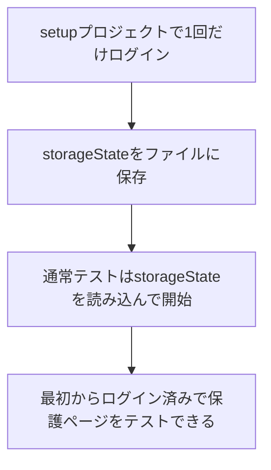

# 第238章：認証が必要なページのテスト

「ログインしてないと入れないページ（マイページ、管理画面など）」って、E2Eテストで一番つまずきやすいところなんだよね…！😵‍💫
理由はカンタンで、Playwrightは**基本、テストごとに“まっさらなブラウザ状態”**で動くから、毎回ログインが必要になりがち💦（そのままだと遅いし不安定）

そこで今日は、Playwrightのおすすめ手法👇でいきます✨
**最初に1回だけログイン → 認証状態を保存 → 以降のテストはログイン済みから開始** 🚀
これは公式でも「setup project + storageState」の形が推奨です。([Playwright][1])

---

## 今日のゴール 🎯

* ✅ 未ログインで保護ページに行くと **ログイン画面に飛ばされる**（または403）をテストできる
* ✅ ログイン済みだと **保護ページが見える** をテストできる
* ✅ 毎回ログインしないので **速い＆安定** 😌✨

---

## 全体像（こう動くよ）🗺️




※ 認証状態ファイルには“なりすまし可能な情報”が入ることがあるので、**Gitに入れない**のが超重要だよ⚠️([Playwright][1])

---

## 1) 認証状態を保存するフォルダを作る 📁✨


プロジェクト直下に `playwright/.auth` を作って、`.gitignore` に入れます。

### PowerShell（Windows）例

```powershell
New-Item -ItemType Directory -Force -Path playwright\.auth
Add-Content .gitignore "`nplaywright/.auth"
```

Playwright公式もこの `.auth` ディレクトリ運用を勧めています。([Playwright][1])

---

## 2) 1回だけログインして保存する「setupテスト」を作る 🔑🧡


`tests/auth.setup.ts` を作ります（ファイル名は `*.setup.ts` ならOK）✨

> ✅ ここでやること：ログイン画面に行く → 入力 → ログイン成功 → storageState保存

```ts
// tests/auth.setup.ts
import { test as setup, expect } from "@playwright/test";
import path from "node:path";

const authFile = path.join(__dirname, "../playwright/.auth/user.json");

setup("authenticate", async ({ page }) => {
  // 1) ログインページへ
  await page.goto("/login");

  // 2) 入力（ラベル名はあなたの画面に合わせてね）
  await page.getByLabel("メールアドレス").fill(process.env.E2E_EMAIL ?? "");
  await page.getByLabel("パスワード").fill(process.env.E2E_PASSWORD ?? "");

  // 3) ログインボタン
  await page.getByRole("button", { name: "ログイン" }).click();

  // 4) 「ログイン成功」を確認（URLでも要素でもOK！）
  await expect(page).toHaveURL(/\/mypage/);

  // 5) 認証状態を保存（cookiesやstorageなどが入るよ）
  await page.context().storageState({ path: authFile });
});
```

* `storageState` をファイルに保存して、それを使い回すのが定番です。([Playwright][1])
* ログインはリダイレクトが絡むことがあるので、**最終URLや要素が出るまで待つ**のがコツだよ😉([Playwright][1])

---

## 3) `playwright.config.ts` で「setup → 本番テスト」の順にする ⚙️🧩


ポイントはこれ👇

* `setup` というプロジェクトを作る
* 通常のプロジェクト（chromium等）に `dependencies: ['setup']` を付ける
* 通常プロジェクト側で `storageState` を読み込む

```ts
// playwright.config.ts
import { defineConfig, devices } from "@playwright/test";
import path from "node:path";
import "dotenv/config";

const authFile = path.join(__dirname, "playwright/.auth/user.json");

export default defineConfig({
  testDir: "./tests",
  use: {
    baseURL: "http://localhost:5173",
    trace: "on-first-retry",
  },
  projects: [
    // 1) まず認証を作る
    { name: "setup", testMatch: /.*\.setup\.ts/ },

    // 2) 通常テスト（ログイン済みで開始）
    {
      name: "chromium",
      use: { ...devices["Desktop Chrome"], storageState: authFile },
      dependencies: ["setup"],
    },
  ],
});
```

この「project dependencies（依存プロジェクト）」方式は、Playwright公式でも**おすすめ**になってます（レポートやトレースとも相性いい！）。([Playwright][2])

---

## 4) テストを書く ✍️🧪

### A. 未ログインだと追い返されるテスト（超大事）🚪🙅‍♀️


これは「storageStateなし」でやりたいので、テスト内で一時的に無効化します👇

```ts
// tests/protected.unauth.spec.ts
import { test, expect } from "@playwright/test";

test.describe("未ログイン", () => {
  test.use({ storageState: { cookies: [], origins: [] } });

  test("保護ページに行くとログイン画面にリダイレクトされる", async ({ page }) => {
    await page.goto("/mypage");

    // 例：/login に飛ばされる想定
    await expect(page).toHaveURL(/\/login/);

    // 例：ログイン画面の見出しが見える
    await expect(page.getByRole("heading", { name: "ログイン" })).toBeVisible();
  });
});
```

### B. ログイン済みなら保護ページが見えるテスト 🥳🎉

通常は config で `storageState` が効くので、そのまま書けばOK！

```ts
// tests/protected.auth.spec.ts
import { test, expect } from "@playwright/test";

test("ログイン済みだと保護ページが表示される", async ({ page }) => {
  await page.goto("/mypage");

  await expect(page.getByRole("heading", { name: "マイページ" })).toBeVisible();
  await expect(page.getByText("ようこそ")).toBeVisible(); // ここは好きな要素でOK
});
```

---

## 5) 実行手順（Windows想定）▶️🪟

1. まずReactアプリを起動（別ターミナル）

```bash
npm run dev
```

2. そのままE2E実行

```bash
npx playwright test
```

---

## 認証情報はどうする？🤫（おすすめ）

テスト用のアカウント（例：`E2E_EMAIL` / `E2E_PASSWORD`）を環境変数で渡すのがラクだよ✨
`dotenv` を使って `process.env` から読むのもよくある形！（さっきの config で `import "dotenv/config";` してるやつ）

> 認証状態ファイルは機密になりやすいので、リポジトリに入れないでね⚠️([Playwright][1])

---

## あるある詰まりポイント 🧯😵‍💫

* **ログイン成功なのに、次のテストでまたログイン画面になる**

  * ログイン後、Cookieが確実に入る前に保存してるかも → **最終URL到達** or **ログイン後にしか見えない要素**を `expect(...).toBeVisible()` で待つのがコツ！([Playwright][1])

* **UI Modeだとsetupが走らない**

  * UI Modeはデフォでsetupを外すことがあるので、必要ならsetupプロジェクトを有効化して実行する感じになるよ🧩([Playwright][1])

* **同じアカウントを並列で使ってテストがケンカする**

  * 設定変更みたいに“サーバー側状態”をいじるテストが多いなら、アカウントを分ける戦略も公式にあります（次のレベル！）([Playwright][1])

---

## ミニ課題（やってみよ）📚✨

1. `/mypage` だけじゃなく、`/settings` みたいな別の保護ページでも同じテストを書く 🛡️
2. 未ログイン時の挙動を「URL」じゃなくて「画面の文言（例：ログインしてください）」でも検証する 💬
3. ログイン済みテストで、ヘッダーの「ログアウト」ボタンが表示されることも確認する 🚪✨

---

次の章（第239章）で、これを **GitHub Actions で自動実行**して「毎回ちゃんと守れてる」状態にしていくよ〜！🤖🔁

[1]: https://playwright.dev/docs/auth "Authentication | Playwright"
[2]: https://playwright.dev/docs/test-global-setup-teardown "Global setup and teardown | Playwright"
