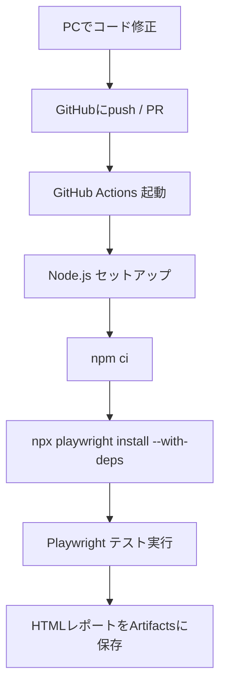

# 第239章：CI/CDでの自動実行

「pushしたら勝手にE2Eが走って、落ちたらすぐ気づける」状態を作るよ〜！✨
今回は **GitHub Actions** で **Playwright** を自動実行して、**HTMLレポートも保存**できるようにします🧁💕

---

## まずは全体図をイメージしよ〜🗺️✨




Playwright公式も、CIはだいたいこの流れでOKって言ってるよ〜✨ ([Playwright][1])

---

## 1) まずローカルで動く状態にしておく🎮✅

最低限、これが通ればOK：

```bash
npx playwright test
```

Playwrightの基本コマンドはこの形だよ〜🧸 ([Playwright][2])

ついでに `package.json` に “CI用の呼び出し口” を作っておくと超ラク💡

```json
{
  "scripts": {
    "test:e2e": "playwright test",
    "test:e2e:ui": "playwright test --ui",
    "test:e2e:report": "playwright show-report"
  }
}
```

---

## 2) CI向けに Playwright をちょい調整🧷✨

CIはマシンが毎回違うから、**安定性重視**が大事〜！
Playwright公式も CIでは `workers: 1` をおすすめしてるよ🫶 ([Playwright][1])

`playwright.config.ts` にこんな感じで入れるのが定番💡

```ts
import { defineConfig } from "@playwright/test";

export default defineConfig({
  // CIは安定優先：並列を切る（おすすめ）
  workers: process.env.CI ? 1 : undefined,

  // CIだけちょいリトライ（ flaky 対策）
  retries: process.env.CI ? 2 : 0,

  // 失敗時の調査がラクになるやつ
  use: {
    trace: "on-first-retry", // 1回目失敗したらトレース残す
  },

  // HTMLレポート出す（Artifactsに置く用）
  reporter: [["html", { open: "never" }]],
});
```

---

## 3) GitHub Actions のワークフローを作る🧁⚙️

### ✅ 作るファイル

```text
.github/workflows/playwright.yml
```

### ✅ 中身（コピペOK！）

Playwright公式の例（push/PRで実行＋レポート保存）をベースに、**npmキャッシュもON**にした版だよ〜✨ ([Playwright][1])

```yaml
name: Playwright E2E

on:
  push:
    branches: [ main, master ]
  pull_request:
    branches: [ main, master ]

jobs:
  test:
    timeout-minutes: 60
    runs-on: ubuntu-latest

    steps:
      - name: Checkout
        uses: actions/checkout@v5

      - name: Setup Node
        uses: actions/setup-node@v6
        with:
          node-version: 22
          cache: "npm"

      - name: Install dependencies
        run: npm ci

      - name: Install Playwright browsers
        run: npx playwright install --with-deps

      - name: Run Playwright tests
        run: npm run test:e2e

      # テスト失敗してもレポートは欲しいので always() 💖
      - name: Upload Playwright report
        uses: actions/upload-artifact@v5
        if: ${{ always() }}
        with:
          name: playwright-report
          path: playwright-report/
          retention-days: 30
```

ポイント🌟

* `npm ci` と `npx playwright install --with-deps` はPlaywright公式の鉄板手順だよ〜 ([Playwright][1])
* Nodeは **20/22/24系がOK**（Playwright公式の要件） ([Playwright][2])
* `actions/setup-node` は `cache: "npm"` が使えるよ〜（依存解決が速くなる✨） ([GitHub][3])

---

## 4) 実行できたか確認する👀✅

1. GitHubのリポジトリを開く
2. 上のタブの **Actions** を押す
3. 走ってるワークフローを開く
4. 成功/失敗、ログが見える！✨

Playwright公式も「Actionsタブで確認できるよ」って流れを案内してるよ〜 ([Playwright][4])

---

## 5) HTMLレポートを見る📦🖥️✨

Actionsの実行画面の下の方に **Artifacts** が出るので、`playwright-report` をDLして展開！

展開したフォルダでこれ👇

```bash
npx playwright show-report playwright-report
```

このコマンドでHTMLレポートを開けるよ〜！ ([Playwright][2])

---

## 6) ありがちハマりポイント集🧯🥺

* **`npm ci` が失敗する**
  → `package-lock.json` をコミットしてない可能性大！`npm ci` 前提だよ〜 ([Playwright][1])

* **CIだけテストが不安定（flaky）**
  → `workers: 1` + `retries` + `trace` が効く！CIは安定優先が正義💪 ([Playwright][1])

* **ブラウザ起動に必要な依存が足りない**
  → `npx playwright install --with-deps` を忘れてない？これが必須〜！ ([Playwright][1])

---

## ミニ課題🎀（できたら強い！）

* ✅ `main` だけじゃなく、`develop` ブランチでも回してみよ〜
* ✅ `node-version` を 20/22/24 のマトリクスにして動作保証を強くしてみよ〜（余裕があれば） ([GitHub][3])

---

次の第240章で「TODOアプリ全機能のE2E」を回すと、いよいよ **“壊してもCIが守ってくれる”** 体験ができるよ🥳🛡️✨

[1]: https://playwright.dev/docs/ci "Continuous Integration | Playwright"
[2]: https://playwright.dev/docs/intro "Installation | Playwright"
[3]: https://github.com/actions/setup-node "GitHub - actions/setup-node: Set up your GitHub Actions workflow with a specific version of node.js"
[4]: https://playwright.dev/docs/ci-intro "Setting up CI | Playwright"
