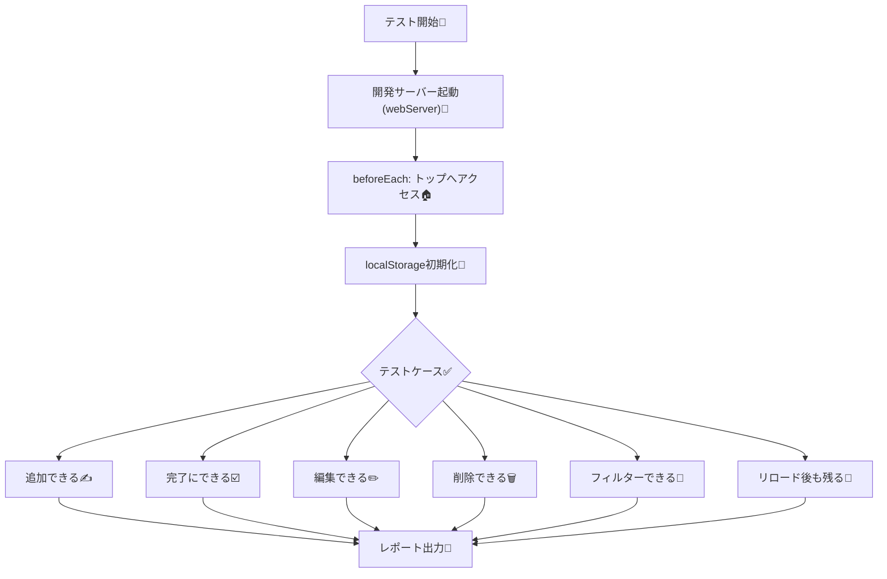
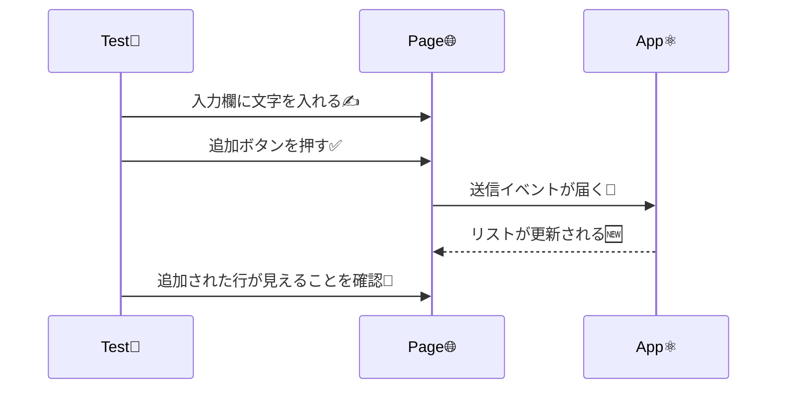

# 第240章：練習：TODOアプリの全機能動作テスト

今日は「TODOアプリが壊れてないこと」を **自動で証明する** 日だよ〜！✨
追加・完了切り替え・編集・削除・フィルター・永続化（リロードしても残る）まで、ぜんぶE2Eで守る💪😊

---

### 🎯 この章のゴール

* TODOアプリの主要機能を **E2Eテストで一通りカバー**できる
* テストが **壊れにくい書き方（getByRole中心）**で書ける
* **毎回同じ状態から**テストを始められる（localStorageをクリアなど）🧼

---

### 🗺️ 今日の作戦（全体像）🧭




---

## 1) Playwright をプロジェクトに入れる（まだなら）📦

プロジェクトのルートでこれ👇（既に入ってたらスキップOK）

```bash
npm init playwright@latest
```

* TypeScript を選ぶ
* tests フォルダ名は好み（例：`e2e`）
* ブラウザのインストールは Yes 推奨

※この初期化コマンドは公式に案内されてるよ 📘 ([Playwright][1])

---

## 2) Vite を起動してからテスト…を自動化する（webServer）🚀


ローカルで毎回「npm run dev」してからテスト…は忘れがち😇
Playwrightに **起動も任せちゃう** のが楽！

### ✅ playwright.config.ts（例）

Viteが必ず同じポートで立つようにして、Playwrightが待ってくれる形にするよ😊
（URLやコマンドは自分のプロジェクトに合わせてね）

```ts
import { defineConfig, devices } from '@playwright/test';

export default defineConfig({
  testDir: 'e2e',
  use: {
    baseURL: 'http://127.0.0.1:5173',
    trace: 'on-first-retry',
  },

  webServer: {
    command: 'npm run dev -- --port 5173',
    url: 'http://127.0.0.1:5173',
    reuseExistingServer: !process.env.CI,
  },

  projects: [
    { name: 'chromium', use: { ...devices['Desktop Chrome'] } },
  ],
});
```

`reuseExistingServer` の挙動（ローカルは使い回す / CIは起動する）は公式説明があるよ🔧 ([Playwright][2])

---

## 3) テストが安定する「UIの前提」を作る（超重要）🧷


E2Eは **要素をどう見つけるか** が命！
おすすめは **getByRole**（ユーザー視点で探す）✨ ([Playwright][3])

### ✅ TODOアプリ側で用意したいもの（理想）

* 入力欄：`role="textbox"` で、ラベル（表示テキスト or aria-label）がある
* 追加ボタン：`role="button"` で「追加」など名前がある
* 各TODO行に：

  * チェック：`role="checkbox"`（ラベルはTODO本文に紐づくと最高）
  * 編集ボタン：`編集`
  * 削除ボタン：`削除`
* フィルター：`すべて / 未完了 / 完了` ボタン（またはタブ）

「名前（ラベル）」が無いと getByRole が迷子になりがち🥺
ここを整えるとテストが一気に強くなるよ💖

---

## 4) “全機能まとめて守る” E2Eテストを書く 🧪✨

### 📄 e2e/todo.e2e.spec.ts（例）


※ボタン名やラベル名は、あなたのTODOアプリの文言に合わせて調整してね😊

```ts
import { test, expect } from '@playwright/test';

test.describe('TODOアプリ：全機能E2E ✅', () => {
  test.beforeEach(async ({ page }) => {
    // いつも同じ状態からスタート🧼
    await page.goto('/');
    await page.evaluate(() => localStorage.clear());
    await page.reload();
  });

  async function addTodo(page: any, text: string) {
    // 入力欄（ラベルが「TODO」や「やること」想定）
    const input = page.getByRole('textbox', { name: /todo|やること|入力/i });
    await input.fill(text);

    // 追加ボタン（「追加」「Add」想定）
    await page.getByRole('button', { name: /追加|add/i }).click();
  }

  test('追加できる ✍️', async ({ page }) => {
    await addTodo(page, '牛乳を買う');

    const item = page.getByRole('listitem').filter({ hasText: '牛乳を買う' });
    await expect(item).toBeVisible();
  });

  test('完了/未完了を切り替えできる ☑️', async ({ page }) => {
    await addTodo(page, '課題を出す');

    const row = page.getByRole('listitem').filter({ hasText: '課題を出す' });
    const checkbox = row.getByRole('checkbox');

    await expect(checkbox).not.toBeChecked();
    await checkbox.check();
    await expect(checkbox).toBeChecked();

    // もしUIで取り消しできるなら
    await checkbox.uncheck();
    await expect(checkbox).not.toBeChecked();
  });

  test('編集できる ✏️', async ({ page }) => {
    await addTodo(page, 'レポート書く');

    const row = page.getByRole('listitem').filter({ hasText: 'レポート書く' });
    await row.getByRole('button', { name: /編集|edit/i }).click();

    // 編集用の入力欄が出る想定（名前は実装に合わせて）
    const editBox = page.getByRole('textbox', { name: /編集|edit/i });
    await editBox.fill('レポート書いて提出する');
    await page.getByRole('button', { name: /保存|save|ok/i }).click();

    await expect(page.getByRole('listitem').filter({ hasText: 'レポート書いて提出する' })).toBeVisible();
  });

  test('削除できる 🗑️', async ({ page }) => {
    await addTodo(page, 'プリント整理');

    const row = page.getByRole('listitem').filter({ hasText: 'プリント整理' });
    await row.getByRole('button', { name: /削除|delete/i }).click();

    await expect(page.getByRole('listitem').filter({ hasText: 'プリント整理' })).toHaveCount(0);
  });

  test('フィルターできる 🔎（すべて/未完了/完了）', async ({ page }) => {
    await addTodo(page, 'A');
    await addTodo(page, 'B');
    await addTodo(page, 'C');

    // Bだけ完了にする
    const rowB = page.getByRole('listitem').filter({ hasText: 'B' });
    await rowB.getByRole('checkbox').check();

    // 未完了だけ表示
    await page.getByRole('button', { name: /未完了|active/i }).click();
    await expect(page.getByRole('listitem').filter({ hasText: 'A' })).toBeVisible();
    await expect(page.getByRole('listitem').filter({ hasText: 'C' })).toBeVisible();
    await expect(page.getByRole('listitem').filter({ hasText: 'B' })).toHaveCount(0);

    // 完了だけ表示
    await page.getByRole('button', { name: /完了|completed/i }).click();
    await expect(page.getByRole('listitem').filter({ hasText: 'B' })).toBeVisible();
    await expect(page.getByRole('listitem').filter({ hasText: 'A' })).toHaveCount(0);

    // すべて表示
    await page.getByRole('button', { name: /すべて|all/i }).click();
    await expect(page.getByRole('listitem').filter({ hasText: 'A' })).toBeVisible();
    await expect(page.getByRole('listitem').filter({ hasText: 'B' })).toBeVisible();
    await expect(page.getByRole('listitem').filter({ hasText: 'C' })).toBeVisible();
  });

  test('リロード後も残る 🔁（永続化）', async ({ page }) => {
    await addTodo(page, '保存されててほしい');

    await page.reload();

    const item = page.getByRole('listitem').filter({ hasText: '保存されててほしい' });
    await expect(item).toBeVisible();
  });
});
```

#### ここで使ってるポイント💡

* `expect(...).toBeVisible()` みたいな **Web向けアサーション**は自動で待ってくれて安定するよ✅ ([Playwright][4])
* `getByRole` は “ユーザーがどう見えるか” に寄せられて壊れにくい✨ ([Playwright][3])

---

## 5) 実行コマンド 🏃‍♀️💨

```bash
npx playwright test
```

HTMLレポート見たいなら（設定によるけど）だいたいこれ👇

```bash
npx playwright show-report
```

---

## 6) 失敗したときの鉄板ムーブ 🧯😇

* どのステップで落ちたか：エラーの直前行を見る👀
* ロケーターが見つからない系：

  * ボタンや入力欄に **ラベルが付いてるか**確認（ここが最多トラブル😭）
* たまに落ちる（フレーク）系：

  * `waitForTimeout` を入れる前に、`expect(...).toBeVisible()` など “待つ系expect” を増やす
  * Playwrightは操作前に色々チェックして自動待機してくれる仕組みがあるよ🧠 ([Playwright][5])

---

## おまけ：追加が成功する流れ（イメージ）🍀




---

### ✅ 今日のチェックリスト（できたら勝ち！）🏅

* [ ] 追加 / 完了切替 / 編集 / 削除 のテストがある✨
* [ ] フィルター（すべて/未完了/完了）をテストしてる🔎
* [ ] beforeEach で状態初期化できてる🧼
* [ ] getByRole中心で、壊れにくい😊

---

必要なら、あなたのTODOアプリの **実際のUI文言（ボタン名・ラベル名）**に合わせて、上のテストを「完全一致版」に整えてあげるよ〜！🥰💖

[1]: https://playwright.dev/docs/intro?utm_source=chatgpt.com "Installation"
[2]: https://playwright.dev/docs/test-webserver?utm_source=chatgpt.com "Web server"
[3]: https://playwright.dev/docs/locators?utm_source=chatgpt.com "Locators"
[4]: https://playwright.dev/docs/test-assertions?utm_source=chatgpt.com "Assertions"
[5]: https://playwright.dev/docs/actionability?utm_source=chatgpt.com "Auto-waiting"
