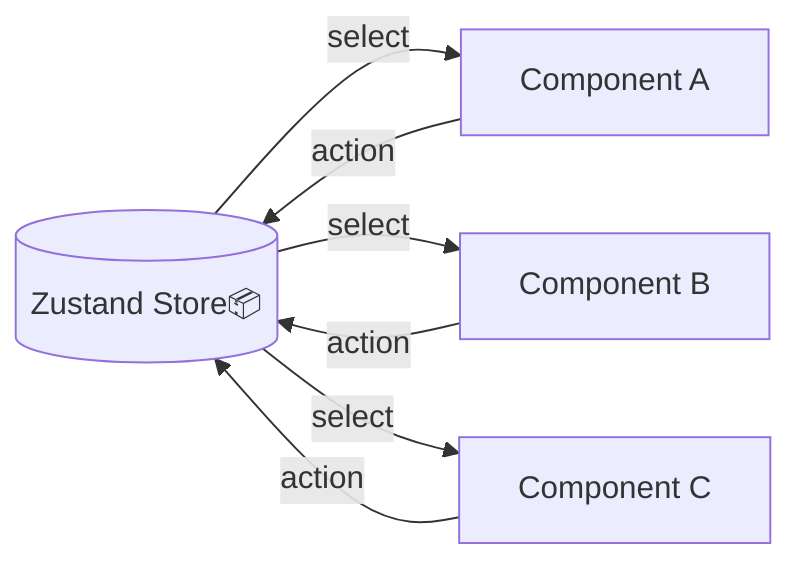
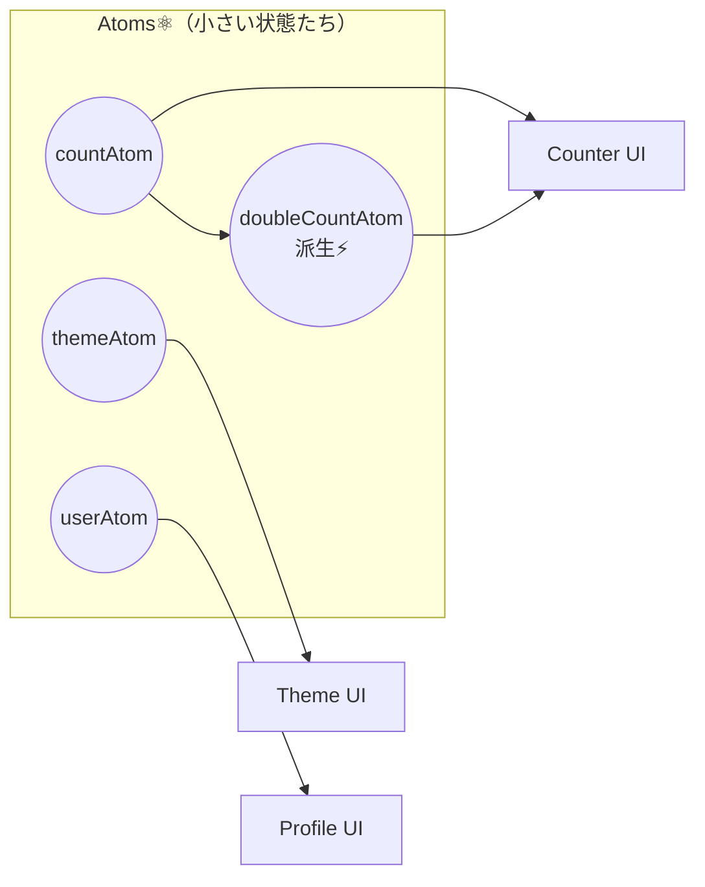

# 第241章：「アトミック」な状態管理とは？

この章では、**Jotaiのいちばん大事な発想＝「アトミック（原子みたいに小さい）」**って何？をつかみます😊✨
まだコードはガッツリ書かなくてOK！今日は**“脳内モデル”を作る回**です🧠💡

---

## 1) まず「状態管理」って何だったっけ？🤔

Reactの`useState`って、**コンポーネントの中にある変化する値**でしたよね。

でもアプリが大きくなると…

* いろんな画面で同じデータ使いたい😵‍💫
* 受け渡し（Props）が長くなる😵‍💫
* どこで更新してるか追えない😵‍💫

…みたいになって、「状態管理ライブラリ」が出番になります💪✨

---

## 2) Zustandは「ひとつの大きい箱」📦

Zustandはイメージとしては…

* **大きいストア（箱）が1個**あって
* その中に状態と更新関数（アクション）を入れる
* コンポーネントは箱から必要なものだけ取り出す

って感じでした😊

✅ いいところ：

* 仕組みがシンプルで速い⚡
* 「更新はここ！」ってまとまりやすい🧩

---

## 3) Jotaiは「小さいパーツの集合」⚛️

Jotaiの世界では、状態は**小さい“原子（atom）”**で表します。

* 状態を **細かい単位のatomに分ける**
* コンポーネントは **必要なatomだけ読む/書く**
* atom同士を組み合わせて、**派生（計算）もできる**✨

✅ ここがポイント：
**「ストアを先に設計する」より、必要な状態を“小さく作って足していく”**感じです🌱

---

## 4) 「アトミック」って結局なに？🌟（超ざっくり定義）

**アトミック状態管理 = 状態を “最小単位のパーツ” に分けて管理する考え方**です⚛️

イメージで言うと…

* Zustand：**冷蔵庫（大きい箱）**に全部入ってる🧊
* Jotai：**タッパー（小さい容器）**がいっぱいあって、必要なのだけ開ける🍱

どっちが良い悪いじゃなくて、**整理の仕方が違う**って感じです😊

---

## 5) ZustandとJotaiの「考え方」の違い🆚

### ✅ ① 設計の方向が逆っぽい

* Zustand：トップダウン（まずストアを作って、そこに入れていく）📦
* Jotai：ボトムアップ（必要なatomを作って、組み合わせていく）⚛️

### ✅ ② “依存関係”が自然に作れる

Jotaiは「atom → atom」みたいに、状態同士を組み合わせやすいです✨
（例：`doubleCountAtom` は `countAtom` から計算）

### ✅ ③ 更新の分離がキレイになりやすい

Jotaiは「読むatom」「書くatom（アクション用）」を分けやすくて、スッキリしがち🧼✨
（これは次の章以降で実感します！）

---

## 6) どっちを使うの？迷ったらこれ💡

ざっくり目安です😊

* **Zustandが気持ちいい時**

  * “アプリ全体の状態” をひとつにまとめたい📦
  * 状態とアクションをセットで管理したい🧩
  * 「ストアはここ！」って場所があると安心😌

* **Jotaiが気持ちいい時**

  * 状態を小さく分けて、必要なところだけ使いたい⚛️
  * 派生（計算）をきれいに作りたい✨
  * 機能単位でatomを増やしていきたい🌱

---

## 7) ミニ理解チェッククイズ📝✨

Q1. Jotaiの“atom”はどんなイメージ？
→ **小さく分けた状態のパーツ**⚛️

Q2. Zustandはどんなイメージ？
→ **大きいストア（箱）にまとめる**📦

Q3. Jotaiは設計がどっち寄り？
→ **ボトムアップ**🌱（必要なatomを足していく）

---

## 8) よくあるつまずき（先に予防）🩹

* 「atomが増えすぎて迷子になりそう😵」
  → 大丈夫！次の章以降で **フォルダ分けのコツ**が出てきます📁✨

* 「結局ストアと何が違うの？🤔」
  → **“1個の箱”にまとめるか、“小さい容器”に分けるか**の違いだと思えばOK🍱📦

---

## 次回予告 🎬✨（第242章）

次はついに **Jotaiの基本 `atom`** を触ります⚛️
「え、これだけ？」ってなるくらいシンプルなので安心してね😊💛
