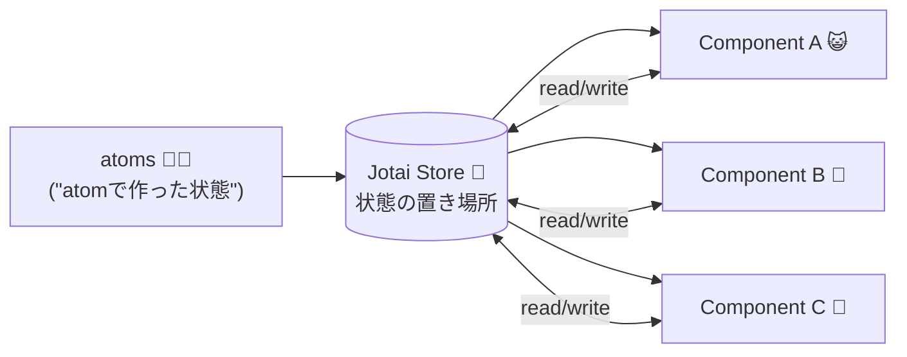

# 第242章：Jotai の基本 (`atom`)

この章では **Jotaiの心臓部**である `atom` を覚えます！
「atom = アプリの状態を入れる“最小単位の箱”」って感じです📦✨

---

## この章のゴール 🎯

* `atom` が何か説明できるようになる
* `atom` を **型付き(TypeScript)** で作れるようになる
* atomを置くファイル設計（置き場所）を決められるようになる

---

## まずは `atom` のイメージをつかもう 🧠✨

### ✅ `atom` ってなに？

* 状態（state）を入れる **小さな1粒**🍬
* 必要なコンポーネントが、その粒を“読んだり書いたり”する感じ

### ✅ Jotaiが嬉しいポイント

* 「でっかい状態の塊」を作らなくていい（必要な分だけ🍬🍬🍬）
* どのコンポーネントからでも同じatomを使える（Propsリレー減る🎁➡️🎁➡️🎁が減る）

---

## 図で見る：Jotaiの世界 🌍（Mermaid）




「atomは部品」→「Store（置き場）に並ぶ」→「必要な部品が使う」って流れです🏪✨

---

## 1) Jotai を入れよう（Windows / PowerShell）💻✨

プロジェクトのフォルダで👇

```bash
npm i jotai
```

---

## 2) `atom` を作ってみよう（最小の例）🍬

### 📁おすすめの置き場所

`src/atoms/` フォルダを作って、atomをまとめるのがスッキリします🧹✨

例：

* `src/atoms/counterAtom.ts`
* `src/atoms/userAtom.ts`

---

## 3) 数字のatom（カウンター用）を作る 🔢

`src/atoms/counterAtom.ts`

```ts
import { atom } from "jotai";

// 数字の状態を入れるatom（初期値は0）
export const countAtom = atom<number>(0);
```

### ポイント🌟

* `atom<number>(0)` で「このatomはnumberだよ！」って宣言できる👌
* 初期値は `0`

---

## 4) オブジェクトのatom（ユーザー情報）を作る 🧑‍🎓✨

`src/atoms/userAtom.ts`

```ts
import { atom } from "jotai";

export type User = {
  name: string;
  grade: number; // 学年イメージ（1〜4）
};

export const userAtom = atom<User>({
  name: "Sakura",
  grade: 2,
});
```

### ポイント🌟

* atomは **オブジェクトもOK** 🙆‍♀️
* `type User` を作っておくと管理が楽ちん💕

---

## 5) atomの「読み書き」は次章でやるけど…ちょい見せ👀✨

「atom作っただけだと動いてるか不安😵‍💫」ってなるので、超ミニで雰囲気だけ！

`src/App.tsx`

```tsx
import { useAtom } from "jotai";
import { countAtom } from "./atoms/counterAtom";

export default function App() {
  const [count, setCount] = useAtom(countAtom);

  return (
    <div style={{ padding: 24 }}>
      <h1>Jotai Counter ⚛️🍬</h1>
      <p>count: {count}</p>
      <button onClick={() => setCount((c) => c + 1)}>+1</button>
    </div>
  );
}
```

ここは「へぇ〜こうやって使うんだ〜😳」でOK！
**次の第243章で `useAtom` をちゃんとやります**📘✨

---

## `atom` の超重要ルール（ここ大事！）🧠🔥

### ✅ atomは「状態の定義」

* `atom(初期値)` で「状態の箱」を作る

### ✅ atomはどこに置く？

* コンポーネントの中にベタ書きしない方がいいことが多いです🙅‍♀️
  （再利用したいし、整理したいし、テストもしやすいし✨）

おすすめは：

* `src/atoms/` に集める（今回の形👍）

---

## よくあるつまずき 🌀😵

### ❌ `atom` を `default export` しちゃって迷子

atomは数が増えやすいので、基本は `export const xxxAtom` が分かりやすいです📦✨

### ❌ 「atom作ったのに画面変わらない！」

atomは作っただけだと表示には出ません😂
`useAtom` などで使って初めて動きます（次章でやるよ！）

---

## ミニ課題（やってみよ💪🥳）

### 🎯課題A

`src/atoms/themeAtom.ts` を作って、文字列のatomを作ろう！

* 初期値：`"light"`
* 型：`"light" | "dark"`

ヒント👇

```ts
import { atom } from "jotai";

export const themeAtom = atom<"light" | "dark">("light");
```

---

## まとめ ✨📌

* `atom` は **状態の最小単位**🍬
* `atom<T>(初期値)` で **型付きで作れる**✅
* atomは `src/atoms/` にまとめると気持ちいい🧹✨
* 次章で `useAtom` を使って「読み書き」を完全にマスターするよ〜！⚛️🔥
