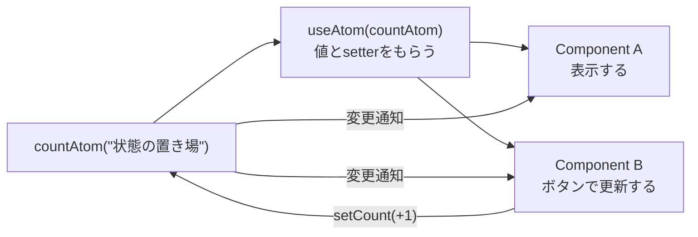

# 第243章：`useAtom` で読み書き

この章では、**Jotai の atom を `useAtom` で「読む＆更新する」**ところを、`useState`っぽく体に入れます💪😊
ゴールはこれ👇

* atom を作れる 🧩
* `useAtom(atom)` で **値と setter** を受け取れる 🎣
* 更新したら **関係あるコンポーネントだけ**が再描画される ⚡

---

## まずイメージ：`useState` とほぼ同じ！😳✨

* `useState`：コンポーネントの中だけの状態
* `useAtom`：**atom（状態の粒）**をみんなで共有できる状態

書き方はほぼ一緒👇

```tsx
const [count, setCount] = useAtom(countAtom)
```

---

## 図で理解：`useAtom` はこう動くよ🧠💡（Mermaid）




「atom を更新すると、それを使ってるコンポーネントだけが反応する」って感じです😊⚡

---

## 1) Jotai を入れる📦✨

プロジェクト（Vite + React + TS）で、ターミナルを開いて👇

```bash
npm i jotai
```

---

## 2) atom を作ろう（`src/atoms/counterAtom.ts`）🧩

フォルダを作って、atom を置くのがおすすめです📁✨

**`src/atoms/counterAtom.ts`**

```ts
import { atom } from "jotai"

// number のatom（初期値は 0）
export const countAtom = atom(0)
```

ポイント👇

* atom は **コンポーネントの外**に作るのが基本！🙅‍♀️（中で作ると毎回作り直しになりがち）

---

## 3) `useAtom` で読む＆更新する（分割してみる）🧸💕

今回は「表示」と「操作」を別コンポーネントにして、**共有できてる感**を体験します✨

### 3-1) 表示コンポーネント（`CounterDisplay.tsx`）👀

**`src/components/CounterDisplay.tsx`**

```tsx
import { useAtom } from "jotai"
import { countAtom } from "../atoms/counterAtom"

export function CounterDisplay() {
  const [count] = useAtom(countAtom) // 読むだけなら setter は要らないよ✨

  return (
    <p style={{ fontSize: 24 }}>
      いまのカウント：<b>{count}</b> 🎀
    </p>
  )
}
```

### 3-2) 操作コンポーネント（`CounterButtons.tsx`）🎮

**`src/components/CounterButtons.tsx`**

```tsx
import { useAtom } from "jotai"
import { countAtom } from "../atoms/counterAtom"

export function CounterButtons() {
  const [count, setCount] = useAtom(countAtom)

  return (
    <div style={{ display: "flex", gap: 12 }}>
      <button onClick={() => setCount(count + 1)}>+1 ✨</button>
      <button onClick={() => setCount(count - 1)}>-1 🌀</button>
      <button onClick={() => setCount(0)}>リセット 🧼</button>
    </div>
  )
}
```

---

## 4) `App.tsx` で合体！🌈

**`src/App.tsx`**

```tsx
import { CounterDisplay } from "./components/CounterDisplay"
import { CounterButtons } from "./components/CounterButtons"

export default function App() {
  return (
    <main style={{ padding: 24 }}>
      <h1>Jotai でカウンター 🧁</h1>
      <CounterDisplay />
      <CounterButtons />
    </main>
  )
}
```

起動👇

```bash
npm run dev
```

**表示とボタンが別コンポーネントなのに、同じ値が動いたら成功！🎉🥳**

---

## ここが超だいじ（ハマりやすい）🧯😵‍💫

### ✅ atom は「外」で作る

**OK**：`counterAtom.ts` に置く
**NG**：コンポーネントの中で `atom(0)` を毎回作る（別物になって共有できないことがある）💥

### ✅ `useAtom` は `useState` っぽいけど「共有」できる

同じ atom を使ってる限り、どこでも同じ状態を見れるよ👭✨

---

## ミニ練習🍓（5分でできる）

次のどっちかやってみてね😊

1. `+10` ボタンを追加してみよう 🔟✨
2. `count` が 0 未満にならないようにしてみよう（0で止める）🧱

ヒント👇

```tsx
setCount((prev) => Math.max(0, prev - 1))
```

---

## まとめ🎀

* `useAtom(atom)` は **`useState` そっくり**で覚えやすい😊
* atom を作って `export` すれば、**複数コンポーネントで同じ状態を共有**できる✨
* 「表示」と「操作」を分けてもちゃんと動くのが気持ちいいポイント🥰

次の第244章（派生アトム）に進むと、**「count から計算された値」**もキレイに作れるようになるよ〜🧠💎
