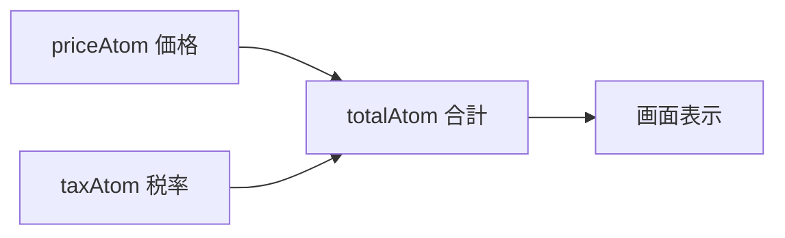

# 第244章：派生アトム (Derived Atoms)

今日は **「計算結果を State として持つ」**っていう、Jotaiのめちゃ気持ちいい考え方をやるよ〜🥳
ポイントはこれ👇

* **元データ（ベースアトム）**：本当に保存したい値（例：価格、税率、TODO配列）🧺
* **派生アトム**：元データから **計算して作る値**（例：合計金額、未完了数、進捗率）🧠✨

派生アトムは `atom((get) => ...)` で作れて、**依存してるアトムが変わると自動で再計算**されるよ💡 ([Jotai][1])

---

## 1) まずは超シンプル例：合計金額を“派生アトム”にする💰➕💰

### ✅ 作りたいもの

* `priceAtom`（価格）
* `taxAtom`（税率）
* `totalAtom`（合計：価格×(1+税率)）←これが派生アトム✨

---

## 2) 依存関係を図にするとこう🎨（Mermaid）




「totalAtom は priceAtom と taxAtom に依存してるよ〜」っていう関係が一目でわかるね👀✨

---

## 3) 実装してみよう（atoms を作る）🧩

`src/atoms/priceAtoms.ts` を作って、こう👇

```tsx
// src/atoms/priceAtoms.ts
import { atom } from "jotai";

export const priceAtom = atom(1200);   // 価格（円）
export const taxAtom = atom(0.1);      // 税率（10%）

// ✅ 派生アトム：getで他のatomを読んで計算するだけ！
export const totalAtom = atom((get) => {
  const price = get(priceAtom);
  const tax = get(taxAtom);
  return Math.round(price * (1 + tax));
});

// さらに派生アトムを重ねてもOK（派生の派生）✨
export const labelAtom = atom((get) => {
  const total = get(totalAtom);
  return `合計は ${total.toLocaleString()} 円です`;
});
```

派生アトムは **read関数（`(get) => ...`）** を渡すだけで作れるよ🙌 ([Jotai][1])

---

## 4) コンポーネントで使う（表示＆更新）🖥️✨

`src/App.tsx` をこうしてみてね👇

```tsx
// src/App.tsx
import { useAtom } from "jotai";
import { labelAtom, priceAtom, taxAtom, totalAtom } from "./atoms/priceAtoms";

export default function App() {
  const [price, setPrice] = useAtom(priceAtom);
  const [tax, setTax] = useAtom(taxAtom);

  // ✅ 派生アトムは「読むだけ」なので、取り出しは1個でOK（setterは使わない）
  const [total] = useAtom(totalAtom);
  const [label] = useAtom(labelAtom);

  return (
    <div style={{ padding: 16, fontFamily: "system-ui" }}>
      <h1>派生アトム練習✨</h1>

      <div style={{ display: "grid", gap: 12, maxWidth: 420 }}>
        <label>
          価格（円）💰
          <input
            type="number"
            value={price}
            onChange={(e) => setPrice(Number(e.target.value))}
            style={{ width: "100%", padding: 8, marginTop: 6 }}
          />
        </label>

        <label>
          税率（例：0.1）🧾
          <input
            type="number"
            step="0.01"
            value={tax}
            onChange={(e) => setTax(Number(e.target.value))}
            style={{ width: "100%", padding: 8, marginTop: 6 }}
          />
        </label>

        <div style={{ padding: 12, border: "1px solid #ddd", borderRadius: 8 }}>
          <div>計算された合計 👉 <b>{total.toLocaleString()} 円</b> 🎉</div>
          <div style={{ marginTop: 6 }}>{label} 😊</div>
        </div>
      </div>
    </div>
  );
}
```

✅ 価格や税率を変えるたびに、`totalAtom` と `labelAtom` が勝手に更新されるよ〜！
この「勝手に一貫性が保たれる感じ」が派生アトムの気持ちよさ😆✨

---

## 5) 派生アトムの“ありがたみ”🌈

### ✨ ありがち問題：計算結果を state に入れたくなる

「合計も state にしよ！」ってやると、更新忘れとかズレが起きがち💥

### ✅ 派生アトムにすると

* 元データだけ更新すればOK
* 計算結果は自動で正しくなる
* UI側がスッキリする✨

Jotaiの公式でも、派生アトムは **“他のatomに依存するatom”** として基本パターンに入ってるよ📘 ([Jotai][2])

---

## 6) TypeScript的にうれしいところ🧠🧷

派生アトムはだいたい **型推論でOK**（getした値から勝手に型が決まる）👍
必要なら明示的に型も付けられるよ〜って公式ガイドにもあるよ📌 ([Jotai][3])

---

## 7) ミニ課題（5分）🏃‍♀️💨

次の派生アトムを追加してみてね👇（全部 “読むだけ” でOK！）

1. `taxPercentLabelAtom`：税率を `10%` みたいに表示する文字列
2. `isFreeShippingAtom`：合計が 3000円以上なら `true`（送料無料🚚✨）
3. 画面に「送料無料です🎉 / 送料かかるよ🥲」を表示

ヒント：全部この形でいけるよ👇

```tsx
import { atom } from "jotai";

export const somethingAtom = atom((get) => {
  // get(...)して計算してreturnするだけ！
});
```

---

## 8) 次章へのチラ見せ👀✨

派生アトムは「読むだけ」だけど、次は **“書き込み専用”** で「処理（Action）」を分離してもっとキレイにするよ〜🔥 ([Jotai][1])

[1]: https://jotai.org/docs/core/atom?utm_source=chatgpt.com "atom — Jotai, primitive and flexible state management ..."
[2]: https://jotai.org/docs/guides/composing-atoms?utm_source=chatgpt.com "Composing atoms"
[3]: https://jotai.org/docs/guides/typescript?utm_source=chatgpt.com "TypeScript — Jotai, primitive and flexible state ..."
