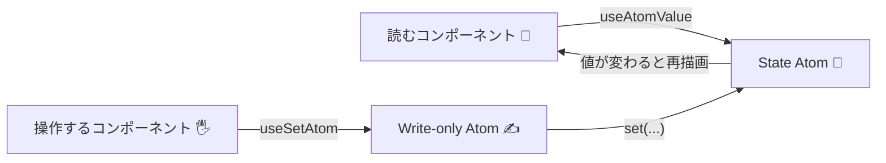

# 第245章：書き込み専用アトム (Write-only Atoms)

## 今日のゴール🎯

「状態（State）」と「操作（Action）」を分けて、コードをスッキリさせるよ〜😊
Jotaiでは、**書き込み専用アトム（Write-only Atom）**を使うと、**読むのは別・更新は別**がめちゃやりやすいの✨ ([tutorial.jotai.org][1])

---

## まずイメージ🌈（StateとActionの流れ）




ポイントはここ👇

* 「読むコンポーネント」は State を読む（表示する）👀
* 「操作するコンポーネント」は Action を呼ぶだけ🖐️（状態は読まない）
* だから、余計な再レンダリングも減らしやすいよ✨ ([Jotai][2])

---

## Write-only Atomの基本形✍️

Write-only Atomはだいたいこの形👇（最初の値を **null** にするのが定番！）

 ([tutorial.jotai.org][1])

```ts
import { atom } from 'jotai'

const textAtom = atom('hello')

export const uppercaseAtom = atom(
  null,
  (get, set) => {
    set(textAtom, get(textAtom).toUpperCase())
  }
)
```

---

## 実装してみよう！TODOで「操作だけ」を分離📝✨

### 1) 追加インストール（まだなら）

```bash
npm install jotai
```

---

### 2) 状態（State Atom）と操作（Write-only Atom）を作る

ファイル：`src/store/todos.ts`

```ts
import { atom } from 'jotai'

export type Todo = {
  id: string
  title: string
  done: boolean
}

export const todosAtom = atom<Todo[]>([
  { id: '1', title: 'Jotaiに触ってみる', done: false },
])

// ✅ 追加（Actionだけ）：引数を1つ受け取る
export const addTodoAtom = atom<null, [string], void>(
  null,
  (get, set, title) => {
    const trimmed = title.trim()
    if (!trimmed) return

    const newTodo: Todo = {
      id: crypto.randomUUID(),
      title: trimmed,
      done: false,
    }

    set(todosAtom, [...get(todosAtom), newTodo])
  }
)

// ✅ 完了切り替え
export const toggleTodoAtom = atom<null, [string], void>(
  null,
  (get, set, id) => {
    set(
      todosAtom,
      get(todosAtom).map((t) =>
        t.id === id ? { ...t, done: !t.done } : t
      )
    )
  }
)

// ✅ 削除
export const removeTodoAtom = atom<null, [string], void>(
  null,
  (get, set, id) => {
    set(todosAtom, get(todosAtom).filter((t) => t.id !== id))
  }
)
```

ここ、ちょい重要ポイント💡

* TypeScriptだと、write-only atomは **3つの型引数**を付けられるよ（値 / 引数（配列）/ 戻り値）✨ ([Jotai][3])

  * 今回は「値は返さない」から `null`
  * 引数は `[string]`（1個でも配列の形）
  * 戻り値は `void`

---

### 3) 画面（コンポーネント）側：読むのはtodosAtom、操作はuseSetAtomで！

ファイル：`src/TodoApp.tsx`

```tsx
import { useAtomValue, useSetAtom } from 'jotai'
import { useState, type ChangeEvent, type FormEvent } from 'react'
import {
  addTodoAtom,
  removeTodoAtom,
  toggleTodoAtom,
  todosAtom,
} from './store/todos'

export function TodoApp() {
  // 👀 読む（表示）
  const todos = useAtomValue(todosAtom)

  // ✍️ 書く（操作）
  const addTodo = useSetAtom(addTodoAtom)
  const toggleTodo = useSetAtom(toggleTodoAtom)
  const removeTodo = useSetAtom(removeTodoAtom)

  const [title, setTitle] = useState('')

  const onChange = (e: ChangeEvent<HTMLInputElement>) => {
    setTitle(e.target.value)
  }

  const onSubmit = (e: FormEvent) => {
    e.preventDefault()
    addTodo(title)
    setTitle('')
  }

  return (
    <div style={{ maxWidth: 520, margin: '40px auto', fontFamily: 'system-ui' }}>
      <h1>Jotai TODO 📝✨</h1>

      <form onSubmit={onSubmit} style={{ display: 'flex', gap: 8 }}>
        <input
          value={title}
          onChange={onChange}
          placeholder="やることを入力…"
          style={{ flex: 1, padding: 10 }}
        />
        <button type="submit">追加</button>
      </form>

      <ul style={{ listStyle: 'none', padding: 0, marginTop: 16 }}>
        {todos.map((t) => (
          <li
            key={t.id}
            style={{ display: 'flex', alignItems: 'center', gap: 10, padding: '8px 0' }}
          >
            <label
              style={{
                flex: 1,
                opacity: t.done ? 0.6 : 1,
                textDecoration: t.done ? 'line-through' : 'none',
              }}
            >
              <input
                type="checkbox"
                checked={t.done}
                onChange={() => toggleTodo(t.id)}
              />
              <span style={{ marginLeft: 8 }}>{t.title}</span>
            </label>

            <button type="button" onClick={() => removeTodo(t.id)}>
              削除🗑️
            </button>
          </li>
        ))}
      </ul>
    </div>
  )
}
```

最後に `src/App.tsx` をこうして表示👇

```tsx
import { TodoApp } from './TodoApp'

export default function App() {
  return <TodoApp />
}
```

---

## なんで「Write-only」で分けるのが嬉しいの？🥰🌟


1. **UIがスッキリ**：クリックしたら Action を呼ぶだけ🖐️
2. **ロジックが再利用しやすい**：別コンポーネントでも同じActionを呼べる✨
3. **不要な再描画を減らしやすい**：読むのは useAtomValue、書くのは useSetAtom に分けるのが推奨されてるよ📌 ([Jotai][2])

---

## よくあるつまずき🧯

* **「操作用アトムなのに、つい値も読みたくなる」**
  → 読む用は別アトム（State/Derived）に任せて、Actionは「更新だけ」に寄せると気持ちいいよ😊
* **TypeScriptの引数型**
  → write-only atomの引数は「配列の形」で書くのがコツ！✨ ([Jotai][3])

---

## ミニ課題🎒✨（やってみよ！）

次のActionを **write-only atom** で追加してみてね💪😊

1. 「完了したTODOを全部消す」🧹
2. 「TODOのタイトル編集」✏️（id と title を受け取る）

できたら、コンポーネント側は **useSetAtomで呼ぶだけ**にしてみよう〜！🎉

---

## まとめ✅

* Write-only Atomで「操作（Action）」を分離できる✍️ ([tutorial.jotai.org][1])
* TypeScriptなら型引数でキレイに固定できる✨ ([Jotai][3])
* 読むのは useAtomValue、書くのは useSetAtom に分けると効率も良いよ〜🚀 ([Jotai][2])

[1]: https://tutorial.jotai.org/quick-start/write-only-atoms?utm_source=chatgpt.com "Write Only Atoms"
[2]: https://jotai.org/?utm_source=chatgpt.com "Jotai, primitive and flexible state management for React"
[3]: https://jotai.org/docs/guides/typescript?utm_source=chatgpt.com "TypeScript — Jotai, primitive and flexible state ..."
