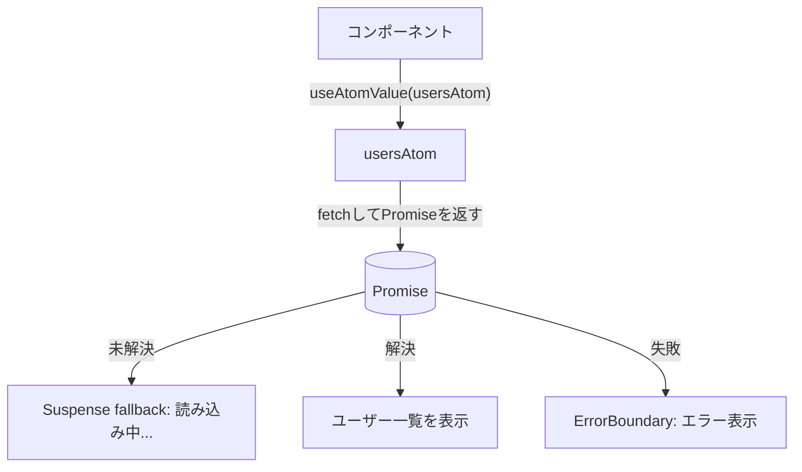

# 第246章：非同期アトム (Async Atoms)

「APIで取ってきたデータ」も、Jotaiのatomでそのまま扱えちゃうやつだよ〜！✨
この章では、**Async Atom（非同期アトム）でデータ取得 → ローディング表示 → エラー表示 → 再取得（リフレッシュ）**まで一気にやってみるね😆💕

---

## 1) 非同期アトムってなに？🧠💡

Jotaiのatomは、**値を返すだけじゃなくて `Promise` を返す**こともできるよ〜！
つまり、atomの中で `fetch()` して **その結果をatomとして読む**、ができる感じ✨

* **Async read atom**：読み取った瞬間にリクエストが走る（スマートgetter）([Jotai][1])
* **Async write atom**：ボタン押した時だけ送る、みたいな“アクション”的なやつ([Jotai][1])

そして、Async atomを `useAtomValue` で読むと、**Suspenseで待ってくれる**（ロード中をいい感じにできる）ってのが強い！😎✨ ([Zenn][2])

---

## 2) ざっくり流れ（図）🗺️✨




---

## 3) セットアップ（Windows）🛠️💻

プロジェクト作成済み（Vite + React TS）として進めるね！
Jotaiとエラーバウンダリ用を入れるよ〜✨

```bash
npm i jotai react-error-boundary
```

---

## 4) 実装：Async Atomでユーザー一覧を取る📡👩‍💻

### フォルダ構成（例）📁

* `src/atoms/usersAtoms.ts`
* `src/components/UsersPanel.tsx`
* `src/App.tsx`

---

### 4-1) atomを書く（Async + リフレッシュ対応）🔁✨

`src/atoms/usersAtoms.ts`

```tsx
import { atom } from "jotai";
import { loadable } from "jotai/utils";

export type User = {
  id: number;
  name: string;
  email: string;
};

// ✅ リフレッシュ用：この数字が変わるたびに再取得させる作戦
const refreshTickAtom = atom(0);

// ✅ ボタンから呼ぶ用（書き込み専用atom）
export const refreshUsersAtom = atom(null, (_get, set) => {
  set(refreshTickAtom, (v) => v + 1);
});

// ✅ Async Read Atom：読むとfetchしてPromiseを返す
export const usersAtom = atom(async (get) => {
  // これを読むことで「refreshTickAtomが変わったら再評価」になる
  get(refreshTickAtom);

  const res = await fetch("https://jsonplaceholder.typicode.com/users");
  if (!res.ok) {
    throw new Error(`ユーザー取得に失敗したよ😢 status=${res.status}`);
  }

  const data = (await res.json()) as User[];
  return data;
});

// ✅ Suspenseなしで扱いたい場合の保険（後で使う）
export const loadableUsersAtom = loadable(usersAtom);
```

ポイント💡

* `usersAtom` の中で `get(refreshTickAtom)` してるのがミソ！
  これで `refreshUsersAtom` を叩くたびに、`usersAtom` が再計算されて再fetchされるよ😆✨
* `loadable` は「Suspenseで止めたくない」時に便利だよ〜([Jotai][3])

---

### 4-2) 表示コンポーネント（Suspenseで読む）🖼️🌈

`src/components/UsersPanel.tsx`

```tsx
import { useAtomValue, useSetAtom } from "jotai";
import { refreshUsersAtom, usersAtom } from "../atoms/usersAtoms";

export function UsersPanel() {
  const users = useAtomValue(usersAtom); // ← PromiseならSuspenseで待つ✨
  const refresh = useSetAtom(refreshUsersAtom);

  return (
    <div style={{ padding: 16 }}>
      <h2>ユーザー一覧👩‍🎓✨</h2>

      <button onClick={() => refresh()} style={{ marginBottom: 12 }}>
        再取得する🔁
      </button>

      <ul>
        {users.map((u) => (
          <li key={u.id} style={{ marginBottom: 8 }}>
            <b>{u.name}</b> ✉️ {u.email}
          </li>
        ))}
      </ul>
    </div>
  );
}
```

---

### 4-3) Suspense + ErrorBoundaryで包む（超重要）🧯🛡️

`src/App.tsx`

```tsx
import { Suspense } from "react";
import { ErrorBoundary } from "react-error-boundary";
import { UsersPanel } from "./components/UsersPanel";

function ErrorFallback(props: { error: Error; resetErrorBoundary: () => void }) {
  return (
    <div style={{ padding: 16 }}>
      <h2>エラーが出ちゃった…😭</h2>
      <p>{props.error.message}</p>
      <button onClick={props.resetErrorBoundary}>もう一回やってみる💪</button>
    </div>
  );
}

export default function App() {
  return (
    <ErrorBoundary FallbackComponent={ErrorFallback}>
      <Suspense fallback={<div style={{ padding: 16 }}>読み込み中だよ〜⏳💤</div>}>
        <UsersPanel />
      </Suspense>
    </ErrorBoundary>
  );
}
```

これで完成！🎉

* 読み込み中 → `Suspense fallback`


* 失敗 → `ErrorBoundary`
* 成功 → 一覧表示✨

---

## 5) Suspenseを使いたくない場合（loadable版）🧩✨


「ページ全体が止まるのイヤ〜😖」って時は、`loadable` が便利！
`loadable` は **loading / hasData / hasError** を返してくれるよ([Jotai][3])

例：`UsersPanelLoadable.tsx` みたいに作るとこう👇

```tsx
import { useAtomValue, useSetAtom } from "jotai";
import { loadableUsersAtom, refreshUsersAtom } from "../atoms/usersAtoms";

export function UsersPanelLoadable() {
  const result = useAtomValue(loadableUsersAtom);
  const refresh = useSetAtom(refreshUsersAtom);

  return (
    <div style={{ padding: 16 }}>
      <h2>ユーザー一覧（loadable版）😺</h2>

      <button onClick={() => refresh()} style={{ marginBottom: 12 }}>
        再取得する🔁
      </button>

      {result.state === "loading" && <p>読み込み中…⏳</p>}
      {result.state === "hasError" && <p>エラーだよ😭 {String(result.error)}</p>}
      {result.state === "hasData" && (
        <ul>
          {result.data.map((u) => (
            <li key={u.id}>
              <b>{u.name}</b> ✉️ {u.email}
            </li>
          ))}
        </ul>
      )}
    </div>
  );
}
```

---

## 6) よくあるハマりポイント🥺🪤

* **Async atomは「読むと即fetch」**だから、UIのどこで読むかが大事！([Jotai][1])
* 「一瞬で解決するPromise」でも、状況によっては**ちょっとSuspenseが発生**してチラつくことがあるよ（そういう時は `loadable` が助けになる）([Zenn][2])

---

## 7) ミニ練習（今日の宿題）📚✨

できたらめっちゃ強くなるやつ💪💕

1. `selectedUserIdAtom`（数値）を作って、選んだIDのユーザーだけ表示してみよ🎯
2. 「再取得🔁」のボタンを押したら、読み込み中表示が出るのを確認してみよ⏳
3. わざとURLを間違えて、エラー画面が出るのを確認してみよ🧯

---

次の第247章は `atomWithStorage` で「ローカルストレージ同期」だよ〜💾✨
「Async atomで取ったデータを保存したい！」みたいな流れも作れて楽しくなる😆💕

[1]: https://jotai.org/docs/guides/async?utm_source=chatgpt.com "Async — Jotai, primitive and flexible state management for ..."
[2]: https://zenn.dev/uhyo/articles/jotai-v2-async-sometimes?utm_source=chatgpt.com "Jotai v2を使いこなすために実は必須級な“async sometimes” ..."
[3]: https://jotai.org/docs/utilities/async?utm_source=chatgpt.com "Async — Jotai, primitive and flexible state management for ..."
