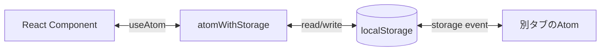

# 第247章：`atomWithStorage`

この章は「アプリを閉じても、次に開いたら前の状態が残ってる！」を作れるようになる回だよ〜😊
Jotai の `atomWithStorage` を使うと、Atom の値が **localStorage / sessionStorage** に自動保存されるの🥳（しかも別タブとも同期できる！） ([Jotai][1])

---

## 今日できるようになること ✅🎯

* `atomWithStorage` で **状態を永続化**する（リロードしても残る）💾
* **初回読み込み**の挙動（`getOnInit`）を理解する👀
* `RESET` で **保存データを消して初期化**する🧼
* localStorage / sessionStorage の使い分けができる📦

---

## まずはイメージ図 🧠🗺️（どう流れてる？）




* コンポーネントはいつも通り `useAtom` で読み書き😊
* 裏で `localStorage` に保存される💾
* 別タブにも（storageイベントで）反映されることがあるよ〜✨ ([Jotai][1])

---

## 1) いちばん基本：ダークモードを保存する 🌙☀️

### `src/atoms/themeAtom.ts` を作る✍️

```tsx
import { atomWithStorage } from "jotai/utils";

export const darkModeAtom = atomWithStorage("myapp:darkMode", false);
```

> キーは `"myapp:darkMode"` みたいに **アプリ名プレフィックス**付けるのおすすめ😉
> （他の機能や別アプリとぶつかりにくい！）

### `src/App.tsx` で使う🧩

```tsx
import { useAtom } from "jotai";
import { darkModeAtom } from "./atoms/themeAtom";

export default function App() {
  const [darkMode, setDarkMode] = useAtom(darkModeAtom);

  return (
    <div style={{ padding: 16, fontFamily: "sans-serif" }}>
      <h1>Theme: {darkMode ? "Dark 🌙" : "Light ☀️"}</h1>

      <button
        onClick={() => setDarkMode((prev) => !prev)}
        style={{ padding: "8px 12px", borderRadius: 8 }}
      >
        Toggle ✨
      </button>

      <p style={{ marginTop: 12 }}>
        リロードしても残ってたら成功〜！💾🎉
      </p>
    </div>
  );
}
```

### 確認ポイント 🔎

* ブラウザの DevTools → **Application** → **Local Storage** を見る👀
* `myapp:darkMode` ってキーが増えてたらOK💾✨

---

## 2) 大事：`getOnInit` を知ろう（初回に保存値を優先する？）👀⚡

`atomWithStorage` は設定しないと、**最初は初期値が一瞬出てから**、保存値に変わることがあるよ〜
（「一瞬チラつく」やつ🥺）

公式ドキュメントでも、SPAで保存値を初回から使いたいなら `getOnInit: true` がポイントって書いてあるよ ([Jotai][1])

### `getOnInit: true` 版

```ts
import { atomWithStorage } from "jotai/utils";

export const darkModeAtom = atomWithStorage("myapp:darkMode", false, undefined, {
  getOnInit: true,
});
```

#### どっちを選ぶ？🤔

* **Viteの普通のSPA**なら：`getOnInit: true` が気持ちいいこと多い😊
* **SSR（Next.jsとか）**だと：`localStorage` がサーバーに無いから注意が必要！ ([Jotai][1])

---

## 3) `RESET`：保存も状態も「初期化！」🧼🗑️

「設定をリセット」ボタン、よくあるよね〜！それ簡単に作れるよ🥳

```tsx
import { useAtom } from "jotai";
import { atomWithStorage, RESET } from "jotai/utils";

const nicknameAtom = atomWithStorage("myapp:nickname", "ななし", undefined, {
  getOnInit: true,
});

export function NicknameBox() {
  const [nickname, setNickname] = useAtom(nicknameAtom);

  return (
    <div style={{ display: "grid", gap: 8, maxWidth: 320 }}>
      <label>
        Nickname ✍️
        <input
          value={nickname}
          onChange={(e) => setNickname(e.target.value)}
          style={{ width: "100%", padding: 8, borderRadius: 8 }}
        />
      </label>

      <button onClick={() => setNickname(RESET)} style={{ padding: 8, borderRadius: 8 }}>
        Reset 🧼
      </button>
    </div>
  );
}
```

`RESET` を渡すと **localStorageの該当キーも消して**初期値に戻るよ〜✨ ([Jotai][1])

---

## 4) sessionStorage にしたい！（タブを閉じたら消えるやつ）🧴🚪

localStorage：ずっと残る💾
sessionStorage：**そのタブの間だけ**残る（タブ閉じたら消える）🫧

Jotai は `createJSONStorage` で storage を差し替えできるよ😊 ([Jotai][1])

```ts
import { atomWithStorage, createJSONStorage } from "jotai/utils";

const sessionJsonStorage = createJSONStorage(() => sessionStorage);

export const draftAtom = atomWithStorage(
  "myapp:draft",
  "",
  sessionJsonStorage,
  { getOnInit: true }
);
```

---

## 5) よくある落とし穴（ここだけ注意！）⚠️🥺

### ✅ キー設計は「被らない」ように

* 例：`myapp:settings:darkMode`
* ユーザーごとに分けたいなら：`myapp:user:${userId}:sidebarOpen` みたいにするのが超便利✨（1台PCで複数ログインするケースも防げる！）

### ✅ 保存されるのは基本「JSON化できるもの」

* string / number / boolean / 配列 / オブジェクト など🧸
* 関数や Date みたいなのは、そのままだと注意（必要なら変換する）⏳

### ✅ SSR では「サーバーに localStorage が無い」

* SSR環境だと初期HTMLと、クライアント復元時の表示がズレることがあるよ〜（チラつき） ([Jotai][1])
* ViteのSPAなら基本そこまで悩まないでOK👌

---

## 練習問題（ミニ課題）🎮✨

「設定画面」っぽいのを作ってみよ〜！🎀

### お題 ✅

次の3つを `atomWithStorage` で保存して、リロードしても残るようにする💾

1. `darkMode`（boolean）🌙
2. `fontSize`（number：例 14〜24）🔠
3. `nickname`（string）✍️

### ヒント 💡

* それぞれキーを分ける（例：`myapp:settings:fontSize`）
* `getOnInit: true` を付けると体験がよくなること多いよ😊

---

## まとめ 🧾💖

* `atomWithStorage(key, initialValue)` で **状態が保存されるAtom**が作れる💾
* `getOnInit: true` で **初回から保存値を優先**できる（SPAで便利！）👀✨ ([Jotai][1])
* `RESET` で **保存データごと初期化**できる🧼
* localStorage / sessionStorage を `createJSONStorage` で切り替えできる📦

---

次の第248章は **Atom Family**（動的にAtomを作る）だよ〜！🧬✨
「ユーザーIDごとに別のAtom」とかやりたい時にめちゃ強い😆

[1]: https://jotai.org/docs/utilities/storage "Storage — Jotai, primitive and flexible state management for React"
