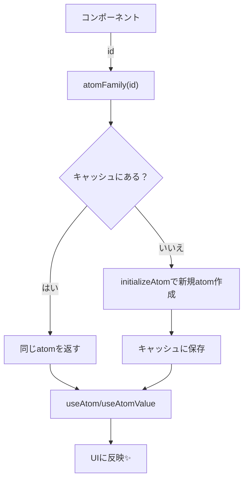
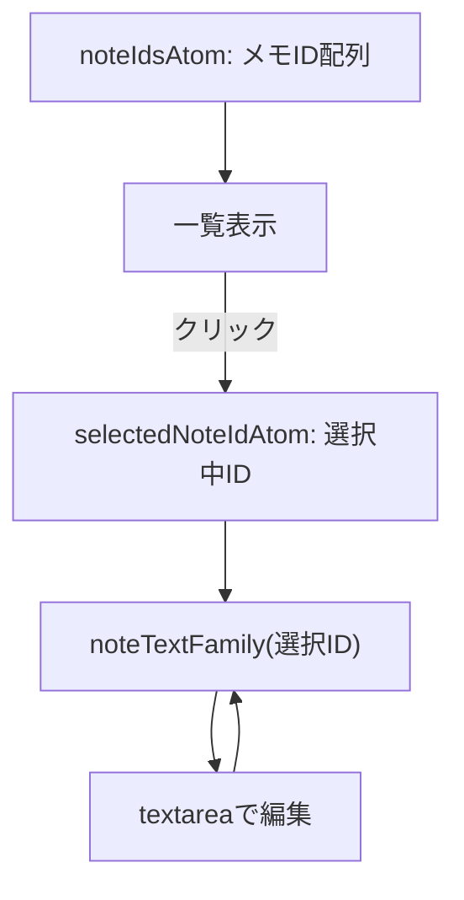

# 第248章：アトムファミリー (Atom Family)

## 1) Atom Familyってなに？🤔

**Atom Family =「引数（IDなど）を渡すと、その人専用・その項目専用の atom を返してくれる工場」**みたいなものだよ〜🏭✨
しかも一度作った atom は **キャッシュ**されるから、同じIDなら毎回同じ atom が返ってくるよ🧠💾
（※2025の最新だと、`jotai/utils` の `atomFamily` は非推奨で、将来削除予定だから **`jotai-family` に移行推奨**だよ！） ([Jotai][1])

---

## 2) どんな時に便利？🌟

たとえば👇みたいな「たくさん同じ形の状態」が欲しいとき！

* TODOが100件あって、**TODOごとに state** が欲しい📝
* ユーザー一覧で、**ユーザーIDごとに state** が欲しい👤
* タブが増えるUIで、**タブIDごとに state** が欲しい📌

---

## 3) イメージ図（キャッシュされる工場）🏭💾




---

## 4) 今どきのセットアップ（jotai-family）📦✨

Jotai公式ドキュメントでは `atomFamily` は将来 `jotai/utils` から消える予定なので、**新規は `jotai-family` 推奨**だよ〜！ ([Jotai][1])

### インストール（プロジェクト内で）🪄

```bash
npm i jotai jotai-family
```

（`useAtomValue` などは `jotai` 側のAPIだよ） ([Jotai][2])

---

## 5) ハンズオン：授業メモアプリ（IDごとにメモを持つ）📝🎓

### つくるもの✨

* 左：メモ一覧（追加・削除）
* 右：選んだメモの本文を編集
* **メモ本文は「メモIDごとの atom」**で管理するよ！

---

### (1) state を作る：`src/state/notes.ts` 🧠

```ts
// src/state/notes.ts
import { atom } from "jotai";
import { atomFamily } from "jotai-family";

export type NoteId = string;

export const noteIdsAtom = atom<NoteId[]>(["react", "english"]);

export const selectedNoteIdAtom = atom<NoteId>("react");

// ⭐ ここが主役：IDごとに atom を作る！
export const noteTextFamily = atomFamily((id: NoteId) =>
  atom<string>(`📚 ${id} のメモを書いてね〜`)
);
```

---

### (2) App：`src/App.tsx` 🧸

```tsx
import { useAtom, useSetAtom, useAtomValue } from "jotai";
import { noteIdsAtom, noteTextFamily, selectedNoteIdAtom } from "./state/notes";

function NoteList() {
  const [ids, setIds] = useAtom(noteIdsAtom);
  const [selectedId, setSelectedId] = useAtom(selectedNoteIdAtom);

  const addNote = () => {
    const id = prompt("新しいメモIDを入れてね（例: math）📝")?.trim();
    if (!id) return;
    if (ids.includes(id)) {
      alert("そのIDはもうあるよ〜😵‍💫");
      return;
    }
    setIds([...ids, id]);
    setSelectedId(id);
  };

  const deleteNote = (id: string) => {
    // ✅ Atom Familyのキャッシュから消す（メモリ節約にもなる）
    noteTextFamily.remove(id);

    setIds(ids.filter((x) => x !== id));

    // 選択中を消したら、残りの先頭に切り替え
    if (selectedId === id) {
      const next = ids.filter((x) => x !== id)[0] ?? "";
      if (next) setSelectedId(next);
    }
  };

  return (
    <div style={{ borderRight: "1px solid #ddd", paddingRight: 12 }}>
      <h2>メモ一覧 📚</h2>
      <button onClick={addNote}>＋追加 ✨</button>
      <ul>
        {ids.map((id) => (
          <li key={id} style={{ marginTop: 8 }}>
            <button onClick={() => setSelectedId(id)}>
              {id === selectedId ? "👉 " : ""}{id}
            </button>
            <button onClick={() => deleteNote(id)} style={{ marginLeft: 8 }}>
              削除 🗑️
            </button>
          </li>
        ))}
      </ul>
    </div>
  );
}

function NoteEditor() {
  const selectedId = useAtomValue(selectedNoteIdAtom);
  const [text, setText] = useAtom(noteTextFamily(selectedId));

  return (
    <div style={{ paddingLeft: 12 }}>
      <h2>編集：{selectedId} ✍️</h2>
      <textarea
        value={text}
        onChange={(e) => setText(e.target.value)}
        rows={12}
        style={{ width: "100%" }}
      />
      <p style={{ opacity: 0.7 }}>
        ※この本文は「{selectedId} 専用atom」に入ってるよ🧠✨
      </p>
    </div>
  );
}

export default function App() {
  return (
    <div style={{ display: "grid", gridTemplateColumns: "240px 1fr", gap: 12 }}>
      <NoteList />
      <NoteEditor />
    </div>
  );
}
```

---

## 6) 超たいじ！落とし穴ポイント⚠️😵‍💫

### ① パラメータに「毎回新しいオブジェクト」を渡すと地獄になりがち💥

`atomFamily({ id: 1 })` みたいに **オブジェクトリテラルを render のたびに作る**と、毎回別物扱いになって無限再レンダリング…みたいな事故が起きることがあるよ🥲
（実例として、オブジェクトリテラルを引数にして無限レンダリングになった話があるよ） ([PR TIMES 開発者ブログ][3])

✅ 対策：

* なるべく `string` / `number` みたいな **プリミティブ（ID）**を渡す
* どうしてもオブジェクトなら `areEqual`（比較関数）を指定する（デフォは `Object.is`） ([Jotai][1])

---

### ② Atom Familyは放置するとメモリが増えることがある🧠📈

Atom Familyは内部が `Map` キャッシュなので、**作った分が残り続ける**ことがあるよ（特にIDが無限に増えるUIで危険！） ([Jotai][1])

✅ 対策：

* もう使わないIDは `remove(id)`
* 期限で掃除したいなら `setShouldRemove(...)` ([Jotai][1])

（今回の例でも `deleteNote()` で `noteTextFamily.remove(id)` してたよ🧹✨）

---

## 7) 仕組みまとめ図（メモ一覧×編集）🗂️📝



---

## 8) ミニ課題（できたら強い💪✨）🎯

1. メモの初期文を「空」にして、プレースホルダー表示にしてみよ😉
2. 「複製」ボタンを作って、選択中メモを新IDでコピーしてみよ📄✨
3. 削除時に「本当に消す？」confirmを出してみよ🗑️⚠️

---

## 9) まとめ🎉

* Atom Familyは **「ID → atom」** を作れる便利な仕組み🧩
* 2025の最新だと `jotai/utils` の `atomFamily` は将来削除予定なので、**`jotai-family` を使うのが安心**だよ〜🛡️ ([Jotai][1])
* `remove` / `setShouldRemove` で **キャッシュ掃除**も忘れずにね🧹 ([Jotai][1])

次の章（DevTools）に行くと、この Atom Family の状態が「見える化」できてめっちゃ楽しくなるよ〜😆🔍

[1]: https://jotai.org/docs/utilities/family "Family — Jotai, primitive and flexible state management for React"
[2]: https://jotai.org/docs/core/use-atom?utm_source=chatgpt.com "useAtom — Jotai, primitive and flexible state management ..."
[3]: https://developers.prtimes.jp/2025/07/31/recoil-to-jotai-atomfamily-infinite-rendering/?utm_source=chatgpt.com "RecoilからJotaiのatomFamilyに移行したら無限レンダリングが ..."
