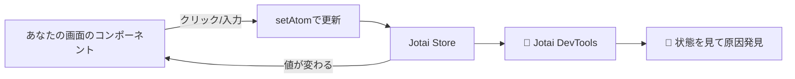

# 第249章：Jotai DevTools

Jotaiって「Atom（アトム）」が増えてくると、
「いま何が入ってるの？」「どこで変わったの？😵‍💫」ってなりがちです。

そこで **Jotai DevTools** の出番！🎉
画面上にデバッグUIを出して、**Atomの中身・変化の履歴（スナップショット）** を見ながら開発できます。 ([Jotai][1])

---

## できるようになること ✅

* `jotai-devtools` を入れて使えるようにする📦
* DevToolsのボタンを表示して、Atomの状態を確認する🔍
* Atomに「名前（debugLabel）」を付けて見やすくする🏷️
* （おまけ）React DevTools側にAtom一覧を出す🧰

---

## 全体イメージ（図解）🗺️




---

## 1) インストールしよう 📦✨

プロジェクトのフォルダで（PowerShellでOK！）

```bash
npm install jotai-devtools
```

公式ドキュメントでも、このパッケージを入れるところからスタートになってます。 ([Jotai][1])

---

## 2) DevToolsを「開発中だけ」表示する部品を作る 🧩🛡️

Vite環境だと **`import.meta.env.DEV`** が便利！
`src/JotaiDevTools.tsx` を作ってね👇

```tsx
// src/JotaiDevTools.tsx
import { DevTools } from "jotai-devtools";
import "jotai-devtools/styles.css";

export function JotaiDevTools() {
  // 開発中だけ表示（本番ビルドでは出さない）
  if (!import.meta.env.DEV) return null;

  return (
    <DevTools
      position="bottom-left"
      theme="light"
      options={{
        snapshotHistoryLimit: 30,
        shouldExpandJsonTreeViewInitially: false,
      }}
    />
  );
}
```

* `styles.css` の読み込みが必要です ([Jotai][1])
* `position` / `theme` / `options` などのPropsが用意されています ([Jotai][1])
* DevToolsは **非production環境向け** で、**本番では使わないのが前提** です（ツリーシェイク推奨の説明あり） ([Jotai][1])

---

## 3) Appに差し込む（最上段がわかりやすい）🧷✨

`src/App.tsx` の先頭あたりに入れちゃおう！

```tsx
// src/App.tsx
import { JotaiDevTools } from "./JotaiDevTools";
import { Counter } from "./Counter";
import { TodoMini } from "./TodoMini";

export default function App() {
  return (
    <>
      <JotaiDevTools />
      <h1>Jotai DevTools 練習</h1>
      <Counter />
      <TodoMini />
    </>
  );
}
```

「アプリの上にDevToolsを置く」形が基本例として紹介されています。 ([Jotai][1])

---

## 4) 見えるAtomを用意しよう（小さな練習アプリ）🎮✨


### Atom定義（debugLabel付きが超おすすめ🏷️）

`src/atoms.ts`

```tsx
// src/atoms.ts
import { atom } from "jotai";

export const countAtom = atom(0);
countAtom.debugLabel = "countAtom";

export type Todo = { id: string; text: string; done: boolean };

export const todosAtom = atom<Todo[]>([]);
todosAtom.debugLabel = "todosAtom";

export const doneCountAtom = atom((get) => get(todosAtom).filter((t) => t.done).length);
doneCountAtom.debugLabel = "doneCountAtom";
```

`atom.debugLabel` を付けると、デバッグ時に表示がわかりやすくなります。 ([Jotai][1])

### Counterコンポーネント

`src/Counter.tsx`

```tsx
import { useAtom } from "jotai";
import { countAtom } from "./atoms";

export function Counter() {
  const [count, setCount] = useAtom(countAtom);

  return (
    <section style={{ padding: 12, border: "1px solid #ddd", borderRadius: 12, marginBottom: 12 }}>
      <h2>カウンター 🔢</h2>
      <p>count: {count}</p>
      <button onClick={() => setCount((c) => c + 1)}>+1 😊</button>{" "}
      <button onClick={() => setCount(0)}>リセット 🔄</button>
    </section>
  );
}
```

### Todoミニ

`src/TodoMini.tsx`

```tsx
import { useMemo, useState } from "react";
import { useAtom } from "jotai";
import { doneCountAtom, todosAtom } from "./atoms";

export function TodoMini() {
  const [todos, setTodos] = useAtom(todosAtom);
  const [doneCount] = useAtom(doneCountAtom);
  const [text, setText] = useState("");

  const canAdd = useMemo(() => text.trim().length > 0, [text]);

  const addTodo = () => {
    const t = text.trim();
    if (!t) return;

    setTodos((prev) => [
      ...prev,
      { id: crypto.randomUUID(), text: t, done: false },
    ]);
    setText("");
  };

  const toggle = (id: string) => {
    setTodos((prev) => prev.map((x) => (x.id === id ? { ...x, done: !x.done } : x)));
  };

  return (
    <section style={{ padding: 12, border: "1px solid #ddd", borderRadius: 12 }}>
      <h2>TODO 📝</h2>

      <div style={{ display: "flex", gap: 8 }}>
        <input
          value={text}
          onChange={(e) => setText(e.target.value)}
          placeholder="やること入力…"
        />
        <button disabled={!canAdd} onClick={addTodo}>
          追加 ➕
        </button>
      </div>

      <p style={{ marginTop: 8 }}>
        完了: {doneCount} / {todos.length} ✅
      </p>

      <ul>
        {todos.map((t) => (
          <li key={t.id} style={{ cursor: "pointer" }} onClick={() => toggle(t.id)}>
            {t.done ? "✅" : "⬜"} {t.text}
          </li>
        ))}
      </ul>

      <p style={{ fontSize: 12, opacity: 0.7 }}>
        ※ リストをクリックで完了/未完了 切り替えだよ😉
      </p>
    </section>
  );
}
```

---

## 5) DevToolsの使い方（ここが本題！）👀✨


1. `npm run dev` で起動 ▶️
2. 画面のどこかに **DevToolsのトリガーボタン** が出ます（位置は `position` で指定） ([Jotai][1])
3. クリックするとパネルが開いて、**Atomの一覧** が見えるはず！🎉
4. `countAtom` を増やしたり、TODO追加/完了にすると
   DevTools側で **値が変わるのが追える** ようになります🔍

さらに `options` には、**タイムトラベル再生間隔** や **スナップショット履歴の上限** みたいな設定もあります。 ([Jotai][1])

---

## 6) （おすすめ）debugLabelを自動で付ける：Babel preset 🏷️✨

「毎回 `debugLabel` 書くのめんどい〜😫」ってなったら、
Jotaiの **Babel preset** を使うと自動でラベルを付けやすくなります（Vite設定例が公式にあります）。 ([Jotai][1])

`vite.config.ts`（例）

```ts
import { defineConfig } from "vite";
import react from "@vitejs/plugin-react";

export default defineConfig({
  plugins: [
    react({
      babel: {
        presets: ["jotai/babel/preset"],
      },
    }),
  ],
});
```

> このpresetには「debug label自動付与」や「React RefreshでAtomの状態がリセットされにくい」系のプラグインが含まれる、という説明があります。 ([Jotai][1])

---

## 7) （おまけ）React DevTools側にAtom一覧を出す 🧰👀

「画面に浮くDevToolsもいいけど、React DevToolsで見たい！」ってときは
`useAtomsDebugValue()` が使えます。 ([Jotai][1])

```tsx
// src/DebugAtoms.tsx
import { useAtomsDebugValue } from "jotai-devtools/utils";

export function DebugAtoms() {
  useAtomsDebugValue();
  return null;
}
```

Appの上の方に `<DebugAtoms />` を置くと、React DevToolsの中でAtom状態が見える感じです。 ([Jotai][1])

---

## よくあるつまづき 🧯😵‍💫

* **DevToolsが出ない！**

  * `import "jotai-devtools/styles.css"` を忘れてない？ ([Jotai][1])
  * `import.meta.env.DEV` を `false` にしてない？（= 本番ビルドで見てない？）
  * DevToolsは基本 **productionでは動かない** 前提です ([Jotai][1])

* **本番ビルドに余計なもの入れたくない！**

  * 公式でも「DevToolsは開発時だけにして、ツリーシェイクしよう」って案内があります ([GitHub][2])

---

## ミニ課題 🎯💖

1. `todosAtom` に `debugLabel` を付けて、DevToolsで名前が見えるのを確認してね🏷️
2. `DevTools` の `position` を `bottom-right` に変えてみて👆
3. `snapshotHistoryLimit` を `5` にして、履歴が増えすぎないのを体感してみよう🕰️ ([Jotai][1])

---

次の第250章（練習：高機能カウンター）では、DevToolsがあると「どこでズレたか」がめちゃ見つけやすくなるよ〜！😆✨

[1]: https://jotai.org/docs/tools/devtools "Devtools — Jotai, primitive and flexible state management for React"
[2]: https://github.com/jotaijs/jotai-devtools "GitHub - jotaijs/jotai-devtools: A powerful toolkit to enhance your development experience with Jotai"
