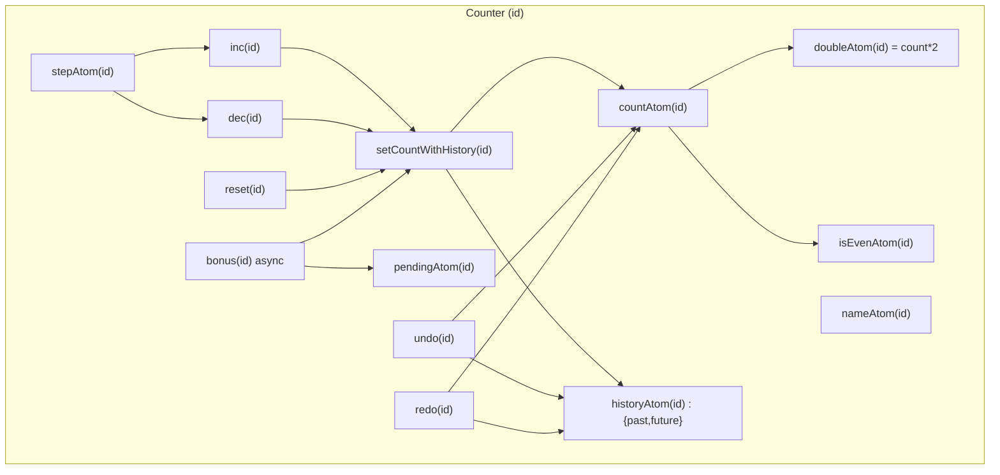
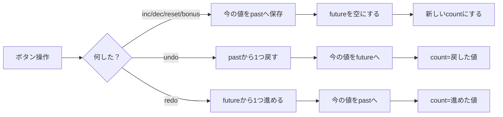

# 第250章：練習：Jotai で作る高機能カウンター

今日のゴールはこれ！👇
**「複数カウンター」「保存💾」「ステップ変更」「派生表示」「Undo/Redo」「疑似非同期ボーナス」「DevTools」**まで入りの、ちょいリッチなカウンターを作るよ〜😆🎉

---

## どんな仕組み？（ざっくり図解）🧠🗺️




Undo/Redoは「過去(past)」「未来(future)」の2本立てで管理するよ👇




---

## 1) セットアップ（コマンド）🛠️💨

プロジェクト作って、JotaiとDevTools入れるよ！
（PowerShellでOK👌）

```bash
npm create vite@latest chapter250-jotai-counter -- --template react-ts
cd chapter250-jotai-counter
npm install
npm install jotai jotai-devtools
npm run dev
```

※ `atomWithStorage` は状態を `localStorage` に保存してくれる機能だよ💾 ([Jotai][1])
※ `jotai-devtools` は開発モード前提で使うのが推奨だよ（本番は外す感じ）🧯 ([GitHub][2])

---

## 2) ファイル構成（作るもの）📁✨

* `src/JotaiDevTools.tsx`
* `src/atoms/counters.ts`
* `src/components/NewCounterForm.tsx`
* `src/components/CounterCard.tsx`
* `src/App.tsx`
* `src/App.css`

---

## 3) DevTools（見える化👀）🧪

`src/JotaiDevTools.tsx`

```tsx
import { DevTools } from "jotai-devtools";
import css from "jotai-devtools/styles.css?inline";

export function JotaiDevTools() {
  // 本番は出さない（開発だけ）
  if (import.meta.env.PROD) return null;

  return (
    <>
      <style>{css}</style>
      <DevTools />
    </>
  );
}
```

---

## 4) Atomたち（この章の心臓🫀）⚛️

`src/atoms/counters.ts`

```tsx
import { atom } from "jotai";
import { atomFamily, atomWithStorage } from "jotai/utils";

export type CounterId = string;

const idsKey = "chapter250:counterIds";
const makeKey = (id: CounterId, part: string) =>
  `chapter250:counter:${id}:${part}`;

const newId = () =>
  // ほぼ全部の環境でOK。もし無い環境でも動くように保険✨
  crypto.randomUUID?.() ?? `${Date.now()}-${Math.random().toString(16).slice(2)}`;

// どのカウンターが存在するか（配列）を保存💾
export const counterIdsAtom = atomWithStorage<CounterId[]>(idsKey, []);

// カウンターの名前（保存💾）
export const counterNameAtomFamily = atomFamily((id: CounterId) =>
  atomWithStorage<string>(makeKey(id, "name"), "カウンター")
);

// 値（保存💾）
export const countAtomFamily = atomFamily((id: CounterId) =>
  atomWithStorage<number>(makeKey(id, "count"), 0)
);

// ステップ（保存💾）
export const stepAtomFamily = atomFamily((id: CounterId) =>
  atomWithStorage<number>(makeKey(id, "step"), 1)
);

// Undo/Redo用（これは保存しないでOK）
export type HistoryState = {
  past: number[];
  future: number[];
};

export const historyAtomFamily = atomFamily((id: CounterId) =>
  atom<HistoryState>({ past: [], future: [] })
);

// 疑似非同期中かどうか
export const pendingAtomFamily = atomFamily((id: CounterId) => atom(false));

// 派生表示（Derived）
export const doubleAtomFamily = atomFamily((id: CounterId) =>
  atom((get) => get(countAtomFamily(id)) * 2)
);

export const isEvenAtomFamily = atomFamily((id: CounterId) =>
  atom((get) => get(countAtomFamily(id)) % 2 === 0)
);

export const canUndoAtomFamily = atomFamily((id: CounterId) =>
  atom((get) => get(historyAtomFamily(id)).past.length > 0)
);

export const canRedoAtomFamily = atomFamily((id: CounterId) =>
  atom((get) => get(historyAtomFamily(id)).future.length > 0)
);

// 「値の変更」＝「履歴も更新」する専用アクション（Write-only）
export const setCountWithHistoryAtomFamily = atomFamily((id: CounterId) =>
  atom(null, (get, set, next: number) => {
    const current = get(countAtomFamily(id));
    const history = get(historyAtomFamily(id));

    set(historyAtomFamily(id), {
      past: [...history.past, current],
      future: [],
    });
    set(countAtomFamily(id), next);
  })
);

// インクリメント（Write-only）
export const incAtomFamily = atomFamily((id: CounterId) =>
  atom(null, (get, set) => {
    const step = get(stepAtomFamily(id));
    const current = get(countAtomFamily(id));
    set(setCountWithHistoryAtomFamily(id), current + step);
  })
);

// デクリメント（Write-only）
export const decAtomFamily = atomFamily((id: CounterId) =>
  atom(null, (get, set) => {
    const step = get(stepAtomFamily(id));
    const current = get(countAtomFamily(id));
    set(setCountWithHistoryAtomFamily(id), current - step);
  })
);

// リセット（Write-only）
export const resetAtomFamily = atomFamily((id: CounterId) =>
  atom(null, (get, set) => {
    const current = get(countAtomFamily(id));
    if (current === 0) return;
    set(setCountWithHistoryAtomFamily(id), 0);
  })
);

// Undo（Write-only）
export const undoAtomFamily = atomFamily((id: CounterId) =>
  atom(null, (get, set) => {
    const history = get(historyAtomFamily(id));
    if (history.past.length === 0) return;

    const current = get(countAtomFamily(id));
    const prev = history.past[history.past.length - 1];

    set(historyAtomFamily(id), {
      past: history.past.slice(0, -1),
      future: [current, ...history.future],
    });
    set(countAtomFamily(id), prev);
  })
);

// Redo（Write-only）
export const redoAtomFamily = atomFamily((id: CounterId) =>
  atom(null, (get, set) => {
    const history = get(historyAtomFamily(id));
    if (history.future.length === 0) return;

    const current = get(countAtomFamily(id));
    const next = history.future[0];

    set(historyAtomFamily(id), {
      past: [...history.past, current],
      future: history.future.slice(1),
    });
    set(countAtomFamily(id), next);
  })
);

// 疑似非同期ボーナス（Write-only / async）
export const bonusAtomFamily = atomFamily((id: CounterId) =>
  atom(null, async (get, set) => {
    if (get(pendingAtomFamily(id))) return;

    set(pendingAtomFamily(id), true);
    try {
      await new Promise((r) => setTimeout(r, 600));

      const bonus = (crypto.getRandomValues(new Uint32Array(1))[0] % 10) + 1;
      const current = get(countAtomFamily(id));
      set(setCountWithHistoryAtomFamily(id), current + bonus);
    } finally {
      set(pendingAtomFamily(id), false);
    }
  })
);

// 追加（Write-only）
export const addCounterAtom = atom(null, (get, set, name: string) => {
  const trimmed = name.trim();
  if (!trimmed) return;

  const id = newId();
  const ids = get(counterIdsAtom);
  set(counterIdsAtom, [id, ...ids]);

  set(counterNameAtomFamily(id), trimmed);
  set(countAtomFamily(id), 0);
  set(stepAtomFamily(id), 1);
  set(historyAtomFamily(id), { past: [], future: [] });
});

// 削除（Write-only）
export const removeCounterAtom = atom(null, (get, set, id: CounterId) => {
  const ids = get(counterIdsAtom);
  set(counterIdsAtom, ids.filter((x) => x !== id));

  // storageの掃除🧹
  localStorage.removeItem(makeKey(id, "name"));
  localStorage.removeItem(makeKey(id, "count"));
  localStorage.removeItem(makeKey(id, "step"));

  // atomFamilyは内部的にMapで、消さないと増え続けることがあるよ🧠
  // removeで掃除できる（無限パラメータ系では超大事） :contentReference[oaicite:2]{index=2}
  counterNameAtomFamily.remove(id);
  countAtomFamily.remove(id);
  stepAtomFamily.remove(id);
  historyAtomFamily.remove(id);
  pendingAtomFamily.remove(id);

  doubleAtomFamily.remove(id);
  isEvenAtomFamily.remove(id);
  canUndoAtomFamily.remove(id);
  canRedoAtomFamily.remove(id);

  setCountWithHistoryAtomFamily.remove(id);
  incAtomFamily.remove(id);
  decAtomFamily.remove(id);
  resetAtomFamily.remove(id);
  undoAtomFamily.remove(id);
  redoAtomFamily.remove(id);
  bonusAtomFamily.remove(id);
});

// 初回に1個は作っておく（空だと寂しいので🥹）
export const ensureAtLeastOneCounterAtom = atom(null, (get, set) => {
  const ids = get(counterIdsAtom);
  if (ids.length > 0) return;

  const id = newId();
  set(counterIdsAtom, [id]);
  set(counterNameAtomFamily(id), "メイン");
});
```

---

## 5) UI：追加フォーム➕😊

`src/components/NewCounterForm.tsx`

```tsx
import { useState } from "react";
import { useSetAtom } from "jotai";
import { addCounterAtom } from "../atoms/counters";

export function NewCounterForm() {
  const [name, setName] = useState("");
  const add = useSetAtom(addCounterAtom);

  return (
    <form
      className="newCounter"
      onSubmit={(e) => {
        e.preventDefault();
        add(name);
        setName("");
      }}
    >
      <input
        value={name}
        onChange={(e) => setName(e.target.value)}
        placeholder="新しいカウンター名（例：勉強📚）"
      />
      <button type="submit">追加➕</button>
    </form>
  );
}
```

---

## 6) UI：カウンターカード（高機能の本体🔥）🎛️

`src/components/CounterCard.tsx`

```tsx
import { useAtom, useAtomValue, useSetAtom } from "jotai";
import {
  CounterId,
  counterNameAtomFamily,
  countAtomFamily,
  stepAtomFamily,
  doubleAtomFamily,
  isEvenAtomFamily,
  canUndoAtomFamily,
  canRedoAtomFamily,
  pendingAtomFamily,
  incAtomFamily,
  decAtomFamily,
  resetAtomFamily,
  undoAtomFamily,
  redoAtomFamily,
  bonusAtomFamily,
  removeCounterAtom,
} from "../atoms/counters";

type Props = { id: CounterId };

export function CounterCard({ id }: Props) {
  const [name, setName] = useAtom(counterNameAtomFamily(id));
  const [count] = useAtom(countAtomFamily(id));
  const [step, setStep] = useAtom(stepAtomFamily(id));

  const double = useAtomValue(doubleAtomFamily(id));
  const isEven = useAtomValue(isEvenAtomFamily(id));
  const canUndo = useAtomValue(canUndoAtomFamily(id));
  const canRedo = useAtomValue(canRedoAtomFamily(id));
  const pending = useAtomValue(pendingAtomFamily(id));

  const inc = useSetAtom(incAtomFamily(id));
  const dec = useSetAtom(decAtomFamily(id));
  const reset = useSetAtom(resetAtomFamily(id));
  const undo = useSetAtom(undoAtomFamily(id));
  const redo = useSetAtom(redoAtomFamily(id));
  const bonus = useSetAtom(bonusAtomFamily(id));
  const remove = useSetAtom(removeCounterAtom);

  return (
    <section className="card">
      <header className="cardHeader">
        <input
          className="titleInput"
          value={name}
          onChange={(e) => setName(e.target.value)}
        />
        <button
          className="danger"
          type="button"
          onClick={() => {
            if (confirm(`「${name}」を削除する？🥲`)) remove(id);
          }}
        >
          削除🗑️
        </button>
      </header>

      <div className="countRow">
        <div className="count">{count}</div>
        <div className="subInfo">
          <div>×2 👉 {double}</div>
          <div>{isEven ? "偶数✨" : "奇数🌟"}</div>
        </div>
      </div>

      <div className="stepRow">
        <label>
          ステップ：
          <input
            type="number"
            min={1}
            value={step}
            onChange={(e) => {
              const n = Number(e.target.value);
              setStep(Number.isFinite(n) && n >= 1 ? Math.floor(n) : 1);
            }}
          />
        </label>
      </div>

      <div className="btnRow">
        <button type="button" onClick={() => dec()}>
          −➖
        </button>
        <button type="button" onClick={() => inc()}>
          ＋➕
        </button>
        <button type="button" onClick={() => reset()}>
          0に戻す🔄
        </button>
      </div>

      <div className="btnRow">
        <button type="button" onClick={() => undo()} disabled={!canUndo}>
          Undo⏪
        </button>
        <button type="button" onClick={() => redo()} disabled={!canRedo}>
          Redo⏩
        </button>
        <button type="button" onClick={() => bonus()} disabled={pending}>
          {pending ? "ボーナス中…⏳" : "ランダムボーナス🎁"}
        </button>
      </div>
    </section>
  );
}
```

---

## 7) Appに組み込み（全部表示✨）🧩

`src/App.tsx`

```tsx
import "./App.css";
import { useEffect } from "react";
import { useAtomValue, useSetAtom } from "jotai";
import { counterIdsAtom, ensureAtLeastOneCounterAtom } from "./atoms/counters";
import { CounterCard } from "./components/CounterCard";
import { NewCounterForm } from "./components/NewCounterForm";
import { JotaiDevTools } from "./JotaiDevTools";

export default function App() {
  const ids = useAtomValue(counterIdsAtom);
  const ensureOne = useSetAtom(ensureAtLeastOneCounterAtom);

  useEffect(() => {
    ensureOne();
  }, [ensureOne]);

  return (
    <div className="app">
      <JotaiDevTools />

      <h1>第250章：Jotai 高機能カウンター🧪✨</h1>
      <p className="hint">リロードしても残るよ💾（localStorage保存）</p>

      <NewCounterForm />

      <div className="grid">
        {ids.map((id) => (
          <CounterCard key={id} id={id} />
        ))}
      </div>

      <footer className="footer">
        <small>DevToolsで状態の変化を眺めるの楽しいよ👀✨</small>
      </footer>
    </div>
  );
}
```

---

## 8) ちょい見た目（最低限でOK😌）🎨

`src/App.css`

```css
.app {
  max-width: 980px;
  margin: 0 auto;
  padding: 20px;
}

.hint {
  opacity: 0.8;
  margin-top: 6px;
}

.newCounter {
  display: flex;
  gap: 10px;
  margin: 16px 0 20px;
}

.newCounter input {
  flex: 1;
  padding: 10px;
}

.grid {
  display: grid;
  grid-template-columns: repeat(auto-fit, minmax(280px, 1fr));
  gap: 14px;
}

.card {
  border: 1px solid #ddd;
  border-radius: 12px;
  padding: 14px;
  background: #fff;
}

.cardHeader {
  display: flex;
  gap: 10px;
  align-items: center;
}

.titleInput {
  flex: 1;
  padding: 8px;
  font-weight: 700;
}

.danger {
  border: 1px solid #f2b6b6;
}

.countRow {
  display: flex;
  align-items: center;
  justify-content: space-between;
  margin: 14px 0;
}

.count {
  font-size: 44px;
  font-weight: 800;
}

.subInfo {
  text-align: right;
  opacity: 0.9;
}

.stepRow {
  margin: 10px 0;
}

.stepRow input {
  width: 90px;
  margin-left: 8px;
  padding: 6px;
}

.btnRow {
  display: flex;
  gap: 10px;
  margin-top: 10px;
  flex-wrap: wrap;
}

.btnRow button {
  padding: 10px 12px;
  border-radius: 10px;
  border: 1px solid #ddd;
  cursor: pointer;
}

.btnRow button:disabled {
  opacity: 0.5;
  cursor: not-allowed;
}

.footer {
  margin-top: 18px;
  opacity: 0.8;
}
```

---

## 動作チェック✅🎉

* カウンターを追加➕ → 何個でも増える
* 値を増減＋ステップ変更 → OK
* Undo/Redo → ちゃんと戻れる
* ランダムボーナス🎁 → 押したらちょい待って足される
* リロード🔄 → 値が残ってたら成功💾（`atomWithStorage`のおかげ） ([Jotai][1])

---

## ミニ解説：この章で「強くなれる」ポイント💪⚛️

* **Derived Atom**：`doubleAtomFamily` / `isEvenAtomFamily`（計算結果を別atomに分ける）
* **Write-only Atom**：`inc/dec/reset/undo/redo/bonus`（UIは「命令」するだけ）
* **atomWithStorage**：保存が一瞬でできる💾 ([Jotai][1])
* **atomFamilyの掃除**：削除時に `.remove(id)` しないと増え続ける系で困ることがある🧠 ([Jotai][3])
* **DevTools**：状態の動きが見える👀（開発時に最高） ([GitHub][2])

---

## 追加課題（できたら超えらい🌸）🧠✨

1. **上限/下限**をつける（例：-100〜100）🔒
2. **履歴をUIに表示**（pastを5件だけ出すとか）📜
3. **「合計」atom**を作る（全カウンターの合計を表示）➕
4. **並び替え**（ドラッグは難しければ上下ボタンでもOK）🔀

---

続きで、追加課題の「合計atom（全カウンター合計）を表示」を一緒に実装して、さらに気持ちよく仕上げる？😆✨

[1]: https://jotai.org/docs/utilities/storage?utm_source=chatgpt.com "Storage — Jotai, primitive and flexible state management ..."
[2]: https://github.com/jotaijs/jotai-devtools "GitHub - jotaijs/jotai-devtools: A powerful toolkit to enhance your development experience with Jotai"
[3]: https://jotai.org/docs/utilities/family?utm_source=chatgpt.com "Family — Jotai, primitive and flexible state management ..."
