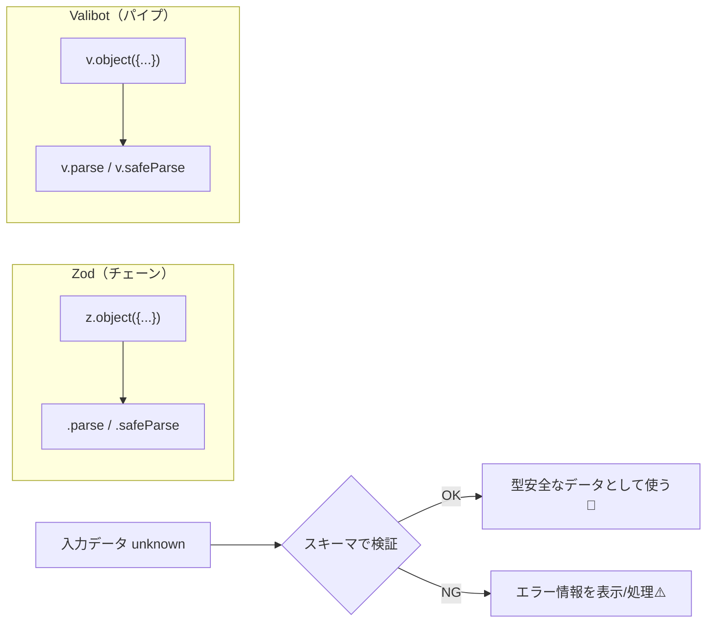
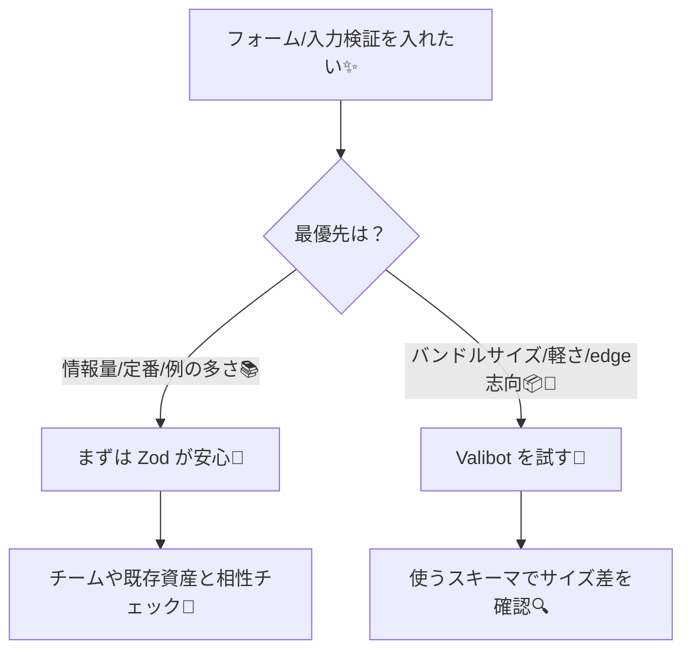

# 第251章：Valibot vs Zod

この章は「**次世代バリデーション**」の入口だよ〜！🎀
フォーム入力とか、APIから来たデータって「正しい形で来る」とは限らないよね？😵‍💫
そこで **スキーマバリデーション**（＝データの検査ルール）を使うと、安心してReactで扱えるようになるよ🛡️✨

---

## 1) まず結論：Zod と Valibot、どっちが勝ち？🥺💭

勝ち負けじゃなくて「向いてる場面が違う」って感じ！🌷

* **Zod**：いまも定番。情報量・利用者・連携例がめちゃ多い📚✨ ([Zod][1])
* **Valibot**：軽い！モジュラー設計で **バンドルサイズを小さくしやすい** のが強み💨✨ ([Valibot][2])

---

## 2) そもそも「Valibot」って何が嬉しいの？🧸✨

Valibotは公式でも「**バンドルサイズ・型安全・開発体験**」を重視してるよ〜って言ってるタイプのライブラリだよ📦✨ ([Valibot][2])

特にフロント（ブラウザ）だと…

* 使った機能だけ取り込まれやすい（＝**tree-shakingが効きやすい**）🌲✨
* 結果的に **JSの配信量が減って、起動が軽くなりやすい** 💨

実測の比較例だと、同じようなケースで **gzip後が Zod: 約12KB / Valibot: 約1.1KB** みたいな差が出た例もあるよ（ケース次第だけどインパクト大）😳📉 ([GitHub][3])

---

## 3) APIの書き味がけっこう違うよ✍️（チェーン vs パイプ）

イメージはこんな感じ👇

* **Zod**：`z.string().min(1).email()` みたいに「.（ドット）」でつないでいく（チェーン） ([Zod][4])
* **Valibot**：`pipe(string(), minLength(1), email())` みたいに関数をつないでいく（パイプ） ([Valibot][2])

図で見るとこんなノリ！🧠✨




---

## 4) ざっくり比較表📋✨

| 観点      | Zod 🦁                         | Valibot 🐣                              |
| ------- | ------------------------------ | --------------------------------------- |
| 立ち位置    | 定番・利用者多い ([Zod][1])            | 軽量志向・モジュラー ([Valibot][2])               |
| 書き方     | チェーン（`.min()` みたいな） ([Zod][4]) | パイプ（`pipe(...)`） ([Valibot][2])         |
| バンドルサイズ | 場合によって大きくなりやすい例あり              | 小さくなりやすい（tree-shaking前提） ([Valibot][2]) |
| 学習コスト   | 情報が多くて学びやすい                    | 書き方に慣れると気持ちいい                           |
| 移行      | —                              | Zod→Valibot移行ガイドあり ([GitHub][5])        |

---

## 5) ミニ実演：同じ「ログイン入力」を両方で書く👩‍💻✨

### 5-1) まずインストール（Windows / PowerShellでOK）💻✨

```bash
npm i zod valibot
```

---

### 5-2) Zod 版（チェーンで書く）🦁✨

```ts
import * as z from "zod";

const LoginSchema = z.object({
  email: z.string().email(),
  password: z.string().min(8),
});

// unknown から検証して「安全な型」にする
export function validateLoginWithZod(input: unknown) {
  const result = LoginSchema.safeParse(input);

  if (result.success) {
    // result.data は型安全！
    return { ok: true as const, data: result.data };
  }
  return { ok: false as const, issues: result.error.issues };
}
```

Zodは `parse()` だと失敗時に throw で、`safeParse()` だと結果オブジェクトで返してくれる感じだよ🧯✨ ([Zod][1])

---

### 5-3) Valibot 版（パイプで書く）🐣✨

```ts
import * as v from "valibot";

const LoginSchema = v.object({
  email: v.pipe(v.string(), v.email()),
  password: v.pipe(v.string(), v.minLength(8)),
});

export function validateLoginWithValibot(input: unknown) {
  const result = v.safeParse(LoginSchema, input);

  if (result.success) {
    // result.output が型安全！
    return { ok: true as const, data: result.output };
  }
  return { ok: false as const, issues: result.issues };
}
```

Valibotも `parse()` は失敗時 throw、`safeParse()` は成功/失敗を分けて返す流れだよ〜🧯✨ ([Valibot][6])

---

## 6) 「で、結局どっちを採用する？」の決め方🎯✨

迷ったらこのルールが超ラク！🫶



さらにValibot側には **「Zodからの移行ガイド」** もあるから、Zod経験者が混ざってても進めやすいよ🙌 ([GitHub][5])

---

## 7) 今日のまとめ🎀✨

* **Zod**：定番。情報が多くて安心感バツグン📚✨ ([Zod][1])
* **Valibot**：モジュラーで軽さを狙いやすい。フロントで特に嬉しいことが多い📦💨 ([Valibot][2])
* 書き方は **チェーン（Zod）** vs **パイプ（Valibot）** で好みも出るよ🎨✨

---

次の第252章では、Valibotの「基本スキーマ」をスラスラ書けるようにしていくよ〜！💪🐣✨

[1]: https://zod.dev/?utm_source=chatgpt.com "Zod: Intro"
[2]: https://valibot.dev/?utm_source=chatgpt.com "Valibot: The modular and type safe schema library"
[3]: https://github.com/anatoo/zod-vs-valibot?utm_source=chatgpt.com "anatoo/zod-vs-valibot - bundle size comparison"
[4]: https://zod.dev/api?utm_source=chatgpt.com "Defining schemas"
[5]: https://github.com/fabian-hiller/valibot/blob/main/website/src/routes/guides/%28migration%29/migrate-from-zod/index.mdx?utm_source=chatgpt.com "Migrate from Zod"
[6]: https://valibot.dev/guides/parse-data/?utm_source=chatgpt.com "Parse data"
