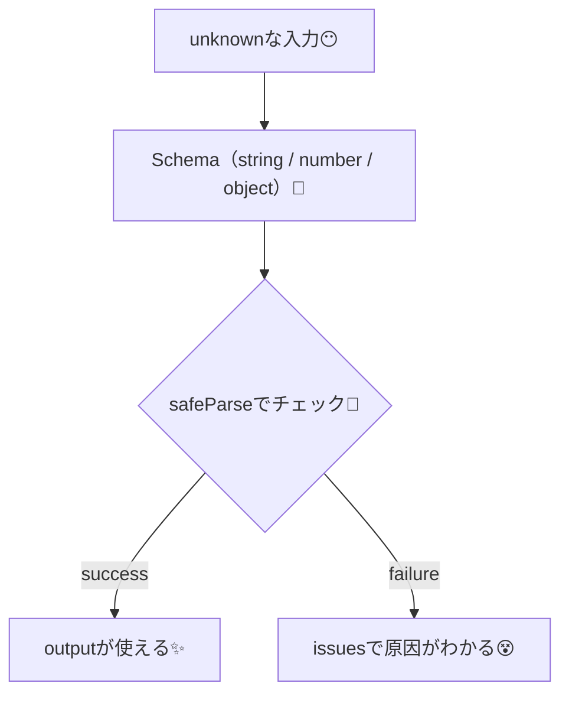
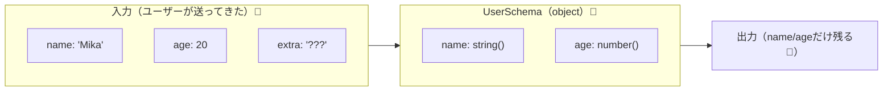

# 第252章：基本的なスキーマ定義

### 今日のゴール🎯

* Valibotで **「文字」「数字」「オブジェクト」** をチェックする“スキーマ”を作れるようになる😊
* 「OKなら使う」「ダメならエラーを見る」までを一通り体験する🧪

---

## 1) スキーマってなに？☕️

TypeScriptの型は「コードを書くときの安心」だけど、**実際に動いてる時に入ってくる値**（フォーム入力・APIレスポンスなど）は、変な形で来ることがあります😵‍💫

そこで Valibot は、**実行時にデータを検査する“型の関所”**みたいな役目をします🚧✨
（公式でも「schemaでunknownなデータを検証する」って思想です）([valibot.dev][1])

---

## 2) インストール🔧（Vite + React TSのプロジェクト内でOK）

ターミナルでこれだけ👇（npmの場合）([valibot.dev][2])

```bash
npm install valibot
```

使うときは、まずこの書き方がラク👇（公式にも載ってるやつ）([valibot.dev][2])

```ts
import * as v from 'valibot';
```

---

## 3) まずは String（文字）スキーマ 🧵

「入力が **文字列** かどうか」をチェックします✨
基本形はこれ👇 ([valibot.dev][3])

```ts
const NameSchema = v.string();
```

### ちょい親切バージョン（エラーメッセージ付き）🥺

`string()` の最初の引数で、型が違うときのメッセージを変えられます([valibot.dev][3])

```ts
const NameSchema = v.string('名前は文字で入れてね🙏');
```

---

## 4) 次は Number（数字）スキーマ 🔢

「入力が **number** かどうか」をチェックします✨ ([valibot.dev][4])

```ts
const AgeSchema = v.number('年齢は数字だよ〜🔢');
```

⚠️ ここ大事：`"20"`（文字の20）と `20`（数字の20）は別物だよ！
`number()` は **数字じゃないと通らない**です🧊 ([valibot.dev][4])

---

## 5) Object（オブジェクト）スキーマ 📦

「こういう形で来てね！」って **オブジェクトの形**を決めます✨
基本形はこれ👇 ([valibot.dev][5])

```ts
const UserSchema = v.object({
  name: v.string('nameは文字でお願い🥺'),
  age: v.number('ageは数字でお願い🥺'),
});
```

そしてポイント🌟
Valibotの `object()` は **知らないキー（余計な項目）を出力から落とします**。
「指定したentriesだけが出力に残る」って公式に書かれてます🧹✨ ([valibot.dev][5])


---

## 6) “チェック結果”を見る（safeParseを軽く使うよ）🧪

今回は結果が見やすい `safeParse` を使ってみます（詳しくは後の章でガッツリ！）😊
`success: true` なら `output`、ダメなら `issues` が取れます([valibot.dev][6])


### まずは `src/valibotDemo.ts` を作ってみてね📝

```ts
import * as v from 'valibot';

const UserSchema = v.object({
  name: v.string('名前は文字で入れてね🙏'),
  age: v.number('年齢は数字で入れてね🔢'),
});

export function demo() {
  const ok = { name: 'みか', age: 20 };
  const ng = { name: 123, age: '20' };

  console.log('--- OKチェック ---');
  const r1 = v.safeParse(UserSchema, ok);
  console.log(r1);

  console.log('--- NGチェック ---');
  const r2 = v.safeParse(UserSchema, ng);
  if (!r2.success) {
    console.log(r2.issues); // どこがダメかズラッと出るよ🧨
  }
}
```

### `App.tsx` から呼んで動かす（ブラウザConsoleで確認）👀

```tsx
import { useEffect } from 'react';
import { demo } from './valibotDemo';

export default function App() {
  useEffect(() => {
    demo();
  }, []);

  return (
    <div style={{ padding: 24 }}>
      <h1>第252章：Valibot スキーマ入門🛡️</h1>
      <p>DevTools の Console を見てね😊</p>
    </div>
  );
}
```

---

## 7) ざっくり図解（流れ）🗺️




---

## 8) Objectのイメージ図📦✨



---

## 9) 練習問題🏃‍♀️💨

### 練習1：キーを増やす➕

`UserSchema` に `score: number()` を追加して、OK/NGデータも更新してみてね😊🔢

### 練習2：入れ子オブジェクトにする📦📦

`profile` を増やしてみよ👇（例）

* `profile: { bio: string }`

---

## まとめ🧡

* `v.string()`：文字かどうかチェック🧵 ([valibot.dev][3])
* `v.number()`：数字かどうかチェック🔢 ([valibot.dev][4])
* `v.object({ ... })`：形を決めてチェック📦（余計なキーは落ちる）([valibot.dev][5])
* `v.safeParse()`：成功/失敗を分岐しやすい🧪 ([valibot.dev][6])

次の章（第253章）は **pipeで「検証＋変換」** をつなげて一気に便利になるよ〜！🚀✨

[1]: https://valibot.dev/?utm_source=chatgpt.com "Valibot: The modular and type safe schema library"
[2]: https://valibot.dev/guides/installation/?utm_source=chatgpt.com "Installation"
[3]: https://valibot.dev/api/string/ "string | Valibot"
[4]: https://valibot.dev/api/number/ "number | Valibot"
[5]: https://valibot.dev/api/object/ "object | Valibot"
[6]: https://valibot.dev/api/safeParse/ "safeParse | Valibot"
