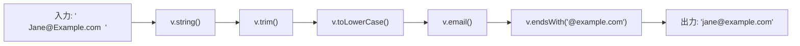

# 第253章：パイプラインと変換 (`pipe`)

### 今日のゴール 🎯

`v.pipe()` を使って、入力データを **「整える → チェックする → 必要なら変換する」** の流れでキレイに扱えるようになること！🏭💕

---

## 1) `pipe`ってなに？（流れ作業ライン）🏭🧵

Valibotの `pipe` は、値を **順番に処理していくレーン** みたいなものです✨
最初に「型の入口（例：`v.string()`）」を置いて、そこから `trim()` や `email()` や `transform()` みたいな “追加の処理” を並べます。
**並べた順に** 実行されて、前の結果が次に渡っていきます🚚💨 ([valibot.dev][1])

> ✅ ルール
>
> * パイプラインは **必ずスキーマ（例：`v.string()`）から開始** 🧷
> * その後に **最大19個** の「検証 or 変換」をつなげられる（合計最大20個）🧱 ([valibot.dev][1])
> * `pipe` はさらに `pipe` で拡張（ネスト）もできるよ🪆 ([valibot.dev][2])

---

## 2) 図でイメージしよう（メールを整えてから検証）✉️✨




こんな感じで、まず余計な空白を消して（`trim`）→ 小文字化して（`toLowerCase`）→ メール形式チェック…って流れにできるよ😄💖 ([valibot.dev][1])

---

## 3) 変換（Transform）ってなに？🔧🪄

**変換**は「値そのものを作り変える」やつ！
たとえば `toLowerCase()` は「文字列を小文字にする変換」だよ🧊➡️🧊 ([valibot.dev][3])

そして最強が `transform()` ✨
自分で関数を書いて **好きな形に変換**できる！ ([valibot.dev][4])

---

## 4) 例1：メールを “使いやすい形” に整えてから検証する ✉️🧼

```ts
import * as v from "valibot";

export const EmailSchema = v.pipe(
  v.string(),
  v.trim(),
  v.toLowerCase(),
  v.email(),
  v.endsWith("@example.com")
);
```

* `trim()`：空白をカット✂️
* `toLowerCase()`：小文字に統一🔡 ([valibot.dev][3])
* `email()`：メール形式チェック✅
* `endsWith()`：ドメイン縛り🔒 ([valibot.dev][1])

チェックしてみる（失敗を投げずに扱える `safeParse` 版）👇

```ts
import * as v from "valibot";
import { EmailSchema } from "./EmailSchema";

const result = v.safeParse(EmailSchema, "  Jane@Example.com  ");

if (result.success) {
  console.log("OK🎉", result.output); // 'jane@example.com'
} else {
  console.log("NG😢", result.issues);
}
```

`safeParse` は `success / output / issues` を返してくれるから扱いやすいよ🙆‍♀️✨ ([valibot.dev][5])

---

## 5) 例2：フォームの「数字っぽい文字列」を number に変換して検証する 🔢🧠

フォーム入力ってだいたい文字列で来がち😵‍💫
そこで `transform(parseInt)` で number にして、`minValue/maxValue` で範囲チェック！🎯

```ts
import * as v from "valibot";

export const WeightSchema = v.pipe(
  v.string(),
  v.trim(),
  v.transform(parseInt),
  v.number(),       // 👈 NaN対策（ここ大事！）
  v.minValue(1),
  v.maxValue(1000)
);
```

💡ポイント：`parseInt` が失敗すると `NaN` になることがあるので、`v.number()` を挟むと安心！🛡️ ([GitHub][6])

---

## 6) 変換すると「型」ってどうなるの？（`InferInput / InferOutput`）🧠📌

Valibotはスキーマから型を作れるんだけど、**変換が入ると input と output が変わる**ことがあるよ✨ ([valibot.dev][7])

たとえば「文字列 → 文字数（number）」に変換する例👇

```ts
import * as v from "valibot";

const LengthSchema = v.pipe(
  v.string(),
  v.transform((input) => input.length) // string → number
);

type In = v.InferInput<typeof LengthSchema>;   // string
type Out = v.InferOutput<typeof LengthSchema>; // number
```

* `InferInput`：入ってくる側の型🧺
* `InferOutput`：`parse/safeParse` の結果（出ていく側）の型📦 ([valibot.dev][7])

---

## 7) よくある落とし穴（先に回避しよ🧯）⚠️

* **`safeParse` の結果を分割代入すると、TypeScriptが賢く推論できなくなることがある**よ〜🥲
  なので `const result = ...` のまま `if (result.success) { ... }` が安全！ ([GitHub][8])
* パイプラインは **並べた順に実行**されるよ（順番めっちゃ大事）🧩 ([valibot.dev][2])

---

## 8) ミニ練習（手を動かすやつ✍️💖）

### 練習A：ユーザー名を正規化してチェック🙋‍♀️

* 前後の空白を消す
* 小文字にする
* 最低3文字

ヒント（完成形の骨組み）👇

```ts
import * as v from "valibot";

export const UsernameSchema = v.pipe(
  v.string(),
  v.trim(),
  v.toLowerCase(),
  v.minLength(3)
);
```

### 練習B：年齢（文字列）→ number にして、0〜120にする🎂

* `transform(Number)` か `transform(parseInt)` を使う
* `v.number()` でNaN対策
* `minValue(0)` / `maxValue(120)`

### 練習C：`"true" | "false"` を boolean に変換する✅❌

* `transform((s) => s === "true")` みたいに作れるよ✨
* 変換後に `v.boolean()` を挟むと気持ちいい👌

---

## まとめ ✅🎉

* `v.pipe()` は **「順番に処理するレーン」** 🏭 ([valibot.dev][1])
* まず **スキーマから開始**して、検証・変換をつなぐ🧷 ([valibot.dev][9])
* `transform()` で **自由に変換**できる🪄 ([valibot.dev][4])
* 変換があると `InferInput / InferOutput` が変わることがあるよ🧠 ([valibot.dev][7])

次の章（第254章）は、これを **React Hook Form と合体**させて “フォームの現場” に持っていく感じだね〜！💪😆

[1]: https://valibot.dev/guides/pipelines/?utm_source=chatgpt.com "Pipelines"
[2]: https://valibot.dev/api/pipe/?utm_source=chatgpt.com "pipe"
[3]: https://valibot.dev/api/toLowerCase/?utm_source=chatgpt.com "toLowerCase"
[4]: https://valibot.dev/api/transform/?utm_source=chatgpt.com "transform"
[5]: https://valibot.dev/api/safeParse/?utm_source=chatgpt.com "safeParse"
[6]: https://github.com/fabian-hiller/valibot/discussions/827 "transform number to string (react hook form) · open-circle valibot · Discussion #827 · GitHub"
[7]: https://valibot.dev/guides/infer-types/?utm_source=chatgpt.com "Infer types"
[8]: https://github.com/fabian-hiller/valibot/discussions/698 "Using safeParse has unknown output compared to parse which uses schema type · open-circle valibot · Discussion #698 · GitHub"
[9]: https://valibot.dev/guides/quick-start/?utm_source=chatgpt.com "Quick start"
