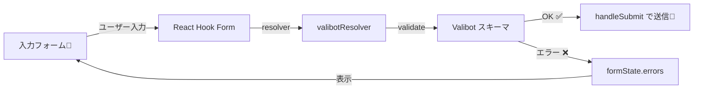

# 第254章：React Hook Form との連携

この章は「**Valibotで作ったスキーマ**」を、**React Hook Form の `resolver` に接続して**、フォームの入力チェックを一気にラクにする回だよ〜！😺📝

---

## できるようになること 🎯

* Valibotスキーマを **React Hook Form に直結**できる（`valibotResolver`）🔗
* `errors.xxx?.message` を使って **エラー文を表示**できる👀⚠️
* スキーマから型（`InferOutput`）を作って **フォームの型を自動化**できる🛡️✨ ([valibot.dev][1])

---

## ざっくり全体図（流れ）🌊




`resolver` は「外部バリデーション（Valibotとか）をフォームに繋ぐ」ための仕組みだよ〜🔌✨ ([GitHub][2])

---

## 1) 必要パッケージを入れる（まだなら）📦

ターミナル（Windows）で👇

```bash
npm i react-hook-form valibot @hookform/resolvers
```

---

## 2) Valibotスキーマを作る（型も一緒に作る）🧠✨

### `src/validators/signupSchema.ts`

```ts
import * as v from "valibot";

export const signupSchema = v.object({
  email: v.pipe(
    v.string(),
    v.nonEmpty("メールは必須だよ〜📧"),
    v.email("メールの形がちょっと変かも…！😵‍💫")
  ),
  password: v.pipe(
    v.string(),
    v.nonEmpty("パスワードは必須だよ🔑"),
    v.minLength(8, "8文字以上にしてね〜🐣")
  ),
  nickname: v.pipe(
    v.string(),
    v.nonEmpty("ニックネーム入れて〜✨"),
    v.maxLength(20, "20文字までだよ📝")
  ),
});

// ✅ スキーマから型を作る（送信データの型になる）
export type SignupFormValues = v.InferOutput<typeof signupSchema>;
```

* `InferOutput` は「バリデーション後の型（parse後の型）」を推論するユーティリティだよ🧷 ([valibot.dev][1])
* `InferInput` もあって、変換（transform）を使うと「入力の型」と「出力の型」が変わることがあるのね👀（必要になったら使おう） ([valibot.dev][3])

---

## 3) React Hook Form に `valibotResolver` を接続する 🔗✨

### `src/components/SignupForm.tsx`

```tsx
import { useForm } from "react-hook-form";
import { valibotResolver } from "@hookform/resolvers/valibot";
import { signupSchema, type SignupFormValues } from "../validators/signupSchema";

export function SignupForm() {
  const {
    register,
    handleSubmit,
    formState: { errors, isSubmitting, isValid },
  } = useForm<SignupFormValues>({
    resolver: valibotResolver(signupSchema),
    mode: "onBlur", // フォーカス外れたタイミングでチェック👀
  });

  const onSubmit = (data: SignupFormValues) => {
    console.log("送信データ:", data);
    alert(`ようこそ ${data.nickname} さん🎉`);
  };

  return (
    <form onSubmit={handleSubmit(onSubmit)} noValidate style={{ maxWidth: 420 }}>
      <h2>新規登録フォーム🎀</h2>

      <label style={{ display: "block", marginTop: 12 }}>
        メール📧
        <input type="email" {...register("email")} style={{ width: "100%" }} />
      </label>
      {errors.email?.message && (
        <p role="alert" style={{ margin: "6px 0", color: "crimson" }}>
          {errors.email.message}
        </p>
      )}

      <label style={{ display: "block", marginTop: 12 }}>
        パスワード🔑
        <input type="password" {...register("password")} style={{ width: "100%" }} />
      </label>
      {errors.password?.message && (
        <p role="alert" style={{ margin: "6px 0", color: "crimson" }}>
          {errors.password.message}
        </p>
      )}

      <label style={{ display: "block", marginTop: 12 }}>
        ニックネーム✨
        <input {...register("nickname")} style={{ width: "100%" }} />
      </label>
      {errors.nickname?.message && (
        <p role="alert" style={{ margin: "6px 0", color: "crimson" }}>
          {errors.nickname.message}
        </p>
      )}

      <button type="submit" disabled={isSubmitting} style={{ marginTop: 16 }}>
        {isSubmitting ? "送信中…⏳" : "登録する🎉"}
      </button>

      <p style={{ marginTop: 10, opacity: 0.7 }}>
        isValid: {String(isValid)} ✅
      </p>
    </form>
  );
}
```

`valibotResolver(schema)` を `useForm({ resolver: ... })` に入れるだけで、フォーム入力がValibotで検証されるよ🫶 ([Zenn][4])

### `src/App.tsx`（表示するだけ）

```tsx
import { SignupForm } from "./components/SignupForm";

export default function App() {
  return (
    <div style={{ padding: 24 }}>
      <SignupForm />
    </div>
  );
}
```

---

## 4) ちょい大事ポイント 💡

### ✅ `noValidate` を付ける理由

ブラウザ標準の「この項目を入力してください」みたいな表示が出ると、Valibotのエラー文が見えづらいことがあるのね😵‍💫
だから `<form noValidate>` が便利〜✨

### ✅ `resolver` の “mode”

`@hookform/resolvers` は `resolverOptions` に `mode: 'async' | 'sync'` を持ってて、`async` がデフォルト、みたいな形で説明されてるよ🧠 ([GitHub][2])

---

## 5) おまけ：非同期バリデーションしたいとき（メール重複チェックとか）⚡

Valibotは「非同期の検証」を入れるなら、`pipeAsync` / `objectAsync` みたいに **Async系で統一**する必要があるよ（ネストのルール）🧩 ([valibot.dev][5])

たとえば雰囲気はこんな感じ👇（イメージ！）

```ts
import * as v from "valibot";
import { valibotResolver } from "@hookform/resolvers/valibot";

const schema = v.objectAsync({
  email: v.pipeAsync(
    v.string(),
    v.nonEmpty("メール必須📧"),
    v.email("形式が変だよ😵‍💫"),
    v.checkAsync(async (mail) => {
      // 例: APIで重複チェックする想定
      return mail !== "already@used.com";
    }, "そのメールもう使われてるかも…💦")
  ),
});

// resolver 側も async を明示すると安心🍀
valibotResolver(schema, {}, { mode: "async" });
```

`valibotResolver` で `mode: "async"` を使う例も紹介されてるよ〜🧪 ([ナオポヨ][6])

---

## よくあるミスあるある 🥲🧯

* **スキーマのキー名**と `register("...")` が一致してない（`email` と `mail` とか）
* エラーが出ない → `mode: "onBlur"` / `"onChange"` にして挙動を確認してみる👀
* `errors.xxx?.message` を表示してない（意外とこれ！）

---

## ミニ課題（やってみよ〜！）🎯💪

### 課題A：利用規約チェックを追加 ✅📜

「同意しないと送れないチェックボックス」を作ってみて！

ヒント：Valibotは「true であること」を `literal(true)` で表せるよ🫶 ([valibot.dev][7])

例（スキーマ側）👇

```ts
terms: v.literal(true, "利用規約に同意してね〜🙇‍♀️")
```

### 課題B：ニックネームを “ひらがなだけ” にしたい（余裕あれば）✨

`v.check()` を使うと「自分ルール」も作れるよ〜（正規表現でOK） ([valibot.dev][8])

---

次の章（第255章）は「カスタムバリデーション」だから、今日の `check()` / `checkAsync()` の感覚がそのまま刺さってくるよ〜😺🧩
必要なら、この章のコードを「ちょい可愛いCSS」にする版も作るよ🎀

[1]: https://valibot.dev/api/InferOutput/?utm_source=chatgpt.com "InferOutput"
[2]: https://github.com/react-hook-form/resolvers "GitHub - react-hook-form/resolvers:  Validation resolvers: Yup, Zod, Superstruct, Joi, Vest, Class Validator, io-ts, Nope, computed-types, typanion, Ajv, TypeBox, ArkType, Valibot, effect-ts, VineJS and Standard Schema"
[3]: https://valibot.dev/api/InferInput/?utm_source=chatgpt.com "InferInput"
[4]: https://zenn.dev/tenkei/articles/9b6e0db9b7800d "[2025年] フロントエンド環境構築（React, TypeScript, Vite, Biome, lefthook）"
[5]: https://valibot.dev/guides/async-validation/?utm_source=chatgpt.com "Async validation"
[6]: https://naopoyo.com/docs/debounce-of-react-hook-form-and-valibot?utm_source=chatgpt.com "React Hook Form と Valibot の debounce - naopoyo.com"
[7]: https://valibot.dev/api/literal/?utm_source=chatgpt.com "literal"
[8]: https://valibot.dev/api/check/?utm_source=chatgpt.com "check"
