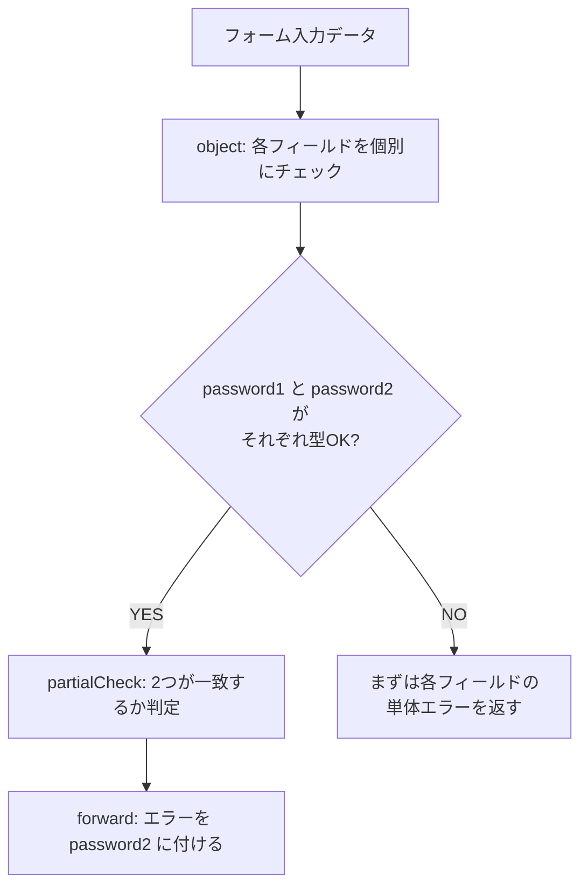

# 第255章：カスタムバリデーションの実装

今日は「既製品のルール（minLength とか email とか）だけじゃ足りないとき」に、自分で判定ルールを作ってバリデーションに組み込む方法をやるよ〜！😊💪

---

## 1) カスタムバリデーションってなに？🧩💡

たとえばこんな「アプリ都合のルール」👇

* ユーザー名に `admin` / `root` みたいな予約語はダメ🙅‍♀️
* パスワードは「英大文字 + 数字」を必須にしたい🔐
* `password` と `passwordConfirm` が一致してないとダメ🙅‍♂️

Valibot ではこういう「自作ルール」を **パイプライン**に差し込めるよ。カスタム判定には `check` が使える（true/false を返すだけでOK）って覚えると早い！ ([valibot.dev][1])

---

## 2) 今日の主役：`check` / `partialCheck` / `forward` 🌟

### ✅ `check`：自由に判定（trueならOK、falseならエラー）🧠

`check(requirement, message)` で、`requirement` が `false` のときにエラーになるよ。 ([valibot.dev][2])

### ✅ `partialCheck`：フォーム向きの相関チェック🥰

`partialCheck` は「必要な部分だけ型がOKなら」先に相関チェックを走らせられるのが強い！
`check` は **全体が型として成立したときだけ**実行されるので、フォームだと不便な場面があるよ。 ([valibot.dev][3])

### ✅ `forward`：エラーを「どの項目のエラーか」に割り当てる📌

相関チェック（例：パスワード一致）って、放っておくと「フォーム全体のエラー」になりがち。
`forward(action, ['password2'])` みたいにすると、**password2 にエラーを付けられる**よ！ ([valibot.dev][4])

---

## 3) 図でイメージ！Mermaidで流れをつかむよ🗺️✨




---

## 4) ハンズオン：会員登録スキーマを作るよ🧁📝

### フォルダ構成（例）📁

* `src/validation/validators.ts`（自作ルール置き場）
* `src/validation/registerSchema.ts`（Valibotスキーマ）
* `src/components/RegisterForm.tsx`（フォーム）

---

### 4-1) 自作バリデーション関数を作る（validators.ts）🛠️✨

```ts
// src/validation/validators.ts
export const isValidUsername = (value: string) => {
  // 例：英数字と _ だけ、3〜16文字
  if (!/^[a-z0-9_]{3,16}$/i.test(value)) return false;

  // 例：予約語NG
  const reserved = new Set(['admin', 'root', 'system']);
  return !reserved.has(value.toLowerCase());
};

export const hasUpperAndNumber = (value: string) => {
  const hasUpper = /[A-Z]/.test(value);
  const hasNumber = /\d/.test(value);
  return hasUpper && hasNumber;
};
```

ポイント✨

* `check` に渡す関数は **副作用なし**（入力→true/false）にすると事故りにくいよ😊
* ルールはコンポーネントじゃなくて `validators.ts` に逃がすとスッキリ🌿

---

### 4-2) Valibotスキーマを書く（registerSchema.ts）🧩✅

```ts
// src/validation/registerSchema.ts
import * as v from 'valibot';
import { hasUpperAndNumber, isValidUsername } from './validators';

export const RegisterSchema = v.pipe(
  v.object({
    email: v.pipe(
      v.string('メールは必須だよ📮'),
      v.nonEmpty('メールは必須だよ📮'),
      v.email('メールの形がちょっと変かも…！😵')
    ),

    username: v.pipe(
      v.string('ユーザー名は必須だよ🙋‍♀️'),
      v.nonEmpty('ユーザー名は必須だよ🙋‍♀️'),
      v.check(isValidUsername, 'ユーザー名は英数字と_で、予約語はNGだよ😖')
    ),

    password1: v.pipe(
      v.string('パスワードは必須だよ🔐'),
      v.nonEmpty('パスワードは必須だよ🔐'),
      v.minLength(8, 'パスワードは8文字以上にしてね🙏'),
      v.check(hasUpperAndNumber, '英大文字と数字を1つずつ入れてね💪')
    ),

    password2: v.pipe(
      v.string('確認用パスワードは必須だよ🔁'),
      v.nonEmpty('確認用パスワードは必須だよ🔁')
    ),
  }),

  // ✅ 2つのパスワード一致チェック（フォーム向け）
  v.forward(
    v.partialCheck(
      [['password1'], ['password2']],
      (input) => input.password1 === input.password2,
      'パスワードが一致してないよ〜！😭'
    ),
    ['password2']
  )
);
```

ここ、超だいじ💡

* 相関チェックは `partialCheck` が便利（フォームで特に） ([valibot.dev][3])
* `forward` で「どのフィールドにエラーを付けるか」を指定できるよ ([valibot.dev][4])

---

## 5) React Hook Form に接続（RegisterForm.tsx）🧷✨

`valibotResolver` は `@hookform/resolvers/valibot` から使えるよ。 ([GitHub][5])

```tsx
// src/components/RegisterForm.tsx
import { useForm } from 'react-hook-form';
import { valibotResolver } from '@hookform/resolvers/valibot';
import * as v from 'valibot';
import { RegisterSchema } from '../validation/registerSchema';

type RegisterFormValues = v.InferInput<typeof RegisterSchema>;

export function RegisterForm() {
  const {
    register,
    handleSubmit,
    formState: { errors, isSubmitting },
  } = useForm<RegisterFormValues>({
    resolver: valibotResolver(RegisterSchema),
    mode: 'onBlur',
  });

  const onSubmit = async (data: RegisterFormValues) => {
    alert(`送信OK〜！🎉\n${JSON.stringify(data, null, 2)}`);
  };

  return (
    <form onSubmit={handleSubmit(onSubmit)} style={{ maxWidth: 420 }}>
      <h2>会員登録✨</h2>

      <label>
        メール📮
        <input {...register('email')} />
      </label>
      {errors.email?.message && <p style={{ color: 'crimson' }}>{errors.email.message}</p>}

      <label>
        ユーザー名🙋‍♀️
        <input {...register('username')} />
      </label>
      {errors.username?.message && <p style={{ color: 'crimson' }}>{errors.username.message}</p>}

      <label>
        パスワード🔐
        <input type="password" {...register('password1')} />
      </label>
      {errors.password1?.message && <p style={{ color: 'crimson' }}>{errors.password1.message}</p>}

      <label>
        パスワード（確認）🔁
        <input type="password" {...register('password2')} />
      </label>
      {errors.password2?.message && <p style={{ color: 'crimson' }}>{errors.password2.message}</p>}

      <button disabled={isSubmitting} type="submit">
        {isSubmitting ? '送信中…⌛' : '登録する💌'}
      </button>
    </form>
  );
}
```

---

## 6) もう1つの武器：`custom`（型そのものが特殊なとき）🧪✨

「この文字列は `${number}px` の形じゃないとダメ！」みたいに、**既存の schema で表しにくい型**なら `custom` で “型ごと” 作れるよ。 ([valibot.dev][6])

（例：ピクセル文字列）

```ts
import * as v from 'valibot';

const PixelStringSchema = v.custom<`${number}px`>((input) =>
  typeof input === 'string' ? /^\d+px$/.test(input) : false
);
```

---

## 7) エラーメッセージを「関数」にする小ワザ🍬

Valibot の `message` は **文字列だけじゃなく関数**でもOK（`(issue) => string`）。 ([valibot.dev][7])
さらに issue には `input` などの情報が入ってるよ。 ([valibot.dev][8])

```ts
import * as v from 'valibot';

const UsernameSchema = v.pipe(
  v.string(),
  v.check(
    (s) => s !== 'admin',
    (issue) => `「${String(issue.input)}」は予約語で使えないよ〜！😵`
  )
);
```

---

## 8) ミニ課題（5〜10分）🏃‍♀️💨

1. **メールを大学ドメイン限定**にしてみてね🎓
   例：`@example.ac.jp` で終わるときだけOK

* ヒント：`v.check((s) => s.endsWith(...), '...')`

2. **ユーザー名の禁止ワード**を増やしてみてね🧹

* `reserved` に追加するだけ！

---

## 9) ちょい先取り：サーバーに問い合わせるなら Async 🛰️

「そのユーザー名、もう使われてる？」みたいなチェックは同期じゃ無理なので、`checkAsync` / `partialCheckAsync` や async validation を使う流れになるよ（必要になったらでOK！） ([valibot.dev][9])

---

## まとめ🎀

* **単体フィールドの独自ルール** → `check` がシンプルで強い ([valibot.dev][2])
* **フォームの相関チェック**（確認パスワードなど） → `partialCheck` + `forward` が最強コンボ ([valibot.dev][3])
* **型そのものが特殊** → `custom` で schema を自作 ([valibot.dev][6])

次の章（第256章）で「エラーメッセージの日本語化」をもっと整えて、さらに実務っぽくしていこ〜！😊✨

[1]: https://valibot.dev/guides/pipelines/ "Pipelines | Valibot"
[2]: https://valibot.dev/api/check/ "check | Valibot"
[3]: https://valibot.dev/api/partialCheck/ "partialCheck | Valibot"
[4]: https://valibot.dev/api/forward/ "forward | Valibot"
[5]: https://github.com/react-hook-form/resolvers "GitHub - react-hook-form/resolvers:  Validation resolvers: Yup, Zod, Superstruct, Joi, Vest, Class Validator, io-ts, Nope, computed-types, typanion, Ajv, TypeBox, ArkType, Valibot, effect-ts, VineJS and Standard Schema"
[6]: https://valibot.dev/api/custom/ "custom | Valibot"
[7]: https://valibot.dev/api/ErrorMessage/?utm_source=chatgpt.com "ErrorMessage"
[8]: https://valibot.dev/guides/issues/?utm_source=chatgpt.com "Issues"
[9]: https://valibot.dev/api/checkAsync/?utm_source=chatgpt.com "checkAsync"
