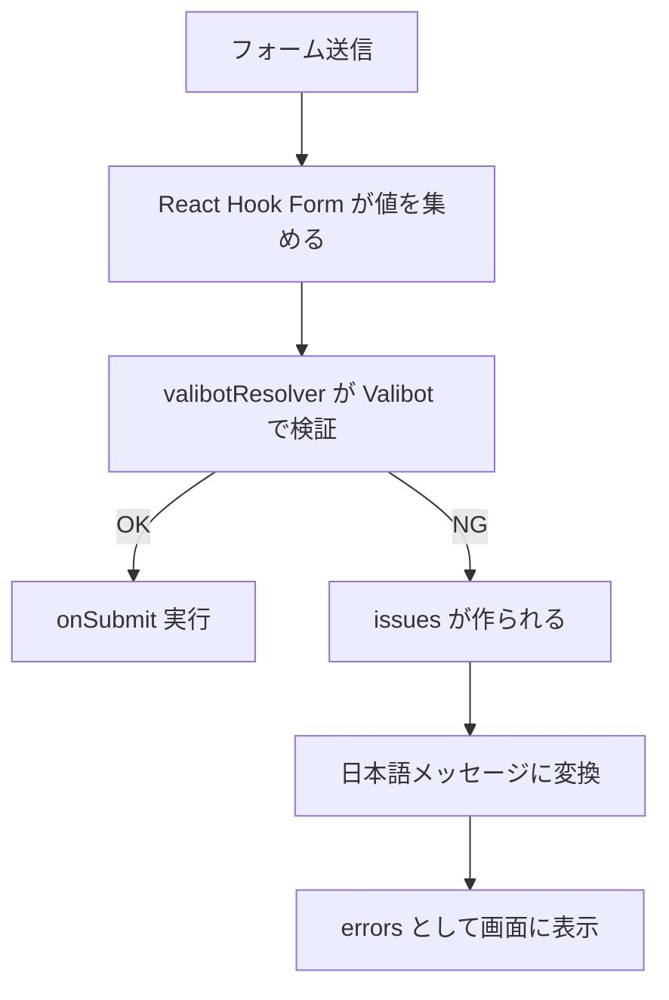
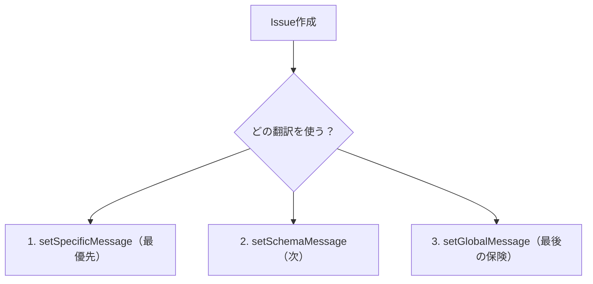

# 第256章：エラーメッセージの日本語化手法

この章では、Valibot のバリデーションエラーを「日本語でわかりやすく」表示できるようにします😊🧡
（React Hook Form と組み合わせる前提で進めるよ〜！）

---

## まず大事：Valibotのエラーは「issues」配列で返ってくる📦

Valibot は検証に失敗すると、`issues`（問題の一覧）を返します。`issue` には `type` / `message` / `path` / `requirement` などが入ってて、ここを元にメッセージを作れます🧠✨ ([Valibot][1])

---

## 今日のゴール🎯（できるようになること）

* ✅ エラーメッセージを日本語にする
* ✅ “必須です” とか “○文字以上” を自然な日本語にする
* ✅ React Hook Form の `errors.xxx?.message` にそのまま出す

---

## 全体の流れ（図でイメージ）🗺️




---

## 方法A：いちばん手軽🧁「その場で日本語メッセージを書く」

Valibot は各ルールにメッセージを渡せます👍（これは超わかりやすい！）
React Hook Form の README でもこういう書き方が紹介されています。 ([GitHub][2])

```tsx
import * as v from 'valibot';

export const LoginSchema = v.object({
  email: v.pipe(
    v.string('メールアドレスを入力してね'),
    v.nonEmpty('メールアドレスは必須だよ'),
    v.email('メールアドレスの形式がちがうかも…！')
  ),
  password: v.pipe(
    v.string('パスワードを入力してね'),
    v.nonEmpty('パスワードは必須だよ'),
    v.minLength(8, 'パスワードは8文字以上にしてね')
  ),
});
```

✅メリット：すぐできる😍
⚠️デメリット：画面が増えると同じ文言をコピペしがち…😵‍💫

---

## 方法B：おすすめ🍣 公式翻訳パックで “まとめて日本語化” する

Valibot には公式の翻訳パック `@valibot/i18n` があり、翻訳を「必要な分だけ」importできる仕組みです✨ ([Valibot][3])
しかも日本語（`ja`）も用意されています🇯🇵 ([JSR][4])

### 1) インストール（Windowsでも同じ）💻

```bash
npm i valibot @valibot/i18n react-hook-form @hookform/resolvers
```

### 2) 翻訳を読み込む（アプリ起動時に1回だけ）🌈

`src/valibot-i18n.ts` を作るのが安全でおすすめ！

```ts
// src/valibot-i18n.ts
import '@valibot/i18n/ja';      // 日本語翻訳を読み込み（side effects）
import * as v from 'valibot';

v.setGlobalConfig({ lang: 'ja' }); // 言語を日本語に
```

> `@valibot/i18n` は side effects で翻訳を“グローバル保管”して、検証時に参照します。 ([Valibot][3])
> 言語は `setGlobalConfig({ lang })` でグローバル指定できます。 ([Valibot][3])

### 3) `main.tsx` の先頭で読み込む（超重要）🔥

```tsx
import './valibot-i18n'; // ← これを先に！
import React from 'react';
import ReactDOM from 'react-dom/client';
import App from './App';

ReactDOM.createRoot(document.getElementById('root')!).render(
  <React.StrictMode>
    <App />
  </React.StrictMode>
);
```

✅これで、メッセージを個別指定しなくても “日本語のデフォルト文言” が出るようになります🎉

---

## 方法C：いちばん実戦的💎「自然な日本語 + 項目名つき」にする

“Invalid input” みたいな直訳より、
「メールアドレスを入力してください」みたいな UI 用の言い方にしたいよね🥹✨

Valibot には翻訳を差し替える API があって、

* `setSpecificMessage`（特定ルールだけ上書き）
* `setSchemaMessage`（型系まとめて上書き）
* `setGlobalMessage`（最後の保険）

みたいに階層があります🧠（優先順位も決まってる！） ([Valibot][3])



### “項目名つき日本語” を作るテンプレ🍡

```ts
// src/valibot-ja-custom.ts
import * as v from 'valibot';

// 画面で見せたいラベル辞書（好きに増やしてOK）
const labels: Record<string, string> = {
  email: 'メールアドレス',
  password: 'パスワード',
};

// issue.path から "email" / "user.name" みたいな文字列を作る
const dotPath = (path?: Array<{ key: string | number }>) =>
  path?.map((p) => String(p.key)).join('.') ?? '';

const labelOf = (issue: { path?: Array<{ key: string | number }> }) => {
  const key = dotPath(issue.path);
  return labels[key] ?? 'この項目';
};

// 必須系：nonEmpty を自然な日本語に
v.setSpecificMessage(
  v.nonEmpty,
  (issue: any) => `${labelOf(issue)}を入力してください`,
  'ja'
);

// 文字数：minLength を自然な日本語に（requirement が最小文字数）
v.setSpecificMessage(
  v.minLength,
  (issue: any) => `${labelOf(issue)}は${issue.requirement}文字以上で入力してね`,
  'ja'
);
```

`issue` には `path` や `requirement` などが入るので、それを使って文章を作れます。 ([Valibot][1])

> 公式翻訳（方法B）を使いつつ、「必須だけは自分の言い回しにする」みたいな使い方がいちばん気持ちいいです😍✨

---

## React Hook Form 側（表示まで完成させる）🧩✨

```tsx
import { useForm } from 'react-hook-form';
import { valibotResolver } from '@hookform/resolvers/valibot';
import * as v from 'valibot';

const LoginSchema = v.object({
  email: v.pipe(v.string(), v.nonEmpty(), v.email()),
  password: v.pipe(v.string(), v.nonEmpty(), v.minLength(8)),
});

type FormValues = {
  email: string;
  password: string;
};

export default function App() {
  const {
    register,
    handleSubmit,
    formState: { errors },
  } = useForm<FormValues>({
    resolver: valibotResolver(LoginSchema),
  });

  return (
    <form onSubmit={handleSubmit((data) => console.log(data))}>
      <div>
        <label>メールアドレス</label><br />
        <input {...register('email')} />
        {errors.email?.message && <p>{errors.email.message}</p>}
      </div>

      <div>
        <label>パスワード</label><br />
        <input type="password" {...register('password')} />
        {errors.password?.message && <p>{errors.password.message}</p>}
      </div>

      <button type="submit">ログイン</button>
    </form>
  );
}
```

---

## おまけ：デバッグ用に “まとめ表示” も便利🧾

検証失敗時の `issues` を人間が読みやすい形にするなら `summarize` が便利！ ([Valibot][5])
（開発中に `console.log` する用だね🛠️）

---

## ミニ練習🎀（5分でOK）

* ✅ `labels` に `username: 'ユーザー名'` を追加
* ✅ スキーマに `username` を追加して `minLength(3)` をつける
* ✅ 「ユーザー名は3文字以上で入力してね」が出たら成功🎉😍

---

次の第257章（`merge` / `pick` / `omit`）に行く前に、もしよければ
「いま作ってるフォームの項目（email以外）」を教えてくれたら、それに合わせた **日本語メッセージ辞書**をこちらでいい感じに整えてサンプル作るよ〜😊💪✨

[1]: https://valibot.dev/guides/issues/?utm_source=chatgpt.com "Issues"
[2]: https://github.com/react-hook-form/resolvers "GitHub - react-hook-form/resolvers:  Validation resolvers: Yup, Zod, Superstruct, Joi, Vest, Class Validator, io-ts, Nope, computed-types, typanion, Ajv, TypeBox, ArkType, Valibot, effect-ts, VineJS and Standard Schema"
[3]: https://valibot.dev/guides/internationalization/ "Internationalization | Valibot"
[4]: https://jsr.io/%40valibot/i18n/1.0.0 "/ - @valibot/i18n - JSR"
[5]: https://valibot.dev/api/summarize/?utm_source=chatgpt.com "summarize"
