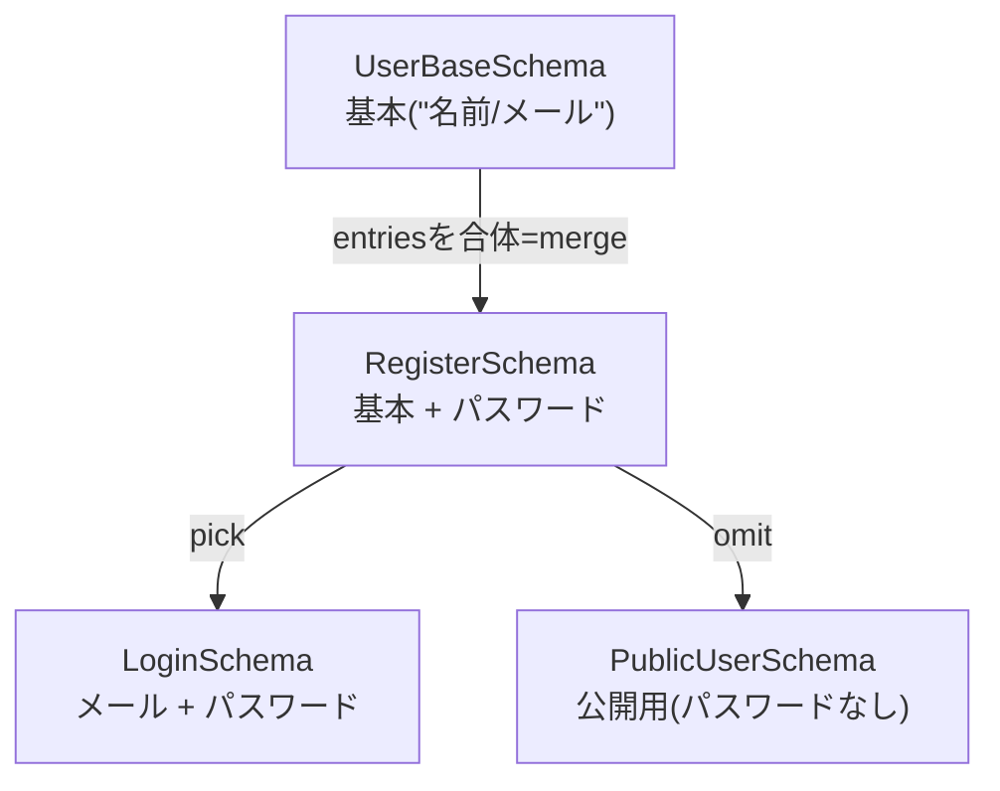

# 第257章：スキーマの合成と拡張 (`merge`, `pick`, `omit`)

今日は「スキーマを使い回して、楽して強くする」回です😎✨
同じようなフォーム（ログイン・新規登録・プロフィール編集…）を作るとき、毎回スキーマをコピペしてると **地味に事故る** ので、合成テクを覚えようね〜🧠💪

---

### まず全体イメージ🌈（こういうことがしたい！）




「merge」は関数名というより、**entriesを合体して新しい object スキーマを作る**って意味で使うよ（公式の例もこのやり方） ([Valibot][1])

---

## 1) まずは“部品スキーマ”を作る🧱✨

`src/validation/userSchemas.ts` を作る想定でいくね💡

```ts
import * as v from "valibot";

/**
 * 基本のユーザー情報（登録でもログインでも使い回したい）
 */
export const UserBaseSchema = v.object({
  name: v.pipe(v.string(), v.minLength(1, "名前は必須だよ〜🙂")),
  email: v.pipe(v.string(), v.email("メールの形が違うかも！📩")),
});

/**
 * パスワードだけの部品
 */
export const PasswordSchema = v.object({
  password: v.pipe(v.string(), v.minLength(8, "パスワードは8文字以上ね🔐")),
});
```

---

## 2) merge（＝entriesを合体）で拡張する🧩➕

Valibotの object スキーマには `entries` があって、それをスプレッドで合体できるよ🙌
（公式ドキュメントでもこの形で「Merge several objects」って紹介されてる） ([Valibot][1])

```ts
import * as v from "valibot";
import { UserBaseSchema, PasswordSchema } from "./userSchemas";

export const RegisterSchema = v.object({
  ...UserBaseSchema.entries,
  ...PasswordSchema.entries,
});
```

### ⚠️ mergeの注意：同じキーがあると「後勝ち」🏁

もし両方に `baz` みたいな同名キーがあったら、**後ろのほうが上書き**するよ（JavaScriptのオブジェクト合体と同じ） ([Valibot][2])

---

## 3) pick：必要なキーだけ取り出す✂️✨

「でっかいスキーマ」から、ログイン用に **メールとパスワードだけ**欲しい！みたいな時に使うよ😊
`pick(schema, ["key1", "key2"])` の形ね ([Valibot][3])

```ts
import * as v from "valibot";
import { RegisterSchema } from "./registerSchema";

export const LoginSchema = v.pick(RegisterSchema, ["email", "password"]);
```

### ⚠️ pickの注意（超だいじ！）🧯

`pick` は **pipe 済みのスキーマ（＝スキーマ自体を pipe で加工したもの）には使えない** ので、
**pick → その後に pipe** の順にしてね、って注意があるよ ([Valibot][3])

---

## 4) omit：いらないキーを消す🗑️✨

「公開用ユーザー」では password を外したい！みたいな時に最高👍
`omit(schema, ["key1", "key2"])` の形だよ ([Valibot][4])

```ts
import * as v from "valibot";
import { RegisterSchema } from "./registerSchema";

export const PublicUserSchema = v.omit(RegisterSchema, ["password"]);
```

### ⚠️ omitも同じ注意

`omit` も **pipe 済みスキーマには使えない** → **omit → その後 pipe** の順番でね ([Valibot][4])

---

## 5) Reactでの使い方ミニ例（RHF）🧡📝

インストール（Windows / PowerShellでもOK）👇

```bash
npm i valibot react-hook-form @hookform/resolvers
```

`RegisterSchema` をそのままフォームに刺す例だよ〜😊✨

```tsx
import { useForm } from "react-hook-form";
import { valibotResolver } from "@hookform/resolvers/valibot";
import * as v from "valibot";
import { RegisterSchema } from "./validation/registerSchema";

// フォームの型はスキーマから作っちゃう🎁
type RegisterForm = v.InferInput<typeof RegisterSchema>;

export function RegisterForm() {
  const {
    register,
    handleSubmit,
    formState: { errors, isSubmitting },
  } = useForm<RegisterForm>({
    resolver: valibotResolver(RegisterSchema),
    defaultValues: { name: "", email: "", password: "" },
  });

  const onSubmit = async (data: RegisterForm) => {
    console.log("送信OK🎉", data);
  };

  return (
    <form onSubmit={handleSubmit(onSubmit)} style={{ display: "grid", gap: 12 }}>
      <label>
        名前🙂
        <input {...register("name")} />
        {errors.name?.message && <p>{errors.name.message}</p>}
      </label>

      <label>
        メール📩
        <input {...register("email")} />
        {errors.email?.message && <p>{errors.email.message}</p>}
      </label>

      <label>
        パスワード🔐
        <input type="password" {...register("password")} />
        {errors.password?.message && <p>{errors.password.message}</p>}
      </label>

      <button disabled={isSubmitting}>
        {isSubmitting ? "送信中…⏳" : "登録する✨"}
      </button>
    </form>
  );
}
```

型推論（`InferInput/InferOutput`）は公式ガイドでも紹介されてるよ〜🧠✨ ([Valibot][5])

---

## 6) ミニ練習🎯✨（5分でできる）

次を作ってみてね😊🖐️

1. `RegisterSchema` から `pick` で `LoginSchema` を作る（もう作ったやつ！）✅
2. `RegisterSchema` から `omit` で `PublicUserSchema` を作る（password消す）✅
3. 追加チャレンジ🔥

   * `ProfileEditSchema`：`RegisterSchema` から `omit(["password"])` して「プロフィール編集用」にする
   * さらに `pick(["name", "email"])` して「編集できる項目だけ」にする（順番注意ね！）⚠️

---

必要なら次の章（第258章：再帰スキーマ）に入る前に、**「merge と intersect の使い分け」**も、例つきでやろうか？😊（けっこう気持ちよく整理できるよ）

[1]: https://valibot.dev/api/object/?utm_source=chatgpt.com "object"
[2]: https://valibot.dev/guides/intersections/ "Intersections | Valibot"
[3]: https://valibot.dev/api/pick/?utm_source=chatgpt.com "pick"
[4]: https://valibot.dev/api/omit/?utm_source=chatgpt.com "omit"
[5]: https://valibot.dev/guides/infer-types/?utm_source=chatgpt.com "Infer types"
