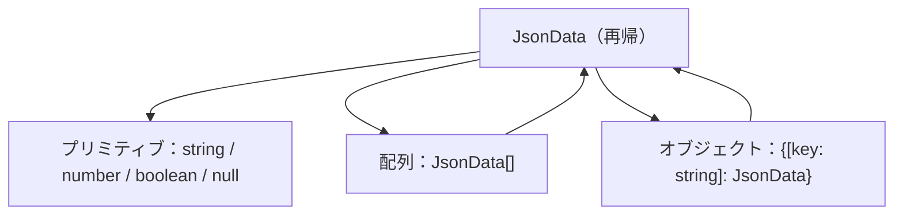

# 第258章：再帰的なスキーマ

この章では **Valibotで「自分自身を参照するスキーマ（再帰）」** を作れるようになります！
ツリー構造や、自由度の高い **JSONっぽいデータ** を安全に扱うときにめちゃ便利です🌳📦

---

## 1) 今日のゴール 🎯

* `v.lazy()` を使って **再帰的なスキーマ** を作れるようになる🌀
* **JSONデータ（文字列/数値/配列/オブジェクトがネストするやつ）** をバリデーションできるようになる🧪
* Reactで「入力 → 検証 → エラー表示」まで軽く体験する💻✨

Valibotの `lazy` は「再帰スキーマを作るための仕組み」で、TSの都合で `GenericSchema` を明示するのがポイントです🧠⚡️ ([Valibot][1])

---

## 2) 「再帰」ってなに？🌀（イメージで理解）

「中にまた同じ形が入ってる」データです！
たとえば「コメントの返信の返信の返信…」とか、「フォルダの中にフォルダ」とか📁💬

### 図：JSONデータはだいたい再帰っぽい 🧩




---

## 3) Valibotで再帰するコツ：`v.lazy()` 🧠✨


### なぜ `lazy` が必要？🤔

再帰って、そのまま書くと「スキーマの定義中に、まだ完成してないスキーマを参照しちゃう」問題が起きます💥
そこで `v.lazy(() => スキーマ)` にして **あとで取り出す** ようにします🪄

さらに、TSの都合で **入力/出力型が自動推論できない** 場合があるので、`v.GenericSchema<型>` を明示します✍️ ([Valibot][1])

---

## 4) 実戦：JSONを丸ごと検証できる「再帰スキーマ」📦✅


ここからが本題！
「JSONっぽい値全部OK」のスキーマを作ります（超強い）💪🔥

### 4-1) `src/valibot/jsonSchema.ts` を作る ✍️

```ts
import * as v from 'valibot';

export type JsonData =
  | string
  | number
  | boolean
  | null
  | { [key: string]: JsonData }
  | JsonData[];

export const JsonSchema: v.GenericSchema<JsonData> = v.lazy(() =>
  v.union([
    v.string(),
    v.number(),
    v.boolean(),
    v.null(),
    v.record(v.string(), JsonSchema),
    v.array(JsonSchema),
  ])
);
```

この形が「JSON全部いけます」の定番構成だよ〜！📦✨ ([Valibot][1])

> 💡ポイント
>
> * `v.record(keySchema, valueSchema)` が「辞書（オブジェクト）」担当🗂️
> * `v.array(JsonSchema)` が「配列の中も再帰」担当📚
> * `v.union([...])` が「どれか1つ当てはまればOK」担当🎭 ([Valibot][1])

---

## 5) Reactでミニ実験：JSON入力を検証してみる🧪💻

「テキストエリアにJSONを貼る → JSON.parse → Valibotで検証 → 結果表示」ってやつです😆✨

### 5-1) まだならインストール（もう入ってたらスキップでOK）📦

```bash
npm i valibot
```

### 5-2) `src/JsonValidator.tsx` を作る 🧡

```tsx
import { useMemo, useState } from 'react';
import * as v from 'valibot';
import { JsonSchema } from './valibot/jsonSchema';

export function JsonValidator() {
  const [text, setText] = useState(
    `{
  "theme": "dark",
  "flags": [true, false, true],
  "profile": { "name": "Aki", "age": 20 },
  "nullable": null
}`
  );

  const result = useMemo(() => {
    // 1) まず JSON として読めるかチェック
    let parsed: unknown;
    try {
      parsed = JSON.parse(text);
    } catch {
      return { kind: 'json-error' as const, message: 'JSONの書き方が崩れてるかも…！😵‍💫' };
    }

    // 2) Valibotで検証（throwしない safeParse）
    const r = v.safeParse(JsonSchema, parsed);
    if (r.success) {
      return { kind: 'ok' as const, value: r.output };
    }

    // 3) issues を “見やすく” する（flatten）
    const flat = v.flatten(r.issues);
    return { kind: 'valibot-error' as const, flat };
  }, [text]);

  return (
    <div style={{ maxWidth: 860, margin: '24px auto', padding: 16 }}>
      <h1 style={{ fontSize: 22, marginBottom: 8 }}>JSONバリデーション実験🧪✨</h1>

      <p style={{ marginTop: 0 }}>
        下のテキストを編集してね✍️（JSONとして読めて、しかもJSON構造として正しいかチェックするよ！）
      </p>

      <textarea
        value={text}
        onChange={(e) => setText(e.target.value)}
        rows={14}
        style={{
          width: '100%',
          fontFamily: 'ui-monospace, SFMono-Regular, Menlo, Monaco, Consolas, "Liberation Mono", "Courier New", monospace',
          fontSize: 14,
          padding: 12,
          borderRadius: 12,
          border: '1px solid #ccc',
        }}
      />

      <div style={{ marginTop: 16, padding: 12, borderRadius: 12, border: '1px solid #ddd' }}>
        {result.kind === 'ok' && (
          <>
            <div style={{ fontWeight: 700, marginBottom: 8 }}>OK！✅ これはJsonSchemaに合ってるよ🎉</div>
            <pre style={{ margin: 0, whiteSpace: 'pre-wrap' }}>
              {JSON.stringify(result.value, null, 2)}
            </pre>
          </>
        )}

        {result.kind === 'json-error' && (
          <div style={{ fontWeight: 700 }}>
            {result.message}（まずはカンマやカッコを見てみよ〜🔍）
          </div>
        )}

        {result.kind === 'valibot-error' && (
          <>
            <div style={{ fontWeight: 700, marginBottom: 8 }}>
              JSONとしては読めた！でも「JSON構造としてNG」があるよ⚠️
            </div>
            <pre style={{ margin: 0, whiteSpace: 'pre-wrap' }}>
              {JSON.stringify(result.flat, null, 2)}
            </pre>
          </>
        )}
      </div>
    </div>
  );
}
```

* `v.safeParse(schema, input)` は **成功/失敗を `success` で返してくれる**ので、フォームやUIで扱いやすいです✅ ([Valibot][2])
* `v.flatten(issues)` は **エラーメッセージを平坦化して見やすくする**用です🧯✨ ([Valibot][3])

### 5-3) `App.tsx` で表示 👀

```tsx
import { JsonValidator } from './JsonValidator';

export default function App() {
  return <JsonValidator />;
}
```

---

## 6) つまづきポイント集（ここ大事！）⚠️🧠

### ✅ 再帰スキーマには「終わり」が必要

ツリーはどこかで止まる必要があるよ🌳
例：二分木なら `left/right: null` が「終点」になる、みたいな感じ。Valibot公式例も `nullable` を使って止めてます🛑 ([Valibot][1])

### ✅ “再帰” と “循環参照” は別モノ😵‍💫

`lazy` は「木みたいに終わる再帰」向き。
もし **オブジェクトが自分自身を参照する（循環参照）** みたいなのを検証すると、終わらなくて危険です⚠️ ([GitHub][4])
（※ JSON は仕様的に循環参照できないので、基本は安心だよ😊）

---

## 7) ミニ練習（5分）⌛️✨

1. テキストエリアにこれを入れてみてね👇

* `{"a": 1, "b": [true, null, {"c":"ok"}]}` ✅
* `{"a": undefined}` ❌（JSONとして読めないはず！）

2. さらに、配列の中に配列を入れて遊んでみよ📚📚

* `[1, [2, [3, [4]]]]` ✅

---

次の章（第259章）は、この章でちょい出しした **`parse` と `safeParse` の使い分け**を、実戦目線でスパッと整理するよ〜😺📌

[1]: https://valibot.dev/guides/other/ "Other | Valibot"
[2]: https://valibot.dev/api/safeParse/?utm_source=chatgpt.com "safeParse"
[3]: https://valibot.dev/api/flatten/?utm_source=chatgpt.com "flatten"
[4]: https://github.com/fabian-hiller/valibot/discussions/673?utm_source=chatgpt.com "Help with circular schemas · open-circle valibot"
